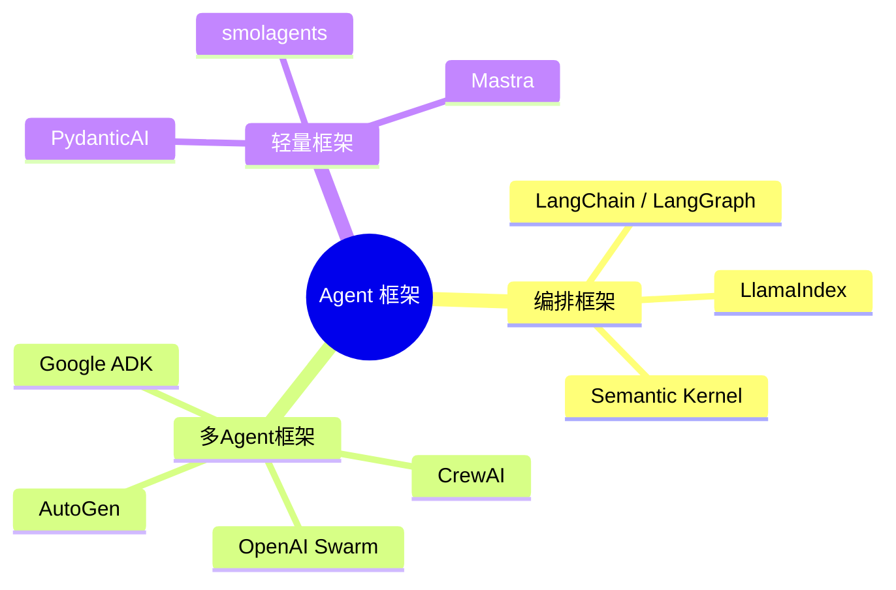
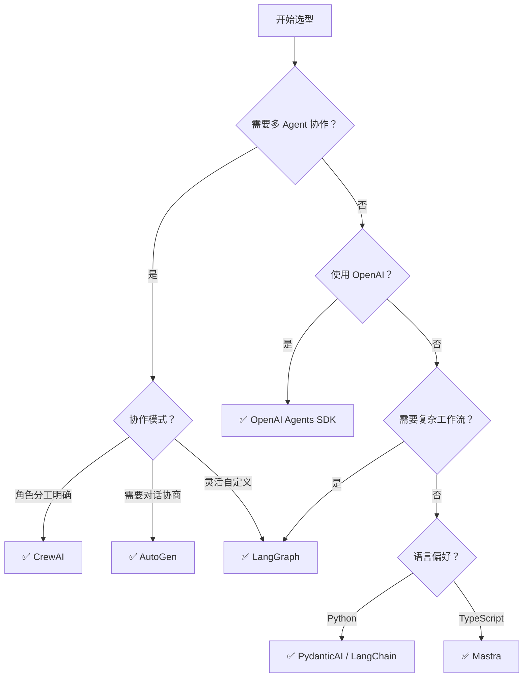

# Agent 框架全景对比

> **创建日期：** 2026-06-06
> **前置知识：** Agent 架构、Function Calling、多 Agent 协作

---

## 一、Agent 框架生态全景



---

## 二、核心框架详解

### 2.1 LangChain / LangGraph

| 维度 | LangChain | LangGraph |
|------|-----------|-----------|
| **定位** | 通用 LLM 应用框架 | 有状态 Agent 编排框架 |
| **核心抽象** | Chain、Agent、Tool | StateGraph（状态图） |
| **适用场景** | 快速原型、RAG 应用 | 复杂 Agent 工作流、多步推理 |
| **学习曲线** | 中等 | 较高 |
| **生产成熟度** | ⭐⭐⭐⭐⭐ | ⭐⭐⭐⭐ |

```python
# LangGraph 示例：定义 Agent 工作流
from langgraph.graph import StateGraph

# 定义状态
class AgentState(TypedDict):
    messages: list
    next_step: str

# 定义节点
def agent(state): ...
def tool_executor(state): ...

# 构建图
graph = StateGraph(AgentState)
graph.add_node("agent", agent)
graph.add_node("tools", tool_executor)
graph.add_conditional_edges("agent", should_continue, {
    "continue": "tools",
    "end": END
})
graph.add_edge("tools", "agent")
```

### 2.2 CrewAI

**定位：** 角色驱动的多 Agent 协作框架

```python
from crewai import Agent, Task, Crew

# 定义角色
researcher = Agent(
    role="研究员",
    goal="收集和分析市场数据",
    backstory="你是一个经验丰富的市场研究员"
)

analyst = Agent(
    role="分析师",
    goal="基于研究数据生成报告",
    backstory="你是一个资深数据分析师"
)

# 定义任务
research_task = Task(description="研究2026年AI市场趋势", agent=researcher)
analysis_task = Task(description="基于研究结果生成分析报告", agent=analyst)

# 组建团队
crew = Crew(agents=[researcher, analyst], tasks=[research_task, analysis_task])
result = crew.kickoff()
```

**特点：** 开箱即用，角色定义清晰，适合快速上手多 Agent 场景。

### 2.3 AutoGen（微软）

**定位：** 对话驱动的多 Agent 协作框架

| 特点 | 说明 |
|------|------|
| 协作方式 | Agent 之间通过对话（Chat）协作 |
| 代码执行 | 内置代码执行沙箱 |
| 人机协作 | 支持人在回路（Human-in-the-Loop） |
| 多模型 | 不同 Agent 可以使用不同模型 |

### 2.4 OpenAI Agents SDK

**定位：** OpenAI 官方的轻量级 Agent 框架

```python
from agents import Agent, Runner

# 定义 Agent
agent = Agent(
    name="助手",
    instructions="你是一个有帮助的助手",
    tools=[search_tool, calculator_tool]
)

# 运行
result = Runner.run_sync(agent, "今天天气怎么样？")
```

**特点：** 极简 API，与 OpenAI 生态深度集成，适合 OpenAI 重度用户。

---

## 三、框架对比速查表

| 框架 | 类型 | 多Agent | 状态管理 | 学习曲线 | 生产成熟度 | 推荐场景 |
|------|------|---------|----------|----------|------------|----------|
| **LangGraph** | 编排框架 | ✅ | 图状态 | 较高 | ⭐⭐⭐⭐ | 复杂 Agent 工作流 |
| **LangChain** | 通用框架 | 有限 | Chain | 中等 | ⭐⭐⭐⭐⭐ | RAG + 简单 Agent |
| **CrewAI** | 多Agent | ✅ | 角色 | 低 | ⭐⭐⭐ | 角色分工明确的协作 |
| **AutoGen** | 多Agent | ✅ | 对话 | 中等 | ⭐⭐⭐ | 多轮对话协作 |
| **OpenAI SDK** | 轻量 | 有限 | 无 | 低 | ⭐⭐⭐⭐ | OpenAI 生态快速开发 |
| **PydanticAI** | 轻量 | 否 | 无 | 低 | ⭐⭐⭐ | 结构化输出 + 工具调用 |
| **Google ADK** | 轻量 | 有限 | 无 | 低 | ⭐⭐ | Gemini 生态 |
| **smolagents** | 轻量 | 有限 | 无 | 低 | ⭐⭐ | HuggingFace 生态 |
| **Mastra** | 轻量 | 有限 | 无 | 中等 | ⭐⭐ | TypeScript 项目 |

---

## 四、选型决策树



---

## 五、框架组合策略

生产环境中，单一框架往往不够，需要**多框架组合**：

| 组合 | 场景 | 说明 |
|------|------|------|
| **LangChain + LangGraph** | RAG + Agent 工作流 | LangChain 做 RAG，LangGraph 做 Agent 编排 |
| **CrewAI + LangChain** | 多 Agent + 工具链 | CrewAI 做角色分工，LangChain 做工具集成 |
| **PydanticAI + 向量数据库** | 结构化输出 + RAG | PydanticAI 做输出校验，向量库做检索 |

---

## 六、2026 年趋势

1. **框架趋同**：各框架 API 越来越相似，迁移成本降低
2. **MCP 协议标准化**：工具调用逐渐统一到 MCP 协议
3. **轻量化趋势**：从重型框架（LangChain）向轻量框架（PydanticAI/smolagents）迁移
4. **可观测性增强**：LangSmith、Weave 等工具让 Agent 行为可追踪

---

## 七、面试高频题

### Q1: LangChain 和 LangGraph 的区别是什么？各适用什么场景？

**详细答案：** 我们是从 LangChain 起来，后来核心链路切到了 LangGraph。LangChain 的 Chain 抽象特别适合快速原型——我们 MVP 就是链式把文档加载、分片、Embedding、检索、LLM 生成串起来了，代码量很少，一周就搭好了。但 Chain 最大的问题是线性的——它只能 A 到 B 到 C，不支持条件分支。我们的 Agent 到了一个复杂步骤"如果查询结果为空就重新改写查询再试"的场景就卡住了，Chain 根本表达不了这种动态流程。

LangGraph 是图结构，每个节点跑完了根据状态决定下一个节点怎么走——"查询 -> 如果有结果就生成回答 -> 如果没结果就改写查询 -> 再查"。我们就是把 Agent 和工具节点画成 StateGraph 的节点，条件边定义流转，状态对象持久化了整个流程的历史。说实话两者不是互斥的——我们现在是 LangChain 做工具集成和文档处理组件，LangGraph 做顶层编排，官方推荐的就是这个套路。如果你就是简单 RAG 或者没什么分支需求，直接用 LangChain Chain 足够；如果工作流里有多步推理、条件跳转、循环这些，上 LangGraph。

---

### Q2: CrewAI 和 AutoGen 的协作模式有什么不同？各有什么优势和局限？

**详细答案：** 我们做产品对比报告时两种都试过。CrewAI 是角色驱动顺序执行——你定义好研究员、分析师、报告审核员三个角色，把任务按顺序给出去，框架自己走流程。我们当时一天就写完代码跑出来了，上手真快。缺点就是流程太死了——一步错了没法改，研究员拿到的数据有问题，分析师只能硬着头皮往下走，没法回到研究员那里说"你这不对重新找"。

AutoGen 是对话驱动的，多个 Agent 自己说话协商。比如写方案，一个写方案一个评审，评审说这里不对，写方案的自动改，多轮对话直到满意。我们当时做技术选型模拟辩论就用了 AutoGen，两个 Agent 分别站正反方，辩论 3 轮后出结论，效果确实比 CrewAI 灵活。但缺点就是不可控——有时候聊着聊着就跑题了，不知道为啥停不下来，token 哗哗浪费。

我们现在选型经验就是：角色分工明确且流程是线性的 -> 选 CrewAI，代码少速度快；需要动态协商、多轮辩论 -> 选 AutoGen，但要有心理准备，token 不可控，而且调试起来复杂。

---

### Q3: 什么时候选轻量框架（PydanticAI/OpenAI SDK），什么时候选重型框架（LangChain/LangGraph）？

**详细答案：** 我们在项目里经历了 LangChain 重 -> PydanticAI 轻的转变。LangChain 最大的问题就是抽象层太多——链式调用出错了你根本不知道是哪一环的问题，连 debug 都要翻 LangChain 源码。而且版本升级太频繁，0.x 到 1.x 的迁移差点给我们 bug 仓库炸了。但它的好处确实是生态强大——700+ 集成，文档处理、向量库、LLM 提供商全帮你接了，省了海量接入工作。

后来我们的简单 Agent 功能（比如单工具调用）就直接换 PydanticAI——API 简洁明了，结构化输出直接用 Pydantic 模型自动校验，代码量和调试时间少了很多。但复杂编排的 Agent 工作流还是得留在 LangGraph，因为轻量框架缺乏这部分能力。我的建议就是：简单 Agent（单步工具调用、模板填充）-> 用轻量框架，透明好调试；复杂工作流（多步推理、条件分支、循环） -> 用 LangGraph。另外轻量框架延迟也更低，LangChain 的 wrapper 层多了 30-50ms 每个调用，生产 P99 敏感的话这 30ms 你就得重视。

---

### Q4: 如何为项目选择合适的 Agent 框架？决策依据是什么？

**详细答案：** 我们选框架分了五维：任务复杂度、多 Agent 需求、生态、团队技能、生产成熟度。任务复杂度决定了你在简单工具调用还是在复杂工作流位置。我们的 Agent 从简单问答迭代到复杂理赔判断和产品对比，中间换了框架——初期简单场景用 CrewAI，后面复杂了切 LangGraph。多 Agent 需求——有没有必要多个 Agent？我们 80% 的查询单 Agent 搞定，20% 复杂场景切多 Agent 走 LangGraph。生态——如果你的项目需要大量第三方集成，LangChain 是没办法绕开的，工具集成和文档加载器太多了。团队技能是很多人忽略的——你的团队对图/状态机熟悉的话 LangGraph 学习曲线问题不大；你要是一个人的项目想在一天内出 demo，直接 CrewAI。生产成熟度也很关键——LangChain/LangGraph 社区最大、教程最多、可观测性工具（LangSmith）最完善，出问题能找到资料。CrewAI 也在起来了但成熟度差一些。

核心经验就是不要绑定单个框架。我们现在用 LangGraph 做顶层编排，PydanticAI 做结构化输出，LangChain 做文档处理组件，三个各司其职。框架是工具不是平台——在需要的地方用，其他地方保持简洁。

---

### Q5: Agent 框架的未来趋势是什么？MCP 协议对框架生态有何影响？

**详细答案：** 2026年最明显的趋势就是轻量化——从 LangChain 这种重型框架往 PydanticAI、OpenAI SDK 这些轻量框架迁，大家都烦透了过度抽象。MCP 协议是真正的 game changer——它把工具提供者和消费者解耦了。以前每个 Agent 框架都有自己的 Tool 接口，你写一个工具想跨框架用就得每个框架都实现一遍，MCP 出来后你只需要实现一次 MCP Server，所有支持 MCP 的框架自动都能用。这对生态的影响就是：过去"我框架工具多所以选我"的逻辑垮了，因为工具不再绑定框架。

我们自己的判断是 MCP 就像 HTTP 对于 Web、USB 对于外设——它奠定了 Agent 生态的基础设施层。未来选框架的核心竞争力会集中在编排和推理能力上，工具生态不再是一个差异化因素，因为工具全走 MCP 统一了。我们已经在项目中把内部工具全加上了 MCP 兼容——所有数据库查询、外部 API 调用、文件处理全部通过 MCP Server 暴露，未来无论切 LangGraph 还是 PydanticAI 还是纯 OpenAI SDK，工具层都不需要任何改动。

---

### Q6: PydanticAI 和 OpenAI Agents SDK 的区别是什么？各适合什么场景？

**详细答案：** 用过两个，PydanticAI 的核心是结构化输出。它的 Agent 每次输出必须通过 Pydantic 模型校验，比如你定义 `class InsuranceClaim(BaseModel): disease_code: str; payout_rate: float`，LLM 输出如果 `payout_rate` 是字符串格式 PydanticAI 直接重试直到拿回正确类型。这种类型安全在多人团队里收益巨大——IDE 代码补全和类型检查让 bug 少了很多。它还是模型无关的，我们 OpenAI 切 Qwen 几乎没改动。OpenAI SDK 就是 Open AI 生态的原生体验——极简 API，深度绑 OpenAI，多 Agent 之间有 Handoff 机制很好用。但如果你想切模型供应商很麻烦，我们只是用它在内部服务之间做推 key 调用。

选型其实简单：核心需求是结构化数据提取和类型安全 -> PydanticAI；深度依赖 OpenAI 和需要 Agent 间 Handoff -> OpenAI SDK；需要将来可能切模型供应商 -> PydanticAI 的模型无关性能省你很多后续工作。

---

### Q7: 在实际项目中，如何评估和降低框架的迁移成本？

**详细答案：** 我们踩过 LangChain 版本迁移的坑——从 0.x 跳到 1.x 整个 Agent API 全变了，迁移一个项目花了整整一周。从那以后我们就定了铁律：**核心业务逻辑一律框架无关**。Agent 推理逻辑、Prompt 模板、工具实现、记忆管理全部是独立模块，框架只是适配层。具体做法就是定义框架无关的接口——`BaseAgent` / `BaseTool` / `BaseMemory`，每个框架实现自己的适配器。比如 `SearchPolicyTool` 里面只是纯函数 `search_policy(keyword: str) -> list`，框架层再用适配器包装成 LangChain Tool 或 PydanticAI Tool，切换框架只需要改适配器。

还有一条经验：**MCP 是降低迁移成本最有效的手段**。我们所有工具现在全部走 MCP Server 暴露，切换框架的时候工具层完全不用动。另外，不要错过框架健康度——我们定期看 GitHub star 趋势、issue 关闭率、维护者活跃度，如果看到一个框架 issue 堆了三个月没理就开始准备迁移路线。最后是 MVP 阶段先用轻量框架，等业务逻辑稳了再看要不要加重型编排——这样核心业务逻辑从第一天就是框架无关的，后续换框架代价极小。