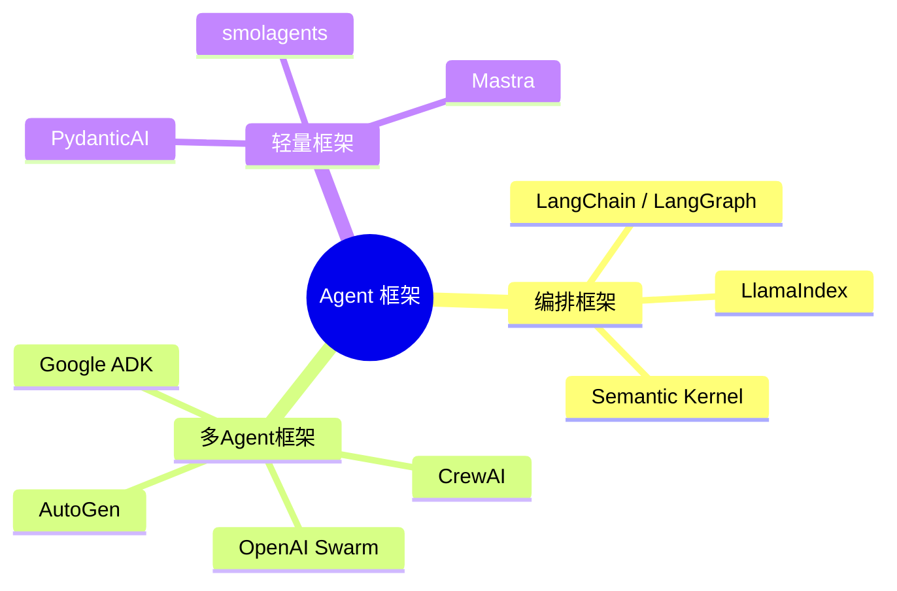
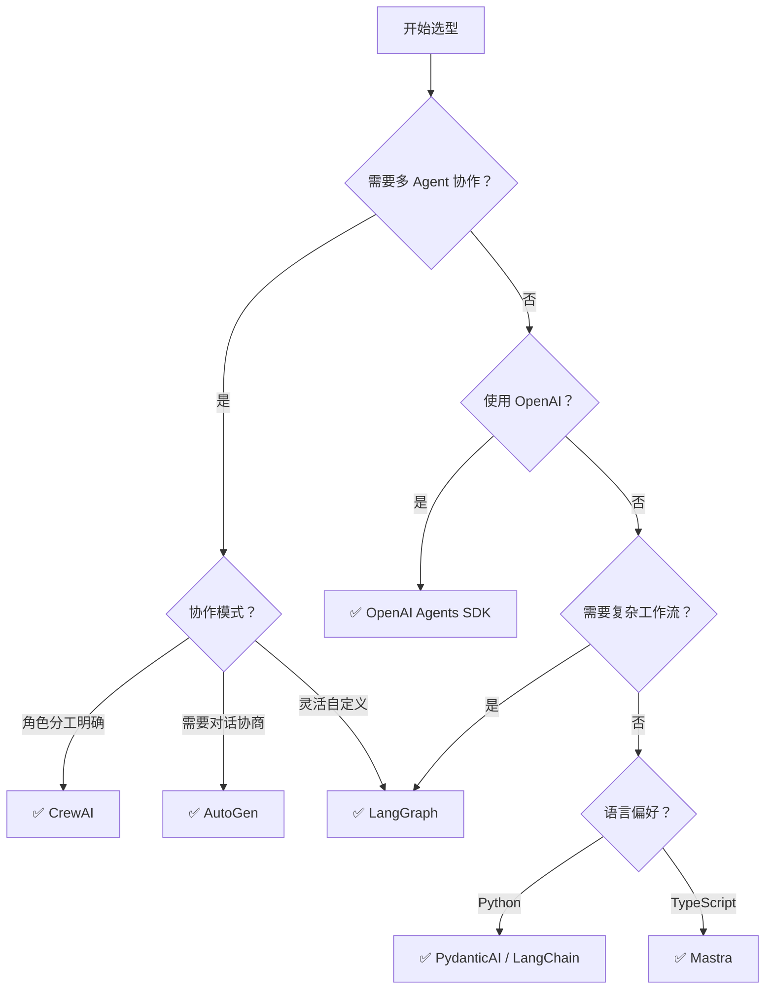

# Agent 框架全景对比

> **创建日期：** 2026-06-06
> **前置知识：** Agent 架构、Function Calling、多 Agent 协作

---

## 一、Agent 框架生态全景



---

## 二、核心框架详解

### 2.1 LangChain / LangGraph

| 维度 | LangChain | LangGraph |
|------|-----------|-----------|
| **定位** | 通用 LLM 应用框架 | 有状态 Agent 编排框架 |
| **核心抽象** | Chain、Agent、Tool | StateGraph（状态图） |
| **适用场景** | 快速原型、RAG 应用 | 复杂 Agent 工作流、多步推理 |
| **学习曲线** | 中等 | 较高 |
| **生产成熟度** | ⭐⭐⭐⭐⭐ | ⭐⭐⭐⭐ |

```python
# LangGraph 示例：定义 Agent 工作流
from langgraph.graph import StateGraph

# 定义状态
class AgentState(TypedDict):
    messages: list
    next_step: str

# 定义节点
def agent(state): ...
def tool_executor(state): ...

# 构建图
graph = StateGraph(AgentState)
graph.add_node("agent", agent)
graph.add_node("tools", tool_executor)
graph.add_conditional_edges("agent", should_continue, {
    "continue": "tools",
    "end": END
})
graph.add_edge("tools", "agent")
```

### 2.2 CrewAI

**定位：** 角色驱动的多 Agent 协作框架

```python
from crewai import Agent, Task, Crew

# 定义角色
researcher = Agent(
    role="研究员",
    goal="收集和分析市场数据",
    backstory="你是一个经验丰富的市场研究员"
)

analyst = Agent(
    role="分析师",
    goal="基于研究数据生成报告",
    backstory="你是一个资深数据分析师"
)

# 定义任务
research_task = Task(description="研究2026年AI市场趋势", agent=researcher)
analysis_task = Task(description="基于研究结果生成分析报告", agent=analyst)

# 组建团队
crew = Crew(agents=[researcher, analyst], tasks=[research_task, analysis_task])
result = crew.kickoff()
```

**特点：** 开箱即用，角色定义清晰，适合快速上手多 Agent 场景。

### 2.3 AutoGen（微软）

**定位：** 对话驱动的多 Agent 协作框架

| 特点 | 说明 |
|------|------|
| 协作方式 | Agent 之间通过对话（Chat）协作 |
| 代码执行 | 内置代码执行沙箱 |
| 人机协作 | 支持人在回路（Human-in-the-Loop） |
| 多模型 | 不同 Agent 可以使用不同模型 |

### 2.4 OpenAI Agents SDK

**定位：** OpenAI 官方的轻量级 Agent 框架

```python
from agents import Agent, Runner

# 定义 Agent
agent = Agent(
    name="助手",
    instructions="你是一个有帮助的助手",
    tools=[search_tool, calculator_tool]
)

# 运行
result = Runner.run_sync(agent, "今天天气怎么样？")
```

**特点：** 极简 API，与 OpenAI 生态深度集成，适合 OpenAI 重度用户。

---

## 三、框架对比速查表

| 框架 | 类型 | 多Agent | 状态管理 | 学习曲线 | 生产成熟度 | 推荐场景 |
|------|------|---------|----------|----------|------------|----------|
| **LangGraph** | 编排框架 | ✅ | 图状态 | 较高 | ⭐⭐⭐⭐ | 复杂 Agent 工作流 |
| **LangChain** | 通用框架 | 有限 | Chain | 中等 | ⭐⭐⭐⭐⭐ | RAG + 简单 Agent |
| **CrewAI** | 多Agent | ✅ | 角色 | 低 | ⭐⭐⭐ | 角色分工明确的协作 |
| **AutoGen** | 多Agent | ✅ | 对话 | 中等 | ⭐⭐⭐ | 多轮对话协作 |
| **OpenAI SDK** | 轻量 | 有限 | 无 | 低 | ⭐⭐⭐⭐ | OpenAI 生态快速开发 |
| **PydanticAI** | 轻量 | 否 | 无 | 低 | ⭐⭐⭐ | 结构化输出 + 工具调用 |
| **Google ADK** | 轻量 | 有限 | 无 | 低 | ⭐⭐ | Gemini 生态 |
| **smolagents** | 轻量 | 有限 | 无 | 低 | ⭐⭐ | HuggingFace 生态 |
| **Mastra** | 轻量 | 有限 | 无 | 中等 | ⭐⭐ | TypeScript 项目 |

---

## 四、选型决策树



---

## 五、框架组合策略

生产环境中，单一框架往往不够，需要**多框架组合**：

| 组合 | 场景 | 说明 |
|------|------|------|
| **LangChain + LangGraph** | RAG + Agent 工作流 | LangChain 做 RAG，LangGraph 做 Agent 编排 |
| **CrewAI + LangChain** | 多 Agent + 工具链 | CrewAI 做角色分工，LangChain 做工具集成 |
| **PydanticAI + 向量数据库** | 结构化输出 + RAG | PydanticAI 做输出校验，向量库做检索 |

---

## 六、2026 年趋势

1. **框架趋同**：各框架 API 越来越相似，迁移成本降低
2. **MCP 协议标准化**：工具调用逐渐统一到 MCP 协议
3. **轻量化趋势**：从重型框架（LangChain）向轻量框架（PydanticAI/smolagents）迁移
4. **可观测性增强**：LangSmith、Weave 等工具让 Agent 行为可追踪

---

## 七、面试高频题

### Q1: LangChain 和 LangGraph 的区别是什么？各适用什么场景？

**详细答案：** LangChain 和 LangGraph 虽然同属 LangChain 生态，但定位和设计哲学截然不同。**LangChain** 是一个通用 LLM 应用框架，核心抽象是 **Chain（链式调用）**——将多个组件（Prompt、LLM、Tool、Parser）串联成一个线性的处理流程。它的优势在于组件化程度高、生态丰富（大量第三方集成），适合快速构建 RAG 应用、简单的 LLM 链和原型验证。但 Chain 的局限性也很明显：它是**线性的、无状态的**，难以表达复杂的条件分支、循环和动态路由，这正是 Agent 工作流中最常见的需求。

**LangGraph** 正是为了解决 LangChain 在 Agent 场景下的不足而诞生的。它的核心抽象是 **StateGraph（有状态图）**——将 Agent 工作流建模为图结构，节点是 Agent 或工具，边定义了执行流程，条件边实现了动态路由，状态对象在节点间流转并保持。LangGraph 的核心理念是"Agent 工作流本质上是状态机"——每个节点执行后更新状态，根据状态决定下一个节点。这种设计让 LangGraph 能够表达任意复杂的 Agent 工作流，包括循环（ReAct 模式）、条件分支（根据工具返回结果决定下一步）、并行执行（多个节点同时执行）、人机交互（暂停等待人工审批）。

**选型建议：** 如果你的需求是"构建一个 RAG 问答系统"或"简单的 LLM 调用链"，LangChain 的 Chain 抽象足够且更简单。如果你的需求是"构建一个复杂的 Agent 工作流，需要多步推理、条件分支、循环调用工具"，那么 LangGraph 是更好的选择。两者可以组合使用——LangChain 做组件和工具集成，LangGraph 做编排。这也是 LangChain 官方推荐的模式：LangChain 提供"积木"（组件），LangGraph 提供"搭建图纸"（编排）。

---

### Q2: CrewAI 和 AutoGen 的协作模式有什么不同？各有什么优势和局限？

**详细答案：** CrewAI 和 AutoGen 代表了两种不同的多 Agent 协作范式。**CrewAI** 采用**角色驱动的顺序协作**模式。开发者定义每个 Agent 的角色（Role）、目标（Goal）和背景故事（Backstory），定义任务（Task）并指定执行者，然后将 Agent 和 Task 组装成一个 Crew，框架自动按顺序执行任务。CrewAI 的核心理念是"团队协作像人类团队一样工作"——每个 Agent 有明确的角色定位，任务按依赖关系顺序执行，前一个任务的输出作为后一个任务的上下文。优势是**简单直观**——角色定义清晰，上手快，代码量少；局限是**灵活性不足**——当需要动态路由、条件分支或 Agent 间的多轮辩论时，CrewAI 的"顺序执行"模型不够灵活。

**AutoGen（微软）** 采用**对话驱动的协商协作**模式。Agent 之间通过多轮对话（Chat）来协作，而非严格的"任务-执行"流程。AutoGen 的核心理念是"Agent 之间的协作本质上是对话"——它们通过对话来协商、质疑、达成共识。AutoGen 内置了代码执行沙箱、支持人在回路（Human-in-the-Loop）、允许不同 Agent 使用不同模型。优势是**灵活性和鲁棒性**——Agent 可以自由对话、相互质疑、动态调整策略，适合需要多轮协商的复杂决策场景；局限是**可控性较低**——对话的走向难以精确预测，可能出现对话偏离主题或冗长低效，且对话轮次不可控导致成本不可预测。

**选型对比：** 如果你的场景是"角色分工明确，流程清晰"（如市场分析 -> 报告生成），CrewAI 更合适，能以更少的代码和更可预测的成本完成任务。如果你的场景是"需要多角度协商、动态决策"（如技术方案评审、投资策略制定），AutoGen 的对话式协作能提供更好的灵活性和鲁棒性。另外，CrewAI 更偏向"开箱即用"的体验，AutoGen 虽然功能更强但学习曲线也更陡。

---

### Q3: 什么时候选轻量框架（PydanticAI/OpenAI SDK），什么时候选重型框架（LangChain/LangGraph）？

**详细答案：** 框架选型本质上是**控制力与便利性的权衡**。轻量框架（PydanticAI、OpenAI Agents SDK、smolagents）的特点是 API 简洁、抽象层少、学习成本低，直接封装 LLM 的核心能力（工具调用、结构化输出、Agent 循环），不引入额外的抽象概念。它们的优势在于**透明性**——代码和 LLM API 之间没有太多中间层，出问题时容易定位和调试；**灵活性**——不绑定特定的工作流模式，可以自由组合和定制；**性能**——没有框架层的额外开销，延迟更低。适用场景包括：快速原型开发、简单的 Agent 应用、需要精确控制 API 调用的场景、团队熟悉 LLM 底层 API 的情况。

重型框架（LangChain、LangGraph、LlamaIndex）的特点是抽象层次高、生态丰富、内置了大量最佳实践和集成。它们的优势在于**生产力**——通过 Chain、Graph、Agent 等高层抽象，可以用少量代码实现复杂的编排逻辑；**生态**——丰富的第三方集成（向量数据库、文档加载器、工具集成）让开发者可以快速接入各种外部服务；**标准化**——框架提供了统一的接口和模式，团队协作时不需要每个人重新发明轮子。适用场景包括：复杂 Agent 工作流、需要大量第三方集成的项目、团队规模较大需要统一开发规范的情况。

**决策框架：** 一个实用的判断方法是看项目的两个维度——**工作流复杂度**和**团队规模**。工作流简单 + 团队小 -> 轻量框架（快速迭代，减少学习成本）；工作流复杂 + 团队大 -> 重型框架（标准化模式，减少沟通成本）。另一个维度是**长期维护成本**——轻量框架的代码通常更简单直接，长期维护成本低；重型框架依赖框架版本升级，可能在框架大版本更新时产生迁移成本。2026 年的趋势是**从重到轻的迁移**——越来越多的团队发现 LangChain 的过度抽象带来的心智负担超过了其便利性，转而使用 PydanticAI 或直接使用 OpenAI SDK + 自建编排逻辑。

---

### Q4: 如何为项目选择合适的 Agent 框架？决策依据是什么？

**详细答案：** 框架选型需要从五个维度系统评估。**维度一：任务复杂度**。简单任务（单步查询、模板填充）-> 轻量框架；中等任务（RAG、工具调用链）-> LangChain 或 PydanticAI；复杂任务（多步推理、条件分支、多 Agent 协作）-> LangGraph、CrewAI 或 AutoGen。**维度二：多 Agent 需求**。如果不需要多 Agent，LangGraph 和轻量框架都可以；如果需要多 Agent 且角色分工明确 -> CrewAI；如果需要 Agent 间协商和辩论 -> AutoGen；如果需要精细控制多 Agent 编排 -> LangGraph。

**维度三：生态与集成**。如果你的项目需要大量第三方集成（向量数据库、文档处理、API 工具），LangChain 的生态最丰富。如果你主要使用 OpenAI 生态，OpenAI Agents SDK 的集成最原生。如果你需要结构化输出和类型安全，PydanticAI 的表现最出色（基于 Pydantic 的模型校验）。**维度四：团队技能**。如果团队有图/状态机经验，LangGraph 的学习曲线不会太陡；如果团队偏好声明式编程，CrewAI 的角色定义方式更直观；如果团队追求极简和透明，直接使用 SDK 或轻量框架更合适。

**维度五：生产就绪度**。考虑框架的成熟度、社区活跃度、文档质量、是否有商业支持。LangChain 和 LangGraph 的社区最大、第三方教程最多、可观测性工具（LangSmith）最完善。CrewAI 和 AutoGen 的社区增长迅速但成熟度略低。轻量框架通常社区较小但代码质量高、bug 少。另外，**锁定风险**也是重要考量——框架越重，迁移成本越高。建议在选型时保持架构的灵活性，将核心业务逻辑与框架解耦，避免深度绑定某个框架。

**实操建议：** 不要试图选一个"万能框架"。生产实践中，最佳方案往往是**多框架组合**：用 LangGraph 做顶层编排，用 PydanticAI 做结构化输出，用 LangChain 的 document loader 做文档处理。关键是将框架视为"工具"而非"平台"——只在需要的地方使用，不强制全项目统一。

---

### Q5: Agent 框架的未来趋势是什么？MCP 协议对框架生态有何影响？

**详细答案：** 2026 年 Agent 框架呈现三个明显趋势。**趋势一：框架趋同**——各框架的 API 设计越来越相似，核心概念（Agent、Tool、Memory、Orchestration）逐渐标准化。LangGraph 的 StateGraph 和 CrewAI 的 Flow 都在向"图编排"模式靠拢，OpenAI Agents SDK 和 PydanticAI 也在向"声明式 Agent 定义"方向演进。这种趋同降低了框架间的迁移成本，也让开发者可以更灵活地混合使用不同框架。**趋势二：轻量化**——从"重型框架"（LangChain）向"轻量框架"（PydanticAI、smolagents、Mastra）的迁移趋势明显。开发者越来越意识到"框架不是越强大越好，而是越简单越好"，过度抽象反而增加了调试和维护成本。

**趋势三：MCP 协议标准化**——MCP（Model Context Protocol）是 Anthropic 提出的工具调用标准化协议，目前正被越来越多的框架和模型服务商采纳。MCP 的核心价值在于**解耦工具提供者和消费者**：工具开发者只需实现一次 MCP Server，任何支持 MCP 的框架和模型都可以直接使用这些工具，无需针对每个框架做适配。这对框架生态的影响深远：过去"框架绑定工具"的模式（如 LangChain 的 Tool 接口）将被 MCP 取代，框架的核心竞争力将从"谁的工具多"转向"谁的编排能力强"。

**个人判断：** MCP 协议将像 HTTP 对 Web 的影响一样，成为 Agent 生态的基础设施层。未来的 Agent 框架将分化为两个层次：底层是 MCP 标准化的工具和资源层，上层是框架的编排和推理层。这意味着框架选型将更加聚焦于"编排能力"而非"工具生态"，轻量框架的优势将进一步凸显——因为它们可以借助 MCP 获得丰富的工具生态，同时保持自身的简洁和灵活。建议在项目中尽早引入 MCP 支持，为未来的工具生态互通做好准备。

---

### Q6: PydanticAI 和 OpenAI Agents SDK 的区别是什么？各适合什么场景？

**详细答案：** PydanticAI 和 OpenAI Agents SDK 都是 2025-2026 年涌现的轻量级 Agent 框架，但设计理念有本质区别。**PydanticAI** 的核心定位是**结构化输出 + 类型安全的 Agent 开发**。它基于 Pydantic 的模型校验能力，将 Agent 的输入输出都定义为严格的类型模型，在编译期和运行时都能捕获类型错误。PydanticAI 的 Agent 循环强调"模型 -> 验证 -> 重试"的模式——LLM 的输出必须通过 Pydantic 模型的校验，校验失败则自动重试。这种设计让 PydanticAI 在需要严格结构化输出的场景（如数据提取、API 响应生成、表单填充）中表现出色。此外，PydanticAI 是模型无关的，支持 OpenAI、Anthropic、Google 等多种模型。

**OpenAI Agents SDK** 的核心定位是**OpenAI 生态的原生 Agent 开发体验**。它提供极简的 API——只需定义 Agent 的名字、指令和工具，即可通过 Runner 运行。它的特点是深度集成 OpenAI 的 API 特性（如 streaming、parallel tool calls、structured outputs），在 OpenAI 模型上能获得最佳性能和最完整的特性支持。但它的局限也很明显——**强绑定 OpenAI 生态**，切换到其他模型供应商的成本较高。OpenAI Agents SDK 的 Agent 之间支持 Handoff（移交）机制，允许一个 Agent 将对话移交给另一个 Agent，这是它区别于 PydanticAI 的一个特色功能。

**选型对比：** 如果你的项目核心需求是**结构化输出**（如从非结构化文本中提取结构化数据、生成严格格式的 JSON 响应），且需要类型安全，PydanticAI 是更好的选择。如果你的项目**深度依赖 OpenAI 模型**，且需要快速构建 Agent 应用（尤其是需要 Agent 间移交的场景），OpenAI Agents SDK 提供更原生的体验。如果你的项目需要**模型无关性**（未来可能切换模型供应商），PydanticAI 的抽象层让你可以更平滑地切换。另外，PydanticAI 在 Python 类型系统方面的优势对于大型团队协作非常有益——类型注解让 IDE 能提供更好的代码补全和错误提示。

---

### Q7: 在实际项目中，如何评估和降低框架的迁移成本？

**详细答案：** 框架迁移成本是 Agent 项目中最容易被忽视但影响最大的风险之一。Agent 框架生态仍在快速演进中，今天的主流框架明天可能被取代，因此**降低框架锁定**是架构设计中的重要考量。核心策略是**将业务逻辑与框架解耦**：将 Agent 的核心推理逻辑、工具实现、Prompt 模板、记忆管理作为独立的模块，框架只负责编排和调用这些模块。这样当需要切换框架时，只需替换编排层，业务逻辑模块可以复用。

具体实现方式包括：**定义框架无关的 Agent 接口**——抽象出 `BaseAgent`、`BaseTool`、`BaseMemory` 等接口，框架特定的实现作为这些接口的适配器。例如，一个 `SearchTool` 同时实现 `BaseTool` 接口和 LangChain 的 `BaseTool` 接口，在 LangChain 和 PydanticAI 之间切换只需改变适配器，核心逻辑不变。**避免在 Prompt 中嵌入框架特有的语法**——使用纯文本 Prompt 模板，不要让 Prompt 依赖框架特有的变量替换语法。**工具实现保持纯函数**——工具的核心逻辑是纯函数，框架只负责调用和结果处理。

**实际操作建议：** 在项目初期，先选择一个轻量框架或直接使用 SDK 构建 MVP，验证核心业务逻辑。当业务逻辑稳定后，再评估是否需要引入重型框架来做编排优化。这个过程中，核心业务逻辑始终是框架无关的，无论选择什么框架都不会有巨大的迁移成本。另外，**关注 MCP 协议**——如果工具都通过 MCP 暴露，那么框架切换时工具层完全不需要变动，这是目前最有效的降低迁移成本的手段。最后，定期评估框架的健康度（GitHub star 趋势、issue 关闭率、维护者活跃度），提前识别框架衰落的信号，避免在"沉船"上投入过多。