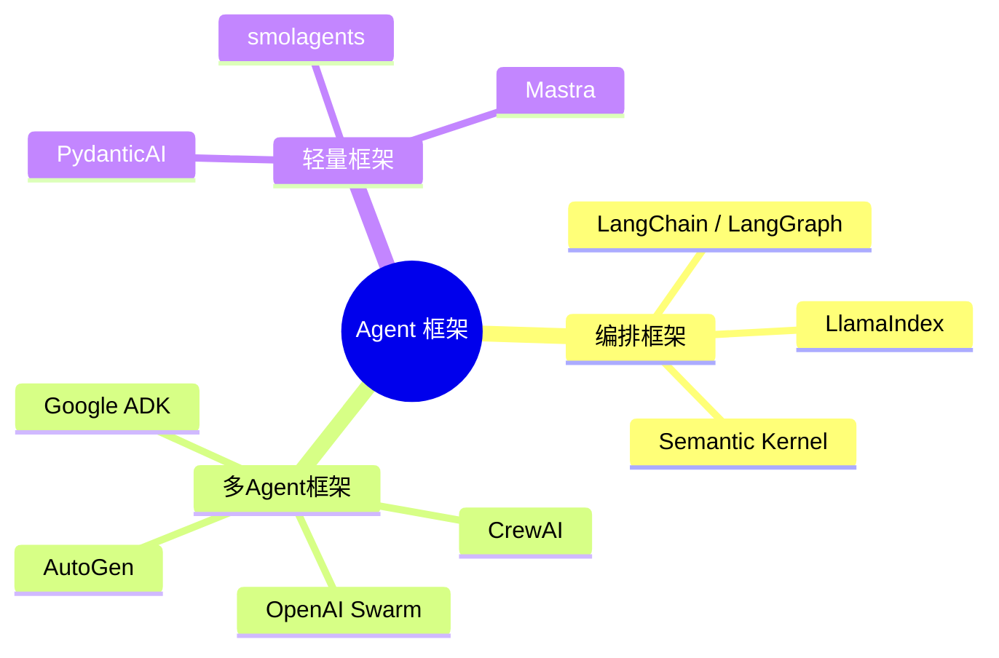
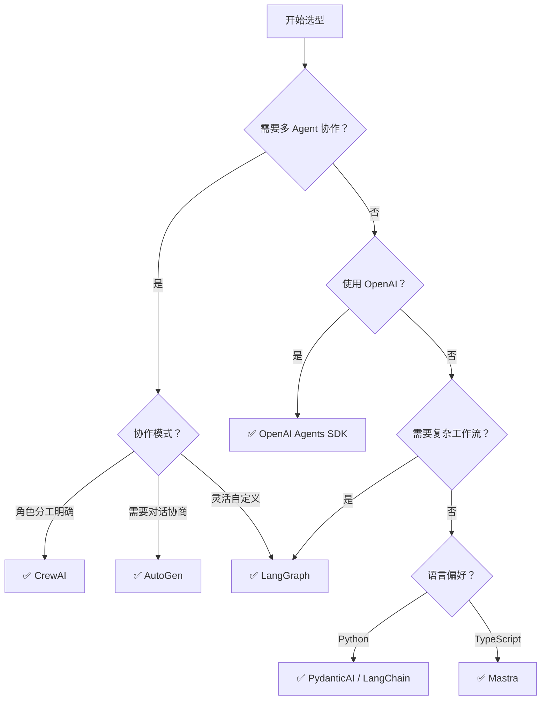

# Agent 框架全景对比

> **创建日期：** 2026-06-06
> **前置知识：** Agent 架构、Function Calling、多 Agent 协作

---

## 一、Agent 框架生态全景



---

## 二、核心框架详解

### 2.1 LangChain / LangGraph

| 维度 | LangChain | LangGraph |
|------|-----------|-----------|
| **定位** | 通用 LLM 应用框架 | 有状态 Agent 编排框架 |
| **核心抽象** | Chain、Agent、Tool | StateGraph（状态图） |
| **适用场景** | 快速原型、RAG 应用 | 复杂 Agent 工作流、多步推理 |
| **学习曲线** | 中等 | 较高 |
| **生产成熟度** | ⭐⭐⭐⭐⭐ | ⭐⭐⭐⭐ |

```python
# LangGraph 示例：定义 Agent 工作流
from langgraph.graph import StateGraph

# 定义状态
class AgentState(TypedDict):
    messages: list
    next_step: str

# 定义节点
def agent(state): ...
def tool_executor(state): ...

# 构建图
graph = StateGraph(AgentState)
graph.add_node("agent", agent)
graph.add_node("tools", tool_executor)
graph.add_conditional_edges("agent", should_continue, {
    "continue": "tools",
    "end": END
})
graph.add_edge("tools", "agent")
```

### 2.2 CrewAI

**定位：** 角色驱动的多 Agent 协作框架

```python
from crewai import Agent, Task, Crew

# 定义角色
researcher = Agent(
    role="研究员",
    goal="收集和分析市场数据",
    backstory="你是一个经验丰富的市场研究员"
)

analyst = Agent(
    role="分析师",
    goal="基于研究数据生成报告",
    backstory="你是一个资深数据分析师"
)

# 定义任务
research_task = Task(description="研究2026年AI市场趋势", agent=researcher)
analysis_task = Task(description="基于研究结果生成分析报告", agent=analyst)

# 组建团队
crew = Crew(agents=[researcher, analyst], tasks=[research_task, analysis_task])
result = crew.kickoff()
```

**特点：** 开箱即用，角色定义清晰，适合快速上手多 Agent 场景。

### 2.3 AutoGen（微软）

**定位：** 对话驱动的多 Agent 协作框架

| 特点 | 说明 |
|------|------|
| 协作方式 | Agent 之间通过对话（Chat）协作 |
| 代码执行 | 内置代码执行沙箱 |
| 人机协作 | 支持人在回路（Human-in-the-Loop） |
| 多模型 | 不同 Agent 可以使用不同模型 |

### 2.4 OpenAI Agents SDK

**定位：** OpenAI 官方的轻量级 Agent 框架

```python
from agents import Agent, Runner

# 定义 Agent
agent = Agent(
    name="助手",
    instructions="你是一个有帮助的助手",
    tools=[search_tool, calculator_tool]
)

# 运行
result = Runner.run_sync(agent, "今天天气怎么样？")
```

**特点：** 极简 API，与 OpenAI 生态深度集成，适合 OpenAI 重度用户。

---

## 三、框架对比速查表

| 框架 | 类型 | 多Agent | 状态管理 | 学习曲线 | 生产成熟度 | 推荐场景 |
|------|------|---------|----------|----------|------------|----------|
| **LangGraph** | 编排框架 | ✅ | 图状态 | 较高 | ⭐⭐⭐⭐ | 复杂 Agent 工作流 |
| **LangChain** | 通用框架 | 有限 | Chain | 中等 | ⭐⭐⭐⭐⭐ | RAG + 简单 Agent |
| **CrewAI** | 多Agent | ✅ | 角色 | 低 | ⭐⭐⭐ | 角色分工明确的协作 |
| **AutoGen** | 多Agent | ✅ | 对话 | 中等 | ⭐⭐⭐ | 多轮对话协作 |
| **OpenAI SDK** | 轻量 | 有限 | 无 | 低 | ⭐⭐⭐⭐ | OpenAI 生态快速开发 |
| **PydanticAI** | 轻量 | 否 | 无 | 低 | ⭐⭐⭐ | 结构化输出 + 工具调用 |
| **Google ADK** | 轻量 | 有限 | 无 | 低 | ⭐⭐ | Gemini 生态 |
| **smolagents** | 轻量 | 有限 | 无 | 低 | ⭐⭐ | HuggingFace 生态 |
| **Mastra** | 轻量 | 有限 | 无 | 中等 | ⭐⭐ | TypeScript 项目 |

---

## 四、选型决策树



---

## 五、框架组合策略

生产环境中，单一框架往往不够，需要**多框架组合**：

| 组合 | 场景 | 说明 |
|------|------|------|
| **LangChain + LangGraph** | RAG + Agent 工作流 | LangChain 做 RAG，LangGraph 做 Agent 编排 |
| **CrewAI + LangChain** | 多 Agent + 工具链 | CrewAI 做角色分工，LangChain 做工具集成 |
| **PydanticAI + 向量数据库** | 结构化输出 + RAG | PydanticAI 做输出校验，向量库做检索 |

---

## 六、2026 年趋势

1. **框架趋同**：各框架 API 越来越相似，迁移成本降低
2. **MCP 协议标准化**：工具调用逐渐统一到 MCP 协议
3. **轻量化趋势**：从重型框架（LangChain）向轻量框架（PydanticAI/smolagents）迁移
4. **可观测性增强**：LangSmith、Weave 等工具让 Agent 行为可追踪

---

## 七、面试重点

::: warning 高频考点
1. **LangChain 和 LangGraph 的区别？** 各适用什么场景？
2. **CrewAI 和 AutoGen 的协作模式有什么不同？**
3. **什么时候选轻量框架，什么时候选重型框架？**
4. **如何为项目选择合适的 Agent 框架？** 决策依据是什么？
5. **Agent 框架的未来趋势是什么？** MCP 协议的影响？
:::