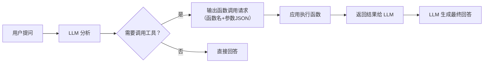

# 工具调用（Function Calling）

> **创建日期：** 2026-06-06
> **前置知识：** Agent 架构、Prompt Engineering

---

## 一、Function Calling 原理

Function Calling 让 LLM 能够**调用外部函数/API**。模型不直接执行函数，而是**输出函数调用请求**（函数名+参数），由应用程序实际执行。



---

## 二、工具描述规范（JSON Schema 最佳实践）

### 2.1 工具定义模板

```python
# 规范的 Function Calling 工具定义
tools = [{
    "type": "function",
    "function": {
        "name": "search_employees",  # 函数名：清晰描述功能
        "description": "根据条件搜索员工信息，"
                       "支持按姓名、部门、职位筛选",  # 描述：帮助模型理解何时调用
        "parameters": {
            "type": "object",
            "properties": {
                "name": {
                    "type": "string",
                    "description": "员工姓名，支持模糊匹配"
                },
                "department": {
                    "type": "string",
                    "description": "部门名称，如'技术部'、'市场部'",
                    "enum": ["技术部", "市场部", "人事部", "财务部"]
                },
                "page": {
                    "type": "integer",
                    "description": "页码，从 1 开始",
                    "default": 1
                }
            },
            "required": []  # 没有必填参数
        }
    }
}]
```

### 2.2 工具描述的核心原则

| 原则 | 说明 | 示例 |
|------|------|------|
| **名称清晰** | 函数名让模型一眼看出功能 | ✅ `search_employees` ❌ `func1` |
| **描述详尽** | 在 description 中说明何时调用、做什么 | ✅ "根据条件搜索员工信息" |
| **参数约束** | 使用 enum 限制可选值，使用 description 说明含义 | ✅ `"enum": ["技术部", "市场部"]` |
| **必填标注** | 用 required 明确哪些参数必须提供 | ✅ `"required": ["name"]` |

---

## 三、工具选择策略

### 3.1 并行调用 vs 串行调用

| 策略 | 适用场景 | 示例 |
|------|----------|------|
| **并行调用** | 工具之间无依赖关系 | 同时查询天气和股票 |
| **串行调用** | 后一个工具依赖前一个的结果 | 先查员工ID，再查员工详情 |

```python
# 并行调用：同时查询北京和上海的天气
response = client.chat.completions.create(
    model="gpt-4o",
    messages=[{"role": "user", "content": "北京和上海今天天气怎么样？"}],
    tools=[weather_tool],
    parallel_tool_calls=True  # 允许并行调用
)
```

### 3.2 工具选择提示

当工具较多时（>10个），可以用以下策略帮助模型选对工具：

1. **工具分组**：将相关工具放在一起，用系统 Prompt 引导
2. **意图路由**：先用简单分类器判断意图，再给对应工具组
3. **工具名称前缀**：如 `db_query_*`、`api_call_*`、`file_read_*`

---

## 四、错误处理与重试

### 4.1 常见错误类型

| 错误类型 | 原因 | 处理方式 |
|----------|------|----------|
| 参数格式错误 | 模型生成的 JSON 不正确 | 解析重试，将错误信息反馈给模型 |
| 工具返回错误 | 被调用函数执行失败 | 将错误信息传给模型，让它调整 |
| 死循环 | 模型反复调用同一个工具 | 设置最大调用次数限制 |
| 幻觉调用 | 模型调用了不存在的工具 | 在 Prompt 中明确可用的工具列表 |

### 4.2 重试框架

```python
def safe_tool_call(messages, tools, max_retries=3):
    """带重试的工具调用框架"""
    for attempt in range(max_retries):
        response = llm.chat(messages, tools=tools)

        # 检查是否需要调用工具
        if not response.tool_calls:
            return response.content  # 直接回答

        try:
            # 执行工具调用
            results = execute_tools(response.tool_calls)
            # 将结果追加到消息历史
            messages.append(response)
            messages.append({"role": "tool", "content": results})
        except Exception as e:
            # 将错误信息反馈给模型
            messages.append({
                "role": "tool",
                "content": f"错误：{str(e)}"
            })
    raise Exception("达到最大重试次数")
```

---

## 五、工具调用链编排

复杂任务需要**多个工具串联调用**：

```python
# 工具调用链示例：复杂数据查询
def complex_query(user_input):
    """
    1. 理解意图 → 确定需要哪些工具
    2. 执行查询 → 获取原始数据
    3. 数据分析 → 对结果进行分析
    4. 格式化输出 → 生成最终答案
    """
    messages = [{"role": "user", "content": user_input}]
    tools = [query_db, analyze_data, format_output]

    while True:
        response = llm.chat(messages, tools=tools)
        if not response.tool_calls:
            return response.content  # 最终答案

        for tool_call in response.tool_calls:
            result = execute(tool_call)
            messages.append({"role": "tool", "content": result})
```

---

## 六、安全沙箱

::: warning 安全考虑
Function Calling 让 LLM 可以执行代码/调用 API，必须做安全控制。
:::

| 安全措施 | 说明 |
|----------|------|
| **权限控制** | 每个工具调用前检查权限（谁可以调用、什么场景可以调用） |
| **参数校验** | 验证参数类型、范围、格式，防止注入攻击 |
| **速率限制** | 限制单个用户/会话的工具调用频率 |
| **只读优先** | 优先提供只读工具，写操作需要二次确认 |
| **审计日志** | 记录所有工具调用，便于追溯和排查 |

---

## 七、面试重点

::: warning 高频考点
1. **Function Calling 的原理是什么？** 模型如何知道该调用哪个工具？
2. **如何设计一个好的工具描述？** JSON Schema 的最佳实践？
3. **并行调用和串行调用有什么区别？** 各适用什么场景？
4. **工具调用失败怎么处理？** 重试策略是什么？
5. **Function Calling 有哪些安全风险？** 如何防护？
:::