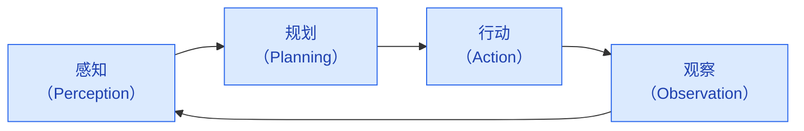
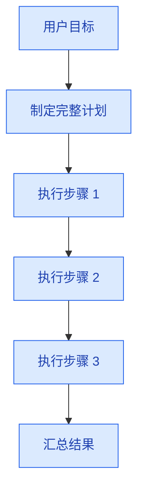
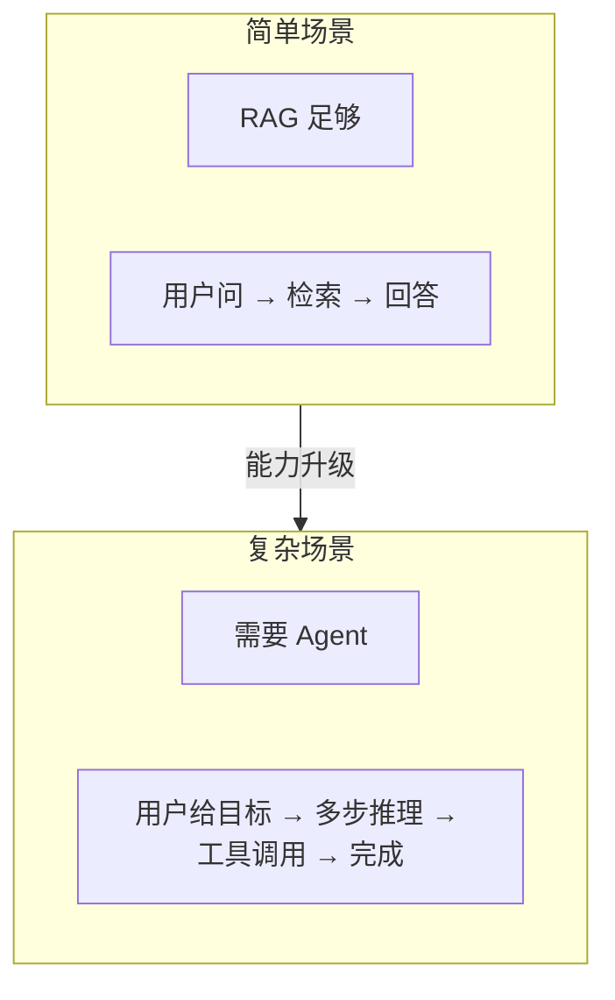

# Agent 架构与原理

> **创建日期：** 2026-06-06
> **前置知识：** LLM 基础、Prompt Engineering、RAG

---

## 一、什么是 Agent？

Agent（智能体）是能够**自主感知环境、做出决策、执行行动**的 AI 系统。与传统 LLM 应用不同，Agent 不是"一问一答"，而是**自主完成多步任务**。

::: tip 核心区别
- **传统 LLM**：用户问 → 模型答（一个回合）
- **Agent**：用户给目标 → Agent 自主规划 → 调用工具 → 观察结果 → 调整策略 → 完成任务（多个回合）
:::

---

## 二、Agent 核心架构



| 环节 | 做什么 | 问题 |
|------|--------|------|
| **感知** | 理解用户意图、获取环境信息 | 用户想做什么？当前状态是什么？ |
| **规划** | 拆解任务、制定步骤 | 需要哪些步骤？先后顺序？ |
| **行动** | 调用工具、执行操作 | 调用哪个工具？传什么参数？ |
| **观察** | 分析结果、判断是否完成 | 结果是否符合预期？需要调整吗？ |

---

## 三、ReAct 框架深入

ReAct（Reasoning + Acting）是 Agent 最基础的运行框架：

```
Thought: 我需要查询北京的天气
Action: call_weather_api("北京")
Observation: 北京今天晴，25°C
Thought: 用户还想知道明天适不适合出行
Action: call_weather_api("北京", "明天")
Observation: 明天多云，22°C，适合出行
Thought: 我已经有了足够的信息来回答
Final Answer: 北京今天晴，25°C；明天多云，22°C，适合出行。
```

### ReAct 的 Prompt 模板

```python
REACT_PROMPT = """
你是一个智能助手，可以调用以下工具完成任务：

可用工具：
{tools}

使用以下格式回答：
Thought: 你的思考过程
Action: 工具名称
Action Input: 工具参数（JSON格式）
Observation: 工具返回的结果
...（可以重复 Thought/Action/Observation）
Thought: 我已获得足够信息
Final Answer: 最终答案

用户问题：{query}
"""
```

---

## 四、Agent 设计模式

### 4.1 Plan-and-Execute（先规划后执行）



**适用场景：** 任务结构清晰，步骤可预见
**优点：** 高效，减少 LLM 调用次数
**缺点：** 计划一旦出错，后续步骤全部偏差

### 4.2 Self-Reflection（自我反思）

Agent 在执行过程中不断反思和纠错：

```
Action: 查询员工张三的工资
Observation: 错误：权限不足，无法查询
Thought: 我没有权限查询工资，但可以查询张三的部门信息
Action: 查询张三的部门
Observation: 张三，技术部，高级工程师
```

**适用场景：** 执行过程可能出错，需要动态调整

### 4.3 Reflexion（反思 + 记忆）

Reflexion 在 Self-Reflection 基础上加入**长期记忆**，从失败中学习：

```
# 第一次尝试失败
Action: 查询数据库表 user_info
Observation: 表不存在
Reflection: 数据库表名应该是 users，不是 user_info

# 第二次尝试（用了上次的反思）
Action: 查询数据库表 users
Observation: 成功返回数据
```

---

## 五、Agent 与 RAG 的关系



| 维度 | RAG | Agent |
|------|-----|-------|
| 交互模式 | 单轮问答 | 多轮自主交互 |
| 工具使用 | 不需要 | 需要调用外部工具 |
| 任务复杂度 | 简单问答 | 多步任务 |
| 自主性 | 低 | 高 |

::: tip 何时需要 Agent？
- 任务需要**多步骤**才能完成
- 需要调用**外部工具**（API、数据库、文件系统）
- 执行过程**可能出错**，需要重试和纠错
- 需要**动态决策**，不是固定流程
:::

---

## 六、面试高频题

### Q1: Agent 的核心架构是什么？感知-规划-行动-观察循环是如何运作的？

**详细答案：** 我们做了一个保险客服 Agent，这个环跑了大半年，分享下实际体验。感知-规划-行动-观察这四个环节其实每天都在跑。感知层就是理解用户到底想问什么——"我这个病能不能赔"和"这个险种包含哪些疾病"需要走向不同的处理路径。规划层把任务拆成子步骤，比如"先检索条款确认病种是否在保障内，再查赔付比例，再确认有没有等待期限制"，大概分 3-5 步。行动层就是执行工具调用——调向量检索、调 Neo4j 图查询、调计算引擎算赔付金额。观察层判断结果是否完整——如果赔付金额算出来是 0，那大概率参数传错了，得回思考层重来。

这个环的关键设计点是终止条件。我们设了 `max_steps=8`，字面意思是最多执行 8 步就强制停止，防止 Agent 陷入死循环。有一回一个复杂理赔问题跑了 7 步才找到完整信息，差点撞上限，后来改成 max_steps=10 留了点buffer。另外我们还加了一个"step timeout"——如果单步工具调用超过 5 秒没返回就报超时，Agent 会在下一个 Thought 里决定要不要重试。这些机制真的不是可有可无的，上线头一个月我们至少抓到 3 次 Agent 死循环，全是靠 max_steps 拦下来的。

### Q2: ReAct 框架的工作原理是什么？Thought/Action/Observation 各自的含义和作用？

**详细答案：** 我们的 Agent 直接用的就是 ReAct 模式，Thought/Action/Observation 是核心概念，跑起来就是个 Alternating Pattern——不是一口气想完所有步骤再执行，而是想一步、做一步、看结果、再想下一步。比如用户问"我的重疾险糖尿病并发症赔不赔"，Agent 第一个 Thought 是"我需要先确认这款保险的疾病列表里有没有糖尿病并发症"，然后 Action 调了向量检索，Observation 返回了条款原文"含糖尿病并发症但需满足3级以上"，第二个 Thought 是"还需要确认用户的诊断结果是否为3级以上"，再调用户医疗记录查询工具，拿到结果后才输出 Final Answer。

交替执行比先规划全貌再执行的好处是防偏差。我们遇到过几次，Agent 一开始想好的全盘计划，第二步执行完了发现情况不一样了——比如条款里没查到这个疾病，说明根本不在保障范围内，后续"查赔付比例"的步骤就不用做了。ReAct 这种一步一确认的模式天然解决了这个问题。格式上我们用了一个结构化的模板，要求必须严格输出 Thought/Action/Action Input/Observation/Final Answer，一个环节输出不对就解析失败，这也是一个坑——有一次 Agent 在 Thought 块里不小心用了一个 lf 而不是 standard 的换行，解析器就挂了，后来我们加了正则容错。

### Q3: Plan-and-Execute 和 Self-Reflection 两种 Agent 设计模式有什么区别？各适用于什么场景？

**详细答案：** 我们在不同场景下两种模式都用过。Plan-and-Execute 适合流程确定的任务——比如"查询某用户所有保单并生成年度保费汇总"，这个流程固定：查用户 → 查保单列表 → 逐单计算保费 → 汇总输出。走 Plan-and-Execute 时 LLM 只调用一次制定计划，后续执行不需要 LLM 参与（我们直接写死步骤调度），省 token 省延迟。但缺点是一旦计划里漏了步骤就麻烦——比如计划里忘了"过滤已失效保单"，汇总结果就会偏大，而且执行过程中不会纠正。

Self-Reflection 我们用在一类有歧义的任务上——用户问"这个病赔不赔"，第一步查条款可能返回"视病情等级而定"，这时候不能直接下结论，Agent 需要反思"我还没有确定用户的病情等级"，然后自动查询用户的医疗记录。这种边做边看的模式多了很多 LLM 调用，token 成本高了不少，但对歧义场景的鲁棒性高很多。

其实这两种也不是二选一，我们在实际架构里是组合用的——主流程走 Plan-and-Execute，但每个执行步骤失败时切换到 Self-Reflection 做重试决策。Reflexion 我们也试过——第一次某个查询因为表名拼错失败后，自动记录为经验写到记忆里，下次同类查询直接修正表名，效果不错但开发成本不低。

### Q4: 什么时候用 Agent，什么时候用 RAG？两者的边界和适用场景如何划分？

**详细答案：** 这个问题我们项目里天天面对。简单答案就是：问"是什么"用 RAG，说"帮我做"用 Agent。但实际判断更细化。我们有个保险客服系统，80% 的请求是"这个条款怎么理解"这种纯 RAG 就能搞定，用户不用多轮交互。剩下 20% 是"帮我算一下我这份保单总共要交多少保费"或者"帮我对比这三款重疾险"——这类不得不分解成多步，先查用户保单，再查每份保单的费率和保障期，再计算汇总，必须走 Agent。

但这里有个经验：不要为了上 Agent 而上 Agent。RAG 是轻量的，一次检索一次生成，P95 在 2 秒内；Agent 链式调用多了延迟就上去了，3-5 轮调用可能到 6-8 秒。我们现在的路由策略是：请求进来先做意图分类，判定是 Simple Query（RAG）还是 Complex Task（Agent），Simple Query 直接走 RAG 快路径，Complex Task 走 Agent 慢路径。而且 Agent 里面也嵌了 RAG 作为检索工具，所以不是互斥的——Agent 的第一步往往就是调 RAG 检索。

### Q5: Agent 在实际项目中最大的挑战是什么？如何应对这些挑战？

**详细答案：** 跑了这一年多 Agent，最大的挑战可以用三个词概括：死循环、幻觉放大、不可调试。死循环是我们最早遇到的——Agent 查到"条款不存在"这个结果后，不是告诉用户而是自己换了三种不同的查询措辞重试了 5 次，吃掉了 20000 tokens 才放弃。后来加了 max_steps=8 硬限制和每步 5 秒超时才算兜住。

幻觉放大更可怕。RAG 里 LLM 编造信息至少还有检索文档能对照，在 Agent 里，如果 Thought 环节就判断错了方向，后续所有 Action 都在做无用功。比如有一次用户问"解约需要什么条件"，Agent 的 Thought 判断"解约等于退保"，然后一路调退保计算工具，最后给出的答案全是错的。后来我们在每个关键 Action 后加了验证步骤，让 Agent 自己问自己"上一步的结果和用户问题对得上吗"。

可调试性是最难解决的。传统程序出 bug 看调用栈一眼就找到问题，Agent 出 bug 你得翻 5-6 轮的 Thought/Action/Observation 链来推断 Agent 在想什么。我们后来把每一步的 Thought 和 Action 全过程落到了 LangSmith 做 trace，再通过 Grafana 面板看 Agent 步数和 token 消耗分布。还有一个关键点：限制工具集能做什么不能做什么。我们 Agent 调数据库工具的时候，只给 `SELECT` 权限，`DELETE` 和 `UPDATE` 直接拦截，物理上杜绝了误操作的风险。