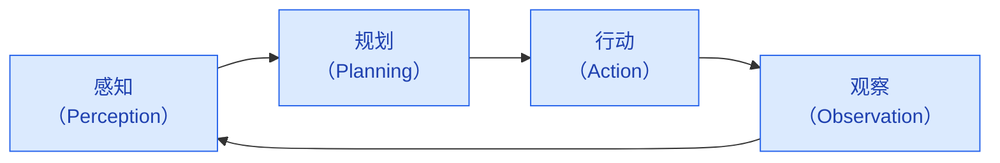
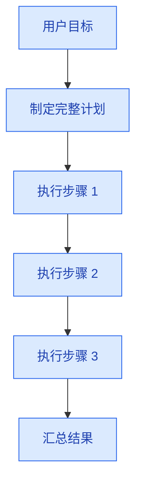
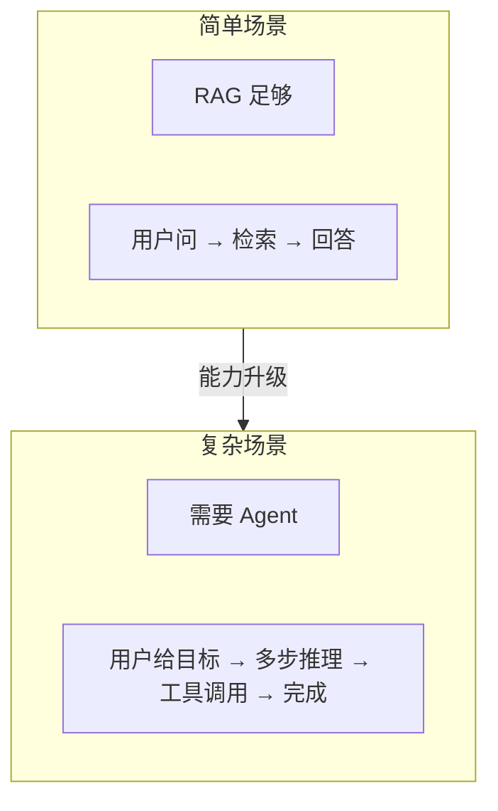

# Agent 架构与原理

> **创建日期：** 2026-06-06
> **前置知识：** LLM 基础、Prompt Engineering、RAG

---

## 一、什么是 Agent？

Agent（智能体）是能够**自主感知环境、做出决策、执行行动**的 AI 系统。与传统 LLM 应用不同，Agent 不是"一问一答"，而是**自主完成多步任务**。

::: tip 核心区别
- **传统 LLM**：用户问 → 模型答（一个回合）
- **Agent**：用户给目标 → Agent 自主规划 → 调用工具 → 观察结果 → 调整策略 → 完成任务（多个回合）
:::

---

## 二、Agent 核心架构



| 环节 | 做什么 | 问题 |
|------|--------|------|
| **感知** | 理解用户意图、获取环境信息 | 用户想做什么？当前状态是什么？ |
| **规划** | 拆解任务、制定步骤 | 需要哪些步骤？先后顺序？ |
| **行动** | 调用工具、执行操作 | 调用哪个工具？传什么参数？ |
| **观察** | 分析结果、判断是否完成 | 结果是否符合预期？需要调整吗？ |

---

## 三、ReAct 框架深入

ReAct（Reasoning + Acting）是 Agent 最基础的运行框架：

```
Thought: 我需要查询北京的天气
Action: call_weather_api("北京")
Observation: 北京今天晴，25°C
Thought: 用户还想知道明天适不适合出行
Action: call_weather_api("北京", "明天")
Observation: 明天多云，22°C，适合出行
Thought: 我已经有了足够的信息来回答
Final Answer: 北京今天晴，25°C；明天多云，22°C，适合出行。
```

### ReAct 的 Prompt 模板

```python
REACT_PROMPT = """
你是一个智能助手，可以调用以下工具完成任务：

可用工具：
{tools}

使用以下格式回答：
Thought: 你的思考过程
Action: 工具名称
Action Input: 工具参数（JSON格式）
Observation: 工具返回的结果
...（可以重复 Thought/Action/Observation）
Thought: 我已获得足够信息
Final Answer: 最终答案

用户问题：{query}
"""
```

---

## 四、Agent 设计模式

### 4.1 Plan-and-Execute（先规划后执行）



**适用场景：** 任务结构清晰，步骤可预见
**优点：** 高效，减少 LLM 调用次数
**缺点：** 计划一旦出错，后续步骤全部偏差

### 4.2 Self-Reflection（自我反思）

Agent 在执行过程中不断反思和纠错：

```
Action: 查询员工张三的工资
Observation: 错误：权限不足，无法查询
Thought: 我没有权限查询工资，但可以查询张三的部门信息
Action: 查询张三的部门
Observation: 张三，技术部，高级工程师
```

**适用场景：** 执行过程可能出错，需要动态调整

### 4.3 Reflexion（反思 + 记忆）

Reflexion 在 Self-Reflection 基础上加入**长期记忆**，从失败中学习：

```
# 第一次尝试失败
Action: 查询数据库表 user_info
Observation: 表不存在
Reflection: 数据库表名应该是 users，不是 user_info

# 第二次尝试（用了上次的反思）
Action: 查询数据库表 users
Observation: 成功返回数据
```

---

## 五、Agent 与 RAG 的关系



| 维度 | RAG | Agent |
|------|-----|-------|
| 交互模式 | 单轮问答 | 多轮自主交互 |
| 工具使用 | 不需要 | 需要调用外部工具 |
| 任务复杂度 | 简单问答 | 多步任务 |
| 自主性 | 低 | 高 |

::: tip 何时需要 Agent？
- 任务需要**多步骤**才能完成
- 需要调用**外部工具**（API、数据库、文件系统）
- 执行过程**可能出错**，需要重试和纠错
- 需要**动态决策**，不是固定流程
:::

---

## 六、面试高频题

### Q1: Agent 的核心架构是什么？感知-规划-行动-观察循环是如何运作的？

**详细答案：** Agent 的核心架构由四个环节组成：**感知（Perception）→ 规划（Planning）→ 行动（Action）→ 观察（Observation）**，这四个环节形成一个闭环，Agent 在其中不断循环直到任务完成。感知环节负责理解用户意图和当前环境状态——用户想要什么？现在手头有哪些信息？还缺什么？规划环节负责将用户目标拆解为可执行的步骤，并决定执行顺序——先做什么、后做什么、是否需要并行。行动环节负责调用工具（API、数据库、文件系统等）执行具体操作，将规划转化为实际效果。观察环节负责分析行动结果，判断是否达到了预期——结果符合预期吗？需要调整策略吗？如果答案是否定的，Agent 会回到感知或规划环节，重新调整。

这个循环与传统的"用户问 → 模型答"模式有本质区别。传统模式是无状态的——每次交互独立，模型不理解上下文中的"进度"。而 Agent 的循环是有状态的——Agent 知道自己已经完成了哪些步骤、还需要做哪些步骤、当前处于什么状态。这种有状态的设计使得 Agent 能够处理需要多步操作的任务，如"帮我查一下最近一周的订单数据，做成表格，然后发邮件给老板"——这个过程需要查数据库、处理数据、生成表格、发送邮件，至少需要 4-5 个行动步骤。

面试中容易被追问的是"循环的终止条件"：Agent 如何知道任务完成了？常见做法有三种：一是模型输出 `Final Answer` 标记（如 ReAct 框架的做法），二是设置最大步数上限（如最多 10 步），三是通过 LLM 判断当前状态是否已满足用户目标。实践中通常是三者结合——LLM 判断为主，最大步数为兜底，防止 Agent 陷入死循环。另一个常见追问是"如何处理循环中的错误"：当行动失败时（如 API 调用超时），Agent 应该将错误信息作为 Observation 反馈给 LLM，让 LLM 决定是重试、换策略还是告知用户。

### Q2: ReAct 框架的工作原理是什么？Thought/Action/Observation 各自的含义和作用？

**详细答案：** ReAct（Reasoning + Acting）是 Agent 领域最基础的运行框架，它将推理和行动交替进行，让 LLM 在执行中思考、在思考中执行。ReAct 框架定义了三类关键输出：**Thought（思考）** 是 LLM 对当前状态的推理和下一步的决策，如"我需要查询订单数据，先调用数据库查询 API"；**Action（行动）** 是 LLM 决定调用哪个工具以及传什么参数，如 `Action: query_database, Action Input: {"sql": "SELECT * FROM orders WHERE ..."}`；**Observation（观察）** 是工具返回的结果，如"返回了 150 条订单记录"。

ReAct 的关键设计在于"交替"——不是先思考完所有步骤再执行，而是思考一步、执行一步、观察结果、再思考下一步。这种交替模式使得 Agent 能够根据中间结果动态调整策略，而不是盲目执行一个预设计划。例如，如果查询数据库后发现订单数据只有 2 条，Agent 可能会调整后续步骤——不需要生成复杂的表格，简单列出来即可。此外，Observation 不仅仅是工具返回的原始数据，还可以包含错误信息（如"API 调用失败：权限不足"），Agent 在下一个 Thought 中需要决定如何处理这个错误。

面试中常被问到 ReAct 与 Chain-of-Thought（CoT）的区别，这是加分点。CoT 是"思考一切 → 输出答案"，适合纯推理任务（如数学题、逻辑题）；ReAct 是"思考一步 → 行动一步 → 观察 → 再思考"，适合需要与外部环境交互的任务（如查询数据库、调用 API）。两者的本质区别在于：CoT 是"闭世界"推理（模型只依赖内部知识），ReAct 是"开世界"推理（模型可以从外部获取信息）。另外，ReAct 的 Prompt 模板设计也非常关键——需要明确定义 Thought/Action/Action Input/Observation 的格式，以及工具列表和参数说明，格式不清晰会导致 LLM 输出不符合预期，解析失败。

### Q3: Plan-and-Execute 和 Self-Reflection 两种 Agent 设计模式有什么区别？各适用于什么场景？

**详细答案：** Plan-and-Execute（先规划后执行）和 Self-Reflection（自我反思）是两种核心的 Agent 设计模式，区别在于"规划与执行的关系"。Plan-and-Execute 是一次性制定完整计划，然后逐步执行，执行过程中不修改计划。Self-Reflection 是边执行边反思，每步之后评估结果，根据需要调整后续步骤。两者的核心差异在于：Plan-and-Execute 假设"计划是完美的"，Self-Reflection 假设"计划可能需要调整"。

Plan-and-Execute 的适用场景是**任务结构清晰、步骤可预见**。例如，"帮我整理这周的会议纪要，按日期排序，生成周报"——这个任务的步骤是确定的（读取纪要 → 排序 → 生成周报），执行过程中不会出现意外。Plan-and-Execute 的优势是高效——只需要一次 LLM 调用来制定计划，后续执行不需要 LLM 参与（或者只需要 LLM 在最后汇总）。缺点是脆弱——如果执行过程中出现意外（如某天的会议纪要缺失），整个计划就需要调整，但 Plan-and-Execute 模式不具备这种灵活性。

Self-Reflection 的适用场景是**执行过程可能出错、需要动态调整**。例如，"帮我找一下竞品 X 的最新融资信息，如果找不到官方信息就找媒体报道"——这个任务中，第一步可能成功也可能失败，如果失败需要换策略。Self-Reflection 的优势是鲁棒——能应对不确定性，即使中间步骤出错也不会导致整个任务失败。缺点是开销大——每一步都需要 LLM 参与思考和决策，Token 消耗和延迟都高于 Plan-and-Execute。

面试中的加分项是能说出 **Reflexion 模式**——这是 Self-Reflection 的升级版，加入了长期记忆（Episodic Memory）。Reflexion 不仅在当前任务中反思，还会将反思结果存储为"经验"，在后续类似任务中复用。例如，第一次执行 SQL 查询时发现表名错了（`user_info` 应该是 `users`），Reflexion 会记录："以后查询用户表用 `users`，不是 `user_info`"。这种长期记忆让 Agent 能够从失败中学习，随着时间推移变得越来越智能。

### Q4: 什么时候用 Agent，什么时候用 RAG？两者的边界和适用场景如何划分？

**详细答案：** Agent 和 RAG 的边界划分，核心看三个维度：**任务复杂度、工具依赖度、自主性需求**。RAG 适合"单轮问答型"场景——用户问一个问题，系统检索相关文档，基于文档生成答案。这类场景的特点是：任务不需要分解（一个问题就是完整的需求），不需要调用外部工具（检索就是唯一的"工具"），不需要多步决策（检索一次就够了）。典型场景包括：客服 FAQ、知识库搜索、文档问答。

Agent 适合"多步任务型"场景——用户给一个目标，系统需要自主规划、调用多种工具、多步执行才能完成。这类场景的特点是：任务需要分解（目标可以拆成多个子任务），需要调用外部工具（API、数据库、文件系统、邮件等），需要多步决策（每一步的结果影响下一步的决策）。典型场景包括：自动化工作流（"帮我查订单、生成报表、发邮件"）、智能助手（"帮我订机票、酒店、安排行程"）、数据分析（"连接数据库、查询数据、生成图表、写分析报告"）。

一个实用的判断标准是：**如果用户的问题是"是什么"，用 RAG；如果用户的问题是"帮我做"，用 Agent**。例如，"公司年假政策是什么？"是 RAG 场景；"帮我申请年假，填写表单并提交"是 Agent 场景。另一个判断标准是：**看任务是否需要多轮交互**。如果用户和系统之间只需要一问一答，RAG 足够；如果需要系统主动发起多步操作，需要 Agent。

但面试中更高阶的回答是：**Agent 和 RAG 不是互斥的，Agent 可以包含 RAG 作为其工具之一**。例如，一个客服 Agent 可以先用 RAG 检索知识库中的答案，如果找不到答案，再调用工单系统创建工单，最后发送邮件通知用户。在这种架构中，RAG 是 Agent 的"检索工具"，Agent 负责决策"什么时候检索、检索什么、检索结果是否足够、是否需要升级到人工"。这种"Agent 编排 RAG"的模式在实际项目中越来越常见，也是面试中展示架构思维的好机会。

### Q5: Agent 在实际项目中最大的挑战是什么？如何应对这些挑战？

**详细答案：** Agent 在实际项目中面临的挑战可以分为三个层面：**可靠性、可控性、可观测性**。可靠性问题是 Agent 最核心的挑战——LLM 本身存在幻觉，加上 Agent 的自主决策能力，错误可能被放大。例如，Agent 可能在推理中走偏（"Thought 偏离"），选择了错误的工具或传了错误的参数，甚至在错误的方向上越走越远。更严重的是，Agent 可能陷入死循环——反复重试同一个失败的操作，消耗大量 Token 和成本。应对可靠性挑战的策略包括：设置最大步数上限（硬限制）、引入质量检查节点（如 Self-RAG 的反思标记）、对关键操作增加人工确认环节（如发送邮件前让用户确认）。

可控性挑战是指 Agent 的行为难以预测和约束。由于 Agent 的决策是由 LLM 自主完成的，同样的输入可能产生不同的执行路径，这在需要确定性行为的场景（如金融交易、医疗诊断）中是不可接受的。应对可控性挑战的策略包括：限制 Agent 的工具集（不给 Agent 不必要的工具，减少"做错事"的可能）、在 Prompt 中明确约束（如"你只能查询数据，不能修改数据"）、使用沙箱环境（在隔离环境中测试 Agent 行为，确保安全后再上线）。

可观测性挑战是指 Agent 的内部状态和执行过程难以监控和调试。传统程序的执行路径是确定的，可以通过日志和断点调试；Agent 的执行路径是 LLM 自主决定的，每次可能不同，且"为什么 Agent 做了这个决策"往往难以解释。应对可观测性挑战的策略包括：记录完整的 Thought/Action/Observation 链路（每一步的思考、行动、结果都要落日志）、使用追踪工具（如 LangSmith、Phoenix）可视化 Agent 的决策过程、建立评估体系（定期用固定测试集评估 Agent 的表现，确保质量不退化）。

面试中的加分项是能结合具体案例说明这些挑战。例如，"我们之前做了一个数据分析 Agent，有一次它发现 SQL 查询失败后，没有报错给用户，而是自己尝试了 5 种不同的 SQL 写法，消耗了 20000 tokens 才放弃。这就是典型的死循环问题，后来我们加了最大步数限制和 early stop 机制来解决。" 这种"实战踩坑 + 解决方案"的回答比单纯列概念得分高得多。