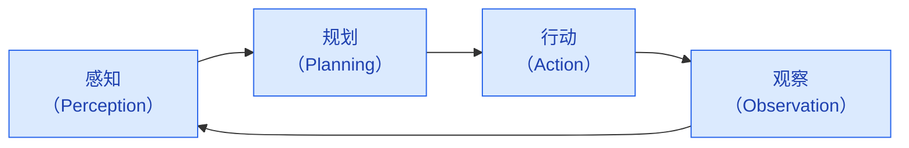
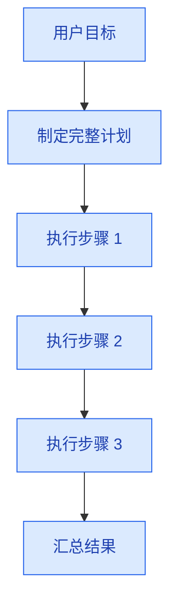
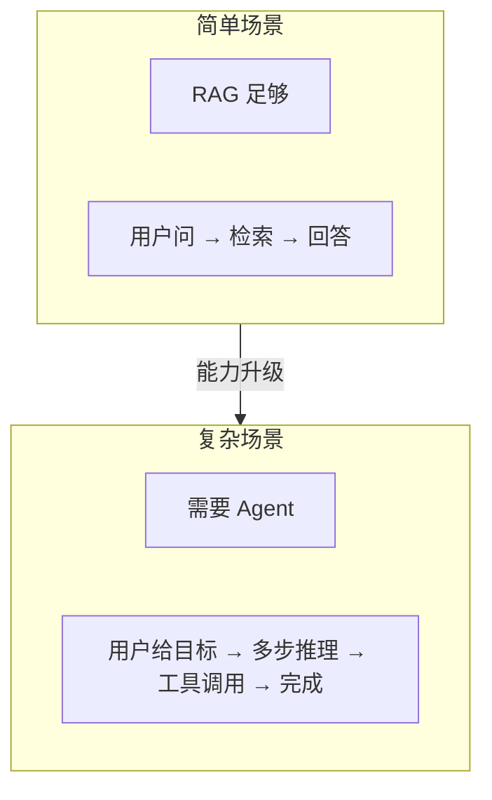

# Agent 架构与原理

> **创建日期：** 2026-06-06
> **前置知识：** LLM 基础、Prompt Engineering、RAG

---

## 一、什么是 Agent？

Agent（智能体）是能够**自主感知环境、做出决策、执行行动**的 AI 系统。与传统 LLM 应用不同，Agent 不是"一问一答"，而是**自主完成多步任务**。

::: tip 核心区别
- **传统 LLM**：用户问 → 模型答（一个回合）
- **Agent**：用户给目标 → Agent 自主规划 → 调用工具 → 观察结果 → 调整策略 → 完成任务（多个回合）
:::

---

## 二、Agent 核心架构



| 环节 | 做什么 | 问题 |
|------|--------|------|
| **感知** | 理解用户意图、获取环境信息 | 用户想做什么？当前状态是什么？ |
| **规划** | 拆解任务、制定步骤 | 需要哪些步骤？先后顺序？ |
| **行动** | 调用工具、执行操作 | 调用哪个工具？传什么参数？ |
| **观察** | 分析结果、判断是否完成 | 结果是否符合预期？需要调整吗？ |

---

## 三、ReAct 框架深入

ReAct（Reasoning + Acting）是 Agent 最基础的运行框架：

```
Thought: 我需要查询北京的天气
Action: call_weather_api("北京")
Observation: 北京今天晴，25°C
Thought: 用户还想知道明天适不适合出行
Action: call_weather_api("北京", "明天")
Observation: 明天多云，22°C，适合出行
Thought: 我已经有了足够的信息来回答
Final Answer: 北京今天晴，25°C；明天多云，22°C，适合出行。
```

### ReAct 的 Prompt 模板

```python
REACT_PROMPT = """
你是一个智能助手，可以调用以下工具完成任务：

可用工具：
{tools}

使用以下格式回答：
Thought: 你的思考过程
Action: 工具名称
Action Input: 工具参数（JSON格式）
Observation: 工具返回的结果
...（可以重复 Thought/Action/Observation）
Thought: 我已获得足够信息
Final Answer: 最终答案

用户问题：{query}
"""
```

---

## 四、Agent 设计模式

### 4.1 Plan-and-Execute（先规划后执行）



**适用场景：** 任务结构清晰，步骤可预见
**优点：** 高效，减少 LLM 调用次数
**缺点：** 计划一旦出错，后续步骤全部偏差

### 4.2 Self-Reflection（自我反思）

Agent 在执行过程中不断反思和纠错：

```
Action: 查询员工张三的工资
Observation: 错误：权限不足，无法查询
Thought: 我没有权限查询工资，但可以查询张三的部门信息
Action: 查询张三的部门
Observation: 张三，技术部，高级工程师
```

**适用场景：** 执行过程可能出错，需要动态调整

### 4.3 Reflexion（反思 + 记忆）

Reflexion 在 Self-Reflection 基础上加入**长期记忆**，从失败中学习：

```
# 第一次尝试失败
Action: 查询数据库表 user_info
Observation: 表不存在
Reflection: 数据库表名应该是 users，不是 user_info

# 第二次尝试（用了上次的反思）
Action: 查询数据库表 users
Observation: 成功返回数据
```

---

## 五、Agent 与 RAG 的关系



| 维度 | RAG | Agent |
|------|-----|-------|
| 交互模式 | 单轮问答 | 多轮自主交互 |
| 工具使用 | 不需要 | 需要调用外部工具 |
| 任务复杂度 | 简单问答 | 多步任务 |
| 自主性 | 低 | 高 |

::: tip 何时需要 Agent？
- 任务需要**多步骤**才能完成
- 需要调用**外部工具**（API、数据库、文件系统）
- 执行过程**可能出错**，需要重试和纠错
- 需要**动态决策**，不是固定流程
:::

---

## 六、面试重点

::: warning 高频考点
1. **Agent 的核心架构是什么？** 感知→规划→行动→观察循环
2. **ReAct 框架的工作原理？** Thought/Action/Observation 的含义
3. **Plan-and-Execute 和 Self-Reflection 的区别？** 各适用什么场景？
4. **什么时候用 Agent，什么时候用 RAG？** 两者的边界在哪里？
5. **Agent 的最大挑战是什么？** 如何应对？
:::

::: danger 容易翻车的点
- 说不清楚 Agent 和 RAG 的区别，混淆两者
- 不理解 ReAct 循环，以为 Agent 就是"加了工具的 LLM"
- 忽视 Agent 的可靠性问题（幻觉、死循环、工具调用失败）
:::