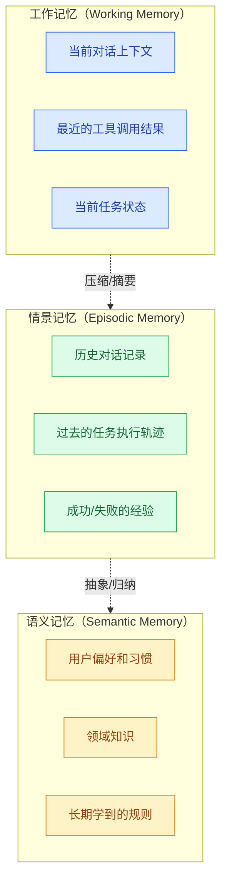

# Agent 记忆系统设计

> **创建日期：** 2026-06-06
> **前置知识：** Agent 架构、向量数据库

---

## 一、为什么 Agent 需要记忆？

没有记忆的 Agent 每次对话都是"重新开始"，无法记住用户偏好、历史上下文和学到的经验。

记忆让 Agent 能够：
- 记住用户偏好和习惯
- 跨对话保持上下文
- 从过去的错误中学习
- 积累领域知识

---

## 二、三层记忆系统



| 记忆类型 | 类比 | 存储方式 | 生命周期 | 检索方式 |
|----------|------|----------|----------|----------|
| **工作记忆** | 人脑的"短时记忆" | 对话消息列表 | 当前会话 | 直接读取 |
| **情景记忆** | 人脑的"经历记忆" | 向量数据库 + 摘要 | 跨会话 | 语义检索 |
| **语义记忆** | 人脑的"知识记忆" | 结构化存储 + 向量 | 永久 | 精确查询 + 语义检索 |

---

## 三、短期记忆（对话历史管理）

### 3.1 滑动窗口

最简单的方式：保留最近 N 轮对话：

```python
def manage_short_term_memory(messages, max_turns=10):
    """保留最近 N 轮对话"""
    return messages[-max_turns * 2:]  # 每轮 = 用户+助手
```

**优点：** 简单
**缺点：** 丢失早期重要信息

### 3.2 摘要压缩

对早期对话进行摘要，保留关键信息：

```python
def summarize_conversation(messages):
    """当对话超过阈值时，对早期消息进行摘要"""
    if len(messages) > 20:
        early = messages[:15]
        recent = messages[15:]

        summary = llm.generate(
            f"请简要总结以下对话的关键信息：\n{early}"
        )

        # 重构消息列表：摘要 + 最近对话
        return [
            {"role": "system", "content": f"对话历史摘要：{summary}"},
            *recent
        ]
    return messages
```

---

## 四、长期记忆（向量存储 + 摘要）

### 4.1 记忆存储

```python
# 长期记忆存储
def store_memory(agent_id, content, memory_type="episodic"):
    embedding = embed(content)
    memory_db.insert({
        "agent_id": agent_id,
        "content": content,
        "embedding": embedding,
        "type": memory_type,
        "timestamp": now(),
        "importance": evaluate_importance(content)  # 重要性评分
    })
```

### 4.2 记忆检索

```python
def retrieve_memories(agent_id, query, top_k=5):
    """根据当前查询检索相关记忆"""
    query_embedding = embed(query)
    memories = memory_db.search(
        query_embedding,
        filter={"agent_id": agent_id},
        top_k=top_k
    )

    # 按重要性+相关性排序
    return sorted(memories, key=lambda m: m.importance * m.similarity)
```

---

## 五、记忆压缩与遗忘

记忆不是越多越好。需要**压缩和遗忘**机制：

### 5.1 记忆压缩

对相似记忆进行合并，减少冗余：

```python
def compress_memories(memories):
    """将多条相似记忆合并为一条"""
    if len(memories) < 3:
        return memories

    summary = llm.generate(
        "请将以下信息合并为一条简洁的记忆：\n"
        + "\n".join(m.content for m in memories)
    )
    return [Memory(content=summary, importance=max(m.importance for m in memories))]
```

### 5.2 遗忘策略

| 策略 | 说明 |
|------|------|
| **时间衰减** | 旧记忆的权重随时间降低 |
| **重要性过滤** | 只保留重要性评分高的记忆 |
| **容量限制** | 达到上限后，删除最不重要的记忆 |
| **矛盾检测** | 新记忆与旧记忆矛盾时，更新旧记忆 |

---

## 六、面试高频题

### Q1: Agent 的三层记忆系统是什么？各有什么作用？

**详细答案：** Agent 的三层记忆系统模拟了人脑的记忆结构，从"即时"到"永久"分为三个层次。**工作记忆（Working Memory）** 对应人脑的短时记忆，存储当前对话的上下文——包括最近的用户消息、助手回复、工具调用结果和当前任务状态。它通常以消息列表的形式存在于内存中，生命周期仅限于当前会话，会话结束后即被清除。工作记忆的核心作用是让 Agent 在单次对话中保持连贯性，理解"刚才说了什么"和"现在在做什么"。它的容量受限于模型的上下文窗口大小。

**情景记忆（Episodic Memory）** 对应人脑的经历记忆，存储历史对话记录、过去任务的执行轨迹、成功和失败的经验。它通常通过向量数据库存储，支持跨会话的语义检索。当用户开启新会话时，Agent 可以通过检索情景记忆来"回忆"之前的交互——例如用户上次说"我不喜欢太啰嗦的回答"，Agent 在新会话中也能据此调整回复风格。情景记忆的生命周期是跨会话的，但通常有压缩和淘汰机制，不会永久保留所有细节。

**语义记忆（Semantic Memory）** 对应人脑的知识记忆，存储从大量交互中抽象出来的长期知识和规则——用户偏好、领域知识、学到的模式。它是最高层次的记忆，通过结构化存储和向量索引实现，生命周期是永久的。例如，经过多次交互，Agent 从情景记忆中归纳出"用户喜欢图表而非文字说明"这一规则，存储到语义记忆中。三层记忆之间的关系是逐层抽象：工作记忆中的信息经过压缩和摘要进入情景记忆，情景记忆中的信息经过归纳和抽象进入语义记忆，形成一个从原始数据到高层知识的上升通道。

---

### Q2: 如何管理对话历史？滑动窗口和摘要压缩的区别是什么？

**详细答案：** 对话历史管理是工作记忆层的核心挑战，因为 LLM 的上下文窗口有硬限制（如 128K tokens），而长时间对话的消息量很容易超出这个限制。**滑动窗口（Sliding Window）** 是最简单的策略：只保留最近 N 轮对话，丢弃超出窗口的早期消息。实现方式通常是 `messages[-max_turns * 2:]`（每轮包含用户和助手各一条消息）。优点是实现简单、性能开销极小；缺点是会**不可逆地丢失早期重要信息**——比如用户在对话开头提到的关键需求，在窗口滑动后就被彻底遗忘。

**摘要压缩（Summarization）** 是一种更智能的策略：当对话长度超过阈值时，对早期消息生成摘要，用摘要替代原始消息，从而在保留关键信息的同时释放 token 空间。实现方式通常是：检测消息数量超过阈值 -> 将早期消息分组 -> 调用 LLM 生成摘要 -> 将摘要作为系统消息插入 -> 保留最近 N 轮原始消息。优点是**保留了早期对话的关键信息**，不会因为窗口滑动而丢失重要上下文；缺点是**摘要本身有信息损失**——LLM 生成的摘要可能遗漏细节、产生偏差，而且摘要操作本身也会消耗额外的 token 和延迟。

**实践建议：** 两种策略不是互斥的，可以组合使用。推荐的分层策略是：将对话历史分为三层——"核心摘要"（对整个对话的目标和关键决策的总结）、"中间摘要"（对已完成阶段的分段摘要）、"最近 N 轮原始消息"（保留最近交互的完整细节）。每次新消息到来时，只更新"最近 N 轮"，当"最近 N 轮"积压过多时，将最早的几轮压缩为分段摘要并入"中间摘要"。这种策略既保留了核心信息，又在细节和上下文窗口之间取得了平衡。另外，对于工具调用密集的场景，工具返回结果往往是最占 token 的部分，可以优先对工具结果进行截断而非丢弃对话消息。

---

### Q3: 长期记忆如何存储和检索？向量数据库在其中的作用是什么？

**详细答案：** 长期记忆的存储和检索是一个"写入-索引-检索-排序"的完整流程。**存储阶段**：将需要记忆的内容（如一段对话摘要、一个用户偏好、一次任务经验）通过 Embedding 模型转换为向量（高维浮点数数组），连同原始内容、元数据（时间戳、类型、重要性评分等）一起存入向量数据库。Embedding 的质量直接决定了检索的准确性——好的 Embedding 模型能将语义相近的内容映射到向量空间中相近的位置。**检索阶段**：当 Agent 需要"回忆"相关记忆时，将当前查询同样通过 Embedding 模型转换为向量，然后在向量数据库中执行相似度搜索（通常使用余弦相似度或欧氏距离），找出 top_k 个最相关的记忆。

**向量数据库的核心作用**是提供高效的**语义检索**能力——它不依赖关键词匹配，而是基于语义相似度来查找。这使得检索可以跨越表述方式的差异：例如用户之前说"我喜欢简洁的回答"，现在说"别太啰嗦"，向量检索能识别出两者的语义相似性并召回相关记忆。主流的向量数据库方案包括专用的向量数据库（Pinecone、Milvus、Weaviate、Qdrant）和传统数据库的向量扩展（PostgreSQL + pgvector、Redis Vector Search）。选型时需要考虑的因素包括：数据规模、查询延迟要求、是否支持元数据过滤、部署和运维成本。

**进阶技巧：** 单纯依赖向量相似度有时会召回不准确的结果。生产级记忆系统通常采用**混合检索**策略：向量相似度 + 关键词匹配 + 元数据过滤（如时间范围、记忆类型、重要性阈值）。另外，**重要性评分**是一个关键机制——不是所有记忆都同等重要，可以通过 LLM 或规则对每条记忆进行重要性评分（如 1-10），在检索时用 `importance * similarity` 作为综合排序依据，确保重要记忆优先被召回。**记忆去重**也是一个不可忽视的环节——在存储新记忆前，先检索是否存在高度相似的已有记忆，如果存在则更新而非新增，避免记忆冗余。

---

### Q4: 记忆压缩和遗忘机制的必要性是什么？如何实现？

**详细答案：** 记忆压缩和遗忘机制的必要性源于三个现实约束。第一，**存储成本**——向量数据库的存储不是免费的，无限积累记忆会导致存储成本持续增长。第二，**检索效率**——记忆量越大，检索的延迟越高，召回质量也可能下降（大量低质量记忆会"淹没"高质量记忆）。第三，**信息过时**——用户偏好会变化、旧知识会被新知识取代，保留过时记忆反而会误导 Agent 的决策。记忆压缩和遗忘正是应对这三个约束的关键机制。

**记忆压缩（Memory Compression）** 的核心思路是将多条相似记忆合并为一条。实现方式：当检测到多条记忆的向量相似度超过阈值时，调用 LLM 将它们合并为一条更简洁、更全面的记忆。例如，用户分别在三次对话中提到"喜欢暗色主题"、"不喜欢亮色背景"、"觉得白天模式刺眼"，这三条记忆可以压缩为"用户偏好暗色主题，对亮色 UI 敏感"。压缩后的记忆保留原始记忆中重要性最高的那条的重要性评分，并更新元数据中的"最后更新时间"。

**遗忘策略**有多种实现方式：**时间衰减**——为每条记忆维护一个权重，权重随时间指数衰减，当权重低于阈值时自动删除或归档；**重要性过滤**——只保留重要性评分高于阈值的记忆，低重要性记忆定期清理；**容量限制**——设置记忆总数的硬上限，达到上限后按"重要性 x 时间衰减"排序，删除排名最低的记忆；**矛盾检测**——当新记忆与旧记忆内容矛盾时（如用户之前说"喜欢 Python"，现在说"更喜欢 Go"），自动更新旧记忆而非同时保留两条矛盾信息。实践中，通常采用多种策略的组合：时间衰减做软淘汰，重要性过滤做硬清理，矛盾检测保持数据一致性。

---

### Q5: 记忆系统在 Agent 中的实际应用场景有哪些？举例说明。

**详细答案：** 记忆系统在 Agent 中的应用非常广泛，以下是几个典型场景。**个性化客服 Agent**：通过语义记忆存储用户的偏好（"喜欢简短回答"、"是技术背景"）、历史问题（"上周问过订单状态"）和解决方案（"上次的退款问题通过工单 #1234 解决"），在新对话中主动应用这些信息，提供"千人千面"的服务体验。**编程助手 Agent**：通过情景记忆存储用户的项目结构、代码风格偏好、常用技术栈，在新会话中无需用户重复说明"我的项目用 React + TypeScript，请用函数组件"。

**知识管理 Agent**：通过语义记忆积累从文档和对话中提取的领域知识。例如，一个企业内部的 Agent 在多次回答员工关于"年假政策"的问题后，可以将核心规则抽象为语义记忆，下次直接引用而非每次都重新检索文档。**学习型 Agent**：通过情景记忆记录每次任务的成功和失败经验，在遇到类似任务时检索历史经验来指导决策。例如，一个数据分析 Agent 记住"上次用折线图展示趋势效果不好，用户要求换成柱状图"，下次遇到类似场景时优先选择柱状图。

**实际落地的挑战：** 记忆系统最大的工程挑战在于**检索准确性**——召回不相关的记忆比没有记忆更糟糕，因为它会误导 Agent 的推理。建议在检索后增加一个**相关性过滤步骤**：用 LLM 判断召回的每条记忆是否与当前问题真正相关，过滤掉不相关的。另一个挑战是**隐私和合规**——用户记忆可能包含敏感信息，需要支持用户查看、修改和删除自己的记忆数据（类似 GDPR 的"被遗忘权"）。建议在设计记忆系统时就将数据隔离和可审计性作为一等需求。

---

### Q6: 工作记忆、情景记忆和语义记忆之间如何实现信息流转？压缩和抽象的具体机制是什么？

**详细答案：** 三层记忆之间的信息流转遵循"从具体到抽象"的认知规律。**工作记忆到情景记忆的流转**：当一次会话结束后，会话的完整内容（或关键摘要）被存储到情景记忆中。这个过程通常在会话结束时触发，关键设计决策是"存什么"——是存储完整对话还是只存储摘要？实践中通常采用"分层存储"：完整对话存档到廉价存储（如对象存储），摘要存入向量数据库供快速检索。摘要的生成方式可以是指令式的（"请总结本次对话的关键信息：用户偏好、讨论主题、达成的结论"），也可以是抽取式的（提取关键实体和关系）。

**情景记忆到语义记忆的流转**：这是一个更高层次的抽象过程，通常不是实时触发，而是定期或当积累到一定量时批量执行。具体机制是：定期扫描情景记忆，对多条相关的情景记忆进行聚类和归纳，提取出共性的、稳定的知识。例如，从 10 条情景记忆中提取出"用户每次都要求用表格展示数据"这一模式，将其转化为语义记忆"用户偏好表格格式的数据展示"。这个过程的实现通常依赖 LLM 的归纳能力——"请从以下多条用户交互记录中提炼出用户的长期偏好和习惯"。

**实现建议：** 信息流转不是单向的——语义记忆也应该能影响工作记忆。在每次新会话开始时，Agent 应该主动检索语义记忆和情景记忆，将相关的用户偏好和历史上下文注入工作记忆，让 Agent 从一开始就"了解用户"。这个"记忆注入"的过程可以设计为：用户发起新会话 -> 检索语义记忆（用户偏好） -> 检索情景记忆（最近相关历史） -> 将检索结果格式化为系统消息注入工作记忆 -> 开始对话。另外，流转的触发时机也很重要：工作记忆到情景记忆的流转建议在会话结束时异步执行，避免阻塞用户体验；情景记忆到语义记忆的流转建议在低峰期批量执行，因为归纳操作通常需要消耗较多 token。