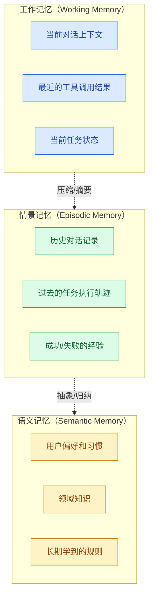

# Agent 记忆系统设计

> **创建日期：** 2026-06-06
> **前置知识：** Agent 架构、向量数据库

---

## 一、为什么 Agent 需要记忆？

没有记忆的 Agent 每次对话都是"重新开始"，无法记住用户偏好、历史上下文和学到的经验。

记忆让 Agent 能够：
- 记住用户偏好和习惯
- 跨对话保持上下文
- 从过去的错误中学习
- 积累领域知识

---

## 二、三层记忆系统



| 记忆类型 | 类比 | 存储方式 | 生命周期 | 检索方式 |
|----------|------|----------|----------|----------|
| **工作记忆** | 人脑的"短时记忆" | 对话消息列表 | 当前会话 | 直接读取 |
| **情景记忆** | 人脑的"经历记忆" | 向量数据库 + 摘要 | 跨会话 | 语义检索 |
| **语义记忆** | 人脑的"知识记忆" | 结构化存储 + 向量 | 永久 | 精确查询 + 语义检索 |

---

## 三、短期记忆（对话历史管理）

### 3.1 滑动窗口

最简单的方式：保留最近 N 轮对话：

```python
def manage_short_term_memory(messages, max_turns=10):
    """保留最近 N 轮对话"""
    return messages[-max_turns * 2:]  # 每轮 = 用户+助手
```

**优点：** 简单
**缺点：** 丢失早期重要信息

### 3.2 摘要压缩

对早期对话进行摘要，保留关键信息：

```python
def summarize_conversation(messages):
    """当对话超过阈值时，对早期消息进行摘要"""
    if len(messages) > 20:
        early = messages[:15]
        recent = messages[15:]

        summary = llm.generate(
            f"请简要总结以下对话的关键信息：\n{early}"
        )

        # 重构消息列表：摘要 + 最近对话
        return [
            {"role": "system", "content": f"对话历史摘要：{summary}"},
            *recent
        ]
    return messages
```

---

## 四、长期记忆（向量存储 + 摘要）

### 4.1 记忆存储

```python
# 长期记忆存储
def store_memory(agent_id, content, memory_type="episodic"):
    embedding = embed(content)
    memory_db.insert({
        "agent_id": agent_id,
        "content": content,
        "embedding": embedding,
        "type": memory_type,
        "timestamp": now(),
        "importance": evaluate_importance(content)  # 重要性评分
    })
```

### 4.2 记忆检索

```python
def retrieve_memories(agent_id, query, top_k=5):
    """根据当前查询检索相关记忆"""
    query_embedding = embed(query)
    memories = memory_db.search(
        query_embedding,
        filter={"agent_id": agent_id},
        top_k=top_k
    )

    # 按重要性+相关性排序
    return sorted(memories, key=lambda m: m.importance * m.similarity)
```

---

## 五、记忆压缩与遗忘

记忆不是越多越好。需要**压缩和遗忘**机制：

### 5.1 记忆压缩

对相似记忆进行合并，减少冗余：

```python
def compress_memories(memories):
    """将多条相似记忆合并为一条"""
    if len(memories) < 3:
        return memories

    summary = llm.generate(
        "请将以下信息合并为一条简洁的记忆：\n"
        + "\n".join(m.content for m in memories)
    )
    return [Memory(content=summary, importance=max(m.importance for m in memories))]
```

### 5.2 遗忘策略

| 策略 | 说明 |
|------|------|
| **时间衰减** | 旧记忆的权重随时间降低 |
| **重要性过滤** | 只保留重要性评分高的记忆 |
| **容量限制** | 达到上限后，删除最不重要的记忆 |
| **矛盾检测** | 新记忆与旧记忆矛盾时，更新旧记忆 |

---

## 六、面试重点

::: warning 高频考点
1. **Agent 的三层记忆系统是什么？** 各有什么作用？
2. **如何管理对话历史？** 滑动窗口和摘要压缩的区别？
3. **长期记忆如何存储和检索？** 向量数据库的作用？
4. **记忆压缩和遗忘机制的必要性？** 如何实现？
5. **记忆系统在 Agent 中的实际应用场景？** 举例说明
:::