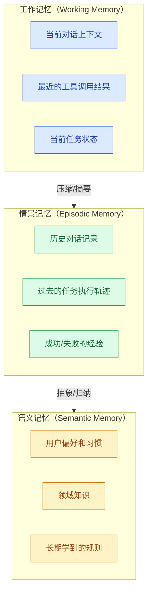

# Agent 记忆系统设计

> **创建日期：** 2026-06-06
> **前置知识：** Agent 架构、向量数据库

---

## 一、为什么 Agent 需要记忆？

没有记忆的 Agent 每次对话都是"重新开始"，无法记住用户偏好、历史上下文和学到的经验。

记忆让 Agent 能够：
- 记住用户偏好和习惯
- 跨对话保持上下文
- 从过去的错误中学习
- 积累领域知识

---

## 二、三层记忆系统



| 记忆类型 | 类比 | 存储方式 | 生命周期 | 检索方式 |
|----------|------|----------|----------|----------|
| **工作记忆** | 人脑的"短时记忆" | 对话消息列表 | 当前会话 | 直接读取 |
| **情景记忆** | 人脑的"经历记忆" | 向量数据库 + 摘要 | 跨会话 | 语义检索 |
| **语义记忆** | 人脑的"知识记忆" | 结构化存储 + 向量 | 永久 | 精确查询 + 语义检索 |

---

## 三、短期记忆（对话历史管理）

### 3.1 滑动窗口

最简单的方式：保留最近 N 轮对话：

```python
def manage_short_term_memory(messages, max_turns=10):
    """保留最近 N 轮对话"""
    return messages[-max_turns * 2:]  # 每轮 = 用户+助手
```

**优点：** 简单
**缺点：** 丢失早期重要信息

### 3.2 摘要压缩

对早期对话进行摘要，保留关键信息：

```python
def summarize_conversation(messages):
    """当对话超过阈值时，对早期消息进行摘要"""
    if len(messages) > 20:
        early = messages[:15]
        recent = messages[15:]

        summary = llm.generate(
            f"请简要总结以下对话的关键信息：\n{early}"
        )

        # 重构消息列表：摘要 + 最近对话
        return [
            {"role": "system", "content": f"对话历史摘要：{summary}"},
            *recent
        ]
    return messages
```

---

## 四、长期记忆（向量存储 + 摘要）

### 4.1 记忆存储

```python
# 长期记忆存储
def store_memory(agent_id, content, memory_type="episodic"):
    embedding = embed(content)
    memory_db.insert({
        "agent_id": agent_id,
        "content": content,
        "embedding": embedding,
        "type": memory_type,
        "timestamp": now(),
        "importance": evaluate_importance(content)  # 重要性评分
    })
```

### 4.2 记忆检索

```python
def retrieve_memories(agent_id, query, top_k=5):
    """根据当前查询检索相关记忆"""
    query_embedding = embed(query)
    memories = memory_db.search(
        query_embedding,
        filter={"agent_id": agent_id},
        top_k=top_k
    )

    # 按重要性+相关性排序
    return sorted(memories, key=lambda m: m.importance * m.similarity)
```

---

## 五、记忆压缩与遗忘

记忆不是越多越好。需要**压缩和遗忘**机制：

### 5.1 记忆压缩

对相似记忆进行合并，减少冗余：

```python
def compress_memories(memories):
    """将多条相似记忆合并为一条"""
    if len(memories) < 3:
        return memories

    summary = llm.generate(
        "请将以下信息合并为一条简洁的记忆：\n"
        + "\n".join(m.content for m in memories)
    )
    return [Memory(content=summary, importance=max(m.importance for m in memories))]
```

### 5.2 遗忘策略

| 策略 | 说明 |
|------|------|
| **时间衰减** | 旧记忆的权重随时间降低 |
| **重要性过滤** | 只保留重要性评分高的记忆 |
| **容量限制** | 达到上限后，删除最不重要的记忆 |
| **矛盾检测** | 新记忆与旧记忆矛盾时，更新旧记忆 |

---

## 六、面试高频题

### Q1: Agent 的三层记忆系统是什么？各有什么作用？

**详细答案：** 我们的保险 Agent 上了三层记忆。工作记忆就是当前对话上下文——存消息列表、最近的工具调用结果和当前任务状态，生命周期就是一次 session，session 结束就清掉。我们在 Redis 里维护了每个 session 的消息列表，用 TTL=30min，卖点是简单但撑不了长对话。情景记忆存的是跨会话的历史记录——用 Chroma 做向量存储，把每次对话结束时自动生成一段 200 字摘要存入。比如用户上次说过"我是做个体户的、没有固定收入"，下次开新会话 Agent 自动检索这段记住，不需要用户再解释一遍。这一步是自动触发的，会话结束时异步执行不影响响应速度。语义记忆是最抽象的一层——我们从情景记忆中做了定期归纳，比如连续 5 次交互都表明"用户喜欢表格形式的数据展示"，就抽象为一条偏好存入 SQL 表里，新会话初始化时自动注入 Prompt。三层关系就是从会话消息（工作记忆）压缩成摘要入向量库（情景记忆），多条情景再归纳为偏好知识（语义记忆）。

---

### Q2: 如何管理对话历史？滑动窗口和摘要压缩的区别是什么？

**详细答案：** 我们一开始就是用最简单的滑动窗口——保留最近 20 轮对话，多的直接丢掉。上线后发现问题很严重——用户在对话开头说"我是做个体户的"这种关键信息，聊到中间窗口滑动了这条就丢了，Agent 就忘了他是个体户。后来改成了摘要压缩：消息量超过 30 条时，把前 20 条压缩成一段 150-200 字的摘要，放到系统 Prompt 里做"已知道的信息"，后面 10 条保持原始形式。加了之后，用户感觉 Agent "记忆"好了很多，不会再重复问基础信息。

实际操作中摘要压缩也有缺点——LLM 生成的摘要肯定丢细节，比如"用户有轻度高血压，服药后血压130/85"压缩后可能只剩"用户健康状况一般"，体感就降了。我们发现最好的组合就是现在用的三层结构：核心摘要（整个对话的目标）、分段摘要（每个阶段的要点）、最近 N 轮原始消息。核心摘要永久保留，分段摘要是增量更新，原始消息保持窗口。另外工具调用的返回结果是最占 token 的——我们直接用结构化摘要代替原始返回，省了太多 token。

---

### Q3: 长期记忆如何存储和检索？向量数据库在其中的作用是什么？

**详细答案：** 我们的长期记忆用 Chroma 作向量存储，BGE-small 做嵌入（因为只是检索短文本回忆用，不需要大模型的精度），流程是：每次会话结束 -> 生成 200 字摘要 -> Embedding -> 写入 Chroma；用户下次开新会话 -> 用当前查询 Embedding 检索 Top-5 相关记忆 -> 把记忆注入 Prompt。关键点是必须在存储时加上重要性评分，不然所有记忆平等对待，质量差的记忆会把高质量记忆掩盖掉。

我们的重要性评分用两条规则自动打：包含用户偏好类信息的（"喜欢XX" "不要XX"）权重最高 10 分，普通交互摘要权重 5 分。检索时按 `importance * similarity` 综合排序。向量检索偶尔会召回不太相关的记忆——上次用户聊"糖尿病并发症"相关，这次查询"糖尿病"触发相似度 0.8 但实际上两类话题背景不同。我们后加了一层相关性过滤——用 LLM 对每条召回记忆判断是否和当前问题相关，不相关的直接干掉。还有一个工程性的点：去重——存新记忆前先检索是否有相似度 >0.95 的已有记忆，有就更新而非新建，避免记忆库膨胀。

---

### Q4: 记忆压缩和遗忘机制的必要性是什么？如何实现？

**详细答案：** 我们之前没做压缩机制，Chroma 里堆了 2 万多条记忆，检索延迟从 20ms 涨到 50ms，而且很多记忆是冗余的——"用户偏好简洁回答"被存了 5 次不同版本的摘要。压缩和遗忘机制的必要性就是三点：存储成本大了之后受不了、检索效率会越来越差、过时的旧记忆会误导 Agent 做错误决策。

我们现在的压缩策略是定期扫描 Chroma，找出相似度 >0.9 的记忆用 LLM 合并成一条，比如三句"不喜欢啰嗦的回复""回答得太长了不适应""要简短""堆成一句话""用户偏好极简回答，一次不超过 3 句"。压缩后的记忆保留最高的重要性评分和最新的时间戳。遗忘分两层——时间衰减是把每条记忆的权重按指数衰减，90 天前的权重基本趋零；容量硬限制是 Chroma 最多存 5000 条，超过就按"重要性 x 衰减权重"排序删最末尾的。还有一个关键是矛盾检测——如果新记忆和旧记忆冲突（用户之前说喜欢表格、现在偏好图表），直接更新旧记忆覆盖而不是并存。

---

### Q5: 记忆系统在 Agent 中的实际应用场景有哪些？举例说明。

**详细答案：** 记忆系统在我们保险 Agent 里无处不在。举个例子——个性化客服。用户第一次对话说"我买的是一款重疾险，保单号 P-2024-00123"，这条信息会存入情景记忆。过两周用户又来问"我的保单理赔范围有哪些"，Agent 不需要问"你保单号多少"，直接就能检索到 P-2024-00123 去查条款。这个体验提升极明显——用户不用每次都重复基本信息，完全觉得自己是在和记住一切的私人客服聊。

还有一个场景就是学习型 Agent。我们的理赔 Agent 第一次处理一个罕见疾病理赔时走了一些弯路，查了 4 步才找到正确条款。情景记忆记录了："罕见疾病 X，正确检索路径是先查附属条款第 3 节而非主条款"。下次同类查询，Agent 检索记忆后直接优化了检索路径，从 4 步缩到 2 步，效率翻了一倍。但实际落地最大的挑战确实是检索准确性——召回错误记忆比没有记忆更糟糕，会误导 Agent 产生错误判断。我们在检索后加了一个 LLM 判定环节判断记忆是否和当前问题相关，降低误注入率。还有就是隐私合规——我们允许用户查看、编辑和删除自己的记忆数据，特别是包含保单号的记忆。

---

### Q6: 工作记忆、情景记忆和语义记忆之间如何实现信息流转？压缩和抽象的具体机制是什么？

**详细答案：** 我们的信息流转是这样的。工作记忆到情景记忆是**会话结束时自动触发**——异步把整段对话压缩成 200 字摘要，写入 Chroma，不阻塞响应。这个过程用了指令式 Prompt："请提取本次对话中用户的关键信息：健康背景、投保偏好、交流风格"，生成的摘要就是结构化且可检索的。情景记忆到语义记忆是**低峰期批量执行**——我们每周日凌晨在 2:00-4:00 的低峰窗口跑一次归纳，把同一用户的多条情景记忆聚类、用 LLM 做批量归纳："从以下 15 条用户交互中提炼出长期偏好"，输出语义记忆存入 SQL 表。这里的一个坑是不要全自动归纳——LLM 可能会归纳出一些不存在的东西，我们把归纳结果加入工审批队列，第一次归纳需要人工确认之后才自动进入。

流转不是单向的——新会话开始时**语义记忆和情景记忆要注入到工作记忆中**。我们的流程是：用户第一次发消息 -> 并行检索语义和情景记忆 -> 把检索到的记忆格式化为系统消息注入 Prompt -> 开始正常对话。这个注入必须控制在 token 范围——我们限制情景记忆注入不超过 3 条、语义记忆不超过 2 条，总注入 token 控制在 500 以内，不能让记忆占用过多上下文窗口。