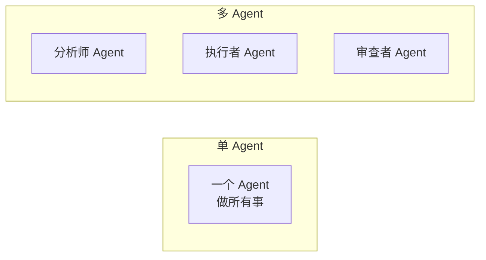
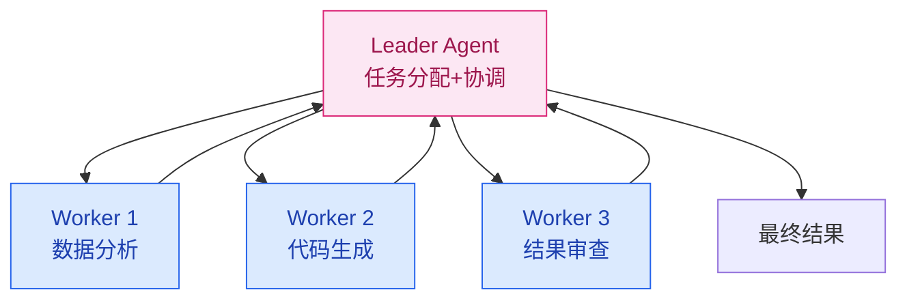

# 多 Agent 协作

> **创建日期：** 2026-06-06
> **前置知识：** Agent 架构、Function Calling

---

## 一、为什么需要多 Agent？

单 Agent 的局限：一个 Agent 承担所有职责（理解、规划、执行、验证），复杂度高，容易出错。

多 Agent 的核心思想：**分工协作**——每个 Agent 专注一个领域，通过通信协调完成任务。



---

## 二、多 Agent 协作模式

### 2.1 Leader-Follower（主从模式）

最常用的模式。一个 Leader Agent 负责任务分配和协调，多个 Worker Agent 负责执行。



**适用场景：** 任务可以分解为独立子任务，有明确的负责人

### 2.2 辩论式（Debate）

多个 Agent 从不同角度分析问题，通过辩论达成共识。

```
分析师 A: 建议使用方案一，因为性能更好
分析师 B: 方案一成本太高，方案二性价比更高
分析师 A: 但在当前场景下，性能是首要约束
...辩论几轮后...
评审 Agent: 综合双方意见，采用方案一，但做成本优化
```

**适用场景：** 需要多角度分析、避免单一视角偏差的决策

### 2.3 层级式（Hierarchical）

多层 Agent 结构，上层做战略决策，下层做战术执行：

| 层级 | 角色 | 职责 |
|------|------|------|
| 战略层 | 规划 Agent | 拆解目标、分配任务 |
| 战术层 | 执行 Agent | 具体执行，调用工具 |
| 验证层 | 审查 Agent | 检查结果，决定是否重试 |

### 2.4 流水线式（Pipeline）

每个 Agent 处理一个阶段，输出传递给下一个 Agent：

```
用户输入 → [意图识别 Agent] → [信息检索 Agent] → [内容生成 Agent] → [质量审查 Agent] → 输出
```

**适用场景：** 任务有明确的阶段划分，各阶段职责清晰

---

## 三、通信机制

### 3.1 消息传递

```python
# Agent 间通信的消息格式
class AgentMessage:
    sender: str       # 发送方 Agent ID
    receiver: str     # 接收方 Agent ID
    type: str         # 消息类型：task / result / query
    content: str      # 消息内容
    context: dict     # 上下文信息（共享状态）
```

### 3.2 共享状态

多个 Agent 通过共享的状态对象交换信息：

```python
# 共享状态
shared_state = {
    "task": "分析销售数据并生成报告",
    "current_step": "data_analysis",
    "data": {"q1_revenue": 100, "q2_revenue": 120},
    "history": [...]  # 所有 Agent 的对话历史
}
```

---

## 四、任务编排

```python
# 多 Agent 任务编排伪代码
def orchestrate_task(user_input):
    # 1. Leader 分析任务
    plan = leader_agent.create_plan(user_input)

    # 2. 分配子任务给 Worker
    results = []
    for step in plan.steps:
        worker = select_worker(step)  # 选择合适的 Worker
        result = worker.execute(step)
        results.append(result)

        # 3. 审查 Agent 检查结果
        if not reviewer_agent.approve(result):
            result = worker.retry(step, reviewer_agent.feedback)

    # 4. 汇总结果
    return leader_agent.summarize(results)
```

---

## 五、多 Agent 框架选型

| 框架 | 协作模式 | 特点 | 适用场景 |
|------|----------|------|----------|
| **LangGraph** | 自定义图编排 | 灵活的状态图，可控性强 | 复杂 Agent 工作流 |
| **CrewAI** | 角色分工 | 开箱即用的多 Agent 角色 | 快速原型、角色明确场景 |
| **AutoGen** | 对话式协作 | 微软出品，Agent 间通过对话协作 | 需要多轮对话协商的场景 |
| **OpenAI Swarm** | 轻量级编排 | 极简 API，Agent 之间可移交 | 简单多 Agent 场景 |

---

## 六、常见陷阱

::: danger 陷阱一：过度设计
不是所有场景都需要多 Agent。单 Agent + 好的工具设计，往往比多 Agent 更可靠。
:::

::: danger 陷阱二：通信开销
多 Agent 之间频繁通信会显著增加延迟和成本。确保每个 Agent 的职责边界清晰。
:::

::: danger 陷阱三：状态不一致
多个 Agent 共享状态时，可能出现状态冲突。使用单一状态源（Single Source of Truth）。
:::

::: danger 陷阱四：一个 Agent 失败导致全链路失败
设计降级策略：某个 Worker 失败时，Leader 可以重新分配或跳过该步骤。
:::

---

## 七、面试高频题

### Q1: 多 Agent 协作有哪些模式？Leader-Follower 和辩论式的区别是什么？

**详细答案：** 我们在保险平台里评估过这四种模式，说下实际判断。Leader-Follower 最成熟——一个 Leader Agent 拆解任务，然后给三个 Worker（检索条款的、计算保费的、生成报告的）各分一块活，各搞各的最后 Leader 汇总。我们做一个理赔额度查询的时候用的就是这种模式，因为任务可以明确拆成查询用户保单、查条款计算逻辑、生成结果三道独立工序。

辩论式我们用在一个比较特殊的场景——技术选型，当时评估要不要从 Chroma 切到 Milvus。我们开了一个模拟的"辩论 Agent"，让两个假 Agent 分别持"切"和"不切"的立场几轮辩论，最后发现这个模式用在决策场景确实有效但不实用——辩论消耗的 token 是普通调用的三四倍。层级式和 Leader-Follower 的区别就是多了个验证层，说白了就是每一步执行完后有人"验收"，适合质量要求很高的场景。我们其实内部跑的是 Leader-Follower + 验证层组合，执行完了再由一个 Reviewer Agent 检查一下结果再递给用户。核心区别就是 Leader-Follower 是分工干不同的事，辩论式是不同角色看同一件事。

---

### Q2: 什么时候用多 Agent，什么时候用单 Agent？决策依据是什么？

**详细答案：** 我们团队在是否上多 Agent 这件事上讨论了好几轮。刚做完 MVP 的时候，产品那边提了很多需求，团队觉得单 Agent 不够用、应该上多 Agent，但评估下来发现当时只有 12 个工具、场景也比较集中，单 Agent 跑了一年没出过架构性缺陷。最后是到一个新需求——"生成保险产品对比分析报告"——这个任务必须拆成信息搜集、数据计算、文本生成三个独立步骤，并且三个步骤需要的工具集和专业知识差很多，才决定走多 Agent。决策依据就是 **任务能拆成独立子任务 + 每个子任务需要不同工具集和角色定义**。

我们的经验是不要一上来就多 Agent。单 Agent 配合好工具设计和 Prompt，正常情况下 80% 的任务搞不定才考虑多 Agent。多 Agent 多一轮通信就多一次 LLM 调用，延迟和成本都翻倍，如果你的任务单一 Agent 两个步骤就搞定了，上个多 Agent 纯属浪费。一个简单的规则：如果你的任务可以在一句话里描述完——"帮我查一下这个条款怎么赔付"——通通走单 Agent；如果描述需要"先做 X，根据 X 结果决定做 Y 还是 Z，最后把 X、Y/Z 整合输出"这种多步骤——就可以评估上多 Agent。另外多 Agent 调试真的比单 Agent 痛苦得多，一条消息断在哪个 Agent 身上定位起来花半天。

---

### Q3: 多 Agent 之间如何通信？消息传递和共享状态各有什么优缺点？

**详细答案：** 我们现在生产上就是消息传递 + 共享状态混用。简单场景我们直接用共享状态——整个任务有一个 global state 字典，所有 Agent 都读写这个字典，里面存当前任务描述、各步进度、中间结果。开发起来真的快，不需要定义消息格式，代码也少。缺点就是耦合太重了——你改一下字段名所有依赖的 Agent 都得改，而且多个 Agent 同时写会出数据不一致问题，我们加了一个轻量的乐观锁去解决。

复杂场景（10+ 个 Agent）我们用消息传递，每个消息就是一个结构化对象，指定发送方、接收方、类型、内容。好处就是解耦，Agent 互相不知道内部实现，只需要按约定格式解析消息，我们所有消息都会落日志，出问题顺着链路就能找到哪里断了。缺点就是序列化麻烦，格式需要严格兼容，版本升级麻烦。

现在的最佳实践就是——单一状态源集中存全局状态，Agent 之间用消息传递走指令交互，要读状态直接问状态管理器，要改状态也是发消息给状态管理器，相当于你把全局状态的读写都交给单一组件，Agent 只发指令消息。这样既解耦了 Agent 之间，状态一致性也有保证。

---

### Q4: 多 Agent 系统有哪些常见问题？如何避免？

**详细答案：** 我们跑了一年多 Agent，踩过的多 Agent 坑主要有这四个。过渡设计是我们最早犯的——MVP 一出就想搞四个 Agent 各司其职，结果评估完发现 80% 的查询走单 Agent 就够了，四个 Agent 额外增加的 LLM 调用成本是单 Agent 的三倍，延迟也飙到 8 秒，产品受不了。**先跑通单 Agent 再说，真不够（任务可以明确拆成不同工具集和领域知识的需求）再上多 Agent。**

通信开销也很隐蔽。我们 Leader-Follower 每个 Worker 做完都要报告 Leader，Leader 汇总一次，再加一个 Reviewer 检查，一套下来至少 4 次 LLM 调用，单是通信 cost 就在 4 万 token 左右。减少通信轮次的方法就是让每个 Agent 一次性完成尽可能多的工作，不要碎片化交互。状态不一致我们也碰到过——两个 Agent 同时写了一个字段，写出来的值互相覆盖。后来我们把所有状态读写都收到单一状态管理器，agent 通过消息请求修改，不再直接操作共享状态，才解决了这个问题。单点故障传播是最麻烦的——Leader-Follower 里面 Worker 挂了整个任务中断。我们的 Leader 做了 graceful degradation，给 Worker 设 5 秒超时，致命操作还有冗余 Worker 备份。

---

### Q5: LangGraph 和 CrewAI 在多 Agent 协作上有哪些核心区别？各适用什么场景？

**详细答案：** 我们两个都用过，说下真实感受。LangGraph 适合你要精控每个执行步骤的场景。我们最先用过 LangGraph 的 StateGraph 做状态编排，图节点是 Agent 或工具，边定义了执行流向，支持条件分支和循环重试，真的非常灵活。比如"查询保单 -> 如果为空 -> 搜索外部数据库 -> 若为空 -> 返回默认值"这种多分支你在 LangGraph 里就是一条条件边的事。但代价是学习曲线比较陡，状态管理、条件边、注解这些概念理解起来需要时间。

CrewAI 适合你要快速出东西。我们原型阶段用了它，只需要定义角色（检索员、分析师、报告员）和目标，框架自动处理编排，基本上半天就能跑通一个 demo。开箱即用体验非常好，但对复杂流程控制力明显弱，我们想加一个自定义重试策略翻了半天文档都无从下手。

选型其实很简单——如果你要的 Agent 流程是线性明确的（A 做完给 B，B 做完给 C），CrewAI 就能搞定。如果你需要精细到"这一步做完根据条件跳到不同分支"的复杂流程，上 LangGraph。我们生产是走 LangGraph，因为保险业务的 Agent 流程太复杂了，产品对比、理赔判断、保费计算每条路径都不一样。

---

### Q6: 多 Agent 系统中如何实现有效的任务分配？Leader Agent 如何选择合适的 Worker？

**详细答案：** 我们的 Leader Agent 分配任务走"执行-反馈-再分配"的动态调度。不是一开始就把全部子任务分配完，而是先分解出第一步，交给最匹配的 Worker 执行，拿到结果后再根据中间状态决定下一步分给谁。匹配方面我们靠能力声明——每个 Worker 注册时声明了自己的能力标签，比如 `["policy_search", "premium_calc", "report_gen"]`，Leader 在 Prompt 里把这些能力列表和任务描述一起传给 LLM，LLM 基于语义匹配选择最合适的 Worker。一个简单的匹配放到 Prompt 里就够了，复杂的我们自己维护了一个能力向量库，用 embedding 做 Worker-任务匹配排序。

关键设计是任务粒度——我们定了一个原则"一个子任务在一个 Worker 内 2-3 次 LLM 调用内完成"。如果子任务太小会产生过多通信，如果太大 Worker 也做不完还会返回模糊结果。另一个点是**超时重分配**——每个 Worker 设了 10 秒超时，过了时间没返回 Leader 就自动把任务重新分给备份 Worker，避免单点卡住全链路。还有，我们维护了一个简单的历史表现记录——如果一个 Worker 连续失败 3 次同样的任务，下次同类任务直接优先分配给其他 Worker，这是最朴素的自适应调度。