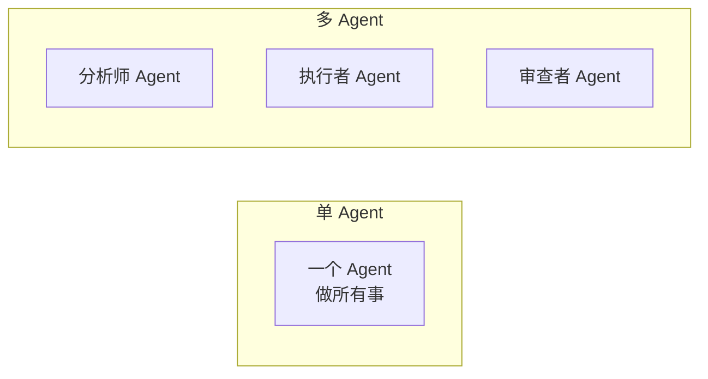
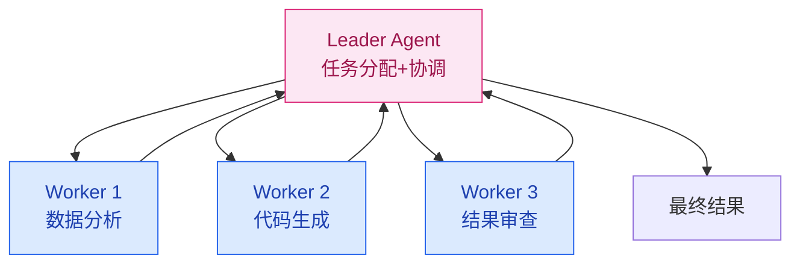

# 多 Agent 协作

> **创建日期：** 2026-06-06
> **前置知识：** Agent 架构、Function Calling

---

## 一、为什么需要多 Agent？

单 Agent 的局限：一个 Agent 承担所有职责（理解、规划、执行、验证），复杂度高，容易出错。

多 Agent 的核心思想：**分工协作**——每个 Agent 专注一个领域，通过通信协调完成任务。



---

## 二、多 Agent 协作模式

### 2.1 Leader-Follower（主从模式）

最常用的模式。一个 Leader Agent 负责任务分配和协调，多个 Worker Agent 负责执行。



**适用场景：** 任务可以分解为独立子任务，有明确的负责人

### 2.2 辩论式（Debate）

多个 Agent 从不同角度分析问题，通过辩论达成共识。

```
分析师 A: 建议使用方案一，因为性能更好
分析师 B: 方案一成本太高，方案二性价比更高
分析师 A: 但在当前场景下，性能是首要约束
...辩论几轮后...
评审 Agent: 综合双方意见，采用方案一，但做成本优化
```

**适用场景：** 需要多角度分析、避免单一视角偏差的决策

### 2.3 层级式（Hierarchical）

多层 Agent 结构，上层做战略决策，下层做战术执行：

| 层级 | 角色 | 职责 |
|------|------|------|
| 战略层 | 规划 Agent | 拆解目标、分配任务 |
| 战术层 | 执行 Agent | 具体执行，调用工具 |
| 验证层 | 审查 Agent | 检查结果，决定是否重试 |

### 2.4 流水线式（Pipeline）

每个 Agent 处理一个阶段，输出传递给下一个 Agent：

```
用户输入 → [意图识别 Agent] → [信息检索 Agent] → [内容生成 Agent] → [质量审查 Agent] → 输出
```

**适用场景：** 任务有明确的阶段划分，各阶段职责清晰

---

## 三、通信机制

### 3.1 消息传递

```python
# Agent 间通信的消息格式
class AgentMessage:
    sender: str       # 发送方 Agent ID
    receiver: str     # 接收方 Agent ID
    type: str         # 消息类型：task / result / query
    content: str      # 消息内容
    context: dict     # 上下文信息（共享状态）
```

### 3.2 共享状态

多个 Agent 通过共享的状态对象交换信息：

```python
# 共享状态
shared_state = {
    "task": "分析销售数据并生成报告",
    "current_step": "data_analysis",
    "data": {"q1_revenue": 100, "q2_revenue": 120},
    "history": [...]  # 所有 Agent 的对话历史
}
```

---

## 四、任务编排

```python
# 多 Agent 任务编排伪代码
def orchestrate_task(user_input):
    # 1. Leader 分析任务
    plan = leader_agent.create_plan(user_input)

    # 2. 分配子任务给 Worker
    results = []
    for step in plan.steps:
        worker = select_worker(step)  # 选择合适的 Worker
        result = worker.execute(step)
        results.append(result)

        # 3. 审查 Agent 检查结果
        if not reviewer_agent.approve(result):
            result = worker.retry(step, reviewer_agent.feedback)

    # 4. 汇总结果
    return leader_agent.summarize(results)
```

---

## 五、多 Agent 框架选型

| 框架 | 协作模式 | 特点 | 适用场景 |
|------|----------|------|----------|
| **LangGraph** | 自定义图编排 | 灵活的状态图，可控性强 | 复杂 Agent 工作流 |
| **CrewAI** | 角色分工 | 开箱即用的多 Agent 角色 | 快速原型、角色明确场景 |
| **AutoGen** | 对话式协作 | 微软出品，Agent 间通过对话协作 | 需要多轮对话协商的场景 |
| **OpenAI Swarm** | 轻量级编排 | 极简 API，Agent 之间可移交 | 简单多 Agent 场景 |

---

## 六、常见陷阱

::: danger 陷阱一：过度设计
不是所有场景都需要多 Agent。单 Agent + 好的工具设计，往往比多 Agent 更可靠。
:::

::: danger 陷阱二：通信开销
多 Agent 之间频繁通信会显著增加延迟和成本。确保每个 Agent 的职责边界清晰。
:::

::: danger 陷阱三：状态不一致
多个 Agent 共享状态时，可能出现状态冲突。使用单一状态源（Single Source of Truth）。
:::

::: danger 陷阱四：一个 Agent 失败导致全链路失败
设计降级策略：某个 Worker 失败时，Leader 可以重新分配或跳过该步骤。
:::

---

## 七、面试重点

::: warning 高频考点
1. **多 Agent 协作有哪些模式？** Leader-Follower 和辩论式的区别？
2. **什么时候用多 Agent，什么时候用单 Agent？** 决策依据是什么？
3. **多 Agent 之间如何通信？** 消息传递和共享状态各有什么优缺点？
4. **多 Agent 系统有哪些常见问题？** 如何避免？
5. **LangGraph 和 CrewAI 的区别？** 各适用什么场景？
:::