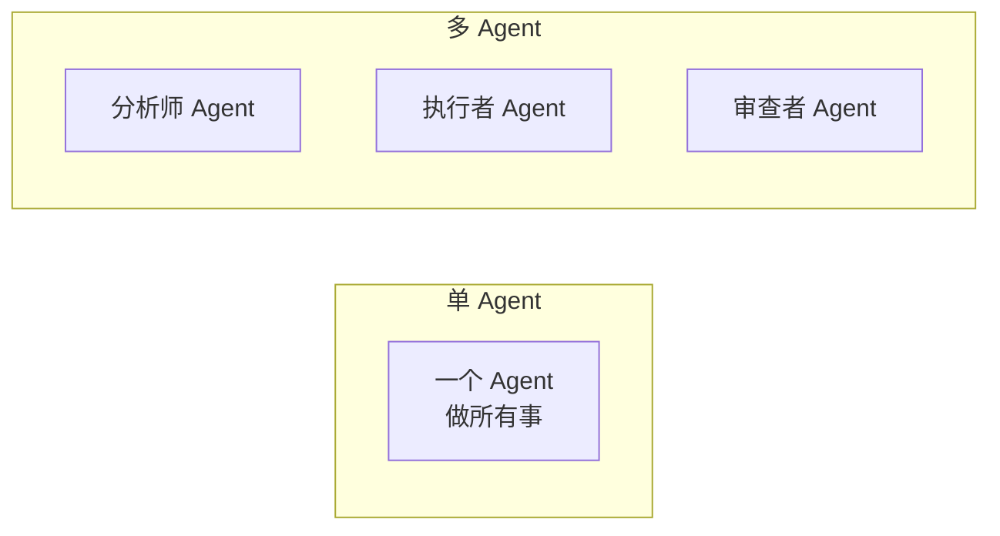
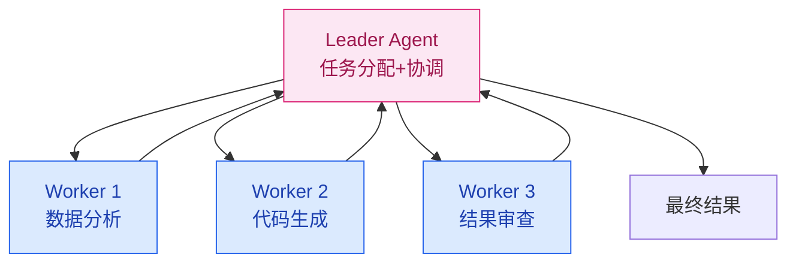

# 多 Agent 协作

> **创建日期：** 2026-06-06
> **前置知识：** Agent 架构、Function Calling

---

## 一、为什么需要多 Agent？

单 Agent 的局限：一个 Agent 承担所有职责（理解、规划、执行、验证），复杂度高，容易出错。

多 Agent 的核心思想：**分工协作**——每个 Agent 专注一个领域，通过通信协调完成任务。



---

## 二、多 Agent 协作模式

### 2.1 Leader-Follower（主从模式）

最常用的模式。一个 Leader Agent 负责任务分配和协调，多个 Worker Agent 负责执行。



**适用场景：** 任务可以分解为独立子任务，有明确的负责人

### 2.2 辩论式（Debate）

多个 Agent 从不同角度分析问题，通过辩论达成共识。

```
分析师 A: 建议使用方案一，因为性能更好
分析师 B: 方案一成本太高，方案二性价比更高
分析师 A: 但在当前场景下，性能是首要约束
...辩论几轮后...
评审 Agent: 综合双方意见，采用方案一，但做成本优化
```

**适用场景：** 需要多角度分析、避免单一视角偏差的决策

### 2.3 层级式（Hierarchical）

多层 Agent 结构，上层做战略决策，下层做战术执行：

| 层级 | 角色 | 职责 |
|------|------|------|
| 战略层 | 规划 Agent | 拆解目标、分配任务 |
| 战术层 | 执行 Agent | 具体执行，调用工具 |
| 验证层 | 审查 Agent | 检查结果，决定是否重试 |

### 2.4 流水线式（Pipeline）

每个 Agent 处理一个阶段，输出传递给下一个 Agent：

```
用户输入 → [意图识别 Agent] → [信息检索 Agent] → [内容生成 Agent] → [质量审查 Agent] → 输出
```

**适用场景：** 任务有明确的阶段划分，各阶段职责清晰

---

## 三、通信机制

### 3.1 消息传递

```python
# Agent 间通信的消息格式
class AgentMessage:
    sender: str       # 发送方 Agent ID
    receiver: str     # 接收方 Agent ID
    type: str         # 消息类型：task / result / query
    content: str      # 消息内容
    context: dict     # 上下文信息（共享状态）
```

### 3.2 共享状态

多个 Agent 通过共享的状态对象交换信息：

```python
# 共享状态
shared_state = {
    "task": "分析销售数据并生成报告",
    "current_step": "data_analysis",
    "data": {"q1_revenue": 100, "q2_revenue": 120},
    "history": [...]  # 所有 Agent 的对话历史
}
```

---

## 四、任务编排

```python
# 多 Agent 任务编排伪代码
def orchestrate_task(user_input):
    # 1. Leader 分析任务
    plan = leader_agent.create_plan(user_input)

    # 2. 分配子任务给 Worker
    results = []
    for step in plan.steps:
        worker = select_worker(step)  # 选择合适的 Worker
        result = worker.execute(step)
        results.append(result)

        # 3. 审查 Agent 检查结果
        if not reviewer_agent.approve(result):
            result = worker.retry(step, reviewer_agent.feedback)

    # 4. 汇总结果
    return leader_agent.summarize(results)
```

---

## 五、多 Agent 框架选型

| 框架 | 协作模式 | 特点 | 适用场景 |
|------|----------|------|----------|
| **LangGraph** | 自定义图编排 | 灵活的状态图，可控性强 | 复杂 Agent 工作流 |
| **CrewAI** | 角色分工 | 开箱即用的多 Agent 角色 | 快速原型、角色明确场景 |
| **AutoGen** | 对话式协作 | 微软出品，Agent 间通过对话协作 | 需要多轮对话协商的场景 |
| **OpenAI Swarm** | 轻量级编排 | 极简 API，Agent 之间可移交 | 简单多 Agent 场景 |

---

## 六、常见陷阱

::: danger 陷阱一：过度设计
不是所有场景都需要多 Agent。单 Agent + 好的工具设计，往往比多 Agent 更可靠。
:::

::: danger 陷阱二：通信开销
多 Agent 之间频繁通信会显著增加延迟和成本。确保每个 Agent 的职责边界清晰。
:::

::: danger 陷阱三：状态不一致
多个 Agent 共享状态时，可能出现状态冲突。使用单一状态源（Single Source of Truth）。
:::

::: danger 陷阱四：一个 Agent 失败导致全链路失败
设计降级策略：某个 Worker 失败时，Leader 可以重新分配或跳过该步骤。
:::

---

## 七、面试高频题

### Q1: 多 Agent 协作有哪些模式？Leader-Follower 和辩论式的区别是什么？

**详细答案：** 多 Agent 协作主要有四种经典模式。**Leader-Follower（主从模式）**：一个 Leader Agent 负责任务分解、分配和协调，多个 Worker Agent 各司其职执行子任务，Worker 完成后将结果汇报给 Leader，由 Leader 汇总输出。这种模式最适合任务可分解为独立子任务且有明确负责人的场景，如代码生成中 Leader 拆解需求，Worker 分别负责前端、后端、测试代码的生成。**辩论式（Debate）**：多个 Agent 从不同角度分析同一问题，通过多轮辩论和相互质疑来达成共识或由评审 Agent 做出最终决策。这种模式的核心价值在于避免单一视角偏差，适合需要多角度分析的决策场景，如技术方案选型、投资风险评估。

**层级式（Hierarchical）** 是多层结构，战略层 Agent 负责目标拆解和任务分配，战术层 Agent 负责具体执行，验证层 Agent 负责检查结果质量。它比 Leader-Follower 多了一个明确的验证层，适合对输出质量要求极高的场景。**流水线式（Pipeline）** 则是各 Agent 按固定阶段顺序处理，上一个 Agent 的输出直接作为下一个 Agent 的输入，如"意图识别 -> 信息检索 -> 内容生成 -> 质量审查"。Leader-Follower 和辩论式的核心区别在于：Leader-Follower 是**分工执行**，各 Agent 做不同的事；辩论式是**多角度审视同一件事**，各 Agent 对同一问题给出不同观点。

**实践建议：** 选择模式时，首先要判断任务的结构特征。如果任务可以明确分解为独立子任务，Leader-Follower 是最成熟可靠的选择。如果任务涉及高风险决策或需要避免偏见，辩论式能提供更好的保障。层级式适合对质量要求极高的场景但会增加延迟和成本。流水线式适合有明确阶段划分的标准化流程。很多生产系统会混合使用多种模式，例如用 Leader-Follower 做任务分解，在每个 Worker 内部用流水线式处理，最后用辩论式审查关键决策。

---

### Q2: 什么时候用多 Agent，什么时候用单 Agent？决策依据是什么？

**详细答案：** 判断是否使用多 Agent 的核心依据是**任务复杂度与职责边界**。如果任务可以被清晰地分解为多个独立子任务，且每个子任务需要不同的专业知识或工具集，那么多 Agent 是合理的选择。例如，一个"分析竞品并生成市场报告"的任务，可以拆解为信息搜集 Agent（爬虫+搜索）、数据分析 Agent（统计+可视化）、报告撰写 Agent（文案+排版），每个 Agent 专注自己的领域。反之，如果任务本身就是单一维度的（如"帮我查一下今天的天气"），单 Agent 完全够用，引入多 Agent 反而增加不必要的通信开销和延迟。

其他决策因素包括：**可靠性要求**——多 Agent 可以通过冗余设计（多个 Agent 独立执行后交叉验证）提高可靠性，但也引入了新的故障点（Agent 间通信失败）；**可维护性**——多 Agent 将复杂系统拆分为多个职责单一的 Agent，每个 Agent 可以独立开发、测试和升级，但整体系统的调试和排错难度会增加；**成本与延迟**——多 Agent 间的通信轮次会显著增加 API 调用次数和端到端延迟。

**常见误区：** 很多团队在项目初期就过度设计多 Agent 系统，认为"Agent 越多越强大"。实际上，单 Agent 配合精心设计的工具集和 Prompt，往往比一个设计粗糙的多 Agent 系统更可靠、更高效。一个好的经验法则是：**先用单 Agent 做到极致，只有当单 Agent 确实无法满足需求时（如任务复杂度超出单个 Agent 的推理能力、需要真正的领域专家分工），才引入多 Agent**。另外，多 Agent 不等于多个 LLM 调用——有时候一个 Agent 内部多次调用 LLM 也能实现类似效果，核心区别在于是否有独立的角色定义和职责边界。

---

### Q3: 多 Agent 之间如何通信？消息传递和共享状态各有什么优缺点？

**详细答案：** 多 Agent 通信主要有两种范式。**消息传递（Message Passing）**：Agent 之间通过结构化的消息对象进行通信，消息通常包含发送方、接收方、消息类型、内容和上下文信息。这种方式类似于微服务之间的消息通信，每个 Agent 是独立的通信单元。优点是**解耦性强**——Agent 之间不需要知道彼此的内部状态，只需定义好消息格式；**可追踪性好**——每条消息都可以被记录和审计；**天然支持异步**——Agent 可以在不同时间处理消息。缺点是**序列化开销**——复杂对象需要序列化/反序列化，增加延迟；**协议维护成本**——需要定义和维护消息格式的版本兼容性。

**共享状态（Shared State）**：多个 Agent 通过读写一个共享的状态对象来交换信息，状态对象通常包含任务描述、当前进度、中间结果、历史记录等。优点是**通信效率高**——Agent 直接读写内存中的状态，无需序列化；**实现简单**——不需要定义复杂的消息协议；**便于全局视图**——任何 Agent 都可以看到完整的状态。缺点是**耦合性强**——所有 Agent 都依赖共享状态的结构，修改状态结构会影响所有 Agent；**并发冲突风险**——多个 Agent 同时修改状态可能导致数据不一致，需要引入锁或乐观锁机制；**调试困难**——状态变更的来源不明确，出问题时难以定位是哪个 Agent 的修改导致的。

**实践建议：** 对于简单场景，共享状态通常是最快上手的方案。对于复杂场景（Agent 数量多、通信频繁、需要持久化），推荐使用消息传递，并配合**单一状态源（Single Source of Truth）** 原则——将共享状态集中管理，Agent 通过消息来请求读取或修改状态，而不是直接操作。在工程实现上，可以将消息传递和共享状态结合使用：用消息传递做 Agent 间的指令通信，用共享状态维护全局上下文。这样既保持了 Agent 间的解耦，又避免了每个消息都携带完整上下文。

---

### Q4: 多 Agent 系统有哪些常见问题？如何避免？

**详细答案：** 多 Agent 系统最常见的四个陷阱。**陷阱一：过度设计**——不是所有场景都需要多 Agent，单 Agent + 好的工具设计往往比多 Agent 更可靠。避免方法：在引入多 Agent 前，先问自己"这个任务是否真的需要多个独立角色的 Agent 来协作？单 Agent 能否通过多步推理完成？"如果答案是模糊的，就先用单 Agent 实现。**陷阱二：通信开销过大**——每增加一个 Agent 间的通信轮次，就增加一次 LLM 调用，端到端延迟和成本会线性甚至指数增长。避免方法：减少不必要的通信轮次，尽量让每个 Agent 在一次调用中完成尽可能多的工作；对于可以并行的任务，使用并行调用而非串行等待。

**陷阱三：状态不一致**——当多个 Agent 共享状态时，可能出现状态冲突或读到脏数据。避免方法：使用**单一状态源（Single Source of Truth）**，所有 Agent 通过统一的状态管理器读写状态，状态管理器负责并发控制和版本管理。**陷阱四：单点故障传播**——在 Leader-Follower 模式中，如果某个 Worker 失败，可能导致整个任务链中断。避免方法：设计**降级策略**——当某个 Worker 失败时，Leader 可以将任务重新分配给其他 Worker，或跳过该步骤使用默认值；对于关键 Worker，可以部署冗余实例进行容错。

**额外注意：** Agent 的**角色定义模糊**也是常见问题。如果两个 Agent 的职责边界不清晰，就会出现"两个 Agent 都认为对方应该做某件事"或"两个 Agent 做了重复的工作"。避免方法是使用明确的角色描述（Role Prompt），清晰定义每个 Agent 的职责范围、输入和输出，甚至可以写"边界说明"——明确列出哪些事情不属于该 Agent 的职责。另外，**评估困难**也是多 Agent 系统的痛点——单 Agent 的行为相对容易评估，但多 Agent 的协作效果很难量化。建议在关键节点设置检查点，用 Reviewer Agent 或人工抽检来评估中间结果的质量。

---

### Q5: LangGraph 和 CrewAI 在多 Agent 协作上有哪些核心区别？各适用什么场景？

**详细答案：** LangGraph 和 CrewAI 代表了两种不同的多 Agent 设计哲学。**LangGraph** 是基于**有状态图（StateGraph）** 的编排框架，它将 Agent 工作流建模为节点和边的图结构，节点是 Agent 或工具，边定义了执行流程和条件分支。它的核心优势在于**灵活性和可控性**——你可以精确控制每一步的执行逻辑、条件路由、循环和重试，适合需要复杂分支逻辑和精细控制的生产级 Agent 工作流。但代价是**学习曲线较陡**，需要理解图的概念、状态管理、条件边等抽象。

**CrewAI** 是基于**角色驱动**的多 Agent 框架，核心理念是"定义角色（Role）-> 分配任务（Task）-> 组建团队（Crew）-> 启动执行"。它的优势在于**开箱即用**——只需定义每个 Agent 的角色（role）、目标（goal）、背景故事（backstory），以及任务描述，框架会自动处理 Agent 间的协作顺序和结果传递。CrewAI 的抽象层次更高，开发者不需要关心底层的通信机制和编排细节，非常适合**快速原型开发**和**角色分工明确的协作场景**。但缺点是**灵活性受限**——当需要复杂的条件分支、动态路由或自定义重试策略时，CrewAI 的"自动编排"可能不够精确。

**选型建议：** 如果你的项目需要精细控制每一步的执行流程（如"查询数据库 -> 如果结果为空则搜索网络 -> 如果搜索也失败则返回默认值"），选择 LangGraph。如果你的项目需求是"研究员收集数据 -> 分析师生成报告 -> 审核员检查质量"这种角色清晰、流程线性的场景，CrewAI 可以让你用更少的代码更快地实现。两者也可以组合使用——例如用 CrewAI 定义角色分工，用 LangGraph 做底层的工作流编排，但这会增加系统复杂度，只在确实需要两者优势时才推荐。

---

### Q6: 多 Agent 系统中如何实现有效的任务分配？Leader Agent 如何选择合适的 Worker？

**详细答案：** 任务分配是多 Agent 系统的核心调度问题。Leader Agent 通常通过以下方式选择合适的 Worker：**基于角色匹配**——每个 Worker 有明确的角色描述（如"你是一个前端开发专家，擅长 React 和 TypeScript"），Leader 将任务描述与 Worker 的角色描述进行语义匹配，选择最相关的 Worker。**基于能力声明**——Worker 在注册时声明自己的能力标签（如 `["python", "data_analysis", "visualization"]`），Leader 根据任务所需的能力集合进行匹配。**基于历史表现**——记录每个 Worker 的历史成功率、平均耗时等指标，Leader 在分配任务时优先选择表现更好的 Worker。

在实际实现中，Leader 通常不会一次性分配所有任务，而是采用**动态调度**策略：先分解出第一步的子任务，分配给 Worker 执行，根据执行结果再决定下一步的分配。这种"执行-反馈-再分配"的循环让系统能够应对不确定性——如果某个 Worker 返回的结果表明需要额外的信息，Leader 可以动态创建新的子任务。另外，**负载均衡**也是需要考虑的因素——避免让某个 Worker 过载而其他 Worker 空闲。

**实践建议：** 对于简单场景，角色匹配已经足够。对于复杂场景，建议实现一个**任务队列机制**：Leader 将子任务放入队列，Worker 从队列中拉取与自己能力匹配的任务。这种模式更加解耦，也更容易扩展（增减 Worker 不影响 Leader）。同时，应为每个任务设置**超时和重试策略**——如果 Worker 在规定时间内未返回结果，Leader 可以将任务重新分配给其他 Worker。最后，**任务粒度**也很关键：任务太细会增加通信开销，任务太粗则 Worker 可能无法独立完成。一个好的经验法则是每个子任务应该是一个 Worker 能在 2-3 次 LLM 调用内完成的独立工作单元。