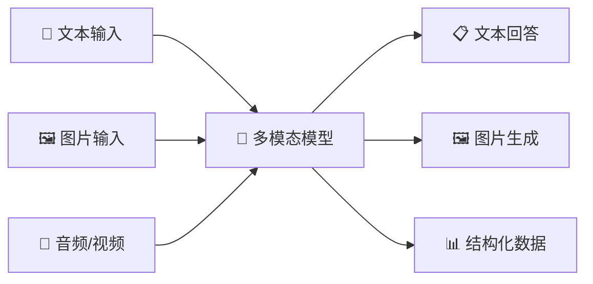
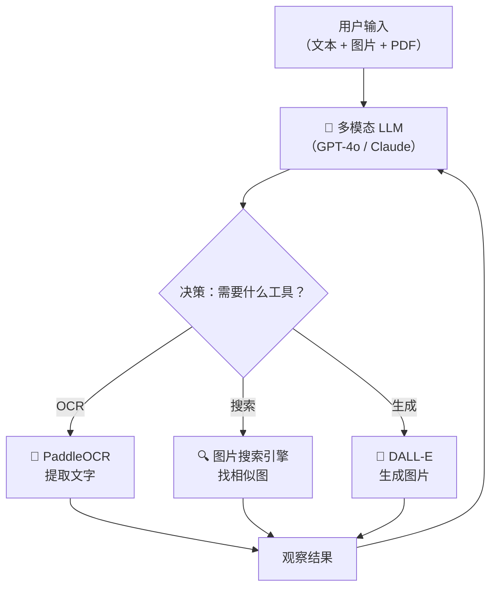

# 多模态 AI 应用开发指南

> **创建日期：** 2026-06-08
> **面向读者：** Java 后端开发者（示例代码使用 Python，侧重架构理解）
> **前置知识：** LLM 基础、RESTful API、Prompt Engineering

---

## 一、概述：什么是多模态 AI？

多模态 AI（Multimodal AI）指能够**同时理解和生成多种数据模态**（文本、图像、音频、视频）的人工智能系统。与传统的"文本进、文本出"LLM 不同，多模态模型可以"看到"图片、"听懂"语音，并基于多源信息进行推理。

| 应用场景 | 说明 | 典型技术栈 |
|----------|------|------------|
| **图像理解** | 识别图片内容、物体、场景、人物关系 | GPT-4o Vision / Claude 3.5 Sonnet |
| **OCR 文字识别** | 从图片中提取结构化文字、表格 | PaddleOCR / Azure Document Intelligence |
| **视觉问答（VQA）** | 基于图片内容回答问题 | LLaVA / Qwen-VL |
| **AIGC 图像生成** | 根据文本描述生成图片 | DALL-E 3 / Stable Diffusion |



---

## 二、多模态模型对比

| 模型 | 能力亮点 | 图片输入价格 | API 格式 | 开源 | 推荐场景 |
|------|----------|-------------|----------|------|----------|
| **GPT-4o** | 综合最强，原生多模态 | ~$5/1M input tokens | OpenAI Chat Completions | 否 | 高精度图像理解、复杂推理 |
| **Claude 3.5 Sonnet** | 长文档+图片理解，128K 上下文 | ~$3/1M input tokens | Anthropic Messages API | 否 | 多页 PDF 分析、合同审阅 |
| **Qwen-VL** | 中文 OCR 优秀，支持细粒度定位 | 免费（开源）/ 阿里云 API | OpenAI 兼容 | 是 | 中文场景、发票识别 |
| **GLM-4V** | 中文理解强，智谱 API 生态完善 | ~$0.01/1K tokens | 智谱 SDK | 否 | 企业内部中文多模态应用 |
| **LLaVA** | 学术界标杆，可本地部署 | 免费（开源） | 本地部署 | 是 | 私有化部署、研究实验 |

> **Java 后端集成建议：** 优先使用 OpenAI 兼容格式的 API（GPT-4o、Qwen-VL），通过统一的 HTTP Client 封装，减少多供应商适配成本。

---

## 三、图像理解实战：OpenAI Vision API

```python
import base64
from openai import OpenAI

client = OpenAI(api_key="sk-xxx")

# 方式一：URL 传图
response = client.chat.completions.create(
    model="gpt-4o",
    messages=[{
        "role": "user",
        "content": [
            {"type": "text", "text": "这张图片里有什么？请用中文描述。"},
            {"type": "image_url", "image_url": {"url": "https://example.com/photo.jpg"}}
        ]
    }],
    max_tokens=500
)
print(response.choices[0].message.content)
```

```python
# 方式二：Base64 传图（适合本地文件、数据库存储的图片）
def encode_image(path: str) -> str:
    with open(path, "rb") as f:
        return base64.b64encode(f.read()).decode("utf-8")

response = client.chat.completions.create(
    model="gpt-4o",
    messages=[{
        "role": "user",
        "content": [
            {"type": "text", "text": "分析这张架构图，总结系统的核心组件和数据流。"},
            {"type": "image_url", "image_url": {
                "url": f"data:image/png;base64,{encode_image('architecture.png')}"
            }}
        ]
    }]
)
```

> **图文混合 Prompt 技巧：** 先描述图片内容，再提出分析要求；对多图场景，给每张图编号并在文本中引用编号。

---

## 四、OCR 与文档理解

| 方案 | 部署方式 | 中文准确率 | 表格识别 | 适用场景 | 成本 |
|------|----------|-----------|----------|----------|------|
| **PaddleOCR** | 本地/云端 | 高（97%+） | 支持 | 通用 OCR、卡证、票据 | 免费开源 |
| **Tesseract** | 本地 | 中（需训练） | 不支持 | 简单英文 OCR | 免费开源 |
| **Azure Document Intelligence** | 云端 API | 很高 | 原生支持 | 复杂版式、手写体、签名 | 按页计费 |

```python
# PaddleOCR 快速上手
from paddleocr import PaddleOCR

ocr = PaddleOCR(lang='ch')  # 中文模型
result = ocr.ocr('invoice.jpg')
for line in result[0]:
    box, (text, confidence) = line
    print(f"识别文字: {text} | 置信度: {confidence:.2%}")
```

---

## 五、多模态 Agent

多模态 Agent 能同时处理文本、图片、表格，将视觉理解能力融入 ReAct 循环中：



**典型场景：** 用户上传一张产品图片，Agent 先用 Vision 识别产品特征，再调用数据库检索相似商品，最后生成对比分析报告。

---

## 六、AIGC 图像生成

| 方案 | 生成质量 | 速度 | API 价格 | 可控性 | 适用场景 |
|------|----------|------|----------|--------|----------|
| **DALL-E 3** | 极高，风格多样 | 快（~10s） | $0.04/张 | 中等（Prompt 控制） | 营销图、创意设计 |
| **Stable Diffusion** | 高，可定制 | 取决于 GPU | 免费（自部署） | 极高（ControlNet/LoRA） | 批量生成、风格定制 |
| **Midjourney API** | 极高，艺术感强 | 中（~30s） | $0.01~0.04/张 | 低（Discord 交互） | 创意设计、概念图 |

```python
# DALL-E 3 调用示例
from openai import OpenAI

client = OpenAI()
response = client.images.generate(
    model="dall-e-3",
    prompt="一张电商产品白底图：银色无线蓝牙耳机，专业摄影棚灯光，高清",
    size="1024x1024",
    quality="standard",
    n=1
)
print(response.data[0].url)  # 返回生成的图片 URL
```

---

## 七、企业场景落地

| 场景 | 技术方案 | 关键能力 | Java 集成要点 |
|------|----------|----------|---------------|
| **合同审阅** | GPT-4o + OCR | 条款提取、风险识别、对比分析 | 长文档分页传输，异步回调 |
| **发票识别** | PaddleOCR + Qwen-VL | 关键字段提取、真伪校验 | Tesseract 备选，结构化输出到 DTO |
| **产品图片搜索** | CLIP 向量化 + Milvus | 以图搜图、相似商品推荐 | 定时任务同步向量库 |
| **图纸理解** | GPT-4o Vision | 工程图标注识别、BOM 表提取 | 图片预处理（缩放/增强） |

---

## 八、面试高频题

### Q1: 多模态模型和纯文本 LLM 在架构上有什么区别？如何实现图文混合推理？

**详细答案：** 多模态模型在架构上通过"多模态编码器 + 对齐层 + LLM 主干"实现跨模态理解。图片首先经过视觉编码器（如 ViT、CLIP Vision Encoder）提取为特征向量，然后通过一个对齐层（Projector，通常是 MLP 或 Q-Former）将视觉特征映射到与文本 Token 相同的向量空间，最后与文本 Token 拼接后送入 LLM 主干进行联合推理。这种设计的核心思想是：让 LLM 把图片"当作一种外语来处理"——先翻译成 LLM 能理解的 Token 表示，再用 LLM 强大的推理能力进行处理。

与纯文本 LLM 的区别在于，多模态模型需要额外的视觉编码器和对齐训练。对齐是一个关键步骤——通常使用大量图文对数据进行预训练，让模型学会将"猫的图片"和"猫"这个词映射到向量空间中相近的位置。在实际推理时，用户输入的图片和文本被本文被拼接成一个混合序列，模型在自回归生成时同时关注文本 Token 和视觉 Token，从而实现图文混合推理。对于 Java 后端开发者，集成时需要注意：图片需要先转换为 Base64 或 URL 格式传输，API 请求体中的 `content` 字段从纯文本改为 `[{"type": "text", ...}, {"type": "image_url", ...}]` 的结构化数组。

### Q2: GPT-4o 和 Claude 3.5 Sonnet 在多模态能力上有什么差异？如何为企业选型？

**详细答案：** GPT-4o 和 Claude 3.5 Sonnet 是目前最强的两个多模态模型，但侧重点不同。GPT-4o 的优势在于"综合图像理解"——对复杂场景、多物体关系、抽象图表（如 UML 类图、ER 图）的理解能力更强，且原生支持图像生成（DALL-E 3）。Claude 3.5 Sonnet 的优势在于"长文档 + 图片"的混合场景——其 128K 上下文窗口可以一次性处理 200+ 页的 PDF 文档（含图片、表格），在合同审阅、法律文书分析等场景中表现突出，且对表格数据的提取准确性更高。

企业选型建议：如果需要高精度图像理解和复杂推理（如工程图纸分析、医学影像辅助诊断），优先选 GPT-4o；如果主要场景是文档理解（PDF 中的文字+图片+表格混合）、长文档分析，优先选 Claude 3.5 Sonnet。成本方面，Claude 3.5 Sonnet 的 API 价格略低于 GPT-4o，且 Claude 对中文文档的 OCR 后理解能力在某些测试中表现更好。对于需要数据不出境的企业，可以考虑开源的 Qwen-VL（阿里）或 GLM-4V（智谱），通过私有化部署满足合规要求，但推理精度和英文场景能力相对较弱。

### Q3: 多模态 Agent 如何设计工具调用？图片和文本如何统一在 Agent 的工作流中？

**详细答案：** 多模态 Agent 的工具调用设计核心在于"统一的消息格式"。在 LangChain 或 LlamaIndex 等多模态框架中，Agent 的消息不再只是纯文本，而是可以包含图片、文件等多模态内容的 `HumanMessage`。例如，用户上传一张发票图片，Agent 首先将图片作为 `content` 的一部分传给多模态 LLM，LLM 推理出"这是一张增值税发票，用户需要提取关键信息"，然后 Agent 调用 OCR 工具（如 PaddleOCR 的函数）提取文字，再将提取结果作为 Observation 反馈给 LLM 进行结构化处理。

多模态 Agent 的关键挑战在于工具链的编排。对于"图片+文本"混合输入，推荐采用两阶段流水线：第一阶段用专门的多模态模型（GPT-4o Vision）进行图片理解和初步推理，第二阶段将推理结果转化为纯文本，交给文本 Agent 进行后续的工具调用和决策。这样做的好处是降低 Token 消耗（图片 Token 很贵），同时让后续的文本推理更稳定。对于需要多轮图片交互的场景（如"先看这张图，再对比另一张图"），需要确保 Agent 的状态管理支持多图片的上下文保持。

### Q4: 企业级 OCR 方案如何选型？PaddleOCR 和 Azure Document Intelligence 各自的优劣势是什么？

**详细答案：** PaddleOCR 和 Azure Document Intelligence 代表了 OCR 领域的两种典型路线——开源本地部署 vs 云端 API 服务。PaddleOCR 的优势在于完全免费、可私有化部署、中文识别准确率极高（97%+），且社区活跃、模型持续更新。它支持超过 80 种语言的文字识别，对表格识别、卡证识别、印章检测等场景有专门的模型。但 PaddleOCR 的劣势在于需要自行管理 GPU 资源、运维成本高，且对复杂版式（如多栏报纸、手写体混排）的鲁棒性不如商用方案。

Azure Document Intelligence 的优势在于开箱即用、对复杂版式有优秀的泛化能力。它的预构建模型（发票、收据、身份证、名片等）可以直接使用，无需训练，且支持自定义模型训练。对表格识别（尤其是跨页表格、合并单元格）和手写体的支持优于 PaddleOCR。劣势是成本较高（按页计费），且数据需要上传到 Azure 云端，不适合数据合规要求严格的场景。企业选型建议：数据量小、版式复杂的场景用 Azure；数据量大、需要私有化部署、有 GPU 资源的场景用 PaddleOCR；对于混合场景，可以用 PaddleOCR 做批量预处理，用 Azure 处理复杂版式的兜底。

### Q5: 多模态 AI 在实际企业项目中最大的挑战是什么？如何应对？

**详细答案：** 多模态 AI 在企业落地中面临三大挑战：**成本控制、格式兼容、幻觉治理**。成本方面，多模态模型的 Token 消耗远高于纯文本——一张 1024x1024 的图片在 GPT-4o 中可能消耗 765~1105 tokens，加上推理用 Token，单次调用的成本可能是纯文本的 5~10 倍。应对策略包括：图片预处理（压缩到合理分辨率、裁剪无关区域）、缓存策略（相同图片不重复分析）、使用开源模型做初筛（Qwen-VL 免费做预分析，GPT-4o 做精判）。

格式兼容挑战是指不同供应商的 API 格式不统一——GPT-4o 使用 `image_url` 格式，Claude 使用 `source` 字段，Qwen-VL 兼容 OpenAI 但也有自己的本地部署接口。应对策略是建立统一的"多模态网关层"，封装不同供应商的 API 差异，对外暴露统一的 `MultimodalRequest` 和 `MultimodalResponse` 接口（Java 后端可以用策略模式 + 工厂模式实现）。幻觉治理挑战是指多模态模型也可能"看图说话"——对图片中的模糊区域进行臆测，或对 OCR 提取的文字进行错误推断。应对策略包括：要求模型标注置信度低的内容、对关键信息（金额、日期、身份证号）进行 二次校验、建立人工审核兜底机制。

### Q6: 多模态 RAG 与传统 RAG 有什么区别？如何构建一个支持图片检索的知识库？

**详细答案：** 传统 RAG 只处理文本，检索的是文本向量；多模态 RAG 需要同时处理文本和图片，检索的是"多模态向量"。多模态 RAG 的架构通常采用"多路索引"策略：一路用文本 Embedding 模型（如 text-embedding-3）对文档中的文字内容建立向量索引，另一路用多模态 Embedding 模型（如 CLIP、Jina CLIP v2）对文档中的图片建立向量索引。查询时，用户输入可以是纯文本、纯图片或图文混合，系统根据查询类型选择合适的检索路径。

构建多模态 RAG 知识库的关键步骤：首先对文档进行解析，将 PDF/Word 中的文字和图片分离；然后对文字部分用文本 Embedding 模型向量化，对图片部分用 CLIP 等模型向量化（图片的向量表示可以直接用于"以图搜图"）；最后将文本向量和图片向量存入同一向量数据库（如 Milvus 支持多向量字段），通过元数据关联文本和图片的对应关系。检索时，用户上传一张图片，系统先用 CLIP 将其向量化，然后在向量库中检索相似图片，再通过元数据关联找到对应的文字说明，形成"图文并茂"的检索结果，增强 LLM 的回答质量。

---

> **延伸阅读：** [多模态模型选型能力矩阵](../llm-basics/model-selection/capability-matrix.md) | [Agent 架构与原理](../agent/index.md) | [RAG 原理详解](../rag/index.md)