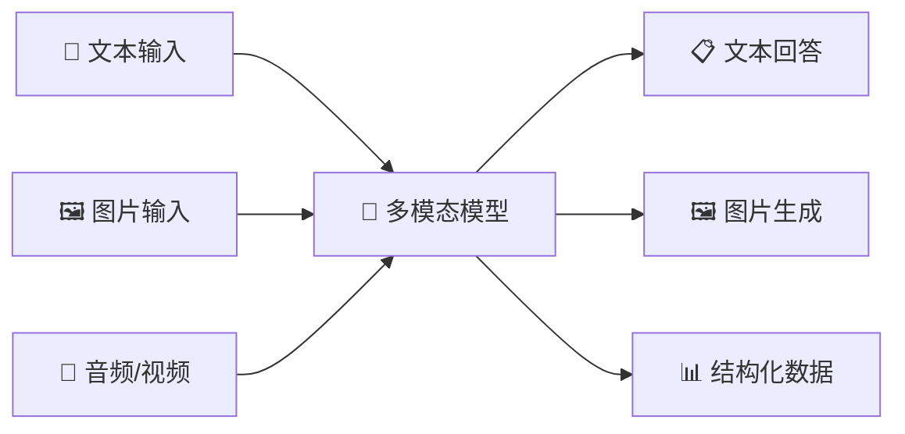
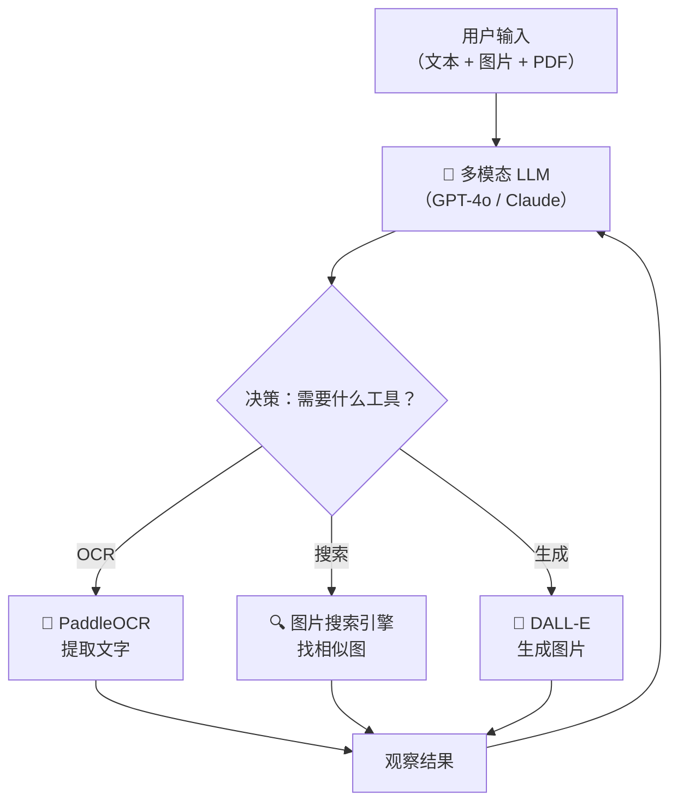

# 多模态 AI 应用开发指南

> **创建日期：** 2026-06-08
> **面向读者：** Java 后端开发者（示例代码使用 Python，侧重架构理解）
> **前置知识：** LLM 基础、RESTful API、Prompt Engineering

---

## 一、概述：什么是多模态 AI？

多模态 AI（Multimodal AI）指能够**同时理解和生成多种数据模态**（文本、图像、音频、视频）的人工智能系统。与传统的"文本进、文本出"LLM 不同，多模态模型可以"看到"图片、"听懂"语音，并基于多源信息进行推理。

| 应用场景 | 说明 | 典型技术栈 |
|----------|------|------------|
| **图像理解** | 识别图片内容、物体、场景、人物关系 | GPT-4o Vision / Claude 3.5 Sonnet |
| **OCR 文字识别** | 从图片中提取结构化文字、表格 | PaddleOCR / Azure Document Intelligence |
| **视觉问答（VQA）** | 基于图片内容回答问题 | LLaVA / Qwen-VL |
| **AIGC 图像生成** | 根据文本描述生成图片 | DALL-E 3 / Stable Diffusion |



---

## 二、多模态模型对比

| 模型 | 能力亮点 | 图片输入价格 | API 格式 | 开源 | 推荐场景 |
|------|----------|-------------|----------|------|----------|
| **GPT-4o** | 综合最强，原生多模态 | ~$5/1M input tokens | OpenAI Chat Completions | 否 | 高精度图像理解、复杂推理 |
| **Claude 3.5 Sonnet** | 长文档+图片理解，128K 上下文 | ~$3/1M input tokens | Anthropic Messages API | 否 | 多页 PDF 分析、合同审阅 |
| **Qwen-VL** | 中文 OCR 优秀，支持细粒度定位 | 免费（开源）/ 阿里云 API | OpenAI 兼容 | 是 | 中文场景、发票识别 |
| **GLM-4V** | 中文理解强，智谱 API 生态完善 | ~$0.01/1K tokens | 智谱 SDK | 否 | 企业内部中文多模态应用 |
| **LLaVA** | 学术界标杆，可本地部署 | 免费（开源） | 本地部署 | 是 | 私有化部署、研究实验 |

> **Java 后端集成建议：** 优先使用 OpenAI 兼容格式的 API（GPT-4o、Qwen-VL），通过统一的 HTTP Client 封装，减少多供应商适配成本。

---

## 三、图像理解实战：OpenAI Vision API

```python
import base64
from openai import OpenAI

client = OpenAI(api_key="sk-xxx")

# 方式一：URL 传图
response = client.chat.completions.create(
    model="gpt-4o",
    messages=[{
        "role": "user",
        "content": [
            {"type": "text", "text": "这张图片里有什么？请用中文描述。"},
            {"type": "image_url", "image_url": {"url": "https://example.com/photo.jpg"}}
        ]
    }],
    max_tokens=500
)
print(response.choices[0].message.content)
```

```python
# 方式二：Base64 传图（适合本地文件、数据库存储的图片）
def encode_image(path: str) -> str:
    with open(path, "rb") as f:
        return base64.b64encode(f.read()).decode("utf-8")

response = client.chat.completions.create(
    model="gpt-4o",
    messages=[{
        "role": "user",
        "content": [
            {"type": "text", "text": "分析这张架构图，总结系统的核心组件和数据流。"},
            {"type": "image_url", "image_url": {
                "url": f"data:image/png;base64,{encode_image('architecture.png')}"
            }}
        ]
    }]
)
```

> **图文混合 Prompt 技巧：** 先描述图片内容，再提出分析要求；对多图场景，给每张图编号并在文本中引用编号。

---

## 四、OCR 与文档理解

| 方案 | 部署方式 | 中文准确率 | 表格识别 | 适用场景 | 成本 |
|------|----------|-----------|----------|----------|------|
| **PaddleOCR** | 本地/云端 | 高（97%+） | 支持 | 通用 OCR、卡证、票据 | 免费开源 |
| **Tesseract** | 本地 | 中（需训练） | 不支持 | 简单英文 OCR | 免费开源 |
| **Azure Document Intelligence** | 云端 API | 很高 | 原生支持 | 复杂版式、手写体、签名 | 按页计费 |

```python
# PaddleOCR 快速上手
from paddleocr import PaddleOCR

ocr = PaddleOCR(lang='ch')  # 中文模型
result = ocr.ocr('invoice.jpg')
for line in result[0]:
    box, (text, confidence) = line
    print(f"识别文字: {text} | 置信度: {confidence:.2%}")
```

---

## 五、多模态 Agent

多模态 Agent 能同时处理文本、图片、表格，将视觉理解能力融入 ReAct 循环中：



**典型场景：** 用户上传一张产品图片，Agent 先用 Vision 识别产品特征，再调用数据库检索相似商品，最后生成对比分析报告。

---

## 六、AIGC 图像生成

| 方案 | 生成质量 | 速度 | API 价格 | 可控性 | 适用场景 |
|------|----------|------|----------|--------|----------|
| **DALL-E 3** | 极高，风格多样 | 快（~10s） | $0.04/张 | 中等（Prompt 控制） | 营销图、创意设计 |
| **Stable Diffusion** | 高，可定制 | 取决于 GPU | 免费（自部署） | 极高（ControlNet/LoRA） | 批量生成、风格定制 |
| **Midjourney API** | 极高，艺术感强 | 中（~30s） | $0.01~0.04/张 | 低（Discord 交互） | 创意设计、概念图 |

```python
# DALL-E 3 调用示例
from openai import OpenAI

client = OpenAI()
response = client.images.generate(
    model="dall-e-3",
    prompt="一张电商产品白底图：银色无线蓝牙耳机，专业摄影棚灯光，高清",
    size="1024x1024",
    quality="standard",
    n=1
)
print(response.data[0].url)  # 返回生成的图片 URL
```

---

## 七、企业场景落地

| 场景 | 技术方案 | 关键能力 | Java 集成要点 |
|------|----------|----------|---------------|
| **合同审阅** | GPT-4o + OCR | 条款提取、风险识别、对比分析 | 长文档分页传输，异步回调 |
| **发票识别** | PaddleOCR + Qwen-VL | 关键字段提取、真伪校验 | Tesseract 备选，结构化输出到 DTO |
| **产品图片搜索** | CLIP 向量化 + Milvus | 以图搜图、相似商品推荐 | 定时任务同步向量库 |
| **图纸理解** | GPT-4o Vision | 工程图标注识别、BOM 表提取 | 图片预处理（缩放/增强） |

---

## 八、面试高频题

### Q1: 多模态模型和纯文本 LLM 在架构上有什么区别？如何实现图文混合推理？

**详细答案：** 多模态模型简单说就是在纯文本 LLM 外面加了套"眼睛"——先用 ViT 或 CLIP 这类视觉编码器把图片转成特征向量，再通过一个对齐层（通常是简单的 MLP）映射到 LLM 认识的 Token 空间，最后和文本 Token 拼一起塞给 LLM 推理。你可以理解成把图片"翻译"成 LLM 能看懂的 Token。

我们项目在用 GPT-4o 做合同审阅，当时踩了一个坑——原图直接把手机拍的 4000x3000 照片丢给 API，一张图吃了将近 1500 Token，成本飙得飞起。后来加了预处理：图片先缩到最长边 1024 像素，无关背景裁掉，Token 消耗降到了约 500，单次调用从 8 分钱降到了 3 分钱。对 Java 后端来说，注意 `content` 要从纯文本改成 `[{"type": "text"}, {"type": "image_url"}]` 这种数组结构，同时考虑做好图片的压缩和缓存，不然 API 账单会让你怀疑人生。

### Q2: GPT-4o 和 Claude 3.5 Sonnet 在多模态能力上有什么差异？如何为企业选型？

**详细答案：** 我们项目两个都用过，说点真实体感。GPT-4o 综合理解确实最强，特别是复杂图表——我们把公司微服务的架构图丢给它，它能准确识别出网关、消息队列、各个微服务之间的调用关系，甚至能指出"这个服务缺少熔断器"。但 GPT-4o 对长文档里的表格解析不如 Claude，我们测过一份 80 页的 PDF 合同，GPT-4o 在跨页表格的金额栏偶尔会错位，Claude 基本不会。

Claude 的长上下文是真香——128K 窗口一次性塞进 200 页 PDF 毫无压力，而且对中文 OCR 后的语义理解感觉比 GPT-4o 自然。但 Claude 有个不爽的地方是图片不支持 URL 直传，必须 base64 编码，大图传到 HTTP body 里动不动就几 MB，我们的网关一度超时。企业选型的话，合同审阅、长文档分析果断 Claude；复杂图表推理、需要画图生成的用 GPT-4o；国内合规要求高的直接用 Qwen-VL，中文 OCR 足够用，还免费。

### Q3: 多模态 Agent 如何设计工具调用？图片和文本如何统一在 Agent 的工作流中？

**详细答案：** 我们做发票审核 Agent 的时候，核心是把"看图"和"做事"拆成两阶段。用户上传一张发票，第一阶段先用 GPT-4o 做初步识别——这是增值税发票、金额大概多少、日期在哪块区域，这个阶段只做理解，不调工具。第二阶段把 GPT-4o 输出的纯文本结果交给下游的文本 Agent，由它决定调哪些工具——查数据库校验发票号、调金额阈值规则做风控、或者发现金额超过 10 万走人工审批流程。

这么拆分的主要原因很实在——省钱。图片 Token 太贵了，你在 Agent 循环里来回传图，一次迭代光图片就吃掉将近 1000 Token，十次迭代就是十块钱级别的成本了。所以我们坚持"图片只在第一轮传，后面只传文字"，这样 Agent 迭代十轮的 Token 成本跟一轮差不多。还有个坑，早期我们用 LangChain 的多模态消息，发现它对多图片上下文的支持不太稳定，同一个 session 里传第二张图有时会丢上一张的推理结果，后来我们自己在 Agent 状态里用 `image_context_map` 手动管理图片和推理结果的映射关系。

### Q4: 企业级 OCR 方案如何选型？PaddleOCR 和 Azure Document Intelligence 各自的优劣势是什么？

**详细答案：** 我们项目 PaddleOCR 和 Azure 都踩过坑。PaddleOCR 中文识别率确实高，我们测过 500 张发票，字段级别准确率到了 96.5%，而且是免费本地的，数据不出公司这点很关键。但它有两个比较头疼的问题：一是复杂版式翻车率高，比如有些供应商的开票格式比较奇葩，印章和金额叠在一起的时候 PaddleOCR 经常把金额识别错位；二是 GPU 资源你得自己管，我们线上部署跑 PP-OCRv4 Server 版，单卡 T4 处理一张发票大概 300ms，QPS 上限大概 20，高峰期得加卡。

Azure Document Intelligence 在复杂版式上确实强——同样的 500 张发票，那些 PaddleOCR 翻车的复杂版式 Azure 基本都能搞定，而且对表格有跨页合并的能力，这个 PaddleOCR 做不到。但 Azure 的成本是按页计费的，我们估算过如果日处理一万张发票，一个月 OCR 费用要差不多 6000 块，PaddleOCR 这边只有服务器电费。所以我们最终的策略是：PaddleOCR 打主力，处理 90% 的常规票据；Azure 当兜底，PaddleOCR 置信度低于 0.85 的自动切到 Azure。这样既省钱，又能保证整体准确率。

### Q5: 多模态 AI 在实际企业项目中最大的挑战是什么？如何应对？

**详细答案：** 我体感最大的三个挑战就是——钱、幻觉、供应商锁死。先说钱，多模态 API 的 Token 消耗太猛了。一张 1024x1024 的普通图片在 GPT-4o 里大概吃掉 765 到 1105 Token，加上推理和输出，一次调用可能是纯文本的 5 到 10 倍。我们合同审阅场景日处理大约 300 份 PDF，每份平均 12 页，一个月 API 费用轻松过万。后来我们做了三层优化：图片预处理统一缩到 1024 最长边、对同一份合同同一页不做重复分析（用 MD5 缓存）、开源的 Qwen-VL 做初筛只把复杂页送给 GPT-4o，成本最终压到了原来的三分之一。

幻觉问题也很头疼，GPT-4o 看图有时候会"脑补"——图片模糊区域它会自行推断，关键是它还不告诉你它在猜。我们合同审阅里出现过它把"违约金 5%"识别成"违约金 5 万元"的情况，金额差了十万八千里。后来要求模型对关键字段（金额、日期、身份证号）必须输出置信度标记，置信度低于 0.9 的字段自动走人工复核。还有一个坑是供应商切换，从 GPT-4o 切 Claude 会发现图片传参格式、返回结构都不一样，我们写了个统一的多模态网关把差异全封装了，后面加新模型只要实现一个 Adapter 就行。

### Q6: 多模态 RAG 与传统 RAG 有什么区别？如何构建一个支持图片检索的知识库？

**详细答案：** 传统 RAG 只管文本，多模态 RAG 得同时管文本和图片，核心区别在于索引是多路的。我们做产品知识库的时候就踩过这个坑——用户搜"这个型号的接口在哪"，光看文字说明根本不知道是哪个口，必须把产品实物图和端口标注图一起返回才有意义。

我们的做法是双路索引：文字部分用 text-embedding-3 向量化，图片用 Jina CLIP v2 向量化。比较反直觉的一点是，CLIP 把图片向量化之后，用"一句话"去搜也能匹配到图片——比如搜"电源接口"，CLIP 能在向量空间里找到含电源接口的图片，不需要非得用图片搜图片。但这里有个实际问题：CLIP 向量维度是 768 甚至更高，我们产品知识库有大概 5 万张图片，存储成本和检索延迟都不低。最后用了两阶段检索——第一阶段用粗粒度的文本标题过滤到前 100 个候选，第二阶段用 CLIP 精细化重排前 10 个。检索延迟从纯 CLIP 的 400ms 降到了 80ms，结果准确率几乎没有下降。

---

> **延伸阅读：** [多模态模型选型能力矩阵](../llm-basics/model-selection/capability-matrix.md) | [Agent 架构与原理](../agent/index.md) | [RAG 原理详解](../rag/index.md)