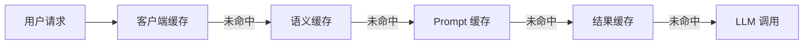
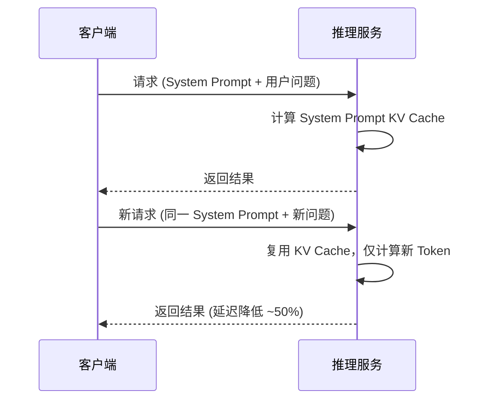
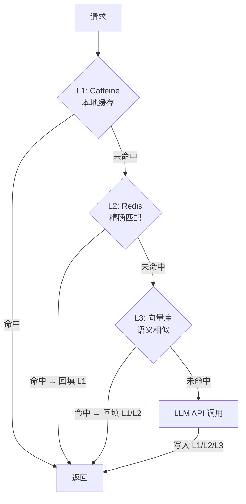

# AI 应用缓存策略完整指南

> 面向 Java 后端开发者 | 当前日期：2026-06-08

## 1. 概述：AI 应用为什么需要缓存

AI 应用面临三大核心瓶颈：

| 瓶颈 | 典型表现 | 缓存价值 |
|------|---------|---------|
| **Token 成本** | GPT-4o 输出 $15/1M tokens，高频调用日耗数千元 | 避免重复请求，直接削减 30%~70% 调用量 |
| **延迟** | 单次 LLM 调用 1~10 秒，用户等待焦虑 | 缓存命中响应 < 10ms，体验提升 100 倍 |
| **QPS 瓶颈** | API Rate Limit（如 OpenAI 500 RPM），峰值直接 429 | 拦截热点查询，保护上游额度 |

**一句话总结**：缓存是 AI 应用 ROI 最高的优化手段——低成本投入，立竿见影的延迟与费用改善。

## 2. 缓存分层总览



| 层级 | 粒度 | 命中率期望 | 典型实现 |
|------|------|-----------|---------|
| 客户端缓存 | 请求级 | 5%~10% | HTTP 304 / ETag |
| 语义缓存 | 语义级 | 30%~50% | GPTCache / Redis + Embedding |
| Prompt 缓存 | Token 级 | 20%~40% | KV Cache 复用 / OpenAI Prompt Caching |
| 结果缓存 | Key 级 | 10%~20% | Redis String / Caffeine |

## 3. 语义缓存（GPTCache）详解

**原理**：将用户问题转为 Embedding 向量，在向量库中检索相似历史问题，相似度超过阈值则直接返回缓存答案，避免重复调用 LLM。

**核心参数**：
- `similarity_threshold`：相似度阈值（0.75~0.90）。阈值过高命中率低，过低答案不准确。建议从 0.80 起步，A/B 测试调优。
- `embedding_model`：推荐 `text-embedding-3-small`（成本低、速度快）。
- `vector_store`：Milvus（千万级）或 FAISS（百万级，本地部署）。

**缓存命中率优化**：
1. 对用户问题做标准化预处理：去除语气词、统一大小写、提取关键意图。
2. 分层阈值：核心业务（如客服 FAQ）阈值 0.90，开放性问答阈值 0.75。
3. 定期清理冷数据，控制索引规模。

**Python 示例（GPTCache 集成 OpenAI）**：

```python
# 初始化 GPTCache —— 语义相似匹配 + FAISS 向量存储
from gptcache import cache
from gptcache.manager import CacheBase, VectorBase
from gptcache.similarity_evaluation import OnnxSimilarityEvaluation

cache.init(
    cache_enable_func=lambda _, __: True,
    pre_embedding_func=lambda x: x,
    embedding_func=lambda x: openai_embedding(x),
    data_manager=CacheBase("sqlite"),
    vector_base=VectorBase("faiss", dimension=1536),
    similarity_evaluation=OnnxSimilarityEvaluation(),
    similarity_threshold=0.80
)

# 包装后的 LLM 调用自动走语义缓存
from gptcache.adapter import openai
response = openai.ChatCompletion.create(
    model="gpt-4o",
    messages=[{"role": "user", "content": "什么是 RAG？"}]
)
```

## 4. Prompt 缓存

### 4.1 KV Cache 复用

LLM 推理时，Transformer 每层产生的 Key/Value 矩阵可被复用。**System Prompt 固定时**，只需计算一次 KV Cache，后续请求直接复用，节省 50%+ 首 Token 延迟。



### 4.2 OpenAI Prompt Caching（2024.10 正式发布）

- 自动检测 Prompt 中超过 1024 Token 的重复前缀。
- 缓存命中后，被缓存 Token 按 **原价 50%** 计费。
- 启用方式：无需额外配置，API 自动生效。建议将 System Prompt 和长上下文放在 Messages 数组最前面。

**Java 调用示例（Spring AI）**：

```java
// System Prompt 前置，触发 OpenAI Prompt Caching
ChatClient chatClient = chatClientBuilder
    .defaultSystem("你是一个 Java 技术专家，擅长 Spring Boot、微服务架构……(长上下文)")
    .build();
String reply = chatClient.prompt()
    .user("如何设计一个高并发的缓存系统？")
    .call()
    .content();
```

## 5. 结果缓存

### 精确匹配 vs 模糊匹配

| 匹配类型 | 适用场景 | 命中率 | 复杂度 |
|---------|---------|-------|--------|
| **精确匹配**（Hash Key） | 固定参数查询（如配置信息、模板生成） | 低 | 低 |
| **模糊匹配**（语义 Key） | 开放性问答、对话类场景 | 高 | 高 |

### 缓存 Key 设计（四要素）

```
Key = MD5({model}:{version}:{temperature}:{content_hash})
```

- `model`：区分不同模型（gpt-4o vs gpt-4o-mini，价格不同不可混用）。
- `version`：Prompt 模板版本号，Prompt 迭代后自动淘汰旧缓存。
- `temperature`：temperature=0（确定性输出）可缓存；temperature>0 生成结果有随机性，谨慎缓存。
- `content_hash`：消息内容摘要。

**Java 示例（Caffeine + 精确匹配）**：

```java
Cache<String, String> resultCache = Caffeine.newBuilder()
    .expireAfterWrite(30, TimeUnit.MINUTES)
    .maximumSize(10_000)
    .build();

public String getOrCall(String model, int version, double temp, String content,
                         Function<String, String> llmCaller) {
    String key = DigestUtils.md5Hex(model + ":" + version + ":" + temp + ":" + content);
    return resultCache.get(key, k -> llmCaller.apply(content));
}
```

## 6. 多级缓存架构



| 层级 | 组件 | 延迟 | 容量 | 适用匹配 |
|------|------|------|------|---------|
| L1 | Caffeine | < 1ms | 万级 | 精确匹配（热点 Key） |
| L2 | Redis | 1~5ms | 千万级 | 精确匹配 + TTL 管理 |
| L3 | Milvus / FAISS | 10~50ms | 亿级 | 语义相似匹配 |

**关键设计**：L2→L1 自动回填热点数据；L3 作为兜底捕获长尾语义重复。

## 7. 缓存失效策略

| 策略 | 机制 | 适用场景 |
|------|------|---------|
| **TTL（Time-To-Live）** | 固定过期时间（如 30min） | 实时性要求低的内容 |
| **版本号** | Prompt 模板升级递增 Version，旧版本 Key 自然淘汰 | Prompt 迭代频繁的场景 |
| **内容变更触发** | 知识库更新时主动 Invalidate 相关缓存 | RAG 应用、FAQ 系统 |

**推荐组合**：TTL（兜底过期）+ 版本号（Prompt 变更）+ 事件驱动 Invalidate（知识库更新）。

## 8. 成本节省估算

| 缓存层级 | 预期命中率 | Token 节省比例 | 适用业务阶段 |
|---------|-----------|---------------|------------|
| 结果缓存（精确） | 10%~15% | 10%~15% | 通用 |
| Prompt 缓存（KV 复用） | 20%~40% | 20%~40% | System Prompt 固定 |
| 语义缓存 | 30%~50% | 30%~50% | 用户问题重复率高 |
| **三级叠加** | **50%~75%** | **50%~75%** | 成熟业务 |

> 按 GPT-4o 日消耗 100 万 Token（$15）计算，三级缓存叠加可日省 $7.5~$11.25，年省 $2,700~$4,100。

## 9. 面试高频题

### Q1：语义缓存和传统 Redis 缓存有什么区别？

**详细答案：** 传统 Redis 缓存依赖 Key 的精确匹配（byte-by-byte），两个语义相同但表述不同的问题（如"怎么退款"和"如何申请退货"）会被视为不同 Key 各自调用 LLM。语义缓存通过 Embedding 将文本映射到向量空间，用余弦相似度判断语义相近程度，相似度超过阈值则视为同一意图直接返回缓存结果。其本质是将"精确匹配"升级为"意图匹配"，在 AI 场景中能将缓存命中率从 10% 提升到 30%~50%，但代价是引入了向量存储和相似度计算的额外开销（10~50ms）。

### Q2：Prompt Caching 为什么能减少延迟？

**详细答案：** LLM 基于 Transformer 架构，推理时每层 Attention 需计算 Key/Value 矩阵（KV Cache）。当 System Prompt 固定时，前 N 个 Token 的 KV Cache 在所有请求中完全一致。传统做法是每次请求都从头计算，浪费了大量 GPU 算力。Prompt Caching 将固定前缀的 KV Cache 持久化，后续请求只需计算增量 Token，省去了重复计算——对于 5000 Token 的 System Prompt，可节省约 50% 的首 Token 延迟（TTFT）和 30%~50% 的计算成本。

### Q3：多级缓存中 L1 到 L3 的数据一致性如何保证？

**详细答案：** 多级缓存通常采用"穿透回填 + TTL 级联"策略而非强一致性。请求先查 L1，未命中则穿透到 L2，L2 命中后回填 L1（设置较短 TTL 如 5min）。L3 命中后同时回填 L1 和 L2。更新场景下采用"先清后填"：知识库变更时，先删除 L2 和 L3 中相关 Key，下次请求触发回填。大型系统可引入 Canal + MQ 实现准实时失效广播。核心原则是**容忍短暂不一致，换取极低延迟**。

### Q4：temperature=0 为什么对缓存有利？temperature>0 能否缓存？

**详细答案：** `temperature=0` 意味着模型始终选择概率最高的 Token（贪心解码），相同输入必然产生相同输出，非常适合精确匹配缓存。`temperature>0` 引入随机采样，同样输入可能产生不同输出，精确匹配缓存失去意义。但可通过语义缓存兜底：两个 temperature=0.7 的输出虽文字不同但语义等价（如都回答了"今天天气晴朗"的变体），语义相似度接近 1.0，仍可命中缓存。**推荐策略**：确定性任务（代码生成、分类）用 temperature=0 + 精确缓存；创造性任务（文案、对话）用 temperature>0 + 语义缓存。

### Q5：缓存击穿（Hotspot Invalid）在 AI 场景如何应对？

**详细答案：** 缓存击穿指某热点 Key 过期瞬间，大量并发请求穿透缓存直击 LLM API，造成雪崩。AI 场景的应对方案：1) **互斥锁**——对同一 Key 加分布式锁（Redis SETNX），仅允许一个请求调用 LLM，其余等待锁释放后读取缓存（Spring Cache + Redisson 实现）。2) **逻辑过期**——热点 Key 不过期，后台异步线程定期刷新，用户始终读到"可能稍旧但绝不穿透"的数据。3) **永不过期 + 后台刷新**——对 FAQ 等确定性内容直接设置永久缓存，知识库变更时主动通知刷新，避免任何穿透可能。

---

> **关键结论**：AI 应用缓存是"业务 ROI 最高"的基础设施投资。从精确匹配到语义匹配，从本地到分布式，分层渐进地建设缓存体系，即可在延迟、成本、可用性三个维度获得数量级的提升。