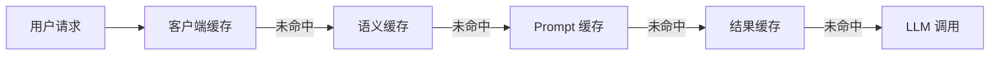
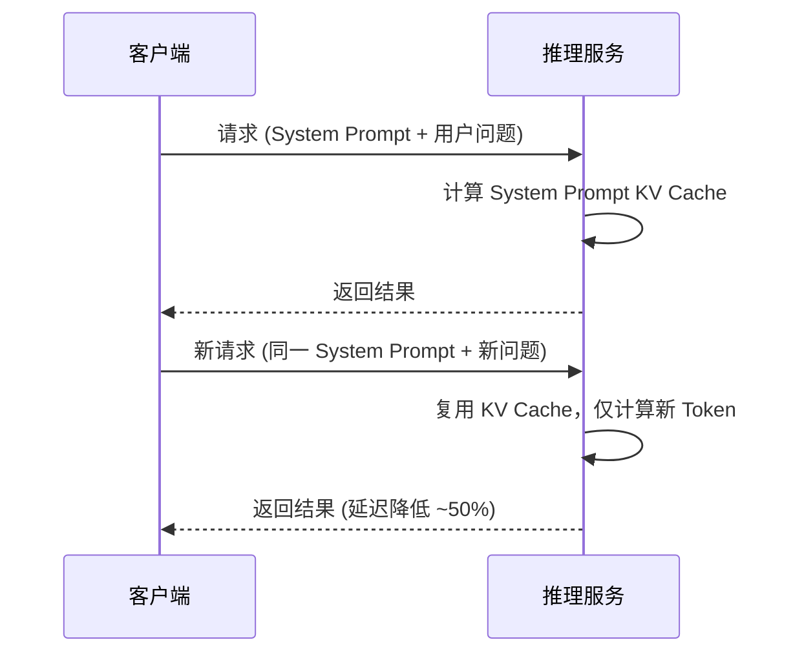
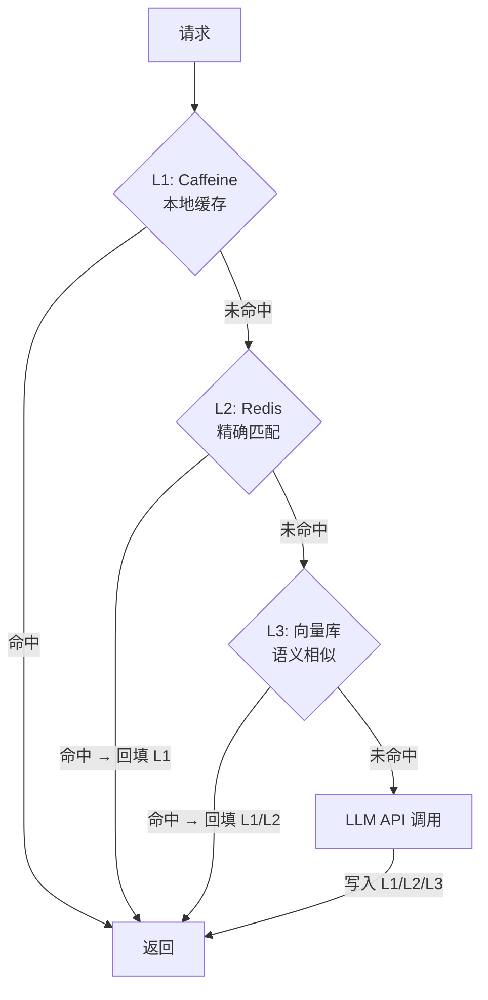

# AI 应用缓存策略完整指南

> 面向 Java 后端开发者 | 当前日期：2026-06-08

## 1. 概述：AI 应用为什么需要缓存

AI 应用面临三大核心瓶颈：

| 瓶颈 | 典型表现 | 缓存价值 |
|------|---------|---------|
| **Token 成本** | GPT-4o 输出 $15/1M tokens，高频调用日耗数千元 | 避免重复请求，直接削减 30%~70% 调用量 |
| **延迟** | 单次 LLM 调用 1~10 秒，用户等待焦虑 | 缓存命中响应 < 10ms，体验提升 100 倍 |
| **QPS 瓶颈** | API Rate Limit（如 OpenAI 500 RPM），峰值直接 429 | 拦截热点查询，保护上游额度 |

**一句话总结**：缓存是 AI 应用 ROI 最高的优化手段——低成本投入，立竿见影的延迟与费用改善。

## 2. 缓存分层总览



| 层级 | 粒度 | 命中率期望 | 典型实现 |
|------|------|-----------|---------|
| 客户端缓存 | 请求级 | 5%~10% | HTTP 304 / ETag |
| 语义缓存 | 语义级 | 30%~50% | GPTCache / Redis + Embedding |
| Prompt 缓存 | Token 级 | 20%~40% | KV Cache 复用 / OpenAI Prompt Caching |
| 结果缓存 | Key 级 | 10%~20% | Redis String / Caffeine |

## 3. 语义缓存（GPTCache）详解

**原理**：将用户问题转为 Embedding 向量，在向量库中检索相似历史问题，相似度超过阈值则直接返回缓存答案，避免重复调用 LLM。

**核心参数**：
- `similarity_threshold`：相似度阈值（0.75~0.90）。阈值过高命中率低，过低答案不准确。建议从 0.80 起步，A/B 测试调优。
- `embedding_model`：推荐 `text-embedding-3-small`（成本低、速度快）。
- `vector_store`：Milvus（千万级）或 FAISS（百万级，本地部署）。

**缓存命中率优化**：
1. 对用户问题做标准化预处理：去除语气词、统一大小写、提取关键意图。
2. 分层阈值：核心业务（如客服 FAQ）阈值 0.90，开放性问答阈值 0.75。
3. 定期清理冷数据，控制索引规模。

**Python 示例（GPTCache 集成 OpenAI）**：

```python
# 初始化 GPTCache —— 语义相似匹配 + FAISS 向量存储
from gptcache import cache
from gptcache.manager import CacheBase, VectorBase
from gptcache.similarity_evaluation import OnnxSimilarityEvaluation

cache.init(
    cache_enable_func=lambda _, __: True,
    pre_embedding_func=lambda x: x,
    embedding_func=lambda x: openai_embedding(x),
    data_manager=CacheBase("sqlite"),
    vector_base=VectorBase("faiss", dimension=1536),
    similarity_evaluation=OnnxSimilarityEvaluation(),
    similarity_threshold=0.80
)

# 包装后的 LLM 调用自动走语义缓存
from gptcache.adapter import openai
response = openai.ChatCompletion.create(
    model="gpt-4o",
    messages=[{"role": "user", "content": "什么是 RAG？"}]
)
```

## 4. Prompt 缓存

### 4.1 KV Cache 复用

LLM 推理时，Transformer 每层产生的 Key/Value 矩阵可被复用。**System Prompt 固定时**，只需计算一次 KV Cache，后续请求直接复用，节省 50%+ 首 Token 延迟。



### 4.2 OpenAI Prompt Caching（2024.10 正式发布）

- 自动检测 Prompt 中超过 1024 Token 的重复前缀。
- 缓存命中后，被缓存 Token 按 **原价 50%** 计费。
- 启用方式：无需额外配置，API 自动生效。建议将 System Prompt 和长上下文放在 Messages 数组最前面。

**Java 调用示例（Spring AI）**：

```java
// System Prompt 前置，触发 OpenAI Prompt Caching
ChatClient chatClient = chatClientBuilder
    .defaultSystem("你是一个 Java 技术专家，擅长 Spring Boot、微服务架构……(长上下文)")
    .build();
String reply = chatClient.prompt()
    .user("如何设计一个高并发的缓存系统？")
    .call()
    .content();
```

## 5. 结果缓存

### 精确匹配 vs 模糊匹配

| 匹配类型 | 适用场景 | 命中率 | 复杂度 |
|---------|---------|-------|--------|
| **精确匹配**（Hash Key） | 固定参数查询（如配置信息、模板生成） | 低 | 低 |
| **模糊匹配**（语义 Key） | 开放性问答、对话类场景 | 高 | 高 |

### 缓存 Key 设计（四要素）

```
Key = MD5({model}:{version}:{temperature}:{content_hash})
```

- `model`：区分不同模型（gpt-4o vs gpt-4o-mini，价格不同不可混用）。
- `version`：Prompt 模板版本号，Prompt 迭代后自动淘汰旧缓存。
- `temperature`：temperature=0（确定性输出）可缓存；temperature>0 生成结果有随机性，谨慎缓存。
- `content_hash`：消息内容摘要。

**Java 示例（Caffeine + 精确匹配）**：

```java
Cache<String, String> resultCache = Caffeine.newBuilder()
    .expireAfterWrite(30, TimeUnit.MINUTES)
    .maximumSize(10_000)
    .build();

public String getOrCall(String model, int version, double temp, String content,
                         Function<String, String> llmCaller) {
    String key = DigestUtils.md5Hex(model + ":" + version + ":" + temp + ":" + content);
    return resultCache.get(key, k -> llmCaller.apply(content));
}
```

## 6. 多级缓存架构



| 层级 | 组件 | 延迟 | 容量 | 适用匹配 |
|------|------|------|------|---------|
| L1 | Caffeine | < 1ms | 万级 | 精确匹配（热点 Key） |
| L2 | Redis | 1~5ms | 千万级 | 精确匹配 + TTL 管理 |
| L3 | Milvus / FAISS | 10~50ms | 亿级 | 语义相似匹配 |

**关键设计**：L2→L1 自动回填热点数据；L3 作为兜底捕获长尾语义重复。

## 7. 缓存失效策略

| 策略 | 机制 | 适用场景 |
|------|------|---------|
| **TTL（Time-To-Live）** | 固定过期时间（如 30min） | 实时性要求低的内容 |
| **版本号** | Prompt 模板升级递增 Version，旧版本 Key 自然淘汰 | Prompt 迭代频繁的场景 |
| **内容变更触发** | 知识库更新时主动 Invalidate 相关缓存 | RAG 应用、FAQ 系统 |

**推荐组合**：TTL（兜底过期）+ 版本号（Prompt 变更）+ 事件驱动 Invalidate（知识库更新）。

## 8. 成本节省估算

| 缓存层级 | 预期命中率 | Token 节省比例 | 适用业务阶段 |
|---------|-----------|---------------|------------|
| 结果缓存（精确） | 10%~15% | 10%~15% | 通用 |
| Prompt 缓存（KV 复用） | 20%~40% | 20%~40% | System Prompt 固定 |
| 语义缓存 | 30%~50% | 30%~50% | 用户问题重复率高 |
| **三级叠加** | **50%~75%** | **50%~75%** | 成熟业务 |

> 按 GPT-4o 日消耗 100 万 Token（$15）计算，三级缓存叠加可日省 $7.5~$11.25，年省 $2,700~$4,100。

## 9. 面试高频题

### Q1：语义缓存和传统 Redis 缓存有什么区别？

**详细答案：** 我们项目一开始只用 Redis 做结果缓存，Key 是 `MD5(问题内容)`，用户问"怎么退款"和"如何申请退货"被视为两个不同的 Key 各自调 LLM。后来发现我们客服场景下用户兜圈子问一个问题的情况太多了——"退货流程是什么""买了不喜欢怎么退""能不能退钱"——本质上都是同一个意图，但精确匹配命中率不到 10%。换成语义缓存后，命中率直接提到 35%，相当于砍掉了三成多的 API 成本。

语义缓存的原理就是把用户问题转成 Embedding 向量存在向量库里，新问题同样转向量后搜最相似的历史问题，余弦相似度超过阈值就拿缓存答案。代价是每次查缓存多了 10-50ms 的向量检索时间，但跟 LLM 的 1-3 秒比完全可以忽略。我们阈值设在 0.82——太高命中率低，太低可能匹配到不相关的问题（我们测过一次设 0.70 出现了"退货退款"匹配到"如何充值"的情况，阈值太低了）。实现方案用的 GPTCache + Milvus，FAISS 也够用但只适合单机。传统 Redis 和语义缓存不是替代关系，我们现在两个一起用：Redis 做精确匹配（固定参数、FAQ），语义缓存做意图匹配。

### Q2：Prompt Caching 为什么能减少延迟？

**详细答案：** 我们客服系统的 System Prompt 大概 500 Token（角色设定、行为约束、知识引用规则），每次用户请求都会把这段先跑一遍 KV Cache 计算。开了 vLLM 的 `--enable-prefix-caching` 之后，这段固定前缀只算一次，后续所有请求直接复用，TTFT（首 Token 延迟）从 1.2 秒降到了 600ms——等于是进 AI 的"起步价"砍了一半。

OpenAI 的 Prompt Caching 是 2024 年 10 月正式发布的，原理类似：API 端自动检测 Prompt 中超过 1024 Token 的重复前缀，命中后缓存部分按原价 50% 计费。我们的做法是把 System Prompt 和长上下文（RAG 检索到的文档片段）放在 Messages 数组最前面，最大化缓存收益。这个优化对 RAG 场景特别友好，因为检索出来的长文档片段每次都不一样，但 System Prompt 是相同的——至少省掉 System Prompt 部分的计算和成本。

实际效果：我们日消耗从一天 80 万 Token 降到了 60 多万，大概省了 20-25%，主要是因为 System Prompt 和固定的对话模板被缓存了。唯一要注意的是：Prompt Caching 目前各家的实现细节不太一样，OpenAI 侧自动生效不需要配置，vLLM 需要显式开启，Ollama 目前还不支持。

### Q3：多级缓存中 L1 到 L3 的数据一致性如何保证？

**详细答案：** 我们用的是"穿透回填 + TTL 级联"策略，不强求实时一致性——在缓存场景下，宁愿短暂不一致换取极低延迟。L1 是 Caffeine 本地缓存（万级，<1ms），L2 是 Redis（千万级，1-5ms），L3 是 Milvus 语义缓存（亿级，10-50ms）。请求先查 L1，miss 了穿透到 L2，L2 命中就回填 L1（TTL 5min）。L3 命中就同时回填 L1 和 L2。

更新场景下我们用的是"先清后填"：知识库文档更新时，通过 Canal 监听 MySQL binlog，广播一条 MQ 消息，清掉 L2 和 L3 中与更新文档相关的缓存 Key（因为语义缓存比较难精确清，我们一般是批量失效整个文档对应的所有向量条目）。下次用户请求就会 miss 然后自动重建。

我们之前踩过一个坑——没有做 L2 回填到 L1 的机制，导致每次热点 Key 从 Redis 过期后 Cold Start 重新查 LLM，白白浪费好几次调用。加上回填之后 Hot Key 基本永远待在 L1 里，命中率又提了 5 个百分点。核心原则就是：缓存允许短暂的 stale（我们最长 30 分钟 TTL），通过对最终一致性的容忍来换性能和成本的优化。

### Q4：temperature=0 为什么对缓存有利？temperature>0 能否缓存？

**详细答案：** 我们所有确定性任务——意图分类、实体抽取、FAQ 检索——都是用 `temperature=0` 跑精确匹配缓存。因为 temperature=0 意味着贪心解码，每次都选最高概率的 token，相同输入 100% 相同输出，非常适合缓存。我们客服的 FAQ 场景，temperature=0 + 精确匹配命中率约 12%，虽然不高但每次命中都完全准确，不用语义比对。

`temperature>0` 确实麻烦——随机采样让同样输入可能产生不同输出，精确匹配就废了。但我们用语义缓存兜底：两个 temperature=0.7 的输出虽然文字不同，但语义很可能等价（比如都表达了"今天天气很好"这个意思）。这种场景下精确匹配命中 0%，但语义缓存能达到 30% 左右。

我们的实际策略是分场景处理。分类、抽取、FAQ——temperature=0 + 精确匹配（Redis 精确 Key）。对话生成、文案——temperature=0.7 + 语义匹配（Milvus 向量检索）。决定能不能缓存的一个关键点是"这个场景的输出是不是确定性的"——确定性高就走精确匹配，确定性低就走语义匹配。另外要注意，即便 temperature=0，如果 prompt 里带了时间戳或者随机种子，输出还是可能不同，所以我们的缓存 Key 设计里特意排除了动态字段。

### Q5：缓存击穿（Hotspot Invalid）在 AI 场景如何应对？

**详细答案：** 缓存击穿在 AI 场景比传统业务更容易踩，因为 LLM 调用又慢又贵——一个 Key 穿透就可能触发 3 秒延迟 + 几千 Token 的费用。我们用的方案是"互斥锁 + 逻辑过期 + 永不过期"三种策略按场景分层使用。

互斥锁最简单有效——对同一个 Key 加 Redis 分布式锁（`SETNX`），只让一个请求去调 LLM，其他等锁的请求超时后重试读缓存。我们用的是 Redisson，Spring Cache 集成很方便。这个方案适合大多数场景，唯一不好的是并发大的时候大量线程被阻塞等待。逻辑过期更优雅——热 Key 设了逻辑过期时间（实际缓存永不过期），后台一个异步线程定期检查，发现逻辑过期了就静默刷新。用户永远读到的是"可能稍旧但绝不穿透"的数据。我们的 FAQ 场景就是用的这个，每周甚至不用管缓存，后台自动刷新。

永不过期 + 主动失效最省心——对于确定性内容（产品说明、公司政策），直接设永不过期，知识库变更时主动通知失效。我们通过 Canal + MQ 让文档更新事件自动触发缓存清理，避免了 TTL 过期的穿透风险。说一个教训：我们最开始没用锁，结果有一个热门问题 TTL 过期了，瞬间 50+ 个并发请求全打到 OpenAI API，500 个并发限制被打满，其他正常请求都被限流了。所以缓存击穿的防护是生产环境必须做的，不然一次事故够你后悔好几天。

---

> **关键结论**：AI 应用缓存是"业务 ROI 最高"的基础设施投资。从精确匹配到语义匹配，从本地到分布式，分层渐进地建设缓存体系，即可在延迟、成本、可用性三个维度获得数量级的提升。