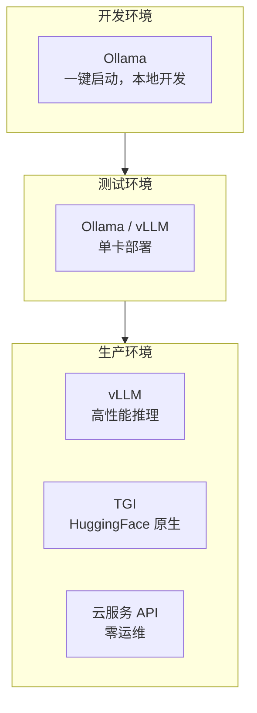
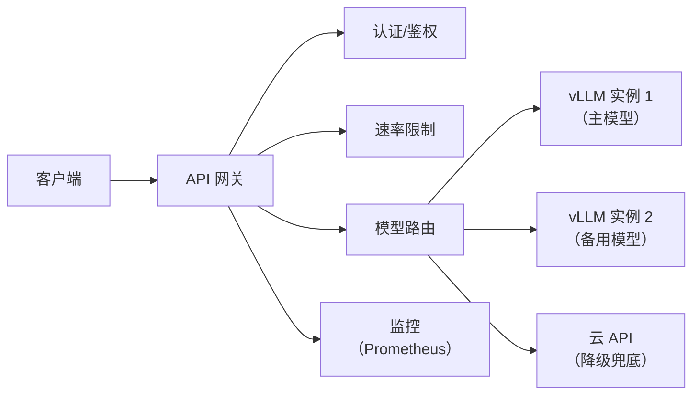

# 模型服务化部署方案

> **创建日期：** 2026-06-06
> **前置知识：** LLM 基础

---

## 一、部署方案对比

| 方案 | 适用阶段 | 性能 | 运维成本 | GPU 需求 |
|------|----------|------|----------|----------|
| **Ollama** | 开发/小规模 | 中 | ⭐ 极低 | 消费级 GPU |
| **vLLM** | 生产 | ⭐⭐⭐⭐⭐ | ⭐⭐⭐ | A100/H100 |
| **TGI** | 生产 | ⭐⭐⭐⭐ | ⭐⭐⭐ | A100/H100 |
| **云服务 API** | 生产 | 取决于服务商 | 零 | 不需要 |

---

## 二、量化技术

量化通过降低模型精度来减少显存占用和提升推理速度：

| 技术 | 精度 | 显存节省 | 速度提升 | 质量损失 |
|------|------|----------|----------|----------|
| **FP16** | 半精度 | ~50% | ~1.5x | 极小 |
| **INT8** | 8bit | ~75% | ~2x | 很小 |
| **INT4 (AWQ/GPTQ)** | 4bit | ~87% | ~3x | 可接受 |
| **GGUF (Q4_K_M)** | 混合精度 | ~80% | ~2.5x | 较小 |

---

## 三、GPU 选型与成本估算

| GPU | 显存 | 适用模型 | 月租（云） | 适用场景 |
|-----|------|----------|-----------|----------|
| RTX 4090 | 24GB | 7B-13B 量化模型 | ¥3000-5000 | 开发/小规模 |
| A100 40GB | 40GB | 13B-30B | ¥8000-12000 | 中等规模 |
| A100 80GB | 80GB | 70B 量化 | ¥12000-18000 | 大规模生产 |
| H100 80GB | 80GB | 70B+ | ¥15000-25000 | 高性能场景 |

---

## 四、API 网关设计

**网关核心功能：**
- **认证鉴权**：API Key 验证、权限控制
- **速率限制**：按用户/应用限制 QPS
- **模型路由**：根据请求类型路由到不同模型
- **降级策略**：主模型不可用时切换到备用
- **监控告警**：延迟、错误率、Token 消耗

---

## 五、面试高频题

### Q1: Ollama 和 vLLM 的区别是什么？各适用什么场景？

**详细答案：** Ollama 和 vLLM 的核心区别在于定位和性能。Ollama 是一个面向开发者的本地模型运行工具，设计目标是"极简、一键启动"，让开发者能在本地快速运行和测试模型。它支持通过 `ollama pull qwen2.5:7b` 一键下载模型，通过 `ollama run qwen2.5:7b` 一键启动，自动处理模型下载、量化（GGUF 格式）、GPU 分配等。Ollama 的性能中等，适合开发和小规模使用，但不适合高并发生产环境。

vLLM 是一个高性能的生产级推理引擎，设计目标是"极致的推理性能"。它的核心优势是 PagedAttention 技术（将 KV Cache 像操作系统分页一样管理，显存利用率提升 2-4 倍）和 Continuous Batching（动态批处理，请求即到即处理，无需等待凑批）。vLLM 的性能在开源推理引擎中是最强的，但部署和配置比 Ollama 复杂，需要手动管理模型路径、GPU 显存分配、推理参数等。

选择建议：开发阶段、个人项目、小规模部署（<10 QPS）使用 Ollama，简单高效；生产环境、高并发（>10 QPS）、大模型推理使用 vLLM。两者可以互补：开发时用 Ollama 快速验证模型效果，生产时用 vLLM 部署。另一个常见选择是 TGI（Text Generation Inference），它是 HuggingFace 的原生推理引擎，性能介于 Ollama 和 vLLM 之间，与 HuggingFace 生态集成最好。

### Q2: 常见的量化技术有哪些？AWQ/GPTQ/GGUF 的区别是什么？

**详细答案：** 量化技术通过降低模型参数的精度来减少显存占用和提升推理速度，常见的量化技术包括 FP16、INT8、INT4 和 GGUF。FP16（半精度浮点）是最基础的量化，将模型从 FP32 转换为 FP16，显存节省约 50%，速度提升约 1.5 倍，质量损失极小，几乎无感知。INT8（8 位整数量化）显存节省约 75%，速度提升约 2 倍，质量损失很小，适合大多数场景。

AWQ（Activation-aware Weight Quantization）和 GPTQ（GPT Post-Training Quantization）都是 INT4 量化技术，显存节省约 87%，速度提升约 3 倍。两者的核心区别在于量化方法：AWQ 基于激活值感知，保留对激活值影响大的权重通道的精度，适合推理场景；GPTQ 基于逐层量化，通过校准数据集最小化量化误差，适合需要一次性量化的场景。AWQ 通常比 GPTQ 更快，但 GPTQ 的质量略好。

GGUF（GPT-Generated Unified Format）是 llama.cpp 项目使用的量化格式，支持多种混合精度（如 Q4_K_M、Q5_K_M），显存节省约 80%，速度提升约 2.5 倍。GGUF 的核心优势是格式通用、CPU 推理友好、支持多种硬件（CPU/GPU/Apple Silicon），适合本地开发和边缘部署。选择建议：vLLM 部署优先用 AWQ（速度快）；质量敏感场景优先用 GPTQ；本地开发和 Ollama 使用 GGUF；如果 GPU 显存充裕，FP16 是最佳选择（质量无损）。

### Q3: 如何估算模型部署的 GPU 需求？显存怎么算？

**详细答案：** 估算模型部署的 GPU 需求需要考虑三个部分的显存占用：模型参数、KV Cache 和推理框架开销。模型参数显存的计算公式是：`参数量 × 每个参数的字节数`。例如，一个 7B 参数的模型，FP16 精度下每个参数 2 字节，模型参数显存 = 7B × 2 = 14GB；INT8 精度下每个参数 1 字节，显存 = 7GB；INT4 精度下每个参数 0.5 字节，显存 = 3.5GB。这是显存占用的主要部分。

KV Cache 显存的计算公式是：`2 × 层数 × 隐藏维度 × 最大序列长度 × 批大小 × 每个元素的字节数`。以 Llama-7B 为例（32 层、隐藏维度 4096），最大序列长度 4096、批大小 8、FP16 精度下，KV Cache = 2 × 32 × 4096 × 4096 × 8 × 2 = 约 16GB。KV Cache 在实际使用中占比很大，且随序列长度和批大小线性增长。PagedAttention 等优化技术可以显著减少 KV Cache 的浪费。

推理框架开销通常占 5-10%，包括框架本身的显存占用、临时缓冲区等。综合来说，7B 模型 FP16 推理至少需要 14GB（参数）+ 16GB（KV Cache）+ 3GB（开销）= 33GB 显存，建议使用 A100 40GB 或以上。快速估算公式：模型参数显存（GB）≈ 参数量（B）× 精度字节数（FP16=2, INT8=1, INT4=0.5），总显存 ≈ 模型参数显存 × 2 ~ 2.5（为 KV Cache 和开销留余量）。量化后，7B INT4 模型只需要约 10GB 显存，可用 RTX 4090（24GB）运行。

### Q4: API 网关在模型服务化中的作用是什么？

**详细答案：** API 网关在模型服务化中扮演着"统一入口"的角色，核心功能包括以下五个方面。第一，认证鉴权：统一管理 API Key 的生成、验证和权限控制，支持按用户/应用/模型级别的细粒度权限管理。没有网关时，每个模型实例都需要独立实现认证逻辑，增加了重复开发和配置出错的概率。

第二，速率限制（Rate Limiting）：按用户/应用/API Key 限制请求频率（QPS），防止某个用户过度使用资源影响其他用户。可以设置多级限制：全局限制（整个服务的 QPS）、用户级限制（单个用户的 QPS）、模型级限制（单个模型的 QPS）。第三，模型路由：根据请求类型（文本生成、代码生成、嵌入等）和优先级将请求路由到不同的模型实例。例如，简单问题路由到 7B 小模型（成本低），复杂问题路由到 72B 大模型（质量高），实现"智能路由"。

第四，降级策略：当主模型不可用（过载、故障）时，自动切换到备用模型或云 API，确保服务不中断。降级策略包括：主模型 -> 备用模型 -> 云 API 的多级降级。第五，监控告警：统一收集所有模型调用的指标（延迟、错误率、Token 消耗、QPS），对接 Prometheus + Grafana 进行可视化和告警。网关还可以实现请求日志记录、审计追踪、A/B 测试（将流量分流到不同模型版本对比效果）等高级功能。在架构设计上，网关通常使用 Nginx/Kong/APISIX 等成熟方案，配合自定义插件实现 AI 特定的功能。

### Q5: 如何设计模型服务的高可用方案？

**详细答案：** 模型服务的高可用方案需要从多个层面设计。第一，多实例部署：每个模型至少部署 2 个实例（主备或负载均衡），分布在不同的 GPU 节点上（甚至不同的可用区），避免单点故障。使用负载均衡（如 Nginx upstream）将请求分发到多个实例，当一个实例故障时自动摘除。第二，健康检查与自动恢复：每个模型实例提供健康检查接口（如 `/health`），负载均衡定期检查实例状态，发现不健康实例自动摘除并触发告警。配合 Kubernetes 的 liveness/readiness probe 和自动重启机制，实现故障自愈。

第三，多级降级策略：主模型 -> 备用模型（同类型小模型）-> 云 API（如 OpenAI API），确保在任何情况下都有可用的模型服务。降级触发条件包括：超时、错误率超过阈值、实例全部不可用。第四，熔断机制：当某个模型实例的错误率超过阈值时，自动熔断（暂时停止向该实例发送请求），防止级联故障。熔断后进入半开状态，定期尝试发送少量请求检测恢复情况。

第五，请求队列与削峰填谷：当请求量超过模型处理能力时，将请求放入队列缓冲，避免直接拒绝请求。配合异步处理，非实时请求可以在低峰期处理。第六，数据持久化与灾备：模型文件、配置文件、向量数据库等需要定期备份，支持快速恢复到新节点。第七，监控告警：设置关键指标（延迟 P99、错误率、QPS、GPU 利用率、显存使用率）的告警阈值，确保问题及时发现。综合来看，高可用方案的核心是"冗余 + 自动切换 + 降级兜底"，任何一个环节都不能有单点。

### Q6: 模型服务化部署中，自建 GPU 集群和云服务 API 如何选择？

**详细答案：** 自建 GPU 集群和云服务 API 的选择是一个典型的"买 vs 租"决策，需要从成本、控制力、灵活性、运维等多个维度综合评估。自建 GPU 集群的优势是：长期成本低（如果使用率高），对模型和推理参数有完全的控制权，数据不出企业网络（数据安全合规），可以自由选择模型和框架。缺点是：前期投入大（GPU 采购成本高），运维复杂（需要管理硬件、驱动、CUDA、推理框架等），弹性扩展能力弱（GPU 资源固定，无法应对突发流量）。

云服务 API（如 OpenAI、Claude、文心、通义）的优势是：零运维、弹性扩展、按量付费（前期成本低）、快速上线（无需等待硬件采购和部署）。缺点是：长期成本高（如果使用量大），数据需要传输到第三方（可能存在数据安全风险），受限于云服务商提供的模型和参数，无法定制推理策略。混合方案是当前企业的主流选择：敏感数据和核心业务使用自建集群（数据安全），非敏感场景和弹性需求使用云 API（灵活性），既保证数据安全，又获得弹性扩展能力。

选择建议：如果数据安全合规要求高（如金融、医疗、政务），优先自建集群；如果使用量小且波动大（如初创公司、内部工具），优先云 API；如果使用量大且稳定（如大型客服系统、内容审核），自建集群长期成本更低；如果技术团队能力有限，优先云 API（减少运维负担）。实际中很多企业采用"自建集群为主 + 云 API 为弹性补充"的混合方案，兼顾成本、安全和灵活性。