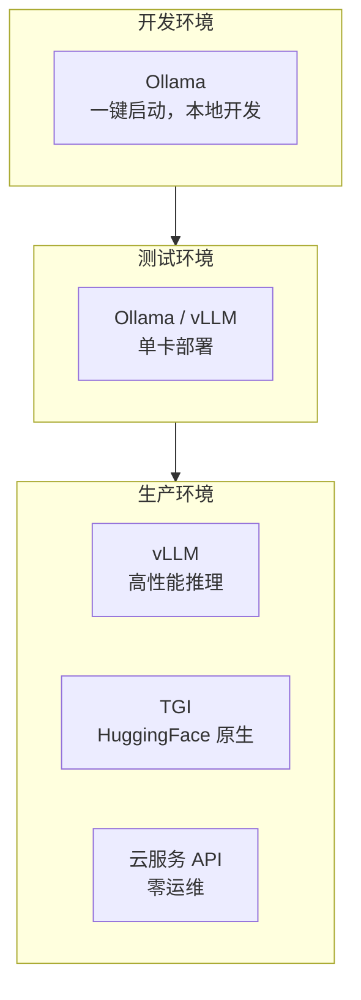
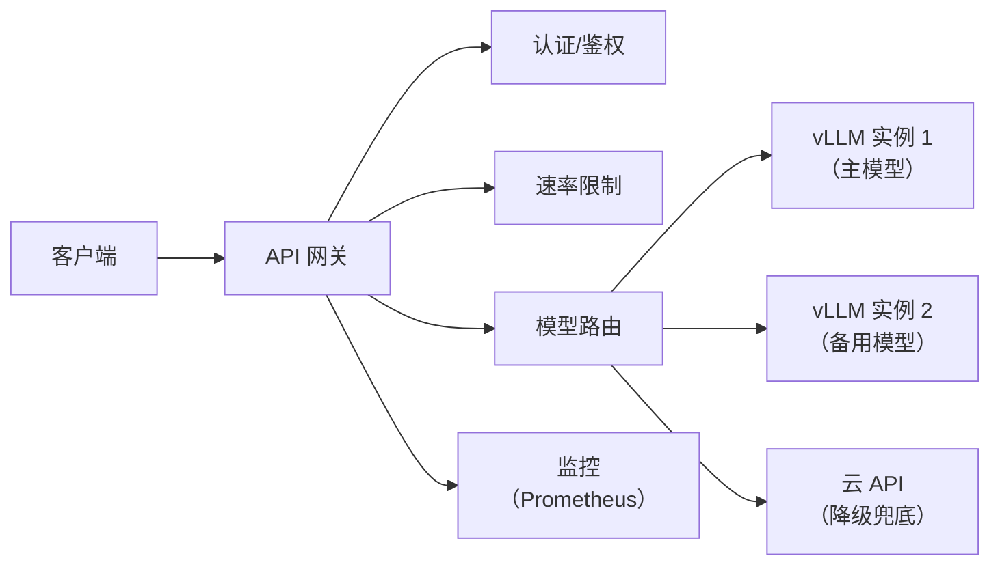

# 模型服务化部署方案

> **创建日期：** 2026-06-06
> **前置知识：** LLM 基础

---

## 一、部署方案对比

| 方案 | 适用阶段 | 性能 | 运维成本 | GPU 需求 |
|------|----------|------|----------|----------|
| **Ollama** | 开发/小规模 | 中 | ⭐ 极低 | 消费级 GPU |
| **vLLM** | 生产 | ⭐⭐⭐⭐⭐ | ⭐⭐⭐ | A100/H100 |
| **TGI** | 生产 | ⭐⭐⭐⭐ | ⭐⭐⭐ | A100/H100 |
| **云服务 API** | 生产 | 取决于服务商 | 零 | 不需要 |

---

## 二、量化技术

量化通过降低模型精度来减少显存占用和提升推理速度：

| 技术 | 精度 | 显存节省 | 速度提升 | 质量损失 |
|------|------|----------|----------|----------|
| **FP16** | 半精度 | ~50% | ~1.5x | 极小 |
| **INT8** | 8bit | ~75% | ~2x | 很小 |
| **INT4 (AWQ/GPTQ)** | 4bit | ~87% | ~3x | 可接受 |
| **GGUF (Q4_K_M)** | 混合精度 | ~80% | ~2.5x | 较小 |

---

## 三、GPU 选型与成本估算

| GPU | 显存 | 适用模型 | 月租（云） | 适用场景 |
|-----|------|----------|-----------|----------|
| RTX 4090 | 24GB | 7B-13B 量化模型 | ¥3000-5000 | 开发/小规模 |
| A100 40GB | 40GB | 13B-30B | ¥8000-12000 | 中等规模 |
| A100 80GB | 80GB | 70B 量化 | ¥12000-18000 | 大规模生产 |
| H100 80GB | 80GB | 70B+ | ¥15000-25000 | 高性能场景 |

---

## 四、API 网关设计

**网关核心功能：**
- **认证鉴权**：API Key 验证、权限控制
- **速率限制**：按用户/应用限制 QPS
- **模型路由**：根据请求类型路由到不同模型
- **降级策略**：主模型不可用时切换到备用
- **监控告警**：延迟、错误率、Token 消耗

---

## 五、面试重点

::: warning 高频考点
1. **Ollama 和 vLLM 的区别？** 各适用什么场景？
2. **常见的量化技术有哪些？** AWQ/GPTQ/GGUF 的区别？
3. **如何估算模型部署的 GPU 需求？** 显存怎么算？
4. **API 网关在模型服务化中的作用？**
5. **如何设计模型服务的高可用方案？**
:::