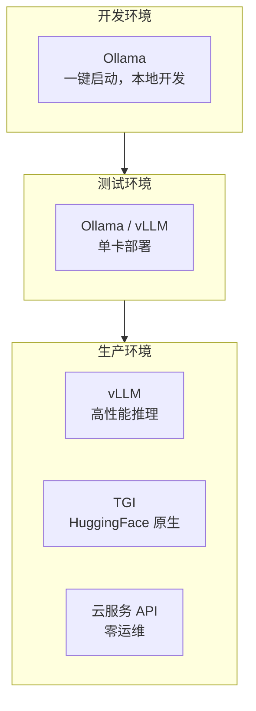
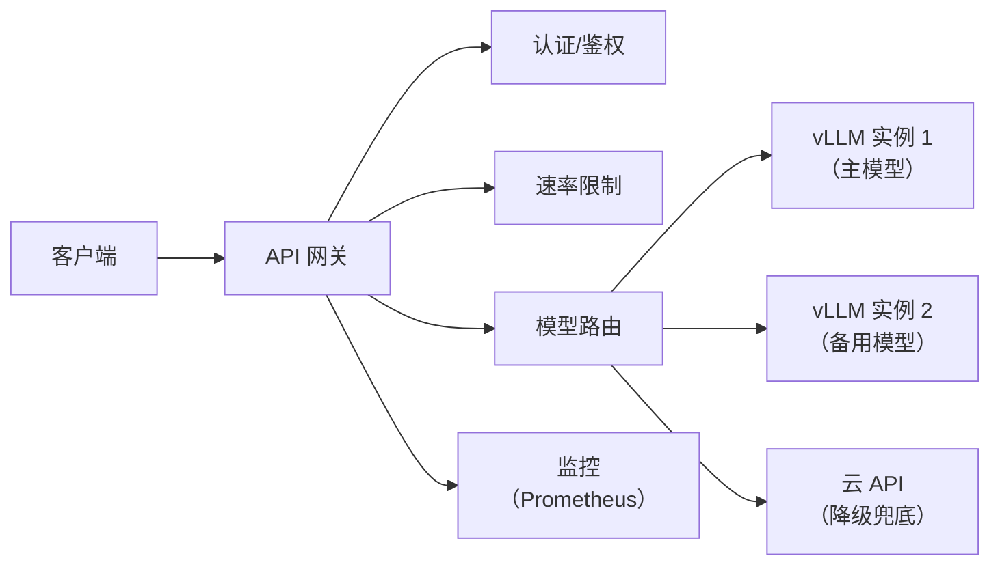

# 模型服务化部署方案

> **创建日期：** 2026-06-06
> **前置知识：** LLM 基础

---

## 一、部署方案对比

| 方案 | 适用阶段 | 性能 | 运维成本 | GPU 需求 |
|------|----------|------|----------|----------|
| **Ollama** | 开发/小规模 | 中 | ⭐ 极低 | 消费级 GPU |
| **vLLM** | 生产 | ⭐⭐⭐⭐⭐ | ⭐⭐⭐ | A100/H100 |
| **TGI** | 生产 | ⭐⭐⭐⭐ | ⭐⭐⭐ | A100/H100 |
| **云服务 API** | 生产 | 取决于服务商 | 零 | 不需要 |

---

## 二、量化技术

量化通过降低模型精度来减少显存占用和提升推理速度：

| 技术 | 精度 | 显存节省 | 速度提升 | 质量损失 |
|------|------|----------|----------|----------|
| **FP16** | 半精度 | ~50% | ~1.5x | 极小 |
| **INT8** | 8bit | ~75% | ~2x | 很小 |
| **INT4 (AWQ/GPTQ)** | 4bit | ~87% | ~3x | 可接受 |
| **GGUF (Q4_K_M)** | 混合精度 | ~80% | ~2.5x | 较小 |

---

## 三、GPU 选型与成本估算

| GPU | 显存 | 适用模型 | 月租（云） | 适用场景 |
|-----|------|----------|-----------|----------|
| RTX 4090 | 24GB | 7B-13B 量化模型 | ¥3000-5000 | 开发/小规模 |
| A100 40GB | 40GB | 13B-30B | ¥8000-12000 | 中等规模 |
| A100 80GB | 80GB | 70B 量化 | ¥12000-18000 | 大规模生产 |
| H100 80GB | 80GB | 70B+ | ¥15000-25000 | 高性能场景 |

---

## 四、API 网关设计

**网关核心功能：**
- **认证鉴权**：API Key 验证、权限控制
- **速率限制**：按用户/应用限制 QPS
- **模型路由**：根据请求类型路由到不同模型
- **降级策略**：主模型不可用时切换到备用
- **监控告警**：延迟、错误率、Token 消耗

---

## 五、面试高频题

### Q1: Ollama 和 vLLM 的区别是什么？各适用什么场景？

**详细答案：** 我们团队两个都用过，现在分工很明确。Ollama 是开发环境的神器——执行 `ollama pull qwen2.5:7b` 一条命令模型就拉好了，不用折腾 CUDA 版本、不用配环境变量，本地改 prompt 调试特别方便。但说实话，Ollama 只适合开发和小规模用。我们在测试环境用 Ollama 跑 Qwen2.5-7B，单卡 4090，并发到 5 个请求 P99 就飙到 8 秒——因为它用的是 llama.cpp 的后端，没有 PagedAttention 那种显存优化，KV Cache 利用率低。

vLLM 是真正能打生产的东西。它的 PagedAttention 把 KV Cache 像内存分页一样管理，显存利用率比 Ollama 高了 2-3 倍。最关键是 Continuous Batching——传统批处理要等一批请求凑齐才推理（Ollama 就是这样），vLLM 是来一个处理一个，GPU 利用率能跑到 80-90%。我们生产用 vLLM 部署 Qwen2.5-32B-AWQ，在 A100 80GB 上单卡跑，QPS 能撑到 120，P99 延迟 2.5 秒，比 Ollama 强了一个数量级。但也有代价——vLLM 的部署配置比 Ollama 麻烦多了，需要自己指定 `--max-model-len`、`--gpu-memory-utilization`、`--max-num-seqs` 这些参数，刚上手调参调了两天。另外提一下 TGI，我们试过但放弃了，主要原因是 HuggingFace 生态绑太紧，我们要接 Qwen 这种非 HF 原生模型有一些兼容问题。

### Q2: 常见的量化技术有哪些？AWQ/GPTQ/GGUF 的区别是什么？

**详细答案：** 我们生产线上三种都用过，简单说一下区别吧。AWQ 和 GPTQ 都是 INT4 量化，都是为 vLLM 这种高性能推理引擎设计的；GGUF 是 llama.cpp/Ollama 的格式，主要给本地开发用。

AWQ 和 GPTQ 的核心差异在量化策略上。AWQ 是"激活感知"，它会分析权重对激活的影响，保留影响大的那些权重的精度，所以推理速度通常比 GPTQ 快一些。GPTQ 是逐层量化，找最小化输出误差的方案，精度损失比 AWQ 略小一丢丢，但速度稍慢。我们现在线上用的 Qwen2.5-32B 是 AWQ 量化，因为 vLLM 对 AWQ 优化更好，吞吐量比同参数的 GPTQ 高了大概 15%。

GGUF 我主要在开发阶段用它。Ollama 一键拉模型就是 GGUF，Q4_K_M 量化是比较均衡的选择，质量损失很小，显存占用也控制得不错。比如 Qwen2.5-7B Q4_K_M 只需要不到 5GB 显存，4090 上就能跑。但 GGUF 不适合高并发生产，主要是 vLLM 不原生支持，得通过第三方引擎，性能掉得厉害。选择上记住一句话就行：生产 vLLM 用 AWQ，追求极致精度用 GPTQ，本地开发 Ollama 用 GGUF，显存够就直接 FP16（反正不会错）。

### Q3: 如何估算模型部署的 GPU 需求？显存怎么算？

**详细答案：** 我们早期就踩过显存不够的坑——直接用 FP16 的 Qwen-14B 往 24GB 显存的 4090 上部署，启动就 OOM，连出错信息都没打完整。显存主要分三块：模型权重占大头，KV Cache 占第二大块，推理框架开销占个 10% 左右。模型权重的计算公式很简单：参数量 x 每个参数的字节数。FP16 每个参数 2 字节，INT4 是 0.5 字节。比如 7B FP16 就是 14GB，INT4 就是 3.5GB。

KV Cache 是部署时最容易漏算的部分。我们上线 Qwen2.5-32B-AWQ 时，模型本身只有 16GB（INT4），但 KV Cache 在请求多了之后能吃掉 20-30GB 显存。特别是用户聊天场景，一个用户的上下文是 4096 token，同时 20 个并发，KV Cache 轻轻松松几十 GB。这也是为什么 vLLM 的 PagedAttention 这么重要——它能自动回收空闲的 KV Cache 块，利用率能到 96% 以上。

实际经验：我们现在的配置是 A100 80GB 跑 32B AWQ 模型，模型权重 16GB，留 50GB 给 KV Cache 存 128 个序列，再加几 GB overhead，刚好跑满。如果用小一点的模型比如 7B INT4，4090 24GB 就够用了。快速估算的话，总显存 = 模型权重显存 x 2.5 左右，基本靠谱。还有一个容易被忽略的点：`max-model-len` 也就是最大输入长度，设得越大 KV Cache 占得越多。我们之前设了 32768，后来分析日志发现 95% 的用户输入不超过 4096 token，砍到 8192 直接省了 15GB 显存。

### Q4: API 网关在模型服务化中的作用是什么？

**详细答案：** API 网关在我们模型服务架构里就是"大门"——所有流量必经之地，统一做各种横切关注点。最最重要的功能就是速率限制。我们上线第一个版本时没做用户级限流，结果有个测试同事写了个循环脚本压测，把整站 QPS 打满了，其他正常用户都没法用。后来我们在网关上做了全局限流（整个服务不超过 200 QPS）+ 用户级限流（每个用户每分钟不超过 120 次），这种坑再也没出过。

另一个核心功能是模型路由。我们现在是分级路由：问题先过意图分类，如果是普通 FAQ，直接路由到 7B Qwen，延迟低、成本低；如果是复杂的售后问题，再转给 32B 模型，回答质量更好。这样成本比全用 32B 低了 60%，体验差不了多少。降级兜底也得网关做——主模型节点挂了，网关自动切到备用节点，如果备用也挂了，自动降级到 OpenAI API，保证客服系统不宕机。

监控告警也在网关这里统一打点——我们把每个请求的延迟、错误率、Token 消耗全打给 Prometheus，Grafana 一看就知道现在业务情况怎么样。有一次我们发现错误率突然从 0.1% 升到 5%，一看监控就是其中一个 GPU 节点显存不够开始 OOM，两分钟就定位问题切流量走备用了。我们现在用的 APISIX 做网关，写点 Lua 插件就能搞定模型路由和限流，比自己从头写省了不少事。

### Q5: 如何设计模型服务的高可用方案？

**详细答案：** 我们在生产上吃过高可用不够的亏——之前单节点跑 32B 模型，某天夜里 GPU 驱动崩了，客服系统停了两个小时才找到人起来重启。现在我们总结下来，模型服务高可用的核心就是"冗余 + 自动切换 + 降级兜底"，每个环节都不能有单点。

我们现在每个模型至少两个实例跑在不同 K8s 节点上，Nginx 做负载均衡，K8s 配了 liveness probe，如果实例死了会自动删掉重建，半小时内能自愈。最关键的是多级降级——我们主模型是 Qwen2.5-32B 跑在自建集群，如果两个实例都挂了，自动切到 Qwen2.5-7B 备用，要是自建集群整个崩了，最后降级到 OpenAI GPT-4o-mini API。所以至今没有出现过完全不可用的情况。

还有一个很重要的点是熔断机制。我们用了 Hystrix 风格的熔断，如果某个实例错误率超过 10%，直接熔断五分钟，不让请求过去，防止把整个集群拖垮。监控告警也得跟上——我们设置了 P99 延迟超过 5 秒告警、错误率超过 2% 告警、GPU 显存超过 90% 告警，飞书群里五分钟就能收到通知。这么一套下来，我们最近大半年只有一次五分钟的中断，可用性在 99.9% 以上。

### Q6: 模型服务化部署中，自建 GPU 集群和云服务 API 如何选择？

**详细答案：** 我们当时也很纠结这个问题——自建 GPU 集群还是直接用 OpenAI API。最后选了"混合方案"，现在回头看这个决策是对的。我们核心客服场景用的是自建集群，两台 A100 80GB 跑 vLLM + Qwen2.5-32B-AWQ，QPS 峰值大概在 120 左右。按 OpenAI GPT-4o 的价格算，我们每天的 Token 消耗如果全走 API 的话大概要 300-400 块一天、一个月小一万。自建的硬件成本虽然前期高，但算下来 ROI 大概 6 个月回本，长期更划算。

但数据安全是比成本更重要的因素。我们处理的客服数据里有用户订单号、联系方式这些敏感信息，绝对不允许传到第三方平台上，这个合规要求直接就决定了核心链路必须自建。不过自建也有代价——GPU 故障、CUDA 版本兼容、驱动升级这些事很消耗精力。我们有一次 CUDA 版本升级后 vLLM 直接启动不了，排查了一天发现是新版驱动和 vLLM 某个依赖冲突，最后降级驱动才恢复。

所以我们现在的策略是：核心链路（客服对话、内部敏感数据）走自建集群；非核心链路（比如内部的文档摘要、周报生成、代码辅助）直接用云 API，没必要自己维护。高峰期间自建集群扛不住流量就动态扩容走 OpenAI API 兜底。总结一句话：敏感数据自建，非敏感用 API；高频自建，低频用 API；团队有运维能力就自建，没人折腾就乖乖用 API。