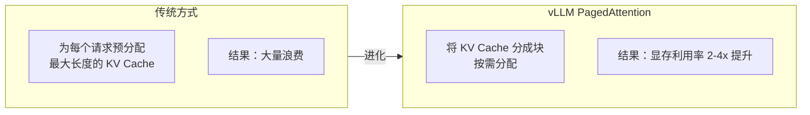

# vLLM 生产部署

> **创建日期：** 2026-06-06
> **前置知识：** 模型部署概述

---

## 一、vLLM 核心优势

vLLM 是目前**性能最强**的开源 LLM 推理引擎。

| 特性 | 说明 |
|------|------|
| **PagedAttention** | 管理 KV Cache 像操作系统管理内存一样，显存利用率提升 2-4 倍 |
| **Continuous Batching** | 动态批处理，请求即到即处理，不需等待凑批 |
| **OpenAI 兼容 API** | 开箱即用，无缝替换 OpenAI API |
| **量化支持** | AWQ、GPTQ、FP8 等多种量化方式 |
| **多卡推理** | 支持张量并行（Tensor Parallelism）跨多 GPU |

---

## 二、安装与启动

```bash
# 安装 vLLM
pip install vllm

# 启动服务（以 Qwen2.5-7B 为例）
python -m vllm.entrypoints.openai.api_server \
    --model Qwen/Qwen2.5-7B-Instruct \
    --host 0.0.0.0 \
    --port 8000 \
    --max-model-len 8192 \
    --gpu-memory-utilization 0.9
```

关键参数：

| 参数 | 说明 | 推荐值 |
|------|------|--------|
| `--model` | 模型路径或 HuggingFace ID | - |
| `--max-model-len` | 最大上下文长度 | 按需设置 |
| `--gpu-memory-utilization` | GPU 显存使用率 | 0.85~0.95 |
| `--tensor-parallel-size` | 张量并行 GPU 数量 | 卡数 |
| `--quantization` | 量化方式 | awq / gptq / fp8 |

---

## 三、PagedAttention 原理



**类比理解：** 传统方式像给每个程序分配固定大小的内存（浪费）；PagedAttention 像操作系统的虚拟内存（按需分配）。

---

## 四、性能调优

| 优化项 | 方法 | 效果 |
|--------|------|------|
| **量化** | `--quantization awq` | 显存减半，速度翻倍 |
| **Prefix Caching** | `--enable-prefix-caching` | 相同 Prefix 复用 KV Cache |
| **Chunked Prefill** | `--enable-chunked-prefill` | 大请求不阻塞小请求 |
| **多卡并行** | `--tensor-parallel-size 4` | 大模型跨多卡 |

---

## 五、Docker 部署

```yaml
# docker-compose.yml
version: '3.8'
services:
  vllm:
    image: vllm/vllm-openai:latest
    command: >
      --model Qwen/Qwen2.5-7B-Instruct
      --host 0.0.0.0
      --port 8000
    ports:
      - "8000:8000"
    volumes:
      - ./models:/root/.cache/huggingface
    deploy:
      resources:
        reservations:
          devices:
            - driver: nvidia
              count: 1
              capabilities: [gpu]
    environment:
      - NVIDIA_VISIBLE_DEVICES=all
```

---

## 六、面试高频题

### Q1: vLLM 的 PagedAttention 是什么？为什么能提升显存利用率？

**详细答案：** 在用 vLLM 之前，我们被 KV Cache 浪费显存的问题折磨得很惨。传统推理引擎的做法是：每个请求来的时候，按最大序列长度预分配一块连续的 KV Cache 空间。但实际上大多数用户的请求根本用不到那么长——我们统计过，95% 的客服对话不超过 1000 token，但 `max-model-len` 设了 8192，等于 87% 分配的显存是浪费的。10 个并发就顶天了。

PagedAttention 的核心就是把 KV Cache 从"整块分配"变成"分页分配"，这是从操作系统的虚拟内存抄过来的思路。KV Cache 被切成固定大小的 block（比如 16 个 token 一块），来一个请求就分配一个 block，不够了再追加，用完了就释放回空闲池。这样显存利用率从不到 50% 提到了 90% 以上。我们实测，同样一块 A100 80GB，用传统方式只能撑 20 个并发，换 vLLM 之后撑到了 80+ 个并发。还有一个场景特别受益：当两个用户共享同样的 system prompt 时（比如都是同一个客服场景），他们的 KV Cache block 可以直接共享，不用重复计算。这对 RAG 场景特别有用，因为 system prompt 通常是一个固定的大段模板。

### Q2: Continuous Batching 解决了什么问题？

**详细答案：** 我们最早在测试环境用 Ollama 时，就吃够了静态批处理的亏。静态批处理的工作方式是"等一批请求凑齐了再一起跑"，问题是——你永远不知道下一个请求什么时候来。而且凑好的一批里面，如果有一个请求生成了 2000 token 的长回复，其他九个请求早就结束了也要干等着，GPU 在那空转。我们测过，静态批处理下 GPU 利用率只有 30-40%，用户看到的 P99 延迟能到 10 秒以上。

Continuous Batching 从根本上改变了这个逻辑——"来一个处理一个，走一个腾一个位置"。vLLM 维护一个活跃请求池，每次推理步骤（生成一个 token）之后，扫描有没有新请求进来（加入池）、有没有请求完成（退出池），下一轮推理的 batch 就是当前池中的所有活跃请求。这样 GPU 就一直处于满负荷状态，不会因为等凑批而空转。我们上线 vLLM 后 GPU 利用率从 35% 飙到 85% 左右，QPS 提高了接近 3 倍。而且用户体验也好了——以前一个新请求可能要在队列里等 1-2 秒才被处理，现在几乎即时进池，P50 延迟从 3 秒降到了 1 秒以内。唯一要注意的是，`max-num-seqs`（最大并发序列数）设太高会导致每个序列分到的 KV Cache 太少，可能出现"运行中 OOM"的问题，我们调到 128 是经过压测得来的。

### Q3: vLLM 如何做多卡部署？张量并行是什么？

**详细答案：** 我们最早上线 Qwen2.5-32B 时直接用 FP16，单卡 A100 80GB 根本装不下（光模型权重就 64GB，KV Cache 还没算），直接就 OOM 了。后来靠张量并行（Tensor Parallelism, TP）解决的。TP 的核心思路就是把模型的大矩阵切到多张 GPU 上并行计算——比如一个线性层的权重矩阵 4096x4096，切两半就是两个 2048x4096，两张卡各算自己那份然后 AllReduce 合并。vLLM 里配置很简单，`--tensor-parallel-size 2` 就搞定了。

我们现在的配置是：Qwen2.5-32B-AWQ 用 `--tensor-parallel-size 2` 跑在两张 A100 80GB 上，模型权重 16GB（AWQ 量化后）加上 KV Cache，每张卡实际用 45GB 左右，留了 35GB 给 KV Cache。延迟方面，TP=2 比单卡（如果能装下）多了大约 10-15% 的通信开销，主要是 AllReduce 的代价，但 NVLink 加持下几乎不感知。

有个坑要提醒：张量并行要求 GPU 型号一致、最好通过 NVLink 连接（PCIe 带宽差很多，我们测过 PCIe 下 TP=2 通信开销会到 25%）。而且 TP 不是越多越好——我们试过 TP=4，通信开销反而让吞吐降了 20%，因为模型太小（32B），四张卡之间通信成了瓶颈。一般规则是：能用单卡就别多卡，单卡装不下（显存超限）才是用 TP 的正确时机。还有 Pipeline Parallelism 我们也试过，把不同层分到不同 GPU，但延迟会比 TP 大不少，适合超大模型（100B+）。

### Q4: vLLM 有哪些性能调优手段？

**详细答案：** 我们上线 vLLM 之后调优了大半个月，总结了几条最管用的。第一优先是这个顺序：**先量化、再调显存、最后开高级特性**。量化效果最立竿见影——把 Qwen2.5-32B 从 FP16 换成 AWQ INT4，显存从 64GB 砍到 16GB，QPS 直接翻倍。`--gpu-memory-utilization` 我们在 0.90 到 0.95 之间调了半天，设 0.95 时偶尔 OOM（特别是在流量尖峰时），最后定在 0.92 是最稳的。

`--enable-prefix-caching` 是我们意外之喜。我们客服系统的 System Prompt 大概 500 Token（角色设定 + 行为约束 + 知识引用规则），之前每次用户请求都把这段重新算一遍 KV Cache。开了 Prefix Caching 之后，同样的 System Prompt 只算一次，TTFT（首 Token 延迟）从 1.2 秒降到 600ms，效果约等于延迟减半。`--enable-chunked-prefill` 也非常实用——之前有用户贴了一大段聊天记录进来（2000+ Token），整个请求把其他小请求全堵住了；开了 Chunked Prefill 之后长请求被切碎交错执行，P99 延迟更稳定了。

还有一个容易被忽略的参数 `--max-model-len`。我们一开始设为 32768，想着"大点没坏处"，结果 KV Cache 占了大量显存。后来分析日志发现 95% 用户输入不超过 4096 Token，砍到 8192，直接省出 15GB 显存，让 `max-num-seqs` 从 64 提到 128，并发能力翻倍。所以调优不要盲目——先看业务数据再定参数。

### Q5: vLLM 和 TGI 的区别是什么？如何选择？

**详细答案：** 我们当初选型的时候两个都试过，最后选了 vLLM。核心原因就是性能——同样的 A100 80GB 跑 Qwen2.5-32B-AWQ，vLLM QPS 比 TGI 高了约 30%，P99 延迟低了 1 秒左右。主要是 PagedAttention 在显存利用上确实比 TGI 高效，我们实测下来显存利用率能到 85-90%，TGI 大概在 65-70%。

但 TGI 也有它的优点：HuggingFace 官方维护，和 HF Hub 生态集成特别好，支持很多 HF 原生特性，比如动态量化、模型流式下载这些开箱即用。vLLM 对一些小众 HF 模型的支持有时候需要折腾一下，比如 Qwen 早期版本我们碰到过兼容性问题，得改配置文件。我们选 vLLM 主要是因为我们业务压力大，必须把每张 GPU 榨到极限，追求极致吞吐就选 vLLM。

如果团队已经深度绑定 HuggingFace 生态，对性能要求不是特别极致，TGI 用起来会更省心，不需要调那么多参数。现在两者社区都挺活跃，都在快速迭代，性能差距也在缩小。我的建议就是：先跑个压测，看你的模型在两个引擎上各能跑出多少 QPS，选对你业务场景性价比最高的那个。

### Q6: vLLM 在生产环境中如何进行 Docker 化部署和运维？

**详细答案：** 我们生产环境就是官方镜像 `vllm/vllm-openai:latest` 跑在 Kubernetes 上，模型文件用 PVC 持久化。关键配置就是一定要声明 GPU 资源——Kubernetes 要先装 GPU Operator 和 NVIDIA Device Plugin，不然找不到 GPU。Docker Compose 适合测试环境，关键就是 `deploy.resources.reservations.devices` 那里指明 GPU 数量，然后把本地模型目录挂到容器里，这样不用每次重新下载模型。

运维上几个关键点。第一，健康检查一定要配，vLLM 有 `/health` 端点，我们配置了 liveness probe，如果 health 检查失败，Kubernetes 自动 kill pod 再重启，省得我们半夜起来看。第二，监控告警——vLLM 自带 Prometheus metrics 端点，我们把 QPS、延迟（P50/P99）、GPU 利用率、显存使用率都打到 Grafana，设置了几个告警：GPU 显存使用率超过 90% 告警、P99 延迟超过 5 秒告警、错误率超过 2% 告警。我们就靠这些告警在流量尖峰来之前扩容。

第三，滚动更新——我们用 Kubernetes 的 Rolling Update，每次发新版本都是逐台节点换，不中断服务。第四，模型更新——我们一般是启动新实例跑新模型，流量切过去再停旧实例，不依赖热加载，虽然麻烦点但更稳，毕竟热加载有时候会出显存泄漏。我们还有个经验：官方镜像已经预装好 CUDA 和所有依赖，不要自己瞎改 Dockerfile 重新装 CUDA，大概率会出兼容性问题。直接用官方镜像把模型挂进去就行，省很多事。