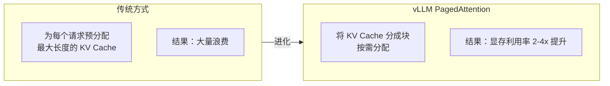

# vLLM 生产部署

> **创建日期：** 2026-06-06
> **前置知识：** 模型部署概述

---

## 一、vLLM 核心优势

vLLM 是目前**性能最强**的开源 LLM 推理引擎。

| 特性 | 说明 |
|------|------|
| **PagedAttention** | 管理 KV Cache 像操作系统管理内存一样，显存利用率提升 2-4 倍 |
| **Continuous Batching** | 动态批处理，请求即到即处理，不需等待凑批 |
| **OpenAI 兼容 API** | 开箱即用，无缝替换 OpenAI API |
| **量化支持** | AWQ、GPTQ、FP8 等多种量化方式 |
| **多卡推理** | 支持张量并行（Tensor Parallelism）跨多 GPU |

---

## 二、安装与启动

```bash
# 安装 vLLM
pip install vllm

# 启动服务（以 Qwen2.5-7B 为例）
python -m vllm.entrypoints.openai.api_server \
    --model Qwen/Qwen2.5-7B-Instruct \
    --host 0.0.0.0 \
    --port 8000 \
    --max-model-len 8192 \
    --gpu-memory-utilization 0.9
```

关键参数：

| 参数 | 说明 | 推荐值 |
|------|------|--------|
| `--model` | 模型路径或 HuggingFace ID | - |
| `--max-model-len` | 最大上下文长度 | 按需设置 |
| `--gpu-memory-utilization` | GPU 显存使用率 | 0.85~0.95 |
| `--tensor-parallel-size` | 张量并行 GPU 数量 | 卡数 |
| `--quantization` | 量化方式 | awq / gptq / fp8 |

---

## 三、PagedAttention 原理



**类比理解：** 传统方式像给每个程序分配固定大小的内存（浪费）；PagedAttention 像操作系统的虚拟内存（按需分配）。

---

## 四、性能调优

| 优化项 | 方法 | 效果 |
|--------|------|------|
| **量化** | `--quantization awq` | 显存减半，速度翻倍 |
| **Prefix Caching** | `--enable-prefix-caching` | 相同 Prefix 复用 KV Cache |
| **Chunked Prefill** | `--enable-chunked-prefill` | 大请求不阻塞小请求 |
| **多卡并行** | `--tensor-parallel-size 4` | 大模型跨多卡 |

---

## 五、Docker 部署

```yaml
# docker-compose.yml
version: '3.8'
services:
  vllm:
    image: vllm/vllm-openai:latest
    command: >
      --model Qwen/Qwen2.5-7B-Instruct
      --host 0.0.0.0
      --port 8000
    ports:
      - "8000:8000"
    volumes:
      - ./models:/root/.cache/huggingface
    deploy:
      resources:
        reservations:
          devices:
            - driver: nvidia
              count: 1
              capabilities: [gpu]
    environment:
      - NVIDIA_VISIBLE_DEVICES=all
```

---

## 六、面试高频题

### Q1: vLLM 的 PagedAttention 是什么？为什么能提升显存利用率？

**详细答案：** PagedAttention 是 vLLM 的核心创新，它借鉴了操作系统中虚拟内存的分页管理思想，将 KV Cache 的存储和管理方式从"连续预分配"改为"分页按需分配"。在传统的推理引擎中，每个请求到达时，系统会为该请求预分配一个固定大小的连续 KV Cache 空间（通常按最大序列长度分配）。这种方式的致命问题是：大多数请求的实际生成长度远小于最大长度，导致大量预分配的 KV Cache 空间被浪费。例如，如果最大序列长度设为 4096，但实际回答只有 500 个 token，那么 87% 的显存被浪费了。

PagedAttention 的解决方案是：将 KV Cache 切分为固定大小的"页"（Page），每个请求不再预分配连续的 KV Cache，而是按需分配页。当请求需要更多 KV Cache 时，从空闲页池中分配新页；当请求完成时，释放占用的页。这种方式类似于操作系统中的分页内存管理，显著减少了显存浪费。此外，PagedAttention 还支持页共享：当多个请求共享相同的 Prompt 前缀时，它们可以共享相同的 KV Cache 页，进一步减少显存占用。

PagedAttention 带来的实际效果是：显存利用率提升 2-4 倍，意味着同样的 GPU 可以处理更大的批大小（batch size）和更多的并发请求。在生产环境中，这意味着更高的吞吐量和更低的单位成本。这是 vLLM 性能远超其他推理引擎的关键原因。理解 PagedAttention 的关键是把握"连续分配"和"分页分配"的本质区别，以及操作系统内存管理思想在 AI 推理中的应用。

### Q2: Continuous Batching 解决了什么问题？

**详细答案：** Continuous Batching（连续批处理）解决了传统 Static Batching（静态批处理）的"排队等待"问题。在传统推理引擎中，批处理是这样工作的：收集一批请求 -> 凑够一个批次 -> 一起推理 -> 等待所有请求完成 -> 开始下一批。这种方式的致命问题是：一个批次中的某个请求如果生成长文本（如 2000 个 token），整个批次都需要等待它完成，即使其他请求已经结束了。这导致了 GPU 利用率低和请求延迟高。

Continuous Batching 的解决方案是：不再等待凑批，而是"即到即处理，即完即退出"。推理引擎维护一个活跃请求池，每个推理步骤（生成一个 token）后，检查是否有新请求到达（加入池中）和是否有请求完成（从池中移除）。GPU 始终以当前池中的所有请求组成批次进行推理，池的大小动态变化。这种方式使得 GPU 始终处于工作状态，不会因为等待某个慢请求而空闲。

Continuous Batching 带来的实际效果是：吞吐量提升 2-10 倍（取决于请求的混合情况），延迟降低（请求不需要等待凑批）。对于实际生产环境，用户的请求到达时间和生成长度都是随机的，Continuous Batching 能够最大化 GPU 利用率和最小化请求延迟。这是 vLLM 的另一个核心性能优势，与 PagedAttention 配合使用，共同构成了 vLLM 的高性能基础。

### Q3: vLLM 如何做多卡部署？张量并行是什么？

**详细答案：** vLLM 的多卡部署通过张量并行（Tensor Parallelism）实现，通过 `--tensor-parallel-size` 参数指定使用的 GPU 数量。张量并行的核心思想是：将模型的权重矩阵切分到多个 GPU 上，每个 GPU 只计算一部分，然后通过 GPU 之间的通信（如 NCCL）合并结果。具体来说，对于 Transformer 的每一层，权重矩阵被按列或按行切分到多个 GPU，每个 GPU 计算自己那部分，然后通过 AllReduce 操作同步结果。

张量并行的优势是：可以突破单 GPU 显存的限制，运行更大的模型。例如，一个 70B 的模型，FP16 精度下需要约 140GB 显存，单张 A100（80GB）无法运行，通过 2 卡张量并行，每张卡只需要约 70GB 显存，就可以运行了。张量并行的代价是 GPU 之间的通信开销，当 GPU 数量较少时（2-4 卡），通信开销可接受；当 GPU 数量较多时（8 卡以上），通信开销可能成为瓶颈。

vLLM 中多卡部署的配置：`--tensor-parallel-size 4` 表示使用 4 张 GPU 进行张量并行。注意：张量并行要求 GPU 型号相同（最好同型号同批次），并且通过 NVLink 或 PCIe 连接，NVLink 的通信带宽远高于 PCIe。此外，vLLM 还支持流水线并行（Pipeline Parallelism），将模型的不同层分配到不同 GPU，减少单卡显存压力但增加了延迟。对于大多数场景，张量并行是首选，因为它能有效减少单卡显存压力且延迟增加较少。

### Q4: vLLM 有哪些性能调优手段？

**详细答案：** vLLM 的性能调优手段可以分为几个层面。第一，量化：使用 `--quantization awq` 或 `--quantization gptq` 启用 INT4 量化，显存减半，速度翻倍，质量损失可接受。对于显存紧张或需要提升吞吐的场景，量化是最有效的优化手段。第二，显存管理：`--gpu-memory-utilization` 控制 GPU 显存使用率（推荐 0.85-0.95），设置过高可能导致 OOM，设置过低浪费显存；`--max-model-len` 限制最大序列长度，显存占用与序列长度成正比，根据业务需求设置合理的上限。

第三，Prefix Caching：`--enable-prefix-caching` 启用前缀缓存。当多个请求共享相同的 System Prompt 或类似的前缀时，它们的 KV Cache 被缓存复用，避免重复计算。在 RAG 场景中，System Prompt 通常很长且固定，Prefix Caching 可以节省 50% 以上的计算量。第四，Chunked Prefill：`--enable-chunked-prefill` 启用分块预填充。当一个大请求（长 Prompt）到达时，将其预填充分成多个小块交错执行，防止大请求长时间阻塞小请求的生成，改善延迟的公平性。

第五，调度策略：`--scheduler-delay-factor` 控制调度延迟因子，影响请求批处理的激进程度，值越大越倾向于等待更多请求组成更大的批次（吞吐优先），值越小越倾向于立即处理（延迟优先）。第六，多卡并行：`--tensor-parallel-size` 使用多 GPU 张量并行，突破单卡性能瓶颈。第七，KV Cache 精度：`--kv-cache-dtype` 可以设置为 auto/fp8，使用 FP8 存储 KV Cache 可以进一步减少显存占用。调优的一般策略是：先量化（效果最显著），再调显存参数，最后启用 Prefix Caching 和 Chunked Prefill 等高级特性。

### Q5: vLLM 和 TGI 的区别是什么？如何选择？

**详细答案：** vLLM 和 TGI（Text Generation Inference）是当前最主流的两个开源推理引擎，它们的核心区别在于性能、生态和特性。在性能方面，vLLM 的 PagedAttention 和 Continuous Batching 组合通常提供更高的吞吐量和更低的延迟，尤其是在高并发场景下。TGI 也支持 Continuous Batching 和 Flash Attention，但在显存管理上不如 PagedAttention 高效，整体性能略逊于 vLLM。

在生态方面，TGI 是 HuggingFace 官方推出的，与 HuggingFace Hub 生态无缝集成，模型下载、配置、部署流程更顺畅。vLLM 也支持 HuggingFace 模型，但集成度不如 TGI 原生。在特性方面，TGI 提供了更丰富的企业特性：内置的请求队列、水印机制（防止生成重复内容）、停止序列控制、日志概率输出等。vLLM 在性能优化上更激进，适合追求极致性能的场景。

选择建议：如果追求最高推理性能，优先选 vLLM；如果已经在 HuggingFace 生态中深度使用，且需要丰富的企业特性，优先选 TGI；如果两者性能差距不大（你的场景下），选择更熟悉的那一个。实际上，两者都在快速迭代，性能差距在缩小。另一个需要考虑的因素是社区支持：vLLM 的社区增长更快，问题修复和新特性更新更活跃。如果你的场景是标准化的文本生成，两个都可以；如果需要特定的高级特性，查看哪个引擎支持得更好。

### Q6: vLLM 在生产环境中如何进行 Docker 化部署和运维？

**详细答案：** vLLM 的 Docker 化部署是生产环境的标准做法。使用官方镜像 `vllm/vllm-openai:latest`，通过 Docker Compose 或 Kubernetes 编排。Docker Compose 部署的关键配置包括：GPU 资源声明（`deploy.resources.reservations.devices` 指定 GPU 数量和型号）、模型挂载（将本地模型目录挂载到容器的 HuggingFace 缓存路径）、端口映射、环境变量设置（如 `NVIDIA_VISIBLE_DEVICES`）。Kubernetes 部署需要额外配置 GPU Operator 和 NVIDIA Device Plugin，以及 PVC 持久化存储模型文件。

运维层面的关键实践：第一，健康检查，vLLM 提供 `/health` 和 `/v1/models` 端点，Kubernetes 的 liveness probe 和 readiness probe 应配置这些端点，确保服务健康。第二，日志管理，vLLM 的日志输出到 stdout，通过 Docker 的日志驱动或 Kubernetes 的日志收集（如 Fluentd、Loki）统一管理。第三，资源限制，设置 CPU 和内存的 limits/requests，防止容器资源泄漏影响节点。

第四，监控告警，对接 Prometheus + Grafana 监控 vLLM 的关键指标：请求延迟（P50/P95/P99）、吞吐量（tokens/s）、GPU 利用率、显存使用率、请求队列长度、错误率。vLLM 提供 Prometheus 格式的 metrics 端点。第五，自动扩缩容，基于 GPU 利用率或请求队列长度触发 HPA（Horizontal Pod Autoscaler），但需要注意 GPU 节点的限制。第六，灰度发布，使用 Kubernetes 的 Rolling Update 策略或 Istio 的流量分割，逐步将流量从旧版本切换到新版本，验证新版本稳定性。第七，模型热加载，vLLM 支持通过 API 动态加载新模型，无需重启服务，适合需要频繁切换模型的场景。