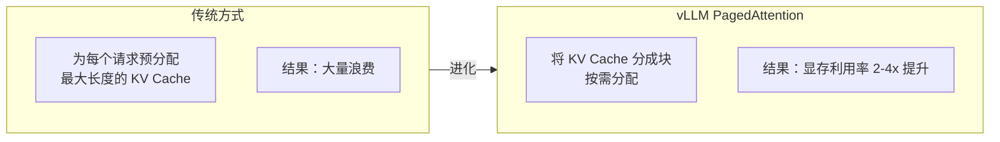

# vLLM 生产部署

> **创建日期：** 2026-06-06
> **前置知识：** 模型部署概述

---

## 一、vLLM 核心优势

vLLM 是目前**性能最强**的开源 LLM 推理引擎。

| 特性 | 说明 |
|------|------|
| **PagedAttention** | 管理 KV Cache 像操作系统管理内存一样，显存利用率提升 2-4 倍 |
| **Continuous Batching** | 动态批处理，请求即到即处理，不需等待凑批 |
| **OpenAI 兼容 API** | 开箱即用，无缝替换 OpenAI API |
| **量化支持** | AWQ、GPTQ、FP8 等多种量化方式 |
| **多卡推理** | 支持张量并行（Tensor Parallelism）跨多 GPU |

---

## 二、安装与启动

```bash
# 安装 vLLM
pip install vllm

# 启动服务（以 Qwen2.5-7B 为例）
python -m vllm.entrypoints.openai.api_server \
    --model Qwen/Qwen2.5-7B-Instruct \
    --host 0.0.0.0 \
    --port 8000 \
    --max-model-len 8192 \
    --gpu-memory-utilization 0.9
```

关键参数：

| 参数 | 说明 | 推荐值 |
|------|------|--------|
| `--model` | 模型路径或 HuggingFace ID | - |
| `--max-model-len` | 最大上下文长度 | 按需设置 |
| `--gpu-memory-utilization` | GPU 显存使用率 | 0.85~0.95 |
| `--tensor-parallel-size` | 张量并行 GPU 数量 | 卡数 |
| `--quantization` | 量化方式 | awq / gptq / fp8 |

---

## 三、PagedAttention 原理



**类比理解：** 传统方式像给每个程序分配固定大小的内存（浪费）；PagedAttention 像操作系统的虚拟内存（按需分配）。

---

## 四、性能调优

| 优化项 | 方法 | 效果 |
|--------|------|------|
| **量化** | `--quantization awq` | 显存减半，速度翻倍 |
| **Prefix Caching** | `--enable-prefix-caching` | 相同 Prefix 复用 KV Cache |
| **Chunked Prefill** | `--enable-chunked-prefill` | 大请求不阻塞小请求 |
| **多卡并行** | `--tensor-parallel-size 4` | 大模型跨多卡 |

---

## 五、Docker 部署

```yaml
# docker-compose.yml
version: '3.8'
services:
  vllm:
    image: vllm/vllm-openai:latest
    command: >
      --model Qwen/Qwen2.5-7B-Instruct
      --host 0.0.0.0
      --port 8000
    ports:
      - "8000:8000"
    volumes:
      - ./models:/root/.cache/huggingface
    deploy:
      resources:
        reservations:
          devices:
            - driver: nvidia
              count: 1
              capabilities: [gpu]
    environment:
      - NVIDIA_VISIBLE_DEVICES=all
```

---

## 六、面试重点

::: warning 高频考点
1. **vLLM 的 PagedAttention 是什么？** 为什么能提升显存利用率？
2. **Continuous Batching 解决了什么问题？**
3. **vLLM 如何做多卡部署？** 张量并行是什么？
4. **vLLM 有哪些性能调优手段？**
5. **vLLM 和 TGI 的区别？** 如何选择？
:::