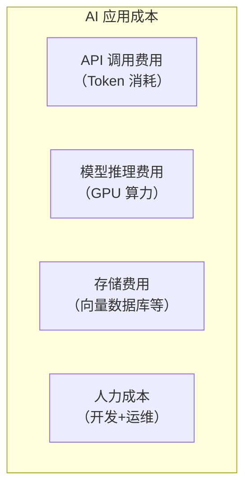
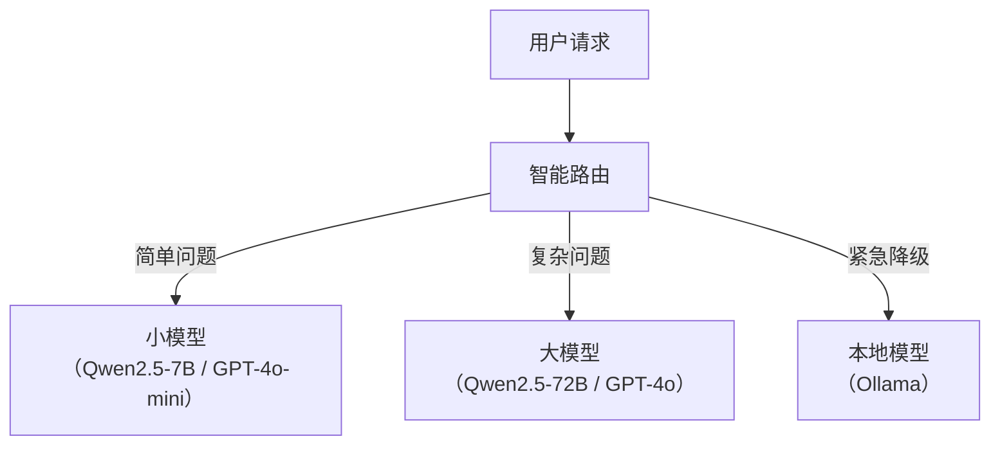

# AI 应用成本优化

> **创建日期：** 2026-06-06
> **前置知识：** LLM 基础、Token 概念、RAG

---

## 一、成本构成全景



**最大头通常是 API 调用费用**，占 60-80%。

---

## 二、Token 消耗监控

```python
# 实时监控 Token 消耗
def log_token_usage(response):
    usage = response.usage
    print(f"输入 Token: {usage.prompt_tokens}")
    print(f"输出 Token: {usage.completion_tokens}")
    print(f"总 Token: {usage.total_tokens}")

    # 累计统计
    daily_stats.add(usage.total_tokens)
    if daily_stats.exceeds_budget():
        alert("Token 消耗已超过预算")
```

---

## 三、Prompt 缓存策略

### 3.1 缓存原理

相同的 Prompt 前缀 + 相同的 System Prompt → 缓存 KV Cache，后续请求复用。

```python
# 利用 Prompt 缓存降低 50% 成本
def chat_with_cache(user_input, system_prompt):
    # 将 System Prompt 放在最前面
    messages = [
        {"role": "system", "content": system_prompt},  # 可缓存
        {"role": "user", "content": user_input}         # 不可缓存
    ]
    return llm.chat(messages)
```

### 3.2 缓存策略

| 缓存类型 | 说明 | 节省 |
|----------|------|------|
| **Prompt 缓存** | 缓存 System Prompt 的 KV Cache | 50% |
| **语义缓存（GPTCache）** | 相似问题返回缓存答案 | 80-90% |
| **结果缓存** | 完全相同的查询直接返回缓存 | 100% |

---

## 四、语义缓存（GPTCache）

```python
from gptcache import Cache
from gptcache.manager import get_data_manager
from gptcache.embedding import Onnx

# 初始化语义缓存
cache = Cache()
cache.init(
    data_manager=get_data_manager("sqlite", "faiss"),
    embedding_func=Onnx()
)

# 使用缓存
@cache.llm_cache
def ask_llm(question):
    return llm.generate(question)  # 相似问题直接返回缓存
```

---

## 五、模型降级与智能路由



```python
def smart_route(question):
    """根据问题复杂度选择模型"""
    complexity = estimate_complexity(question)
    if complexity < 0.3:
        return "gpt-4o-mini"       # 成本最低
    elif complexity < 0.7:
        return "gpt-4o"            # 中等成本
    else:
        return "gpt-4o"            # 高成本，复杂问题
```

---

## 六、Prompt 压缩

对长 Prompt 进行压缩，减少 Token 消耗：

```python
def compress_prompt(context, max_tokens=1000):
    """压缩 Prompt 上下文"""
    if count_tokens(context) <= max_tokens:
        return context

    # 策略1：截断
    return truncate_to_tokens(context, max_tokens)

    # 策略2：LLM 摘要
    # return llm.summarize(context, max_tokens=max_tokens)
```

---

## 七、批量处理优化

| 策略 | 说明 | 节省 |
|------|------|------|
| **批量 API 调用** | 合并多个请求为一次调用 | 20-30% |
| **异步处理** | 非实时请求放入队列异步处理 | 利用空闲时段 |
| **离线预计算** | 提前计算 Embedding 和摘要 | 减少实时计算 |

---

## 八、成本优化检查清单

| 优化项 | 预期节省 | 实施难度 |
|--------|----------|----------|
| Prompt 缓存 | 30-50% | ⭐ 低 |
| 语义缓存 | 50-80% | ⭐⭐ 中 |
| 模型降级路由 | 40-60% | ⭐⭐ 中 |
| Prompt 压缩 | 20-30% | ⭐ 低 |
| 批量处理 | 20-30% | ⭐⭐ 中 |
| 量化模型 | 30-50% | ⭐⭐⭐ 高 |

---

## 九、面试重点

::: warning 高频考点
1. **AI 应用成本主要由哪些构成？** 如何优化？
2. **Prompt 缓存和语义缓存的区别？** 各能节省多少？
3. **模型智能路由如何实现？** 复杂度判断怎么做？
4. **生产环境如何监控 Token 消耗？**
5. **成本优化和安全/质量的权衡？**
:::