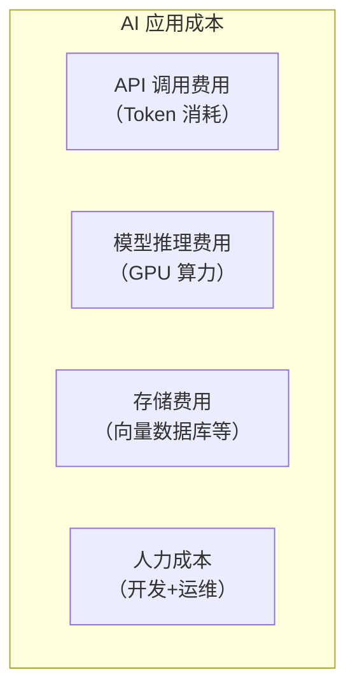
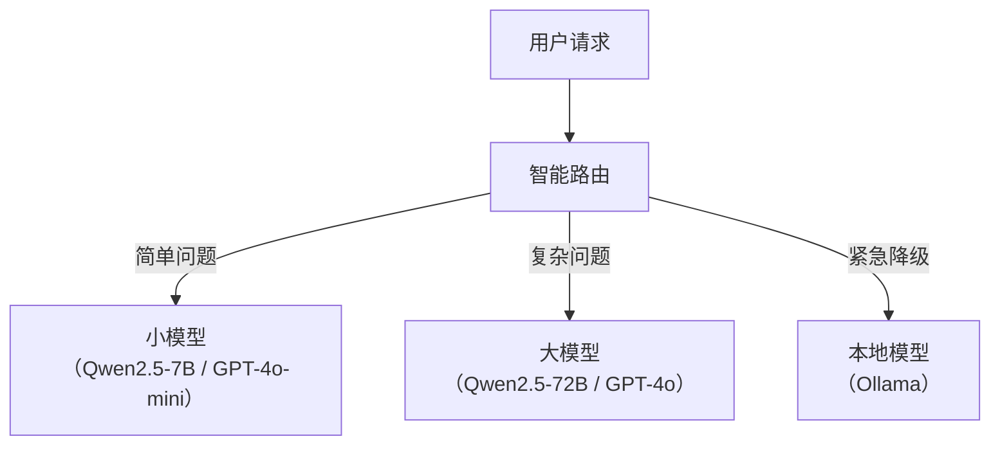

# AI 应用成本优化

> **创建日期：** 2026-06-06
> **前置知识：** LLM 基础、Token 概念、RAG

---

## 一、成本构成全景



**最大头通常是 API 调用费用**，占 60-80%。

---

## 二、Token 消耗监控

```python
# 实时监控 Token 消耗
def log_token_usage(response):
    usage = response.usage
    print(f"输入 Token: {usage.prompt_tokens}")
    print(f"输出 Token: {usage.completion_tokens}")
    print(f"总 Token: {usage.total_tokens}")

    # 累计统计
    daily_stats.add(usage.total_tokens)
    if daily_stats.exceeds_budget():
        alert("Token 消耗已超过预算")
```

---

## 三、Prompt 缓存策略

### 3.1 缓存原理

相同的 Prompt 前缀 + 相同的 System Prompt → 缓存 KV Cache，后续请求复用。

```python
# 利用 Prompt 缓存降低 50% 成本
def chat_with_cache(user_input, system_prompt):
    # 将 System Prompt 放在最前面
    messages = [
        {"role": "system", "content": system_prompt},  # 可缓存
        {"role": "user", "content": user_input}         # 不可缓存
    ]
    return llm.chat(messages)
```

### 3.2 缓存策略

| 缓存类型 | 说明 | 节省 |
|----------|------|------|
| **Prompt 缓存** | 缓存 System Prompt 的 KV Cache | 50% |
| **语义缓存（GPTCache）** | 相似问题返回缓存答案 | 80-90% |
| **结果缓存** | 完全相同的查询直接返回缓存 | 100% |

---

## 四、语义缓存（GPTCache）

```python
from gptcache import Cache
from gptcache.manager import get_data_manager
from gptcache.embedding import Onnx

# 初始化语义缓存
cache = Cache()
cache.init(
    data_manager=get_data_manager("sqlite", "faiss"),
    embedding_func=Onnx()
)

# 使用缓存
@cache.llm_cache
def ask_llm(question):
    return llm.generate(question)  # 相似问题直接返回缓存
```

---

## 五、模型降级与智能路由



```python
def smart_route(question):
    """根据问题复杂度选择模型"""
    complexity = estimate_complexity(question)
    if complexity < 0.3:
        return "gpt-4o-mini"       # 成本最低
    elif complexity < 0.7:
        return "gpt-4o"            # 中等成本
    else:
        return "gpt-4o"            # 高成本，复杂问题
```

---

## 六、Prompt 压缩

对长 Prompt 进行压缩，减少 Token 消耗：

```python
def compress_prompt(context, max_tokens=1000):
    """压缩 Prompt 上下文"""
    if count_tokens(context) <= max_tokens:
        return context

    # 策略1：截断
    return truncate_to_tokens(context, max_tokens)

    # 策略2：LLM 摘要
    # return llm.summarize(context, max_tokens=max_tokens)
```

---

## 七、批量处理优化

| 策略 | 说明 | 节省 |
|------|------|------|
| **批量 API 调用** | 合并多个请求为一次调用 | 20-30% |
| **异步处理** | 非实时请求放入队列异步处理 | 利用空闲时段 |
| **离线预计算** | 提前计算 Embedding 和摘要 | 减少实时计算 |

---

## 八、成本优化检查清单

| 优化项 | 预期节省 | 实施难度 |
|--------|----------|----------|
| Prompt 缓存 | 30-50% | ⭐ 低 |
| 语义缓存 | 50-80% | ⭐⭐ 中 |
| 模型降级路由 | 40-60% | ⭐⭐ 中 |
| Prompt 压缩 | 20-30% | ⭐ 低 |
| 批量处理 | 20-30% | ⭐⭐ 中 |
| 量化模型 | 30-50% | ⭐⭐⭐ 高 |

---

## 九、面试高频题

### Q1: AI 应用成本主要由哪些构成？如何优化？

**详细答案：** AI 应用的成本构成可以分为四个主要部分。第一，API 调用费用（Token 消耗），这是最大头，通常占 60-80%。每次 LLM 调用都会产生费用，费用与输入 Token 数量（Prompt 长度）和输出 Token 数量（回答长度）成正比。Prompt 越长、回答越长，成本越高。RAG 应用中，检索到的文档片段也会占用大量 Token，因此检索策略直接影响成本。第二，模型推理费用（GPU 算力），如果使用自部署模型，需要承担 GPU 服务器租赁或购买的费用，以及电力和运维成本。GPU 费用通常按月计算，与实际使用率无关。

第三，存储费用，包括向量数据库存储（文档向量化后的存储）、对话历史存储（Memory 持久化）、日志存储（审计和安全日志）等。向量数据库的存储费用通常与文档数量和向量维度成正比。第四，人力成本，包括 AI 应用工程师的开发工资、运维工程师的运维工资、Prompt 工程师的优化工资等。人力成本通常占总成本的 20-30%。

优化策略按优先级排序：第一，Prompt 缓存（节省 30-50%），利用 API 的 Prompt 缓存功能，将 System Prompt 和固定前缀的 KV Cache 缓存复用，避免重复计费；第二，语义缓存（节省 50-80%），使用 GPTCache 等工具，对相似问题返回缓存答案，避免重复调用 LLM；第三，模型降级路由（节省 40-60%），简单问题用小模型（如 GPT-4o-mini），复杂问题用大模型（如 GPT-4o），避免所有问题都用最贵的模型；第四，Prompt 压缩（节省 20-30%），对长 Prompt 进行压缩，减少 Token 消耗；第五，批量处理（节省 20-30%），利用批量 API 的折扣价格；第六，量化模型（节省 30-50%），使用 INT4/INT8 量化减少 GPU 显存需求和推理成本。

### Q2: Prompt 缓存和语义缓存的区别是什么？各能节省多少？

**详细答案：** Prompt 缓存和语义缓存是两种不同层次的缓存策略，解决的是不同的问题。Prompt 缓存是 API 层面的缓存机制，原理是：当多个请求共享相同的 Prompt 前缀（如 System Prompt）时，API 服务端缓存这些前缀的 KV Cache，后续请求可以直接复用，无需重新计算。这能节省 50% 左右的 Token 费用（因为输入 Token 无需重复计费）。例如，RAG 应用中 System Prompt 可能长达 2000 个 Token，通过 Prompt 缓存，每次请求只需为不同的用户输入部分付费，System Prompt 部分被缓存复用。

语义缓存是应用层面的缓存机制，原理是：当用户提出相似的问题时，直接返回之前缓存的答案，而不是重新调用 LLM。例如，用户 A 问"如何申请年假"，用户 B 问"年假怎么申请"，语义缓存识别出这是同一个问题，直接返回缓存答案。这能节省 80-90% 的成本（完全避免了 LLM 调用）。语义缓存的实现通常使用 GPTCache 等工具，通过 Embedding 计算问题相似度，当相似度超过阈值时返回缓存。

两者的核心区别：Prompt 缓存是在 API 调用内部优化，每次仍然调用 LLM，但部分计算被复用；语义缓存是在 API 调用外部优化，完全不调用 LLM。Prompt 缓存适用于 System Prompt 固定且很长的场景，语义缓存适用于高频重复问题的场景。两者可以叠加使用：先检查语义缓存，如果命中则直接返回；如果未命中，调用 LLM 时利用 Prompt 缓存减少费用。需要注意的是，语义缓存需要设置合理的相似度阈值，阈值过高会导致缓存命中率低，阈值过低会导致返回不相关的答案。

### Q3: 模型智能路由如何实现？复杂度判断怎么做？

**详细答案：** 模型智能路由的核心思想是"不同复杂度的问题用不同成本和能力的模型处理"，简单问题用小模型（成本低），复杂问题用大模型（质量高）。实现智能路由需要三个组件：问题复杂度评估器、路由规则和模型池。问题复杂度评估器是核心，负责判断问题属于简单还是复杂。评估方法包括：第一，基于规则的方法，根据问题长度、关键词（如"分析"、"总结"、"代码"等标记为复杂问题）、是否包含多步指令等启发式规则判断；第二，基于模型的方法，使用一个小型分类模型（或 LLM 本身）快速判断问题复杂度。

路由规则定义了复杂度阈值与模型选择的映射关系。例如，复杂度分数 < 0.3 路由到 gpt-4o-mini（成本最低），0.3-0.7 路由到 gpt-4o（中等成本），> 0.7 路由到 gpt-4o（高成本，复杂问题）。路由规则需要根据实际业务场景调优，通过分析生产日志中的问题分布和模型表现来优化阈值。模型池包含了多个不同成本和能力的模型，除了主模型外，还应包括降级兜底模型（如本地 Ollama 模型），当所有 API 模型不可用时使用。

智能路由的注意事项：第一，复杂度评估本身也有成本（如果使用 LLM 评估），需要权衡评估成本和节省的成本；第二，路由错误会导致质量下降（复杂问题路由到小模型）或成本浪费（简单问题路由到大模型），需要持续监控和优化路由准确率；第三，路由策略应该支持动态调整，例如在高峰期将更多问题路由到小模型（降级保可用），在低峰期恢复大模型（保证质量）。一个实用的渐进式策略：开始时不使用智能路由，全部用大模型；收集一段时间的数据后，分析问题分布和模型表现，再引入智能路由。

### Q4: 生产环境如何监控 Token 消耗？

**详细答案：** 生产环境中监控 Token 消耗需要建立完善的观测体系。第一，实时 Token 计数：在每次 LLM 调用后，记录输入 Token 数量、输出 Token 数量和总 Token 数量。大多数 LLM API 的响应中包含 `usage` 字段（`prompt_tokens`、`completion_tokens`、`total_tokens`），可以直接获取。对于自部署模型，推理框架通常也提供 Token 计数功能。第二，聚合统计：按时间维度（小时、天、周、月）聚合 Token 消耗，生成趋势图表，识别异常波动。按维度聚合：按用户、按 API Key、按模型、按应用功能模块聚合，了解 Token 消耗的分布。

第三，成本计算：将 Token 消耗转换为实际成本（不同模型有不同的单价），生成成本报表。例如，GPT-4o 输入 $2.50/1M tokens，输出 $10.00/1M tokens，根据实际 Token 消耗计算费用。第四，预算告警：设置日/周/月的 Token 预算上限，当消耗接近或超过预算时触发告警。可以设置多级告警：80% 预算时发送提醒，100% 预算时发送警告，120% 预算时触发紧急告警。

监控工具的选择：第一，使用 LangSmith、Weave、Phoenix 等 AI 可观测性平台，它们提供了开箱即用的 Token 监控和成本分析功能；第二，自建监控，使用 Prometheus + Grafana，自定义 metrics 收集 Token 消耗数据，构建 Dashboard；第三，API 层面的监控，如果使用 API 网关（如 Kong、APISIX），可以在网关层统一收集 Token 使用数据。监控的关键指标：单次请求平均 Token 消耗、日 Token 消耗趋势、各模型 Token 消耗占比、各用户 Token 消耗排名、Token 预算使用率。监控不仅用于成本控制，也用于发现异常行为（如 Token 消耗突然飙升，可能是注入攻击或滥用）。

### Q5: 成本优化和安全/质量的权衡是什么？

**详细答案：** 成本优化与安全、质量之间存在天然的张力，需要找到平衡点。成本优化 vs 安全：一些成本优化手段可能引入安全风险。例如，语义缓存虽然节省成本，但缓存中可能存储了包含敏感信息的问答对，如果缓存被未授权访问就会泄露信息。解决方案：缓存中不存储完整问答内容，只存储脱敏后的特征向量；对缓存数据设置访问控制和加密存储。再如，模型降级路由中，简单问题路由到小模型，但小模型可能缺乏安全对齐（如没有经过充分的安全微调），更容易被越狱攻击。解决方案：选择经过了安全对齐的小模型，或在小模型调用时增加额外的安全审查。

成本优化 vs 质量：一些成本优化手段可能降低回答质量。例如，Prompt 压缩可能丢失关键信息，导致 AI 回答不准确；模型降级路由中，复杂问题路由到小模型可能导致回答质量下降；语义缓存中，相似度阈值设置不当可能返回不相关的缓存答案。解决方案：第一，建立质量监控体系，每次成本优化后监控质量指标（如 RAGAS 分数、用户满意度），确保质量不显著下降；第二，设置质量底线，明确哪些场景绝对不能降级（如医疗咨询、法律建议），哪些场景可以适度降级；第三，A/B 测试，在正式上线前，通过 A/B 测试对比优化前后的质量和成本，量化 trade-off。

平衡策略的核心是"分级服务"：对不同场景、不同用户、不同问题设置不同的质量-成本标准。VIP 用户使用高质量高成本方案，普通用户使用标准方案；核心业务场景（如客服、销售）保证质量，非核心场景（如内部工具）可以降低成本；工作时间高峰使用高质量方案，非高峰使用省钱方案。这种分级策略让成本优化更加精细化和可控，而不是一刀切地降低所有场景的质量。

### Q6: 批量处理和离线预计算如何降低 AI 应用成本？

**详细答案：** 批量处理和离线预计算是降低 AI 应用成本的重要策略。批量处理的核心思想是：将多个独立的 LLM 请求合并为一次批量调用，利用 API 提供商的批量折扣（通常折扣 20-50%）。OpenAI 等提供商提供了专门的 Batch API，允许将多个请求打包提交，异步处理，价格通常比实时 API 便宜 50%。批量处理适用于非实时场景：如批量文档摘要、批量数据标注、批量翻译、批量内容审查等。实现方式：将请求收集到队列中，达到一定数量或时间窗口后，合并为一次批量调用提交。

离线预计算的核心思想是：将可以提前计算的内容在低峰期或离线完成，避免实时计算。典型场景包括：第一，Embedding 预计算，将知识库文档的 Embedding 提前计算好并存入向量数据库，用户查询时直接检索，无需实时计算 Embedding；第二，摘要预计算，将长文档的摘要提前生成好，用户查看时直接展示缓存的摘要；第三，常见问题缓存，分析历史数据找出高频问题，提前生成答案并缓存，用户提问时直接返回缓存。离线预计算将计算成本从"每次请求"转移到"一次计算、多次复用"，大幅降低了实时成本。

批量处理和离线预计算的注意事项：第一，批量处理增加了延迟，不适用于实时交互场景；第二，离线预计算的内容需要定期更新（如知识库更新后重新计算 Embedding），否则可能返回过时信息；第三，需要建立调度机制，在低峰期（如凌晨）自动执行批量任务和预计算任务；第四，批量处理和预计算的结果需要缓存管理，设置合理的过期时间。结合使用：先通过离线预计算处理大部分内容，实时请求时通过批量处理降低 API 调用成本，再通过语义缓存进一步减少重复调用，形成多层次的成本优化体系。