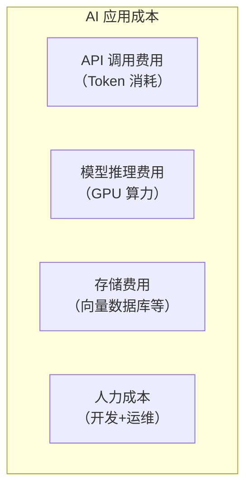
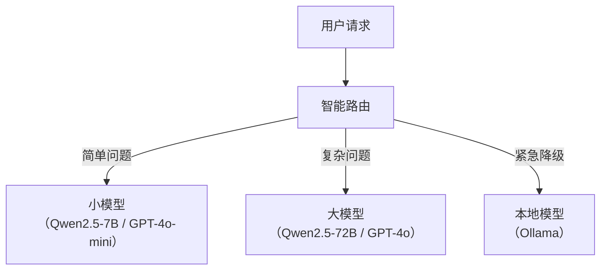

# AI 应用成本优化

> **创建日期：** 2026-06-06
> **前置知识：** LLM 基础、Token 概念、RAG

---

## 一、成本构成全景



**最大头通常是 API 调用费用**，占 60-80%。

---

## 二、Token 消耗监控

```python
# 实时监控 Token 消耗
def log_token_usage(response):
    usage = response.usage
    print(f"输入 Token: {usage.prompt_tokens}")
    print(f"输出 Token: {usage.completion_tokens}")
    print(f"总 Token: {usage.total_tokens}")

    # 累计统计
    daily_stats.add(usage.total_tokens)
    if daily_stats.exceeds_budget():
        alert("Token 消耗已超过预算")
```

---

## 三、Prompt 缓存策略

### 3.1 缓存原理

相同的 Prompt 前缀 + 相同的 System Prompt → 缓存 KV Cache，后续请求复用。

```python
# 利用 Prompt 缓存降低 50% 成本
def chat_with_cache(user_input, system_prompt):
    # 将 System Prompt 放在最前面
    messages = [
        {"role": "system", "content": system_prompt},  # 可缓存
        {"role": "user", "content": user_input}         # 不可缓存
    ]
    return llm.chat(messages)
```

### 3.2 缓存策略

| 缓存类型 | 说明 | 节省 |
|----------|------|------|
| **Prompt 缓存** | 缓存 System Prompt 的 KV Cache | 50% |
| **语义缓存（GPTCache）** | 相似问题返回缓存答案 | 80-90% |
| **结果缓存** | 完全相同的查询直接返回缓存 | 100% |

---

## 四、语义缓存（GPTCache）

```python
from gptcache import Cache
from gptcache.manager import get_data_manager
from gptcache.embedding import Onnx

# 初始化语义缓存
cache = Cache()
cache.init(
    data_manager=get_data_manager("sqlite", "faiss"),
    embedding_func=Onnx()
)

# 使用缓存
@cache.llm_cache
def ask_llm(question):
    return llm.generate(question)  # 相似问题直接返回缓存
```

---

## 五、模型降级与智能路由



```python
def smart_route(question):
    """根据问题复杂度选择模型"""
    complexity = estimate_complexity(question)
    if complexity < 0.3:
        return "gpt-4o-mini"       # 成本最低
    elif complexity < 0.7:
        return "gpt-4o"            # 中等成本
    else:
        return "gpt-4o"            # 高成本，复杂问题
```

---

## 六、Prompt 压缩

对长 Prompt 进行压缩，减少 Token 消耗：

```python
def compress_prompt(context, max_tokens=1000):
    """压缩 Prompt 上下文"""
    if count_tokens(context) <= max_tokens:
        return context

    # 策略1：截断
    return truncate_to_tokens(context, max_tokens)

    # 策略2：LLM 摘要
    # return llm.summarize(context, max_tokens=max_tokens)
```

---

## 七、批量处理优化

| 策略 | 说明 | 节省 |
|------|------|------|
| **批量 API 调用** | 合并多个请求为一次调用 | 20-30% |
| **异步处理** | 非实时请求放入队列异步处理 | 利用空闲时段 |
| **离线预计算** | 提前计算 Embedding 和摘要 | 减少实时计算 |

---

## 八、成本优化检查清单

| 优化项 | 预期节省 | 实施难度 |
|--------|----------|----------|
| Prompt 缓存 | 30-50% | ⭐ 低 |
| 语义缓存 | 50-80% | ⭐⭐ 中 |
| 模型降级路由 | 40-60% | ⭐⭐ 中 |
| Prompt 压缩 | 20-30% | ⭐ 低 |
| 批量处理 | 20-30% | ⭐⭐ 中 |
| 量化模型 | 30-50% | ⭐⭐⭐ 高 |

---

## 九、面试高频题

### Q1: AI 应用成本主要由哪些构成？如何优化？

**详细答案：** 我们客服系统的成本结构是：API 调用 65%、GPU 推理 15%、向量存储 5%、人力 15%。最大头永远是 API 费用，而且这部分是按量走的、上不封顶——这个月上量了费用就可能翻倍。

优化我们按"投入产出比"排序。第一优先是 Prompt 缓存——复用 System Prompt 的 KV Cache，省钱效果立竿见影，我们开 DeepSeek 前缀缓存之后，System Prompt 部分从 $0.27/M 降到 $0.028/M，一下就省了大约总 Token 费的 15%。第二是语义缓存——我们把 FAQ 场景的高频问题做了语义匹配，命中率 35%，意味着 35% 的请求完全不走 LLM，这一步对我们月费贡献最大——从 $450 降到了 $290。第三是模型降级——简单问题走 DeepSeek V3，复杂问题路由到 GPT-4o，再砍 40%。第四是 Prompt 精简——我们把 System Prompt 从 500 Token 压到 120 Token，半年省了一笔可观的支出。按这个顺序效果依次递减，但每步叠加起来综合能降 60-70%。

### Q2: Prompt 缓存和语义缓存的区别是什么？各能节省多少？

**详细答案：** 我们两个都在用，区别总结：Prompt 缓存是在 API 内部省钱（少算重复前缀），语义缓存是在 API 不调就省钱（直接返回缓存答案）。Prompt 缓存本质是——LLM 调用照常进行，但 System Prompt 那部分 KV Cache 重用了，不计费，省的是"输入 Token"。我们开 DeepSeek 的开放缓存，命中率约 85%（因为 85% 请求的 System Prompt 相同），省了大约 $50/月。

语义缓存是完全另外一套思路——用户问过相同或相似问题，直接返回缓存的回答，一次 LLM 都不调。我们放了 GPTCache + Milvus 的语义缓存，FAQ 场景命中率 35%，这些请求完全不需要调 LLM，直接砍掉了 35% 的 API 调用。但语义缓存有坑——阈值定得太低（0.70）时匹配到很多不相关回答，阈值太高（0.90）命中率又太低。我们最后定在 0.82，是拉了一个月的数据调试出来的。两者不是替代关系——我们建议双管齐下，Prompt 缓存是"白送的优化"（不用改动代码），语义缓存是"需要调参但回报大的"。两强合在一起能砍 50-60%。

### Q3: 模型智能路由如何实现？复杂度判断怎么做？

**详细答案：** 我们现在的智能路由用得挺顺——先让一个便宜的模型（DeepSeek V3）做快速意图分析，输出 `complexity_level`（low/medium/high）和推荐的处理模型，然后代码按优先级分流。这比规则引擎靠谱多了——早期我们用关键词匹配，"取消"、"退"、"怎么"这些词根本没法区分复杂度。

关键点是"用便宜的模型去决定你是否需要贵的模型"。路由逻辑在 application 层用一套 if-else 映射表，简单可维护，不需要专门的 ML 服务。我们做了实时 dashboard 看路由分布——70% 走 Layer 1（DeepSeek V3）、20% 走 Layer 2（Claude Sonnet）、10% 走 Layer 3（o3/Opus）。这个比例是跑了一个月数据压出来的，每个季度重新看一次是否需要调整。最大的坑是路由错误——复杂问题被错误地路由到小模型会导致回答质量严重下降。我们加了兜底：如果小模型回答的 confidence score 低，会触发二次路由重新走大模型。

### Q4: 生产环境如何监控 Token 消耗？

**详细答案：** 我们每次 LLM 调用后都从 `response.usage` 拿 Token 数据，然后打 Prometheus Counter（Micrometer 很方便），label 区分 model、feature、tenant_id。Grafana 面板上实时显示每小时消耗趋势、各模型占比、Top-10 消费用户。告警阈值是：日预算的 80% 发提醒、100% 发警告、120% 发紧急告警到飞书。

有一次告警救了我们的预算——系统改了一个 prompt bug，意外地把整篇对话历史重复嵌了两次，导致每次请求 Token 翻倍，Grafana 红线拐了几分钟后我们就被叫醒了。没有这套监控，一晚上烧几千块是分分钟的事。

### Q5: 成本优化和安全/质量的权衡是什么？

**详细答案：** 这是我们在成本优化上最纠结的地方。一个教训：一次我们设火了"极限省钱模式"，把所有流量都切到 DeepSeek V3，结果复杂售后问题（涉及多步骤退款流程）的准确率从 88% 掉到 72%。错了不止是体验差，还是法律风险——错误告诉用户可以全额退款，结果实际只退一半。

我们的平衡策略是分级服务。VIP 用户走 Claude Sonnet 高质方案，普通用户走 DeepSeek V3 标准方案；核心场景保证不降级，非核心场景允许省钱。语义缓存也要小心——缓存中可能存了敏感信息，我们把缓存数据的访问做了严格的 ACL 限制。总的原则：可以省钱但绝不能省安全，安全是第一底线。

### Q6: 批量处理和离线预计算如何降低 AI 应用成本？

**详细答案：** 我们有两类成本优化用到批量处理和离线预计算。第一类是 nightly batch jobs——每天凌晨 2 点把当天新加入的文档全部做 embedding 和 chunking，这些是固定的预处理任务，早上用户访问时就已经全部 indexed 了，不需要实时计算。我们用 OpenAI Batch API 跑 embedding，价格减半。

第二类是离线预生成技术——我们从历史数据里找到了 200 个超高频 FAQ 问题（比如"怎么退货""运费怎么算"），提前在后台跑一遍生成回答 + 缓存，用户命中率高达 40%。这些缓存每周更新一次，成本几乎为零。批量处理和实时请求处理的区别就是"提前准备"vs"即时应对"——能用批量的一定不要用实时。