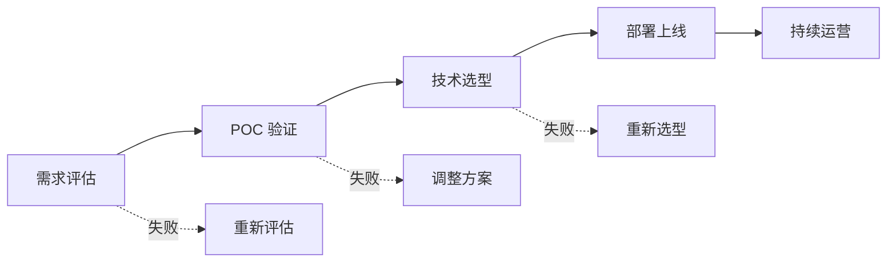

# 企业 AI 落地方法论

> **创建日期：** 2026-06-06
> **前置知识：** 全部 AI 应用技术栈

---

## 一、企业 AI 落地五步法



### 第一步：需求评估

| 评估维度 | 关键问题 |
|----------|----------|
| **业务价值** | 解决什么问题？ROI 是多少？ |
| **数据就绪** | 有足够的数据吗？质量如何？ |
| **技术可行性** | 现有技术能否实现？差距在哪？ |
| **合规风险** | 数据安全、隐私合规是否满足？ |

### 第二步：POC 验证

- 用最小成本验证核心假设
- 1-2 周完成，不要追求完美
- 使用低代码平台（Dify）快速验证

### 第三步：技术选型

| 决策点 | 选项 |
|--------|------|
| 模型 | 云端 API vs 本地部署 vs 混合 |
| 架构 | 低代码平台 vs 自研框架 |
| RAG | 简单 RAG vs 高级 RAG |
| Agent | 是否需要 Agent？ |

### 第四步：部署上线

- 灰度发布，逐步放量
- 建立监控和告警
- 准备回滚方案

### 第五步：持续运营

- 收集用户反馈
- 持续优化 Prompt 和检索
- 定期更新知识库

---

## 二、组织能力建设

| 角色 | 职责 | 技能要求 |
|------|------|----------|
| **AI 应用工程师** | 开发 AI 应用 | Prompt 设计、RAG、Agent |
| **AI 架构师** | 技术选型和架构设计 | 全栈 AI 技术 |
| **Prompt 工程师** | Prompt 设计优化 | 语言表达、逻辑推理 |
| **数据工程师** | 数据处理和知识库建设 | 数据清洗、ETL |

---

## 三、ROI 评估框架

| 维度 | 指标 | 计算方式 |
|------|------|----------|
| **效率提升** | 人工工时节省 | 节省工时 × 人力成本 |
| **质量提升** | 错误率降低 | 错误减少次数 × 单次损失 |
| **体验提升** | 响应速度 | 缩短的响应时间 × 客户价值 |
| **成本** | AI 基础设施 | API 费用 + 硬件 + 人力 |

```
ROI = (效率提升 + 质量提升 + 体验提升 - 成本) / 成本
```

---

## 四、常见陷阱

::: danger 陷阱一：追求完美
POC 阶段追求完美，花费 3 个月才上线。正确做法：2 周 MVP → 上线 → 迭代。
:::

::: danger 陷阱二：技术驱动而非业务驱动
选最"先进"的技术，而非最适合业务的技术。正确做法：从业务需求出发选技术。
:::

::: danger 陷阱三：忽视数据质量
花大量时间调 Prompt，但知识库数据质量差。正确做法：先优化数据，再优化 Prompt。
:::

::: danger 陷阱四：缺乏评估体系
凭感觉判断 AI 效果好不好。正确做法：建立评估集，量化评估。
:::

::: danger 陷阱五：忽视安全合规
上线后才发现数据安全问题。正确做法：安全合规从第一天开始考虑。
:::

---

## 五、面试高频题

### Q1: 企业 AI 落地的五个步骤是什么？各步骤的关键产出是什么？

**详细答案：** 企业 AI 落地的五步法是一个系统化的方法论，每个步骤都有明确的目标和关键产出。第一步，需求评估：核心目标是确定 AI 项目是否值得做、能否做。关键产出是需求评估报告，包含业务价值分析（ROI）、数据就绪度评估、技术可行性分析、合规风险评估。常见错误是跳过需求评估直接开始开发，导致项目方向错误或资源浪费。评估阶段最重要的是"价值验证"——不要被 AI 的热度冲昏头脑，而是冷静分析 AI 是否真的能解决业务问题。

第二步，POC 验证：核心目标是用最小成本验证核心假设。关键产出是 POC Demo 和验证报告，证明 AI 方案在技术上可行、在业务上有效。POC 风格应该"快、糙、猛"：1-2 周完成，使用低代码平台（如 Dify）快速搭建，只验证最核心的假设，不追求完美。常见错误是 POC 阶段追求完美，花 3 个月才上线，结果发现假设不成立，浪费了大量时间。正确的做法是"2 周 MVP -> 上线 -> 收集反馈 -> 迭代"。

第三步，技术选型：核心目标是选择最适合业务需求的技术方案。关键产出是技术选型文档，包含模型选择（云端 API vs 本地部署 vs 混合）、架构选择（低代码平台 vs 自研框架）、RAG 方案（简单 RAG vs 高级 RAG）、Agent 方案（是否需要 Agent）等决策。选型的原则是"从业务需求出发"而非"从技术出发"，选择最适合而非最先进的技术。第四步，部署上线：核心目标是将 AI 应用安全稳定地部署到生产环境。关键产出是部署方案和运维手册，包含灰度发布策略、监控告警配置、回滚方案。第五步，持续运营：核心目标是持续优化 AI 应用的效果。关键产出是运营报告和优化计划，包含用户反馈收集、Prompt 优化、知识库更新、效果评估。

### Q2: 如何评估 AI 项目的 ROI？有哪些指标？

**详细答案：** AI 项目的 ROI 评估需要从投入和产出两个维度计算。投入（成本）包括：AI 基础设施费用（API 调用费用 + GPU 算力 + 存储 + 网络）、人力成本（开发 + 运维 + Prompt 工程师）、数据标注成本（如果需要微调）、合规成本（安全审计、数据保护）。产出（收益）包括：效率提升（人工工时节省 × 人力成本）、质量提升（错误率降低 × 单次损失）、体验提升（响应速度提升带来的客户满意度提升和收入增长）。

ROI 的计算公式是：`ROI = (效率提升 + 质量提升 + 体验提升 - 成本) / 成本`。但需要注意的是，AI 项目的收益往往是间接的、长期的，难以精确量化。例如，客服 AI 减少了客服人员的工时，但释放的人力可以转向更高价值的工作（如客户关系维护），这部分价值很难精确计算。因此，ROI 评估应该结合定量指标和定性判断。

关键评估指标包括：效率指标（人工工时节省百分比、自动处理率）、质量指标（错误率变化、客户满意度 NPS 变化）、成本指标（单次交互成本、月度总成本）、体验指标（响应时间、首次解决率）。评估时要注意：第一，AI 项目通常有 3-6 个月的投入期，ROI 在 6-12 个月后才能体现，评估周期要足够长；第二，AI 项目的效果不是一蹴而就的，需要持续优化，ROI 评估应该考虑迭代改进的收益；第三，对比基准很重要，要与人工处理的成本和效果进行对比，而不是与"零成本"对比。

### Q3: POC 阶段应该怎么做？常见错误是什么？

**详细答案：** POC（Proof of Concept）阶段的核心原则是"用最小成本验证核心假设"。正确做法：第一，明确核心假设，只验证最关键的问题（如"AI 能否理解我们的业务知识并给出准确回答"），不要试图验证所有功能。第二，时间控制在 1-2 周，使用低代码平台（如 Dify、Coze、FastGPT）快速搭建原型，不要从头编码。第三，使用真实但有限的业务数据（如 50-100 个文档），不要一开始就导入全量数据。第四，定义明确的成功标准（如"Top-3 检索准确率 > 80%"，"回答可用率 > 70%"），有了标准才能判断 POC 是否成功。

POC 阶段最常见的错误有以下几种。第一，追求完美：花 3 个月搭建一个功能完善的系统，结果发现核心假设不成立，浪费了大量时间。第二，用错数据：使用不具代表性的测试数据，POC 效果好但实际生产效果差。第三，没有明确成功标准：POC 做完后无法判断是否成功，陷入"看起来不错，但不知道好不好"的困境。第四，技术选型过早：在 POC 阶段就确定了技术栈，结果发现不适合，但因为已经投入了时间而难以放弃。第五，忽视用户体验：只关注 AI 的准确性，忽视了用户交互流程的合理性，导致即使 AI 回答对了，用户也不满意。

POC 后的决策：如果 POC 验证成功，进入技术选型和正式开发阶段；如果 POC 验证失败，分析失败原因，决定是调整方案重新 POC，还是放弃项目。POC 失败不是坏事，反而避免了更大的投入浪费。关键是要从失败中学习，理解为什么失败，为下一个项目提供参考。

### Q4: 企业 AI 落地最常见的陷阱有哪些？如何避免？

**详细答案：** 企业 AI 落地最常见的陷阱有以下五个。陷阱一，追求完美：POC 阶段花费过长时间追求完美，错过了市场窗口。避免方法：设定 2 周的时间限制，只验证核心假设，用 MVP 快速上线，收集真实反馈后迭代。陷阱二，技术驱动而非业务驱动：选择最"先进"的技术，而非最适合业务的技术。例如，业务只需要一个简单的问答系统，但团队坚持使用最新的 Agent 框架和复杂的编排。避免方法：始终从业务需求出发，问自己"这个技术能解决什么业务问题"，而不是"这个技术很酷，我们能用在哪里"。

陷阱三，忽视数据质量：花大量时间调 Prompt 和优化模型，但知识库的数据质量差（如文档过时、格式混乱、信息矛盾）。避免方法：先优化数据，再优化 Prompt。数据的质量直接决定了 AI 应用的上限，Prompt 和模型只能在数据质量的基础上优化。陷阱四，缺乏评估体系：凭感觉判断 AI 效果好不好，没有量化的评估标准。避免方法：建立固定的评估数据集（50-100 个典型问题），每次变更后运行评估，确保质量不退化。使用 RAGAS 等评估框架量化评估效果。

陷阱五，忽视安全合规：上线后才发现数据安全问题，导致被迫下架或面临法律风险。避免方法：安全合规从第一天开始考虑，在需求评估阶段就纳入合规风险评估，在架构设计阶段就考虑数据安全（如数据脱敏、访问控制、审计日志）。陷阱六，低估持续运营成本：AI 应用不是一次性交付的，需要持续的运营和优化（Prompt 调整、知识库更新、模型升级、效果监控）。避免方法：在项目规划时就预留运营预算和人力，建立持续运营的机制和流程。

### Q5: 如何建立 AI 应用的效果评估体系？

**详细答案：** 建立 AI 应用的效果评估体系需要从三个维度入手。第一，自动化评估：使用 RAGAS 等评估框架，建立固定的评估数据集（黄金测试集），包含 50-100 个典型问题和标准答案。每次系统变更（如 Prompt 调整、检索策略优化、模型切换）后，自动运行评估，计算忠实度、答案相关性、上下文精确度、上下文召回率等指标。自动化评估的优点是快速、可重复、可量化，缺点是只能评估"标准问题"，无法覆盖所有真实场景。

第二，人工评估：定期（如每周）从生产日志中随机抽取 50-100 条真实对话，由业务专家或 AI 应用工程师进行人工评估。评估维度包括：回答准确性（是否正确）、回答完整性（是否覆盖了所有重要信息）、回答有用性（是否真正解决了用户问题）、回答安全性（是否包含敏感信息或不当内容）。人工评估的优点是贴近真实场景、能发现自动化评估无法检测的问题，缺点是成本高、速度慢、主观性强。

第三，用户反馈：在产品中嵌入用户反馈机制（如点赞/踩、评分、反馈表单），收集用户对 AI 回答的满意度。用户反馈的优点是直接反映用户真实感受，缺点是反馈率低（通常只有 1-5% 的用户会主动反馈），且容易受情绪影响（不满意的用户更可能反馈）。评估体系的建立建议：先建立自动化评估（快速、低成本），再补充人工评估（深度、高质量），最后加入用户反馈（真实、直接）。三种评估方式互相补充，构成完整的评估体系。评估不是一次性工作，而是需要持续进行，形成"评估 -> 发现问题 -> 优化 -> 再评估"的闭环。

### Q6: 企业 AI 落地中，如何平衡"快速上线"和"质量保障"？

**详细答案：** 平衡"快速上线"和"质量保障"是企业 AI 落地的核心挑战。正确的策略是"先上线，再优化"，而不是"优化好了再上线"。原因有三：第一，AI 应用的效果只有通过真实用户的使用才能验证，内部测试无法完全模拟真实场景的复杂性和多样性；第二，早期的用户反馈是优化方向的最佳指导，没有用户反馈的优化是盲目的；第三，快速上线可以抢占市场窗口，在竞争中建立先发优势。

具体的平衡策略：第一，定义"最小可接受质量标准"（Minimum Acceptable Quality），明确哪些问题绝对不能出错（如安全合规、敏感信息泄露），哪些问题可以接受并逐步优化（如回答的详细程度、格式美观度）。第二，灰度发布，先对 5-10% 的用户开放，收集反馈，优化后再逐步放量到 50%、100%。灰度发布可以控制风险，即使出现问题也只影响小部分用户。第三，建立快速回滚机制，确保在出现严重问题时能在 5 分钟内回滚到上一个稳定版本。

第四，建立"优化-上线"的快节奏，每次优化后快速上线验证，形成"周迭代"的节奏，而不是"月迭代"。第五，区分"核心功能"和"锦上添花"，核心功能（如 RAG 检索准确性、回答可用性）优先保障质量，锦上添花（如 UI 美化、高级功能）可以延后。第六，监控和告警，上线后实时监控关键指标（准确率、用户满意度、错误率），设置告警阈值，及时发现和修复问题。总结来说，快速上线不是牺牲质量，而是通过"快速迭代 + 灰度发布 + 实时监控"的方式，在保证质量的前提下加速交付。