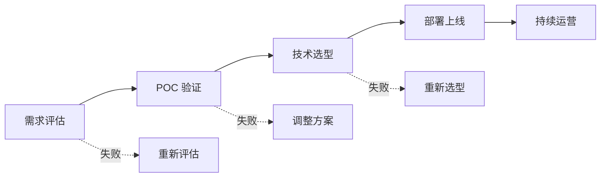

# 企业 AI 落地方法论

> **创建日期：** 2026-06-06
> **前置知识：** 全部 AI 应用技术栈

---

## 一、企业 AI 落地五步法



### 第一步：需求评估

| 评估维度 | 关键问题 |
|----------|----------|
| **业务价值** | 解决什么问题？ROI 是多少？ |
| **数据就绪** | 有足够的数据吗？质量如何？ |
| **技术可行性** | 现有技术能否实现？差距在哪？ |
| **合规风险** | 数据安全、隐私合规是否满足？ |

### 第二步：POC 验证

- 用最小成本验证核心假设
- 1-2 周完成，不要追求完美
- 使用低代码平台（Dify）快速验证

### 第三步：技术选型

| 决策点 | 选项 |
|--------|------|
| 模型 | 云端 API vs 本地部署 vs 混合 |
| 架构 | 低代码平台 vs 自研框架 |
| RAG | 简单 RAG vs 高级 RAG |
| Agent | 是否需要 Agent？ |

### 第四步：部署上线

- 灰度发布，逐步放量
- 建立监控和告警
- 准备回滚方案

### 第五步：持续运营

- 收集用户反馈
- 持续优化 Prompt 和检索
- 定期更新知识库

---

## 二、组织能力建设

| 角色 | 职责 | 技能要求 |
|------|------|----------|
| **AI 应用工程师** | 开发 AI 应用 | Prompt 设计、RAG、Agent |
| **AI 架构师** | 技术选型和架构设计 | 全栈 AI 技术 |
| **Prompt 工程师** | Prompt 设计优化 | 语言表达、逻辑推理 |
| **数据工程师** | 数据处理和知识库建设 | 数据清洗、ETL |

---

## 三、ROI 评估框架

| 维度 | 指标 | 计算方式 |
|------|------|----------|
| **效率提升** | 人工工时节省 | 节省工时 × 人力成本 |
| **质量提升** | 错误率降低 | 错误减少次数 × 单次损失 |
| **体验提升** | 响应速度 | 缩短的响应时间 × 客户价值 |
| **成本** | AI 基础设施 | API 费用 + 硬件 + 人力 |

```
ROI = (效率提升 + 质量提升 + 体验提升 - 成本) / 成本
```

---

## 四、常见陷阱

::: danger 陷阱一：追求完美
POC 阶段追求完美，花费 3 个月才上线。正确做法：2 周 MVP → 上线 → 迭代。
:::

::: danger 陷阱二：技术驱动而非业务驱动
选最"先进"的技术，而非最适合业务的技术。正确做法：从业务需求出发选技术。
:::

::: danger 陷阱三：忽视数据质量
花大量时间调 Prompt，但知识库数据质量差。正确做法：先优化数据，再优化 Prompt。
:::

::: danger 陷阱四：缺乏评估体系
凭感觉判断 AI 效果好不好。正确做法：建立评估集，量化评估。
:::

::: danger 陷阱五：忽视安全合规
上线后才发现数据安全问题。正确做法：安全合规从第一天开始考虑。
:::

---

## 五、面试重点

::: warning 高频考点
1. **企业 AI 落地的五个步骤是什么？** 各步骤的关键产出？
2. **如何评估 AI 项目的 ROI？** 有哪些指标？
3. **POC 阶段应该怎么做？** 常见错误是什么？
4. **企业 AI 落地最常见的陷阱有哪些？**
5. **如何建立 AI 应用的效果评估体系？**
:::