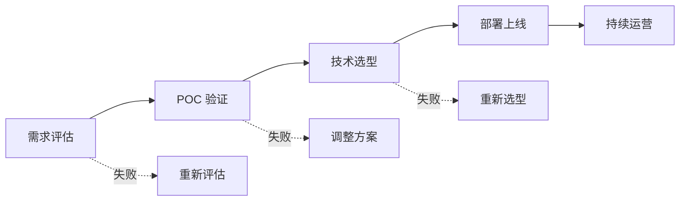

# 企业 AI 落地方法论

> **创建日期：** 2026-06-06
> **前置知识：** 全部 AI 应用技术栈

---

## 一、企业 AI 落地五步法



### 第一步：需求评估

| 评估维度 | 关键问题 |
|----------|----------|
| **业务价值** | 解决什么问题？ROI 是多少？ |
| **数据就绪** | 有足够的数据吗？质量如何？ |
| **技术可行性** | 现有技术能否实现？差距在哪？ |
| **合规风险** | 数据安全、隐私合规是否满足？ |

### 第二步：POC 验证

- 用最小成本验证核心假设
- 1-2 周完成，不要追求完美
- 使用低代码平台（Dify）快速验证

### 第三步：技术选型

| 决策点 | 选项 |
|--------|------|
| 模型 | 云端 API vs 本地部署 vs 混合 |
| 架构 | 低代码平台 vs 自研框架 |
| RAG | 简单 RAG vs 高级 RAG |
| Agent | 是否需要 Agent？ |

### 第四步：部署上线

- 灰度发布，逐步放量
- 建立监控和告警
- 准备回滚方案

### 第五步：持续运营

- 收集用户反馈
- 持续优化 Prompt 和检索
- 定期更新知识库

---

## 二、组织能力建设

| 角色 | 职责 | 技能要求 |
|------|------|----------|
| **AI 应用工程师** | 开发 AI 应用 | Prompt 设计、RAG、Agent |
| **AI 架构师** | 技术选型和架构设计 | 全栈 AI 技术 |
| **Prompt 工程师** | Prompt 设计优化 | 语言表达、逻辑推理 |
| **数据工程师** | 数据处理和知识库建设 | 数据清洗、ETL |

---

## 三、ROI 评估框架

| 维度 | 指标 | 计算方式 |
|------|------|----------|
| **效率提升** | 人工工时节省 | 节省工时 × 人力成本 |
| **质量提升** | 错误率降低 | 错误减少次数 × 单次损失 |
| **体验提升** | 响应速度 | 缩短的响应时间 × 客户价值 |
| **成本** | AI 基础设施 | API 费用 + 硬件 + 人力 |

```
ROI = (效率提升 + 质量提升 + 体验提升 - 成本) / 成本
```

---

## 四、常见陷阱

::: danger 陷阱一：追求完美
POC 阶段追求完美，花费 3 个月才上线。正确做法：2 周 MVP → 上线 → 迭代。
:::

::: danger 陷阱二：技术驱动而非业务驱动
选最"先进"的技术，而非最适合业务的技术。正确做法：从业务需求出发选技术。
:::

::: danger 陷阱三：忽视数据质量
花大量时间调 Prompt，但知识库数据质量差。正确做法：先优化数据，再优化 Prompt。
:::

::: danger 陷阱四：缺乏评估体系
凭感觉判断 AI 效果好不好。正确做法：建立评估集，量化评估。
:::

::: danger 陷阱五：忽视安全合规
上线后才发现数据安全问题。正确做法：安全合规从第一天开始考虑。
:::

---

## 五、面试高频题

### Q1: 企业 AI 落地的五个步骤是什么？各步骤的关键产出是什么？

**详细答案：** 我们项目落地就是按这个方法论走的，每一步都有血的教训。第一步需求评估——最容易被跳过的环节。我们当时差点踩坑：业务方说"给我做一个智能客服"，没说清楚到底要解决什么。花了两天梳理，才确认核心是"减少售后邮件积压、自动处理 70% 的重复问题"。如果不做这一步就动手，做出来的东西大概率没人用。关键产出就是一份不超过两页的评估报告——问题描述、预计 ROI、数据就绪度、风险点。

第二步 POC 验证——我们给自己定了两周硬 deadline，用 Dify 快速搭原型把用户最关心的 10 个 FAQ 跑通，找 5 个客服同事试用。第三步技术选型——我们在云端 API vs 自建部署之间纠结了两周，最后选了混合方案。第四步灰度上线——先给 10% 用户开放，跑了一周数据没大问题才放到 50%。第五步持续运营最容易被低估——我们现在每周至少改一次 Prompt，每月更新一次知识库。结论是：AI 项目上线只是开始，运营才是真功夫。

### Q2: 如何评估 AI 项目的 ROI？有哪些指标？

**详细答案：** 我们项目立项时硬着头皮算过 ROI，说实话挺难的——前期收益大多是软的。我们的算法是：ROI = (客服工时节省 x 人力成本 + 错误减少带来的损失规避 - API 费用) / 项目投入。客服系统上线后自动处理率 65%，意味着 65% 的用户问题不需要人工介入，直接折算每月节省 3.5 个人力。这 3.5 个人力被分流去做 VIP 客户维护和复杂投诉处理，这部分间接收益很难精确量化但真实存在。

搞 AI 项目有一个坑：前 3-6 个月是纯投入期（搭架子、调 prompt、跑评估），ROI 必须看 12 个月的周期才有参考意义。我们第一季度的 ROI 是 -40%，到第六个月才打平，第九个月开始正 60%。还有一点：AI 项目的核心价值往往不在省了多少钱，而在"做以前做不到的事"——比如 24 小时自动客服、实时多语言翻译、秒级工单分类，这些能力的价值在传统 ROI 公式里很难体现。

### Q3: POC 阶段应该怎么做？常见错误是什么？

**详细答案：** 我们 POC 踩过的最大的坑就是"想把 demo 做得太完美"。第一个月我们花了两周调 UI、配了十几条创意回复，结果上线给业务同事看，核心的检索准确率只有 60%，完全不能用。测试的数据和实际使用的不是一回事——我们测试时用的是产品手册（结构化），实际用户问的却是口语化的客服对话。

后来我们给自己立了两个硬规矩。一是 2 周 deadline，时间到了就算丑也要上线给业务同事试用；二是只验证核心假设——"AI 能不能从我们的知识库检索到正确的文档片段并基于它回答问题"。其他功能（多轮对话、意图识别、个性化回复）一概延后。我们用了 Dify 这种低代码平台来验证，不需要写后端代码，业务同事自己就能搭流程。

最大的错误就是花了 3 个月做了一个"功能齐全"但核心假设都没验证的系统。这种大概率浪费 3 个月。我现在给团队的 POC 标准是：2 周，10 个核心 FAQ，5 个试用用户。过了再继续，没过就 pivot 或放弃。

### Q4: 企业 AI 落地最常见的陷阱有哪些？如何避免？

**详细答案：** 我们亲身踩过三个大坑。第一是"技术驱动"——技术团队花了两周调研最新的 Agent 框架，搞了一个复杂的多 Agent 协作系统，结果业务方就说"我就想让他自动回复退货问题"。最简单的 FAQ RAG 就够了，根本不需要那么重的东西。第二是数据质量差——我们急着上线，直接用 Confluence 上导出的一堆过时文档建知识库，头两周准确率只有 50%。后来花了一周清理文档（把过时的删掉、重复的合并、格式统一），准确率直接升到 80%，比改 prompt 有效多了。

第三是没建评估体系。上线初始是人工抽检，两个月后 feature 越来越多、越来越难判断质量。现在我们每周从线上采样 50-100 条用 RAGAS 跑评估，有指标降幅超过 5% 就告警，这个帮助对我们长期维护质量特别关键。打个比方——没有评估体系的 AI 项目，就像开车没有仪表盘。

### Q5: 如何建立 AI 应用的效果评估体系？

**详细答案：** 我们是"三轨并重"。第一轨自动化——用 RAGAS 评估流水线，每周从线上采样 100 条，跑 Faithfulness、Answer Relevancy、Context Precision 三个指标，输出到 Grafana 面板。第二轨人工盲评——两周一次，拉两个业务同事各评 50 条，不知道是哪个模型出的，打分 1-5。这个能捕捉到自动化发现不了的问题，比如"语气是否合适"、"回复是否太啰嗦"。

第三轨用户反馈——我们的客服聊天结束后有个简单的点赞/踩按钮，收集率不高（大约 3%），但踩了的案例每条我们都看，能发现一些 blind spot。效果评估的建立顺序：先自动化（快、可重复）-> 再人工（深、高质量）-> 最后用户反馈（真、直接）。关键是把评估变成例行公事而不是一次性工作——我们每周一下午自动出报告，周三人工复评，周四 review 优化项，节奏已经固化了。

### Q6: 企业 AI 落地中，如何平衡"快速上线"和"质量保障"？

**详细答案：** 我们团队现在的节奏是"快速上线 + 迭代优化"，最反对的就是"功能做完美再上"。AI 应用质量是跑出来的不是测出来的——内部的测试数据永远不能完全代表线上用户真实说话的方式。我们把质量标准跟风险挂钩：**绝对不能出错**的安全容错（比如泄露用户敏感信息、违反合规）上线前严格把关；**可以出错但不致命**的质量容错（比如回答不够详细、语气不够好）先上线再从用户反馈中迭代。

具体策略：(1) 灰度发布——先开给 10% 的客服组，观察一周没问题再放 50%。有一次灰度到 50% 时发现了幻觉率异常，是因为某条文档被改了但没同步到索引库，及时修了没影响剩余用户。(2) 快速回滚——每次都留一个现成的回滚方案，5 分钟内切回上一个稳定版本。(3) 周迭代节奏——我们基本每周二改 Prompt 或知识库更新，周四上线，下周一看出效果报告。月迭代太慢、日迭代不敢，周迭代我们觉得是最佳节奏。核心不是"多快上线"而是"上线后多快能发现问题并修复"。