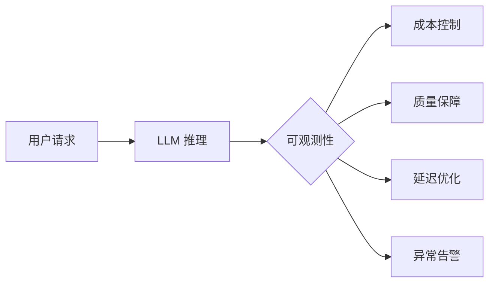
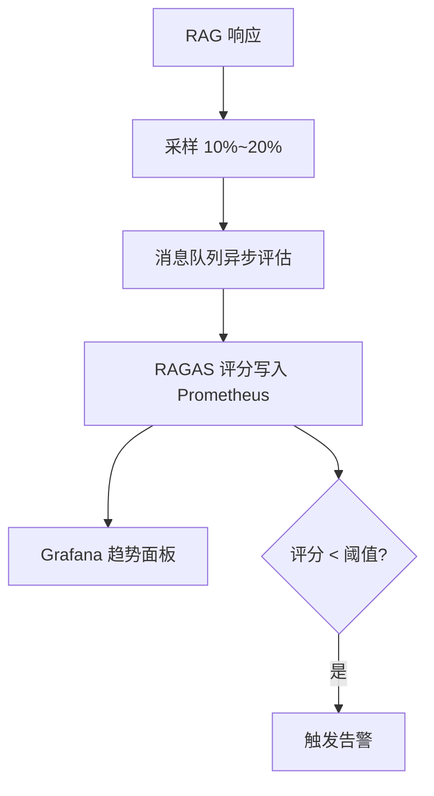

# AI 应用可观测性完整指南

> 面向 Java 后端开发者 | 从零构建 AI 应用监控体系

## 1. 概述

AI 应用相较传统服务有三个根本性差异，使可观测性从"锦上添花"变为"生存刚需"：

| 维度 | 传统应用 | AI 应用 |
|------|---------|--------|
| 输出 | 确定性结果 | 非确定性（同 prompt 不同回答） |
| 成本 | 固定资源消耗 | 按 Token 计费，波动剧烈 |
| 质量 | 逻辑分支可控 | 语义级"好坏"，难以量化 |



## 2. 三大支柱

| 支柱 | 用途 | AI 场景示例 |
|------|------|------------|
| **Logs** | 离散事件记录 | 每次 LLM 调用的 raw prompt / response、错误堆栈 |
| **Metrics** | 聚合数值指标 | Token 消耗速率、TTFT P99、RAGAS 评分趋势 |
| **Traces** | 分布式调用链 | RAG：Embedding → Retrieval → Generation 全链路 |

```python
import structlog
logger = structlog.get_logger()
logger.info("llm_call", model="gpt-4", prompt_tokens=350,
            completion_tokens=180, latency_ms=1200, user_id="u_42")
```

## 3. Token 监控

### 3.1 实时消耗追踪

```python
import tiktoken

def count_tokens(text: str, model: str = "gpt-4") -> int:
    enc = tiktoken.encoding_for_model(model)
    return len(enc.encode(text))

# 每次调用前预估，调用后记录实际消耗
estimated = count_tokens(prompt) + max_tokens
logger.info("token_usage", estimated=estimated, model="gpt-4")
```

### 3.2 多维度统计

```sql
-- 按用户/租户/模型统计 Token 消耗（PromQL 等价逻辑）
-- 实际在 Java 侧用 Micrometer Counter 按 tag 上报
SELECT user_id, model, SUM(prompt_tokens + completion_tokens) AS total
FROM llm_calls WHERE ts > NOW() - INTERVAL '1 day'
GROUP BY user_id, model ORDER BY total DESC;
```

### 3.3 预算告警

```yaml
# Prometheus 告警：日消耗超 $100
groups:
  - name: token_budget
    rules:
      - alert: TokenBudgetExceeded
        expr: sum(rate(token_cost_total[1d])) > 100
        for: 5m
```

## 4. 质量监控

### 4.1 RAGAS 自动评估 Pipeline

```python
from ragas import evaluate
from ragas.metrics import faithfulness, answer_relevancy

result = evaluate(
    dataset=eval_dataset,
    metrics=[faithfulness, answer_relevancy]
)
# {'faithfulness': 0.88, 'answer_relevancy': 0.92}
# 生产环境用异步采样策略，避免每次请求都评估
```

### 4.2 质量趋势与异常检测



## 5. 延迟监控

| 指标 | 含义 | 良好阈值 |
|------|------|---------|
| TTFT (Time To First Token) | 首个 Token 产出时间 | < 1000ms |
| TPS (Tokens Per Second) | Token 生成速率 | > 20 t/s |
| P50 端到端延迟 | 中位数总延迟 | < 5s |
| P99 端到端延迟 | 长尾延迟 | < 15s |

```python
import time

start = time.monotonic()
response = llm.chat(prompt)
total = time.monotonic() - start
tps = response.completion_tokens / (total - response.first_token_time + start)

logger.info("latency", ttft=response.ttft_ms, tps=tps, total_s=total)
```

## 6. 工具链对比

| 工具 | 定位 | 优势 | 劣势 |
|------|------|------|------|
| **LangSmith** | LLM DevOps 平台 | 深度集成 LangChain，自动捕获 Chain/Tool 调用 | 商业 SaaS，数据上传云端 |
| **Weave (W&B)** | MLOps 实验追踪 | 模型实验对比、版本管理强大 | 侧重训练阶段，推理阶段价值递减 |
| **Phoenix (Arize)** | 开源可观测性 | OpenTelemetry 原生、免费自部署 | 社区规模较小 |
| **OpenAI Dashboard** | 官方控制台 | 开箱即用、零配置 | 仅限 OpenAI 模型 |

```python
# Phoenix 集成：一行代码开启 LangChain 全链路追踪
from phoenix.trace.langchain import LangChainInstrumentor
LangChainInstrumentor().instrument()
```

## 7. 告警策略

```yaml
groups:
  - name: ai_app_alerts
    rules:
      - alert: HighCost          # 成本超预算
        expr: sum(token_cost_total[1h]) > 50
      - alert: QualityDegraded   # 质量下降
        expr: avg(faithfulness_score[10m]) < 0.7
      - alert: HighLatency       # 延迟飙升
        expr: histogram_quantile(0.99, ttft_seconds) > 3
      - alert: HighErrorRate     # 错误率攀升
        expr: rate(llm_errors[5m]) / rate(llm_calls[5m]) > 0.05
```

## 8. 实战：Prometheus + Grafana 监控面板

```python
from prometheus_client import Histogram, Counter, Gauge, start_http_server

ttft = Histogram("llm_ttft_seconds", "TTFT", buckets=[.1,.5,1,2,5,10])
tokens = Counter("llm_tokens_total", "Token 消耗", ["model","user"])
ragas_g = Gauge("ragas_faithfulness", "忠实度评分")

start_http_server(8000)  # 暴露 /metrics

def monitored_call(prompt: str):
    with ttft.time():
        resp = llm.chat(prompt)
    tokens.labels(model="gpt-4", user="u_42").inc(resp.total_tokens)
    ragas_g.set(evaluate_faithfulness(resp))  # 异步写入更佳
    return resp
```

Grafana 面板核心查询：
- TTFT P99：`histogram_quantile(0.99, rate(llm_ttft_seconds_bucket[5m]))`
- Token 消耗：`sum(rate(llm_tokens_total[1h])) by (model)`
- 质量趋势：`avg(ragas_faithfulness)`

## 9. 面试高频题

### Q1: AI 应用可观测性和传统微服务观测有什么本质区别？

**详细答案：** 我们做了快两年的 AI 应用，可观测性跟传统服务最大的差异我总结了三个点。第一个是输出不搞标准——传统服务的状态码 200/500 看着就明白，但 LLM 返回的"今天很开心"还是"我很高兴呢"都是对的，但质量可能差一半。我们就上了 RAGAS 这套语义级质量指标（Faithfulness、Relevancy），让机器评分代替人肉判断。

第二个是成本模型完全不同——传统服务的内存、CPU 用量很稳定，但 LLM 调用是按 Token 计费的，一个 prompt bug 能一晚上烧掉几千块。第三个是失败很隐蔽——传统服务挂了瞬间报 500 告警，但 AI 挂了几乎没人发现，因为它返回的都是"看起来对"但其实是幻觉的答案。我们就增设了"低 Faithfulness 评分告警"——如果采样率超过 15% 的答案 Faithfulness 低于 0.8，说明模型开始在胡编了。

### Q2: Java 后端如何处理 LLM 调用的超时与熔断？

**详细答案：** 我们 Java 后端用的是 WebFlux + Resilience4j，说实话 LLM 调用最大的问题是延迟方差——GPT-4o 偶尔能卡 30 秒以上。熔断器设滑动窗口统计，错误率超过 50% 就 open，立刻返回预设的降级回答（"系统繁忙，请稍后重试"）。超时设置分两层：连接超时 5 秒，读取超时根据 `max_tokens / 20 tps + 3s buffer` 动态算——比如 max_tokens=500，读取超时就设 28 秒。LLM 调用放入独立线程池，用虚拟线程避免阻塞 Tomcat 的核心线程。

### Q3: RAGAS 评估在生产环境如何落地？每次请求都跑吗？

**详细答案：** 不会每次请求都跑 RAGAS——评估本身也消耗 Token，成本不能忽略。我们按 15% 比例随机采样，异步处理：主流程先返回回答，同时把 `(question, context, answer)` 三元组发到 Kafka，评估服务独立消费计算 Faithfulness、Relevancy、Precision，结果打回 Prometheus。单次评估窗口不低于 100 条才有统计意义，我们用的是加权滑动平均看趋势，防止单次波动引发误报。评估服务的资源是独立的，不影响主链路延迟。

### Q4: LangSmith、Weave、Phoenix 三者如何选择？

**详细答案：** 我们团队选了 Phoenix 作为主力，因为它是开源的、基于 OpenTelemetry 的，和现有的 Jaeger + Grafana 栈无缝集成，不需要再买一套新的 APM。LangSmith 我们只给重度 LangChain 用户提供——追踪 Chain 执行的完整调用链，对调试 Agent 特别有用，但数据要上传 SaaS，不喜欢开源的用不了。Weave 是 ML 实验管理的工具，对推理阶段帮助有限，适合模型训练团队更实用。我的建议：如果只是个推祂 AI 部署团队（不像 ML 研究），Phoenix 完全够用。

### Q5: 面对 LLM 幻觉率高的问题，可观测性层面能做什么？

**详细答案：** 可观测性不能修复幻觉，但能让你发现后快速定位来源。我们做的是三层监控：一层是 RAGAS Faithfulness 的 P50/P90 趋势——如果忠实度持续往下掉（比如从 0.88 掉到 0.82），不管用户投诉没有都发告警；二层是按指标拆解幻觉来源——Context Precision 低说明检索回了无关文档（向量库问题），Faithfulness 低但 Precision 高说明模型在忽略正确文档（Prompt 设计问题）；三层是低评分案例归档——把这些问题完整的 trace（检索结果 + prompt + 回答）存到 ELK，支持按评分区间检索，形成反馈闭环。

### Q6: 如何为 AI 应用设计多租户成本分摊方案？

**详细答案：** 我们的 label 体系是 `(tenant_id, user_id, model, feature)` 四维标签，每次 LLM 调用都用 Micrometer Counter 记录 prompt_tokens 和 completion_tokens。计费逻辑放在一个独立的 billing 服务：查 model 的实时单价（比如 gpt-4o $0.03/1k prompt tokens），乘以该租户的聚合用量。Prometheus Recording Rules 预聚合小时/日级别的 `token_cost_by_tenant` 指标，Grafana 面板可以按租户、按模型、按功能实时查看成本分布。有个容易错的细节：不同模型 tokenizer 不一样，必须用对应的 tokenizer 计数，不能简单用字符数估算，否则误差会积累。