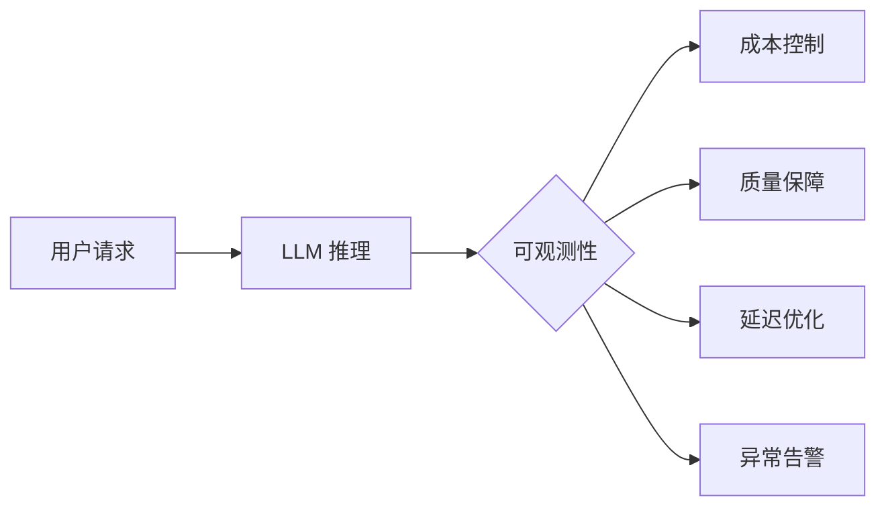
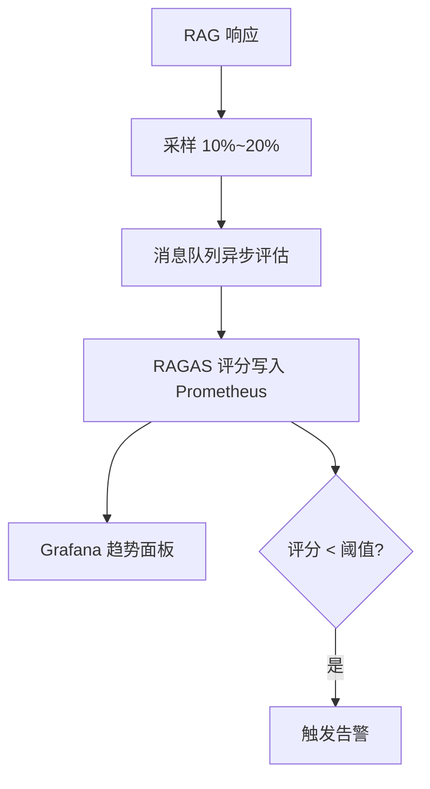

# AI 应用可观测性完整指南

> 面向 Java 后端开发者 | 从零构建 AI 应用监控体系

## 1. 概述

AI 应用相较传统服务有三个根本性差异，使可观测性从"锦上添花"变为"生存刚需"：

| 维度 | 传统应用 | AI 应用 |
|------|---------|--------|
| 输出 | 确定性结果 | 非确定性（同 prompt 不同回答） |
| 成本 | 固定资源消耗 | 按 Token 计费，波动剧烈 |
| 质量 | 逻辑分支可控 | 语义级"好坏"，难以量化 |



## 2. 三大支柱

| 支柱 | 用途 | AI 场景示例 |
|------|------|------------|
| **Logs** | 离散事件记录 | 每次 LLM 调用的 raw prompt / response、错误堆栈 |
| **Metrics** | 聚合数值指标 | Token 消耗速率、TTFT P99、RAGAS 评分趋势 |
| **Traces** | 分布式调用链 | RAG：Embedding → Retrieval → Generation 全链路 |

```python
import structlog
logger = structlog.get_logger()
logger.info("llm_call", model="gpt-4", prompt_tokens=350,
            completion_tokens=180, latency_ms=1200, user_id="u_42")
```

## 3. Token 监控

### 3.1 实时消耗追踪

```python
import tiktoken

def count_tokens(text: str, model: str = "gpt-4") -> int:
    enc = tiktoken.encoding_for_model(model)
    return len(enc.encode(text))

# 每次调用前预估，调用后记录实际消耗
estimated = count_tokens(prompt) + max_tokens
logger.info("token_usage", estimated=estimated, model="gpt-4")
```

### 3.2 多维度统计

```sql
-- 按用户/租户/模型统计 Token 消耗（PromQL 等价逻辑）
-- 实际在 Java 侧用 Micrometer Counter 按 tag 上报
SELECT user_id, model, SUM(prompt_tokens + completion_tokens) AS total
FROM llm_calls WHERE ts > NOW() - INTERVAL '1 day'
GROUP BY user_id, model ORDER BY total DESC;
```

### 3.3 预算告警

```yaml
# Prometheus 告警：日消耗超 $100
groups:
  - name: token_budget
    rules:
      - alert: TokenBudgetExceeded
        expr: sum(rate(token_cost_total[1d])) > 100
        for: 5m
```

## 4. 质量监控

### 4.1 RAGAS 自动评估 Pipeline

```python
from ragas import evaluate
from ragas.metrics import faithfulness, answer_relevancy

result = evaluate(
    dataset=eval_dataset,
    metrics=[faithfulness, answer_relevancy]
)
# {'faithfulness': 0.88, 'answer_relevancy': 0.92}
# 生产环境用异步采样策略，避免每次请求都评估
```

### 4.2 质量趋势与异常检测



## 5. 延迟监控

| 指标 | 含义 | 良好阈值 |
|------|------|---------|
| TTFT (Time To First Token) | 首个 Token 产出时间 | < 1000ms |
| TPS (Tokens Per Second) | Token 生成速率 | > 20 t/s |
| P50 端到端延迟 | 中位数总延迟 | < 5s |
| P99 端到端延迟 | 长尾延迟 | < 15s |

```python
import time

start = time.monotonic()
response = llm.chat(prompt)
total = time.monotonic() - start
tps = response.completion_tokens / (total - response.first_token_time + start)

logger.info("latency", ttft=response.ttft_ms, tps=tps, total_s=total)
```

## 6. 工具链对比

| 工具 | 定位 | 优势 | 劣势 |
|------|------|------|------|
| **LangSmith** | LLM DevOps 平台 | 深度集成 LangChain，自动捕获 Chain/Tool 调用 | 商业 SaaS，数据上传云端 |
| **Weave (W&B)** | MLOps 实验追踪 | 模型实验对比、版本管理强大 | 侧重训练阶段，推理阶段价值递减 |
| **Phoenix (Arize)** | 开源可观测性 | OpenTelemetry 原生、免费自部署 | 社区规模较小 |
| **OpenAI Dashboard** | 官方控制台 | 开箱即用、零配置 | 仅限 OpenAI 模型 |

```python
# Phoenix 集成：一行代码开启 LangChain 全链路追踪
from phoenix.trace.langchain import LangChainInstrumentor
LangChainInstrumentor().instrument()
```

## 7. 告警策略

```yaml
groups:
  - name: ai_app_alerts
    rules:
      - alert: HighCost          # 成本超预算
        expr: sum(token_cost_total[1h]) > 50
      - alert: QualityDegraded   # 质量下降
        expr: avg(faithfulness_score[10m]) < 0.7
      - alert: HighLatency       # 延迟飙升
        expr: histogram_quantile(0.99, ttft_seconds) > 3
      - alert: HighErrorRate     # 错误率攀升
        expr: rate(llm_errors[5m]) / rate(llm_calls[5m]) > 0.05
```

## 8. 实战：Prometheus + Grafana 监控面板

```python
from prometheus_client import Histogram, Counter, Gauge, start_http_server

ttft = Histogram("llm_ttft_seconds", "TTFT", buckets=[.1,.5,1,2,5,10])
tokens = Counter("llm_tokens_total", "Token 消耗", ["model","user"])
ragas_g = Gauge("ragas_faithfulness", "忠实度评分")

start_http_server(8000)  # 暴露 /metrics

def monitored_call(prompt: str):
    with ttft.time():
        resp = llm.chat(prompt)
    tokens.labels(model="gpt-4", user="u_42").inc(resp.total_tokens)
    ragas_g.set(evaluate_faithfulness(resp))  # 异步写入更佳
    return resp
```

Grafana 面板核心查询：
- TTFT P99：`histogram_quantile(0.99, rate(llm_ttft_seconds_bucket[5m]))`
- Token 消耗：`sum(rate(llm_tokens_total[1h])) by (model)`
- 质量趋势：`avg(ragas_faithfulness)`

## 9. 面试高频题

### Q1: AI 应用可观测性和传统微服务观测有什么本质区别？

**详细答案：** 传统微服务关注确定性行为——HTTP 状态码、CPU 使用率、DB 查询延迟等可精确量化的指标。AI 应用面临三大根本差异：第一，输出非确定性，同一 prompt 产生不同回答是设计预期而非 bug，因此需要"语义级质量指标"（如 RAGAS 忠实度和相关性）替代"200 vs 500"的二元判断。第二，成本模型从固定资源变为按 Token 计费，一个冗余 system prompt 或失控多轮对话可能造成数倍成本膨胀，需建立 Token 预算和告警机制。第三，失败模式更隐蔽——LLM 很少直接报错，而是返回看似合理的"幻觉"，要求可观测性具备内容质量评估能力，而非仅监控技术指标。

### Q2: Java 后端如何处理 LLM 调用的超时与熔断？

**详细答案：** Java 后端调用 LLM（本质是 HTTP 长连接）推荐使用虚拟线程（Java 21+）或 WebFlux 避免阻塞平台线程。熔断用 Resilience4j CircuitBreaker，滑动窗口统计失败比例，错误率超 50% 时快速失败返回降级回答。超时需分层：连接超时 5s，读取超时根据 `max_tokens` 和预期 TPS 动态计算（如 `max_tokens / 20 tps + 3s buffer`）。建议将 LLM 调用放入独立线程池（核心线程数 = CPU 核数 x 2），避免慢调用耗尽 Tomcat 工作线程，同时用 Micrometer 将 TTFT、TPS 接入 Prometheus。

### Q3: RAGAS 评估在生产环境如何落地？每次请求都跑吗？

**详细答案：** 不建议每次请求都跑 RAGAS，评估本身也消耗 Token。推荐按 10%-20% 比例采样或按租户优先级分层采样。Pipeline 设计为异步非阻塞：主流程返回响应后，将 `(question, context, answer)` 三元组写入 Kafka，评估服务独立消费并计算 faithfulness、answer_relevancy、context_precision，结果写回 Prometheus。采样需保证统计显著性，单次评估窗口数据量不低于 100 条，用加权滑动平均追踪趋势，避免单次异常引发误报。

### Q4: LangSmith、Weave、Phoenix 三者如何选择？

**详细答案：** 三者核心差异在生态绑定和部署模式。LangSmith 深度绑定 LangChain，链路编排基于 LangChain 时开箱体验最佳，但它是 SaaS 商业产品，数据上传云端。Weave 定位 MLOps 全流程，擅长模型实验对比和版本管理，推理阶段价值递减。Phoenix 基于 OpenTelemetry 的开源方案，支持自部署，与现有可观测性栈（Jaeger、Prometheus、Grafana）无缝集成，不锁定框架。建议策略：早期用 Phoenix 构建基线，深度 LangChain 用户叠加 LangSmith，实验期辅以 Weave。

### Q5: 面对 LLM 幻觉率高的问题，可观测性层面能做什么？

**详细答案：** 可观测性不是修复幻觉的药方，但能让你"先看见再修复"。策略一：设置 RAGAS faithfulness 的 P50/P90 趋势监控，忠实度持续走低时自动告警。策略二：按维度拆解幻觉来源——通过 context_precision 判断是检索回了无关文档（向量 DB 问题），还是模型忽略了相关文档（prompt 设计问题）。策略三：建立幻觉案例回放机制——将低评分案例的完整 trace（检索结果 + prompt + 生成回答）持久化到日志系统（ELK），支持按评分区间检索，形成质量改进的反馈闭环。

### Q6: 如何为 AI 应用设计多租户成本分摊方案？

**详细答案：** 多租户场景推荐分层标签体系：`(tenant_id, user_id, model, feature)`。每次 LLM 调用通过 Micrometer Counter 记录 prompt_tokens 和 completion_tokens。计费逻辑放在 Grafana 或独立服务：按 model 查询单价（如 gpt-4 $0.03/1k prompt tokens），乘以聚合用量。使用 Prometheus Recording Rules 预聚合小时/日级别的 `token_cost_by_tenant` 指标，通过 Grafana 面板或 API 暴露。关键细节：不同模型 tokenizer 不同，必须用对应 tokenizer（如 tiktoken）计数，不能用字符数估算。