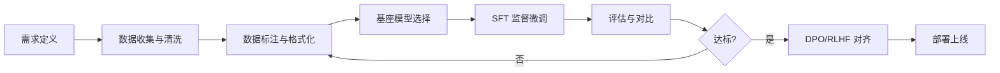

# LLM 微调实践完整指南

> 面向 Java 后端开发者的中文微调指南，从概念到落地。

---

## 1. 概述

**微调（Fine-tuning）**是在预训练基座模型（如 LLaMA、Qwen、DeepSeek）之上，用领域标注数据继续训练，使模型在特定任务上表现更优的技术手段。

**三种适配手段对比：**

| 手段 | 原理 | 是否需要标注数据 | 适用场景 |
|------|------|:---:|------|
| Prompt Engineering | 调整提示词模板 | 否 | 快速验证、简单任务 |
| RAG | 检索外部知识注入上下文 | 否（需知识库） | 知识密集型、时效性要求高 |
| 微调 | 更新模型参数 | **是** | 风格对齐、格式约束、领域术语 |

**何时需要微调（满足任一即可入坑）：**
- 你需要模型输出稳定的 JSON/SQL/YAML 格式，Prompt 无法保证 100%
- 你需要模型掌握私有领域术语（医药、法律、金融）
- 你需要改变模型的语气、角色、回复风格
- Prompt Engineering + RAG 组合已无法满足精度要求

---

## 2. 微调 vs RAG 决策矩阵

| 维度 | 微调 | RAG |
|------|------|-----|
| 知识更新 | 需重新训练 | 实时更新知识库即可 |
| 推理延迟 | 低（无额外检索） | 高（检索+重排+拼接） |
| 格式控制 | **强** | 弱 |
| 幻觉控制 | 中 | **强**（可溯源） |
| 数据依赖 | 需高质量标注数据 | 需结构化知识库 |
| 成本 | 训练成本高，推理便宜 | 训练零成本，推理较贵 |
| 可解释性 | 黑盒 | 可溯源到文档 |

**决策口诀：知识靠 RAG，能力靠微调。**

---

## 3. 微调流程



**各阶段输出物：**

| 阶段 | 产出 | 工具/框架 |
|------|------|-----------|
| 数据准备 | `.jsonl` 数据集 | Label Studio, self-instruct |
| 基座选择 | 模型权重 | HuggingFace, ModelScope |
| SFT 训练 | Lora 适配器 / 全量权重 | LLaMA-Factory, Axolotl |
| 评估 | BLEU/ROUGE/人工评分 | lm-evaluation-harness |
| 部署 | API 服务 | vLLM, Ollama, TGI |

---

## 4. SFT（监督微调）详解

### 4.1 数据格式

最常见的对话格式（ShareGPT / Alpaca 格式）：

```python
# 标准 Alpaca 格式
{
    "instruction": "将以下 Java Entity 转为对应的 DDL 建表语句",
    "input": "class User { Long id; String name; LocalDate birth; }",
    "output": "CREATE TABLE user (\n  id BIGINT PRIMARY KEY,\n  name VARCHAR(255),\n  birth DATE\n);"
}
```

```python
# ShareGPT 多轮对话格式（推荐）
{
    "conversations": [
        {"from": "human", "value": "请用 Java Stream API 对 List<Order> 按金额降序取前10"},
        {"from": "gpt", "value": "orders.stream()\n  .sorted(Comparator.comparing(Order::getAmount).reversed())\n  .limit(10)\n  .toList();"}
    ]
}
```

### 4.2 核心训练参数

```yaml
# LLaMA-Factory 典型配置
cutoff_len: 2048          # 最大序列长度
learning_rate: 5e-5       # 学习率，QLoRA 可用 2e-4
num_train_epochs: 3       # 训练轮数，小数据 5~10，大数据 1~2
per_device_train_batch_size: 2
gradient_accumulation_steps: 8  # 等效 batch_size = 2 × 8 = 16
lora_rank: 8              # LoRA 秩，越大能力越强但参数量增加
lora_alpha: 16            # 缩放因子，通常 alpha = rank × 2
lora_target: all          # 目标模块：q_proj,v_proj 或 all
```

### 4.3 LoRA / QLoRA

LoRA（Low-Rank Adaptation）只训练低秩矩阵增量，冻结原模型权重。
QLoRA 进一步将基座模型量化为 4-bit（NF4），大幅降低显存需求。

```python
# peft + bitsandbytes 示例（QLoRA）
from transformers import BitsAndBytesConfig
from peft import LoraConfig, get_peft_model

bnb_config = BitsAndBytesConfig(
    load_in_4bit=True,
    bnb_4bit_quant_type="nf4",
    bnb_4bit_compute_dtype="float16",
)
lora_config = LoraConfig(
    r=8, lora_alpha=16, target_modules=["q_proj", "v_proj"],
    lora_dropout=0.05, bias="none", task_type="CAUSAL_LM",
)
model = get_peft_model(model, lora_config)
# 7B 模型：全量 ~14GB → QLoRA ~6GB（单卡 4090 即可）
model.print_trainable_parameters()  # trainable: ~0.1%
```

**显存对比（7B 模型）：**

| 方法 | 显存占用 | 最低 GPU |
|------|---------|----------|
| 全量微调 | ~55 GB | A100 80G |
| LoRA | ~16 GB | RTX 4090 24G |
| QLoRA | ~6 GB | RTX 4060 16G |

---

## 5. DPO/RLHF 对齐训练（简要）

SFT 让模型"会做"，DPO/RLHF 让模型"做得好"——对齐人类偏好（安全、有用、诚实）。

```python
# DPO 数据格式（偏好对）
{
    "prompt": "如何实现线程安全的单例模式？",
    "chosen": "推荐使用枚举实现单例...（详细、正确、优雅）",
    "rejected": "加个 synchronized 就行...（过于简略、有误导）"
}
```

**RLHF 三步：** SFT → 训练奖励模型（Reward Model）→ PPO 强化学习
**DPO 一步：** 直接从偏好数据中优化，无需奖励模型，工程实现更简单，效果接近 RLHF。

> 建议：先跑通 SFT，上线后收集真实反馈形成偏好对，再做 DPO 迭代。

---

## 6. 数据准备最佳实践

| 维度 | 建议 | 反例 |
|------|------|------|
| 数据量 | 至少 500 条高质量样本，理想 2K~10K | 用 50 条数据硬训导致过拟合 |
| 多样性 | 覆盖长/短文本、不同场景、边界情况 | 全是同一模板生成的相似数据 |
| 质量 | 每条人工审核，output 必须准确 | 用 GPT-4 生成标注后不审核直接训 |
| 格式一致 | 全程使用同一对话模板 | 混用 ChatML / Alpaca / ShareGPT 格式 |
| 标签清洗 | 删除重复、截断、乱码样本 | 直接从线上日志采样不处理 |

**数据配比建议：** 常规任务 70% + 困难任务 20% + 边界/对抗样本 10%

---

## 7. 成本估算

| 环节 | 方案 | 估算成本 |
|------|------|---------|
| 数据标注（1000 条） | 外包标注 | 1,000 ~ 5,000 元 |
| 数据标注（1000 条） | GPT-4 生成 + 人工审核 | 200 ~ 500 元 |
| 训练 7B QLoRA | 单卡 4090，3 epoch | ~5 元（电费）/ 云 GPU ~30 元 |
| 训练 7B 全量 | 4×A100，3 epoch | 云 GPU ~2,000 元 |
| 推理部署 7B | vLLM + T4 | ~300 元/月 |
| 推理部署 7B | vLLM + A10 | ~1,500 元/月 |

> 一次低成本试水：GPT-4 生成标注（200元）+ QLoRA 云训练（30元）+ Ollama 自部署 = 约 250 元即可完成从 0 到 1。

---

## 8. 常见陷阱

1. **数据泄露（Data Leakage）**：训练集混入测试集样本，评估指标虚高，上线翻车。必须严格按时间/来源切分。
2. **灾难性遗忘（Catastrophic Forgetting）**：微调后模型丢失通用能力。解决：混合通用数据（5%~10%）一起训练。
3. **过拟合**：训练集 Loss 极低但测试集表现差。解决：减少 epoch、增加正则、早停（Early Stopping）。
4. **格式漂移**：LoRA target 选太少，输出格式不稳定。建议 target_modules 选 "all" 或至少 q+v+o 三个投影层。
5. **基座选错**：用 Base 模型直接做对话微调（应该用 Instruct/chat 版本），输出不可控。
6. **不做评估就开始用**：至少准备 50 条测试用例，对比微调前后效果，否则不知道是"变好了"还是"学会背答案了"。

---

## 9. 面试高频题

### Q1: 微调和 RAG 的核心区别是什么？什么时候用哪个？

**详细答案：**

微调通过反向传播更新模型内部参数，改变的是模型"能力"——使其学会特定格式、风格或领域知识。RAG（检索增强生成）不改变模型参数，而是在推理时从外部知识库检索相关内容拼入 Prompt，让模型基于检索结果回答。

选择策略：如果需求是"让模型按照固定 JSON Schema 输出"或"学会 Java 后端领域的代码风格"，微调更合适，因为这类能力需要内化到参数中，Prompt 约束力有限。如果需求是"回答公司内部文档上的问题，且文档经常更新"，RAG 更合适——无需重新训练，更新知识库即可生效。实践中两者常配合使用：微调保证输出格式与风格，RAG 注入最新知识。

### Q2: LoRA 的原理是什么？为什么能大幅减少训练参数？

**详细答案：**

LoRA 的核心假设是：模型适配新任务时，权重更新矩阵是低秩的。它将全量权重更新 ΔW ∈ R^{d×k} 分解为两个小矩阵 A ∈ R^{d×r} 和 B ∈ R^{r×k}（r << min(d,k)），前向计算变为 h = Wx + BAx，原始权重 W 冻结，只训练 A 和 B。

以 7B 模型为例，全量微调需更新 70 亿参数，LoRA（r=8）仅训练约 0.1%~1% 参数（数百万量级）。这意味着：显存大幅下降、训练速度快数倍、可保留多个任务的 LoRA 适配器并用同一基座，切换任务只需换适配器。QLoRA 更激进，将基座模型量化到 4-bit，进一步把 7B 训练显存从 16GB 压缩到 6GB。

### Q3: SFT 和 DPO 分别解决什么问题？训练流程上有什么区别？

**详细答案：**

SFT（监督微调）解决"会不会做"的问题：给定输入，学习模仿标注数据中的输出，本质是有监督的分类/生成任务。DPO（直接偏好优化）解决"做得好不好"的问题：从人类偏好对中学习——面对同一问题，好回答（chosen）和差回答（rejected）的差异是什么。

训练流程上：SFT 只需 (instruction, output) 一对，用交叉熵损失优化。DPO 需要 (prompt, chosen, rejected) 三元组，损失函数直接最大化 chosen 与 rejected 之间的相对概率差距，无需训练单独的奖励模型。实践中先 SFT 让模型获得基础任务能力，再 DPO 对齐人类偏好，是当前业界最主流的两阶段流水线。

### Q4: 微调后模型出现"灾难性遗忘"怎么办？

**详细答案：**

灾难性遗忘是指模型在领域数据上微调后，原本具备的通用能力（如推理、翻译、常识问答）显著退化。这是微调阶段最大的风险之一。

应对策略有三：第一，数据层面在训练集中混合 5%~10% 通用数据（如 ShareGPT 对话、通用问答对），让模型不"忘记"母语。第二，训练层面使用较小的学习率（5e-5~2e-4）和适当的 epoch 数（1~3），LoRA 本身因冻结大部分参数也有防遗忘效果。第三，评估层面除领域指标外，必须用通用 Benchmark（MMLU、C-Eval 等）对比微调前后分数，量化遗忘程度。如果通用能力下降超过 5%，应调整数据配比或降低训练强度重新训练。

### Q5: 如何评估微调效果？只用 Loss 看够吗？

**详细答案：**

Loss 是训练收敛指标，**绝对不能作为唯一的评估标准**。Loss 低只能说明模型学会了拟合训练集分布，不代表实际效果好。

完整评估体系应包含三个层级：第一层自动化指标，根据任务类型选用 BLEU/ROUGE（文本生成）、精确率/召回率（分类抽取）、JSON Schema 校验通过率（格式化输出）。第二层固定测试集，准备 50~200 条未参与训练的测试样本，人工或 GPT-4 进行 A/B 对比打分（微调前 vs 微调后）。第三层线上评估，部署后监控用户真实请求的通过率、重试率、用户反馈。只有当三层指标均正向提升，才能确认微调有效。常见反例是：训练 Loss 从 2.0 降到 0.3，但线上格式错误率反而升高——典型的过拟合翻车现场。