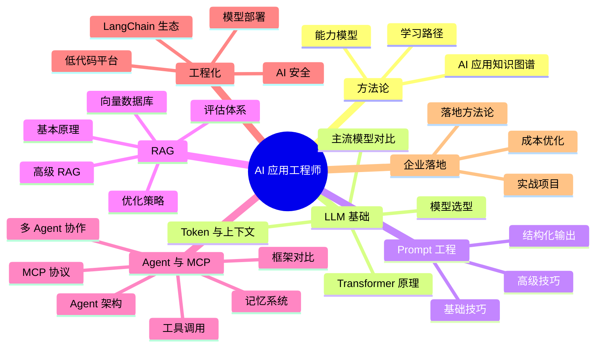

# AI 应用

## 模块概述

AI 应用模块面向后端开发者的 AI 落地实践，从**方法论与知识图谱** → **LLM 基础** → **Prompt Engineering** → **RAG 检索增强生成** → **Agent 智能体与 MCP 协议** → **工程化与生态** → **企业实战项目**，形成完整的 AI 应用工程师能力闭环。

当前后端工程师的核心竞争力正在从"写业务逻辑"转向"AI 集成与调优"。

::: tip 趋势判断
未来 3 年，具备 AI 应用落地能力的后端工程师将成为稀缺资源。不是每个人都需要训练模型，但每个人都需要学会**用好模型**。
:::

::: info 技术栈
大模型 API（OpenAI / 文心 / 通义 / DeepSeek） + LangChain / LlamaIndex + RAG + Agent + MCP + FastAPI + Vue3
:::

## 知识图谱

## 核心模块

### 🧭 方法论

| 模块 | 核心内容 |
|------|----------|
| [AI 应用方法论](./methodology/) | AI 应用知识图谱、能力模型、技术栈全景、学习路径规划 |

### 🧱 LLM 基础

| 模块 | 核心内容 |
|------|----------|
| [大模型概览](./llm-basics/) | Transformer 心智模型、API 调用、Function Calling |
| [主流模型对比](./llm-basics/models) | 国际+国内模型价格能力对比、场景推荐 |
| [Token 与上下文](./llm-basics/token) | Token 概念、上下文窗口、成本估算、长文本策略 |
| [模型选型](./llm-basics/model-selection/) | 选型决策框架、能力矩阵、场景匹配 |

### ✍️ Prompt 工程

| 模块 | 核心内容 |
|------|----------|
| [Prompt 设计](./prompt-engineering/) | Prompt 结构、Zero/Few-Shot、CoT、迭代方法论 |
| [高级技巧](./prompt-engineering/advanced) | ReAct、Self-Consistency、ToT、DSPy、模板化 |
| [结构化输出](./prompt-engineering/structured-output) | JSON Mode、Pydantic、instructor、校验重试 |

### 🔍 RAG 检索增强生成

| 模块 | 核心内容 |
|------|----------|
| [RAG 原理](./rag/) | RAG 全链路、vs 微调对比、面试高频问题 |
| [向量数据库](./rag/vector-db) | 相似度度量、ANN 算法、向量数据库选型 |
| [RAG 优化](./rag/optimization) | 分块策略、混合检索、Rerank、HyDE、查询改写、多路召回 |
| [RAG 评估](./rag/evaluation) | RAGAS 四大指标、评估集构建、自动化评估 |
| [高级 RAG](./rag/advanced) | Graph RAG、Agentic RAG、Self-RAG、Corrective RAG、RAPTOR |

### 🤖 Agent 与 MCP

| 模块 | 核心内容 |
|------|----------|
| [Agent 架构](./agent/) | 感知→规划→行动→观察循环、ReAct、设计模式 |
| [工具调用](./agent/function-call) | Function Calling 原理、工具描述规范、错误处理、安全沙箱 |
| [多 Agent 协作](./agent/multi-agent) | Leader-Follower、辩论式、层级式、流水线模式 |
| [记忆系统](./agent/memory) | 三层记忆（工作/情景/语义）、压缩与遗忘 |
| [框架对比](./agent/frameworks) | LangGraph/CrewAI/AutoGen/OpenAI SDK/PydanticAI 全景对比 |
| [MCP 协议](./mcp/) | 协议架构、JSON-RPC 2.0、Stdio/SSE 传输 |
| [MCP 原语](./mcp/tools-resources) | Tools/Resources/Prompts/Sampling 详解 |
| [Server 开发](./mcp/server-dev) | FastMCP 开发、Python SDK、安全实践 |

### ⚙️ 工程化与生态

| 模块 | 核心内容 |
|------|----------|
| [LangChain 入门](./langchain/) | 核心组件、LCEL 管道语法、与 LlamaIndex 差异 |
| [Chain 与 Memory](./langchain/chain) | Chain 类型、Memory 管理、自定义 Chain |
| [实战案例](./langchain/practice) | RAG 应用、对话机器人、Agent 实战 |
| [编排框架对比](./langchain/ecosystem) | LangChain/LlamaIndex/Semantic Kernel 全景对比 |
| [模型部署](./deployment/) | vLLM/TGI/Ollama 对比、量化、GPU 选型 |
| [vLLM 生产部署](./deployment/vllm) | PagedAttention、性能调优、多卡部署 |
| [Ollama 本地开发](./deployment/ollama) | 本地模型管理、OpenAI 兼容 API |
| [低代码平台](./low-code/) | Dify/Coze/FastGPT 对比与选型 |
| [AI 安全](./security/) | Prompt 注入、越狱防护、数据泄露、合规 |

### 🏢 企业落地

| 模块 | 核心内容 |
|------|----------|
| [落地方法论](./enterprise/) | 五步法（评估→POC→选型→部署→运营）、ROI 评估 |
| [成本优化](./enterprise/cost-optimization) | Token 监控、缓存策略、模型路由、语义缓存 |

### 🚀 实战项目

| 模块 | 核心内容 |
|------|----------|
| [项目总览](./projects/) | 三项目技术栈、递进关系、环境准备 |
| [知识库问答系统](./projects/project1-knowledge-qa) | RAG + FastAPI + Vue3 全栈实战 |
| [AI 代码助手](./projects/project2-code-assistant) | RAG + Agent + Function Calling 实战 |
| [智能数据分析](./projects/project3-data-analysis) | NL2SQL + Agent + 可视化 综合实战 |

### 🐍 Python 入门

| 模块 | 核心内容 |
|------|----------|
| [Python 基础](./python-basics/) | Java 开发者视角的 Python 速成 |
| [AI 开发库](./python-basics/ai-libs) | openai/requests/pydantic/fastapi/asyncio |
| [虚拟环境](./python-basics/venv) | venv/pip/Poetry 包管理 |

## 面试重点

::: warning 高频考点
1. **RAG 全文检索流程**：从文档上传到用户提问返回答案的完整链路，每个环节的优化手段
2. **Prompt Engineering 实践**：给出一个业务场景，设计 Prompt 模板并说明设计思路
3. **向量检索原理**：Embedding 是什么？为什么能表示语义？向量相似度计算方法对比
4. **Agent 设计思路**：如何让 LLM 自主拆解任务、调用工具、纠正错误？
5. **MCP 协议**：与传统 API 集成的区别，为什么需要标准化的上下文协议？
6. **大模型选型**：不同场景的模型推荐与评估标准
7. **AI 应用安全**：Prompt 注入、数据泄露、越狱攻击的防御策略
8. **企业落地**：如何评估 AI 项目的 ROI？落地五步法？
:::

::: danger 容易翻车的点
- 停留在"调 API"层面，不理解 RAG 各环节的优化方向
- Prompt 设计凭感觉，没有工程化的迭代思路
- 对 Embedding 和向量检索的理解不到位，说不出优化策略
- 忽视 AI 应用的安全问题（注入攻击、数据泄露）
- 说不清楚 Agent 和 RAG 的区别，混淆两者
- 只知道 LangChain，不了解其他框架的适用场景
:::

## 学习建议

### 阶段一：基础入门
1. 调用 OpenAI Compatible API，完成对话、流式输出、Function Calling 三个 Demo
2. 学习 Prompt Engineering 指南，用不同任务验证效果
3. 理解 Token 计数和计费逻辑，建立成本意识

### 阶段二：RAG 系统
4. 从零搭建一个本地知识库问答系统
5. 对比不同的文档切分策略对检索准确率的影响
6. 使用 RAGAS 评估你的 RAG 系统质量

### 阶段三：Agent 开发
7. 使用 LangChain/LangGraph 构建一个能调用工具的 Agent
8. 实现多 Agent 协作场景
9. 开发一个 MCP Server，让 LLM 能访问企业内部 API

### 阶段四：企业落地
10. 完成一个完整的企业实战项目（知识库问答 / 代码助手 / 数据分析）

::: details 推荐资源
- OpenAI 官方 Cookbook 和 Prompt Engineering Guide
- LangChain / LlamaIndex 官方文档
- DeepLearning.AI 的 LangChain 和 RAG 系列课程
- MCP 协议官方规范（modelcontextprotocol.io）
- 各模型厂商的 Best Practice 文档
- Dify 开源平台（github.com/langgenius/dify）
:::