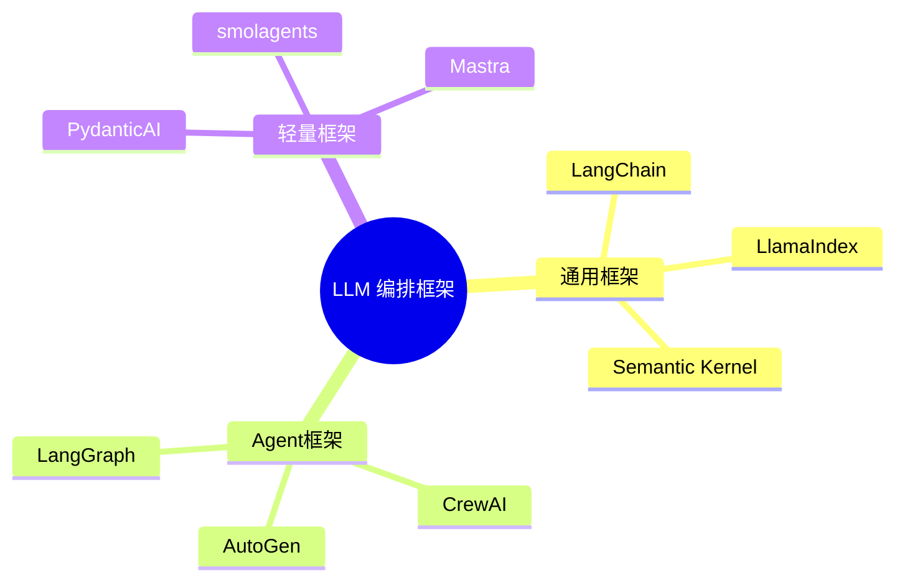

# LLM 编排框架生态对比

> **创建日期：** 2026-06-06
> **前置知识：** LangChain 入门、Agent 框架

---

## 一、编排框架全景图

---

## 二、三大通用框架对比

| 维度 | LangChain | LlamaIndex | Semantic Kernel |
|------|-----------|------------|-----------------|
| **开发者** | LangChain Inc | LlamaIndex Inc | 微软 |
| **语言** | Python / JS | Python / TS | C# / Python / Java |
| **核心定位** | 通用 LLM 编排 | 数据索引与检索 | 企业级 AI 编排 |
| **RAG 能力** | ⭐⭐⭐ | ⭐⭐⭐⭐⭐ | ⭐⭐⭐ |
| **Agent 能力** | ⭐⭐⭐⭐⭐ | ⭐⭐⭐ | ⭐⭐⭐⭐ |
| **企业特性** | LangSmith 监控 | 数据连接器丰富 | Azure 集成、安全合规 |
| **学习曲线** | 中等 | 较低 | 中等 |

---

## 三、各框架擅长领域

| 框架 | 最擅长 | 不足 |
|------|--------|------|
| **LangChain** | 复杂 Agent 工作流、多工具编排 | 抽象层多，调试困难 |
| **LlamaIndex** | 文档解析、数据索引、高级 RAG | Agent 能力弱 |
| **Semantic Kernel** | 企业级集成（Azure/Office）、多语言 | 社区生态较小 |
| **LangGraph** | 有状态多步 Agent 工作流 | 学习曲线陡峭 |
| **CrewAI** | 角色驱动的多 Agent 协作 | 灵活性受限 |
| **AutoGen** | 对话驱动的多 Agent 协作 | 调试复杂 |
| **PydanticAI** | 结构化输出 + 类型安全 | 功能较基础 |

---

## 四、多框架组合策略

::: tip 最佳实践
不要锁定单一框架。根据场景选择最合适的框架，多框架组合是生产环境的常态。
:::

| 组合方案 | 适用场景 | 说明 |
|----------|----------|------|
| **LlamaIndex（检索） + LangChain（编排）** | 复杂 RAG + Agent | LlamaIndex 做文档处理，LangChain 做编排 |
| **PydanticAI（输出） + 向量数据库（检索）** | 轻量 RAG | 极简组合 |
| **CrewAI（角色） + LangChain（工具）** | 多角色协作 | CrewAI 做分工，LangChain 做工具链 |
| **LangGraph（工作流） + OpenAI SDK（模型）** | 复杂工作流 | LangGraph 管流程，OpenAI SDK 管模型 |

---

## 五、2026 年趋势

1. **从重型到轻型**：开发者从 LangChain 向 PydanticAI/smolagents 等轻量框架迁移
2. **MCP 标准化**：工具调用统一到 MCP 协议，降低框架锁定
3. **可观测性成标配**：LangSmith、Weave、Phoenix 等观测工具普及
4. **TypeScript 生态崛起**：Mastra 等 TS 框架吸引全栈开发者

---

## 六、面试高频题

### Q1: LangChain 和 LlamaIndex 的核心区别是什么？如何选择？

**详细答案：** 我们项目两个框架都在用，现在分工很明确。LangChain 做编排层——对话路由、Agent 决策、Memory 管理、SSE 流式推送，所有需要"控流程"的逻辑都在它手里。LlamaIndex 专门做数据处理——加载文档、建索引、做检索策略，我们知识库 5 万篇文档的索引和检索全是它在扛。如果硬要一句话总结：LangChain 像是一个乐高底板，你可以把各种组件往上拼；LlamaIndex 更像是一台精密的文档处理机，插上电源就能高效运转。

有个实际案例能说明差别。我们的知识库 QA 需要跨多个产品线检索（比如手机和耳机两个品类可能有不同政策），用 LangChain 裸写的话要自己管理多次检索、结果合并、排序，代码量很大。LlamaIndex 的 `SubQuestionQueryEngine` 直接一行配置就搞定了——它自动把"手机和耳机的退货政策有什么不同？"拆成两个子问题分别检索然后汇总。但反过来，检索完成后用户开始追问细节、要改订单、要退款，这些交互式的多轮操作 LlamaIndex 就显得很吃力，还是得切回 LangChain 的 Agent 来处理。所以选框架的核心是看你的主要场景：以检索为主选 LlamaIndex，以编排为主选 LangChain，两者都需要就组合用。2025 年之后一个明显趋势是，很多简单项目两个都不用，直接裸 SDK 加个向量库就行了。

### Q2: LangChain 的优缺点是什么？什么时候不适合用 LangChain？

**详细答案：** 我们项目用 LangChain 0.3.x 搭了整个客服系统，说实话优缺点都体验得很透彻。生态方面，LangChain 确实碾压——我们需要对接 Milvus、PostgreSQL、Redis、ES，全有现成的集成，不用写胶水代码。当 OpenAI 推出 function calling 之后，LangChain 不到两周就封好了 `create_openai_tools_agent`，我们直接迁移，业务代码几乎没动。社区也强，有一次 `ConversationSummaryBufferMemory` 序列化出 bug，GitHub issue 一搜就有 workaround。

但吐槽的点也不少。版本升级是最大的痛——我们从 0.1 升到 0.2 那次，`initialize_agent` 被砍了，所有 Agent 代码重写，折腾了一周多。抽象层也深，有一次 debug callback 没触发，追了四层调用栈才发现是 `RunnableConfig` 传参问题，用裸 SDK 两分钟就发现的事在 LangChain 里搞了一下午。所以我们现在定了规矩：简单场景一律不用框架——我们有个内部文本分类小工具，开始也用 LangChain，后来去掉框架直接用 `openai.chat.completions.create`，代码量直接砍半。适合用 LangChain 的场景是：多 Agent 协作、复杂工具编排、有状态的多步工作流；不适合的场景是：简单问答、固定格式输出、批处理、团队不熟悉 LangChain 的项目。

### Q3: 轻量框架（PydanticAI）和重型框架（LangChain）如何选择？

**详细答案：** 我们团队去年做了一个内部工具，两个项目用了不同框架，对比很直观。A 项目是客服主系统，多 Agent、多工具、复杂路由，选了 LangChain——虽然抽象多，但编排能力确实强，RunnableBranch 一行代码就能做意图路由，AgentExecutor 自动管理执行循环，如果不选 LangChain 我们自己写这些基础设施至少两个月。B 项目是内部的"周报自动生成器"，需求很简单：读 Jira API -> 拼 Prompt -> 调 GPT-4o-mini 生成周报。一开始跟着主项目也用 LangChain，后来发现一层层装配链件的代码比业务逻辑还多，果断换成了 PydanticAI，整功能从 150 行减到 60 行。

我的判断标准很简单：画一下你的系统流程图，如果超过 3 个分支、需要工具调用、有状态管理、有复杂的对话路由——用 LangChain 或 LangGraph 这类重型框架是值的；如果只是"调模型做个分类/翻译/摘要"，裸 SDK 或者 PydanticAI 完全够。2025-2026 年的一个趋势是"往轻量走"，很多人从 LangChain 迁出去了，因为大多数实际项目真没必要用那么重的框架。另外，团队的熟悉程度也是个硬约束——我们组新来的两个前端背景的同事，上手 PydanticAI 只用了两天，LangChain 花了两周还没搞明白 AgentExecutor 的执行循环。

### Q4: 多框架组合的常见方案有哪些？

**详细答案：** 说实话，生产环境只用单一框架的项目很少——我们自己的系统就是"LlamaIndex + LangChain + PydanticAI"三件套组合。LlamaIndex 管知识库检索（5 万篇文档的索引、SubQuestionQueryEngine 子问题拆分、CrossEncoder Rerank），LangChain 管对话编排和 Agent 决策，PydanticAI 管结构化输出（订单信息抽取、工单分类）。每个组件做自己最擅长的事，接口用 FastAPI 兜底。

其他常见组合我也见过。一个是"PydanticAI + 向量数据库"的轻量 RAG 方案——有家做 SaaS 的朋友就用这套搭了个 FAQ 系统，总共不到 500 行代码，性能很好，检索延迟稳定在 300ms。另一个是"LangGraph + OpenAI SDK"的方案——有个做自动化运维的团队用 LangGraph 定义工作流（有分支、有回退、有状态持久化），但模型调用直接用 OpenAI SDK 不用 LangChain 的 LLM 封装，理由是"LangChain 的 ChatOpenAI 包装层在某些边界情况下会把流式中断掉"。我觉得选择组合的核心不是"哪个框架最流行"，而是"你的每个子系统最适合什么工具"——别因为 LangChain 能检索就硬用它做 RAG，也别因为 LlamaIndex 能调 LLM 就硬用它做 Agent。

### Q5: 2026 年编排框架的发展趋势是什么？

**详细答案：** 从我们团队和周边圈子的动向来看，几个趋势很明显。第一是"去重框架化"——去年下半年开始，GitHub 上越来越多项目直接甩掉框架用裸 SDK。我们自己的几个内部小工具也从 LangChain 迁出去了。不是 LangChain 不好，是大多数场景确实用不上那么重的编排能力——一个分类接口几十行 OpenAI SDK 就搞定了，为什么还要引入 80MB 的依赖？

第二是 MCP（Model Context Protocol）标准化。这是个好东西——以前你写的工具绑定在 LangChain 的 @tool 装饰器上，换框架就得重写。MCP 把工具调用接口标准化之后，工具可以跨框架复用。我们最近在试把内部几个 gRPC 服务包装成 MCP Server，这样不管上层用 LangChain 还是以后换别的框架，工具层不用动。第三是可观测性从 nice-to-have 变成 must-have——我们 Prometheus + Grafana 那一套，每个 LLM 调用的延迟、Token 消耗、错误率都有 Dashboard，没有这套东西跑生产就是盲飞。第四是 TypeScript 生态在发力，Mastra 这类框架让前端全栈可以直接用 TS 写 Agent，虽然生态还没 Python 成熟，但势头很猛。总的来说，2026 年框架在"做减法"而不是做加法。

### Q6: Semantic Kernel 和 LangChain 的定位差异是什么？企业级场景如何选择？

**详细答案：** 我没在生产环境深度用过 Semantic Kernel，但调研过，也和微软的兄弟聊过，理解它的定位。SK 的核心差异就一点：它是"微软生态的 AI 编排框架"，如果你家基础设施全在 Azure 上——Azure OpenAI、Cognitive Search、Functions ——SK 几乎是零配置集成。LangChain 更像"中立第三方"，什么云都能接但都不够深。SK 用 Planner 概念做任务规划，LangChain 用 Chain/Agent；SK 强大在企业级特性——安全、合规、审计开箱就有，LangChain 强大在社区生态和 AI 工具的丰富度。

企业选型的话，我的经验法则是：如果公司已经在 Azure 上跑着，或者技术栈是 .NET/JAVA（SK 原生支持 C# 和 Java），那 SK 是更自然的选择，Azure 的技术支持也能兜底。如果公司是多云、混合云，或者需要快速试错、灵活切换模型（今天 OpenAI 明天 Claude），那 LangChain 更灵活。我们当时也纠结过要不要上 SK，但因为团队 Python 为主、基础设施在阿里云上、模型除了 OpenAI 还要接 Qwen 和 DeepSeek，LangChain 的灵活性对我们更重要。另外说句实话：SK 的社区活跃度和 AI 前沿跟进速度还是比不上 LangChain——比如 OpenAI 的 structured outputs 出来后 LangChain 一周就适配了，SK 的节奏明显慢半拍。