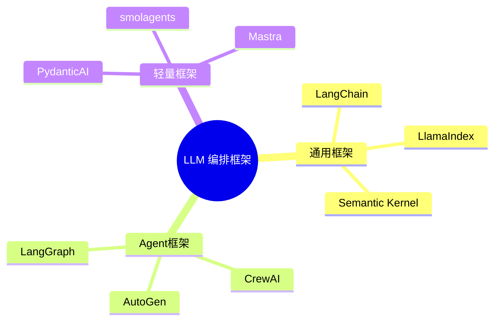

# LLM 编排框架生态对比

> **创建日期：** 2026-06-06
> **前置知识：** LangChain 入门、Agent 框架

---

## 一、编排框架全景图

---

## 二、三大通用框架对比

| 维度 | LangChain | LlamaIndex | Semantic Kernel |
|------|-----------|------------|-----------------|
| **开发者** | LangChain Inc | LlamaIndex Inc | 微软 |
| **语言** | Python / JS | Python / TS | C# / Python / Java |
| **核心定位** | 通用 LLM 编排 | 数据索引与检索 | 企业级 AI 编排 |
| **RAG 能力** | ⭐⭐⭐ | ⭐⭐⭐⭐⭐ | ⭐⭐⭐ |
| **Agent 能力** | ⭐⭐⭐⭐⭐ | ⭐⭐⭐ | ⭐⭐⭐⭐ |
| **企业特性** | LangSmith 监控 | 数据连接器丰富 | Azure 集成、安全合规 |
| **学习曲线** | 中等 | 较低 | 中等 |

---

## 三、各框架擅长领域

| 框架 | 最擅长 | 不足 |
|------|--------|------|
| **LangChain** | 复杂 Agent 工作流、多工具编排 | 抽象层多，调试困难 |
| **LlamaIndex** | 文档解析、数据索引、高级 RAG | Agent 能力弱 |
| **Semantic Kernel** | 企业级集成（Azure/Office）、多语言 | 社区生态较小 |
| **LangGraph** | 有状态多步 Agent 工作流 | 学习曲线陡峭 |
| **CrewAI** | 角色驱动的多 Agent 协作 | 灵活性受限 |
| **AutoGen** | 对话驱动的多 Agent 协作 | 调试复杂 |
| **PydanticAI** | 结构化输出 + 类型安全 | 功能较基础 |

---

## 四、多框架组合策略

::: tip 最佳实践
不要锁定单一框架。根据场景选择最合适的框架，多框架组合是生产环境的常态。
:::

| 组合方案 | 适用场景 | 说明 |
|----------|----------|------|
| **LlamaIndex（检索） + LangChain（编排）** | 复杂 RAG + Agent | LlamaIndex 做文档处理，LangChain 做编排 |
| **PydanticAI（输出） + 向量数据库（检索）** | 轻量 RAG | 极简组合 |
| **CrewAI（角色） + LangChain（工具）** | 多角色协作 | CrewAI 做分工，LangChain 做工具链 |
| **LangGraph（工作流） + OpenAI SDK（模型）** | 复杂工作流 | LangGraph 管流程，OpenAI SDK 管模型 |

---

## 五、2026 年趋势

1. **从重型到轻型**：开发者从 LangChain 向 PydanticAI/smolagents 等轻量框架迁移
2. **MCP 标准化**：工具调用统一到 MCP 协议，降低框架锁定
3. **可观测性成标配**：LangSmith、Weave、Phoenix 等观测工具普及
4. **TypeScript 生态崛起**：Mastra 等 TS 框架吸引全栈开发者

---

## 六、面试高频题

### Q1: LangChain 和 LlamaIndex 的核心区别是什么？如何选择？

**详细答案：** LangChain 和 LlamaIndex 的核心区别在于定位和能力侧重点。LangChain 是通用 LLM 应用编排框架，核心能力是 Chain/Agent 编排、多工具集成和多组件协调，它的设计哲学是"像搭积木一样构建 AI 应用"。LlamaIndex 是数据索引和检索框架，核心能力是文档解析、索引构建、高级检索策略，它的设计哲学是"让 LLM 高效访问海量数据"。这两个框架的定位差异决定了它们适用场景的不同。

在 RAG 能力上，LlamaIndex 更专业：它提供了 100+ 种文档加载器、多种索引结构（向量索引、树索引、关键词索引、知识图谱索引）、丰富的检索策略（递归检索、混合检索、子问题分解）和专门的评估工具（如 Faithfulness、Relevancy 指标）。LangChain 的 RAG 更像是一个"集成层"，你需要自己选择和组合向量库、文档加载器等组件。在 Agent 能力上，LangChain 明显更强：丰富的 Agent 类型、工具定义管理机制、多 Agent 协作支持。LlamaIndex 的 Agent 能力相对较弱。

选择建议：如果项目以文档检索和知识库问答为核心，数据量大且检索质量要求高，优先选择 LlamaIndex；如果项目需要复杂的 Agent 工作流、多工具编排、多轮对话管理，优先选择 LangChain。两者可以组合使用：LlamaIndex 做检索（利用其专业优势），LangChain 做编排（利用其编排优势），通过 API 或共享组件组合。2026 年的趋势是：轻量项目直接使用 SDK 而不用框架，中等项目按需选一个框架，大型项目多框架组合。

### Q2: LangChain 的优缺点是什么？什么时候不适合用 LangChain？

**详细答案：** LangChain 的优点包括：第一，生态最丰富，拥有最庞大的社区和最多的集成（数百个向量数据库、文档加载器、工具集成），遇到问题容易找到解决方案；第二，编排能力强，LCEL 和 Agent 框架提供了灵活的编排机制，能构建复杂的工作流；第三，可观测性好，配合 LangSmith 等工具可以进行详细的调试、追踪和性能分析；第四，文档和教程丰富，学习资源多，社区活跃度高。

LangChain 的缺点同样明显：第一，抽象层次过多，"魔法"太多导致调试困难，出问题时需要在源码中跳转多层才能定位原因；第二，过度封装，简单任务可能只需要几行 OpenAI SDK 代码，用 LangChain 反而需要更多代码和配置；第三，版本迭代快且不稳定，从 0.0.x 到 0.1.x 到 0.2.x 经历了多次破坏性 API 变更，升级成本高；第四，性能开销，框架的抽象层带来额外的性能开销，在高吞吐场景下可能成为瓶颈。

不适合使用 LangChain 的场景：简单项目（直接调用 LLM API 做问答，用 OpenAI SDK 更简洁）；高性能要求场景（框架的抽象层带来额外延迟，建议直接使用底层 SDK）；团队不熟悉 LangChain（学习曲线陡峭导致开发效率反而降低）；需要精细控制每个环节的场景（LangChain 的封闭抽象可能阻碍精细控制）。2025-2026 年的趋势是：简单项目倾向于使用轻量框架（如 PydanticAI、smolagents）或直接使用 SDK，只有复杂编排场景才考虑 LangChain。

### Q3: 轻量框架（PydanticAI）和重型框架（LangChain）如何选择？

**详细答案：** 轻量框架和重型框架的选择取决于项目的复杂度和团队的偏好。轻量框架（如 PydanticAI、smolagents、Mastra）的特点是：API 简洁、学习成本低、与标准 Python/TypeScript 生态兼容性好、没有过度抽象。PydanticAI 基于 Pydantic 提供类型安全的 LLM 交互，特别适合需要结构化输出的场景；smolagents 专注于 Agent 开发，API 极简；Mastra 是 TypeScript 生态的轻量 Agent 框架。轻量框架适合中小型项目、快速原型验证和不喜欢过度抽象的团队。

重型框架（如 LangChain、LangGraph）的特点是：功能全面、生态丰富、抽象层次多、学习曲线陡峭。LangChain 提供了从 Prompt 管理到 Agent 编排的完整工具链，适合需要复杂编排、多工具集成、多组件协调的大型项目。LangGraph 在 LangChain 基础上增加了有状态图执行能力，适合需要复杂状态管理和分支逻辑的工作流。重型框架适合大型企业项目、需要完整生态支持的生产系统。

选择策略：第一，项目复杂度是首要考量，简单项目用轻量框架或 SDK，复杂项目用重型框架；第二，团队经验，如果团队没有人熟悉 LangChain，从零学习成本高，不如用轻量框架快速上手；第三，长期维护，重型框架的版本迭代快，需要持续跟进升级，轻量框架相对稳定；第四，未来扩展性，如果项目预期会变得很复杂，一开始用重型框架可能更省事（避免后期迁移）。2026 年的趋势是"轻量化"——越来越多的开发者从 LangChain 迁移到 PydanticAI 等轻量框架，因为大多数实际项目并不需要 LangChain 的全部功能。

### Q4: 多框架组合的常见方案有哪些？

**详细答案：** 多框架组合是生产环境的常态，以下是最常见的组合方案。方案一：LlamaIndex（检索）+ LangChain（编排），这是最经典的组合。LlamaIndex 负责文档加载、索引构建、高级检索策略，发挥其数据处理和检索的专业优势；LangChain 负责 Agent 编排、多工具集成、对话管理，发挥其编排和生态优势。两个框架通过 API 或共享组件（如向量数据库）连接，数据流是：LlamaIndex 检索 -> LangChain Chain/Agent 处理 -> 输出。

方案二：PydanticAI（结构化输出）+ 向量数据库（检索），适合轻量 RAG 场景。PydanticAI 负责 LLM 交互和结构化输出，向量数据库（如 Chroma、Pinecone）负责检索，不需要任何重型框架。这种方案代码量最少，性能最好，适合对框架依赖敏感的团队。方案三：CrewAI（角色分工）+ LangChain（工具链），适合多 Agent 协作场景。CrewAI 负责定义 Agent 角色和协作流程，LangChain 提供丰富的工具集成，每个 Agent 可以调用 LangChain 的工具链。

方案四：LangGraph（工作流）+ OpenAI SDK（模型调用），适合需要复杂状态管理的工作流场景。LangGraph 负责定义和执行有状态的工作流图（节点、边、条件分支），OpenAI SDK 负责具体的 LLM 调用，避免了 LangChain 的过度抽象。方案五：Dify（低代码）+ 自研插件（定制化），适合快速原型和企业内部工具。Dify 提供可视化的 AI 应用构建能力，自研插件通过 API 或 MCP Server 扩展功能。选择组合方案的关键是：每个框架做自己最擅长的事，不要一个框架包揽所有，保持组件之间的接口清晰。

### Q5: 2026 年编排框架的发展趋势是什么？

**详细答案：** 2026 年 LLM 编排框架的发展呈现几个明确趋势。第一，从重型到轻型：开发者正在从 LangChain 等重型框架向 PydanticAI、smolagents 等轻量框架迁移。原因包括：大多数项目不需要 LangChain 的全部功能，轻量框架的 API 更简洁直观，学习成本更低，与标准 Python/TypeScript 生态更兼容。这个趋势反映了市场对"过度抽象"的反思——框架应该提供便利，而不是增加复杂度。

第二，MCP 标准化推动工具调用统一：MCP 协议正在成为 AI 工具调用的基础设施标准，越来越多的框架支持 MCP。这意味着工具调用不再被框架锁定，任何支持 MCP 的框架都可以调用任何 MCP Server。这降低了框架切换的成本，也推动了工具生态的繁荣。第三，可观测性成为标配：LangSmith、Weave、Phoenix 等观测工具已经成为生产环境的标配，开发者需要实时监控 LLM 调用的质量、成本和延迟。

第四，TypeScript 生态崛起：Mastra 等 TypeScript 框架吸引了全栈开发者，前端开发者现在可以直接用 TypeScript 构建 AI 应用，无需学习 Python。第五，Agent 框架的成熟：LangGraph、CrewAI、AutoGen 等 Agent 框架正在走向成熟，支持更复杂的状态管理、多 Agent 协作和错误恢复。第六，评估体系的完善：RAGAS、LangSmith 评估等工具让 AI 应用的评估从"凭感觉"走向"可量化"，推动了 AI 应用的工程化。第七，框架的"去框架化"趋势：很多开发者发现，不需要框架直接用 SDK 也能高效开发，这是对框架疲劳的自然反应。

### Q6: Semantic Kernel 和 LangChain 的定位差异是什么？企业级场景如何选择？

**详细答案：** Semantic Kernel（SK）是微软推出的企业级 AI 编排框架，与 LangChain 的定位有几个关键差异。第一，语言生态：SK 原生支持 C#、Python、Java，LangChain 主要支持 Python 和 JS/TS。对于 .NET 生态的企业，SK 是自然选择。第二，企业集成：SK 与 Azure 生态深度集成（Azure OpenAI、Azure Cognitive Search、Azure Functions 等），对于已经使用 Azure 的企业，SK 可以无缝融入现有基础设施。LangChain 在云服务集成上更中立，但缺乏特定云的深度集成。

第三，架构设计：SK 的核心是"Planner"（规划器）和"Plugin"（插件），强调将 AI 能力与现有企业系统集成（如 Office 365、Dynamics 365）。LangChain 的核心是"Chain"和"Agent"，更强调 AI 工作流的编排。第四，成熟度：SK 在企业级特性（安全、合规、审计）上更成熟，这是微软的企业基因决定的；LangChain 在 AI 生态和社区活跃度上更占优势。

企业级场景的选择建议：如果企业已经在 Azure 生态中，优先选择 SK，可以获得更好的集成体验和技术支持；如果企业需要构建复杂的 Agent 工作流或需要丰富的 AI 生态支持，优先选择 LangChain；如果企业是 .NET 技术栈，SK 是更自然的选择；如果企业需要快速原型和多框架灵活性，LangChain 的社区和生态优势更大。实际上，两者不是互斥关系——很多企业在不同场景中同时使用两个框架，根据具体需求选择最合适的工具。