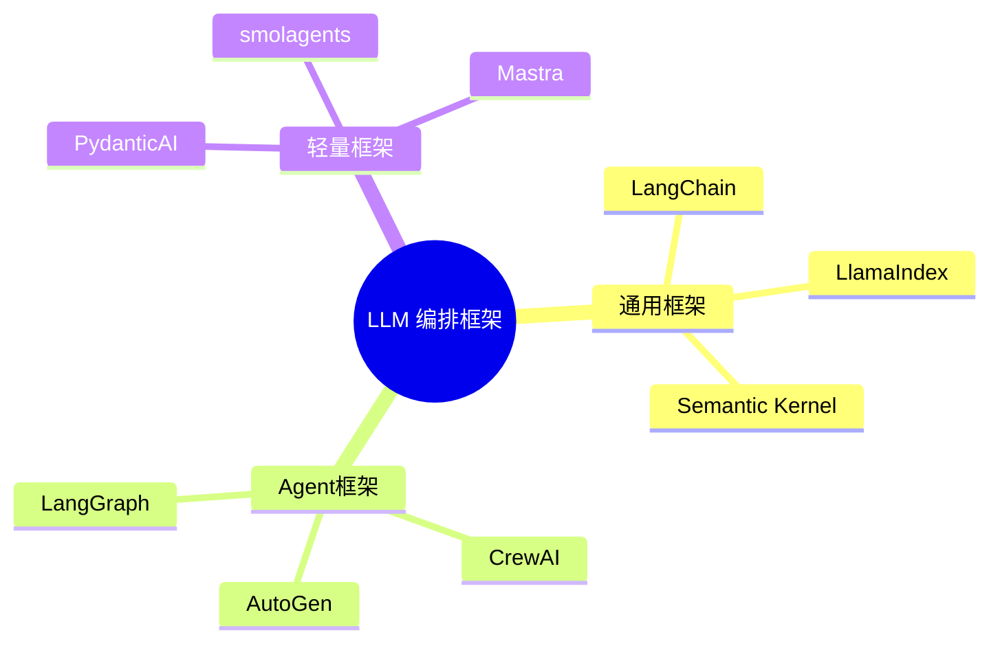

# LLM 编排框架生态对比

> **创建日期：** 2026-06-06
> **前置知识：** LangChain 入门、Agent 框架

---

## 一、编排框架全景图

---

## 二、三大通用框架对比

| 维度 | LangChain | LlamaIndex | Semantic Kernel |
|------|-----------|------------|-----------------|
| **开发者** | LangChain Inc | LlamaIndex Inc | 微软 |
| **语言** | Python / JS | Python / TS | C# / Python / Java |
| **核心定位** | 通用 LLM 编排 | 数据索引与检索 | 企业级 AI 编排 |
| **RAG 能力** | ⭐⭐⭐ | ⭐⭐⭐⭐⭐ | ⭐⭐⭐ |
| **Agent 能力** | ⭐⭐⭐⭐⭐ | ⭐⭐⭐ | ⭐⭐⭐⭐ |
| **企业特性** | LangSmith 监控 | 数据连接器丰富 | Azure 集成、安全合规 |
| **学习曲线** | 中等 | 较低 | 中等 |

---

## 三、各框架擅长领域

| 框架 | 最擅长 | 不足 |
|------|--------|------|
| **LangChain** | 复杂 Agent 工作流、多工具编排 | 抽象层多，调试困难 |
| **LlamaIndex** | 文档解析、数据索引、高级 RAG | Agent 能力弱 |
| **Semantic Kernel** | 企业级集成（Azure/Office）、多语言 | 社区生态较小 |
| **LangGraph** | 有状态多步 Agent 工作流 | 学习曲线陡峭 |
| **CrewAI** | 角色驱动的多 Agent 协作 | 灵活性受限 |
| **AutoGen** | 对话驱动的多 Agent 协作 | 调试复杂 |
| **PydanticAI** | 结构化输出 + 类型安全 | 功能较基础 |

---

## 四、多框架组合策略

::: tip 最佳实践
不要锁定单一框架。根据场景选择最合适的框架，多框架组合是生产环境的常态。
:::

| 组合方案 | 适用场景 | 说明 |
|----------|----------|------|
| **LlamaIndex（检索） + LangChain（编排）** | 复杂 RAG + Agent | LlamaIndex 做文档处理，LangChain 做编排 |
| **PydanticAI（输出） + 向量数据库（检索）** | 轻量 RAG | 极简组合 |
| **CrewAI（角色） + LangChain（工具）** | 多角色协作 | CrewAI 做分工，LangChain 做工具链 |
| **LangGraph（工作流） + OpenAI SDK（模型）** | 复杂工作流 | LangGraph 管流程，OpenAI SDK 管模型 |

---

## 五、2026 年趋势

1. **从重型到轻型**：开发者从 LangChain 向 PydanticAI/smolagents 等轻量框架迁移
2. **MCP 标准化**：工具调用统一到 MCP 协议，降低框架锁定
3. **可观测性成标配**：LangSmith、Weave、Phoenix 等观测工具普及
4. **TypeScript 生态崛起**：Mastra 等 TS 框架吸引全栈开发者

---

## 六、面试重点

::: warning 高频考点
1. **LangChain 和 LlamaIndex 的核心区别？** 如何选择？
2. **LangChain 的优缺点？** 什么时候不适合用？
3. **轻量框架（PydanticAI）和重型框架（LangChain）如何选择？**
4. **多框架组合的常见方案有哪些？**
5. **2026 年编排框架的发展趋势？**
:::