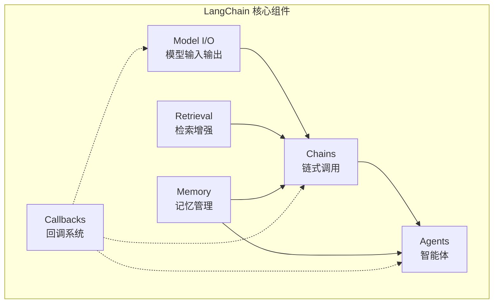

# LangChain 入门

> **创建日期：** 2026-06-06
> **前置知识：** LLM 基础、Prompt Engineering、RAG

---

## 一、LangChain 是什么？

LangChain 是当前最流行的 **LLM 应用开发框架**，提供了一套标准化的组件来构建 AI 应用。

::: tip 核心价值
LangChain 不是帮你写 AI 逻辑，而是帮你**组织** AI 逻辑——让 Prompt、模型调用、工具、记忆等组件可以像乐高一样拼接。
:::

## 二、核心架构



| 组件 | 作用 | 类比 |
|------|------|------|
| **Model I/O** | 封装 LLM 调用、Prompt 模板、输出解析 | 数据库驱动 |
| **Retrieval** | 文档加载、切分、向量存储、检索 | ORM 查询层 |
| **Chains** | 将多个组件串联成管道 | 责任链模式 |
| **Agents** | LLM 自主决策调用哪些工具 | 策略模式 |
| **Memory** | 对话历史管理、上下文保持 | Session 管理 |
| **Callbacks** | 日志、监控、流式输出 | AOP 切面 |

---

## 三、快速上手

### 3.1 安装

```bash
pip install langchain langchain-openai
```

### 3.2 第一个 Chain

```python
from langchain_openai import ChatOpenAI
from langchain_core.prompts import ChatPromptTemplate
from langchain_core.output_parsers import StrOutputParser

# 1. 创建模型
llm = ChatOpenAI(model="gpt-4o", temperature=0)

# 2. 定义 Prompt 模板
prompt = ChatPromptTemplate.from_messages([
    ("system", "你是一个{role}。"),
    ("user", "{question}")
])

# 3. 构建 Chain：Prompt → LLM → 输出解析
chain = prompt | llm | StrOutputParser()

# 4. 运行
result = chain.invoke({
    "role": "Java 架构师",
    "question": "如何设计一个高可用的微服务系统？"
})
print(result)
```

::: tip LCEL（LangChain Expression Language）
`|` 管道操作符是 LangChain 的核心语法，类似 Linux 管道：数据从左到右流动。
:::

---

## 四、与 LlamaIndex 的定位差异

| 维度 | LangChain | LlamaIndex |
|------|-----------|------------|
| **定位** | 通用 LLM 应用框架 | 数据索引和检索框架 |
| **核心能力** | Chain/Agent 编排、工具集成 | 文档解析、索引构建、检索 |
| **RAG** | 支持，但非核心 | 核心能力，更专业 |
| **Agent** | 强大 | 较弱 |
| **学习曲线** | 中等 | 较低 |
| **适用场景** | 需要编排的复杂应用 | 以文档检索为核心的应用 |

::: tip 选择建议
- 数据索引/RAG 为主 → LlamaIndex
- 需要 Agent/工具调用/复杂编排 → LangChain
- 两者可以组合使用：LlamaIndex 做检索，LangChain 做编排
:::

---

## 五、面试高频题

### Q1: LangChain 的核心组件有哪些？各有什么作用？

**详细答案：** 我们项目用 LangChain 0.3.x 搭了一套智能客服系统，六大组件基本都用上了。Model I/O 这块，我们当时对接了 OpenAI 和 Azure OpenAI 两套 API，靠 LangChain 的统一封装，切换模型只需要改一个参数名，不用动业务代码。Retrieval 模块我们用来做知识库检索，文档加载、切分、向量化一条龙，上线后发现中文文档用 RecursiveCharacterTextSplitter 默认参数切出来效果很差——经常把一句话拦腰截断，后来调了 chunk_size 到 800 配合 overlap 100 才稳住。Chains 是我们最常用的，用 LCEL 管道把 prompt -> llm -> parser 串起来，代码比直接调 API 清晰很多。Agent 我们用在需要多步推理的售后场景，比如用户说"帮我查上次那个退款进度"，Agent 先调订单查询工具拿到订单号，再调退款查询工具查到进度，这个动态决策链用 Chain 写会很别扭。Memory 用的是 ConversationSummaryBufferMemory，既不会像全量 buffer 那样 Token 越滚越多——我们测算过，超过 8 轮对话后如果不做摘要，每次请求要多消耗 2000+ Token。Callbacks 我们主要用自定义 handler 把每次 LLM 调用的耗时和 Token 消费打到 Prometheus，有一次发现 P99 延迟突然飙到 12 秒，追下来才知道是某条 prompt template 里不小心拼了一堆无关上下文。

### Q2: LCEL（管道操作符）是什么？有什么好处？

**详细答案：** 我们项目大量用了 LCEL，说实话，一开始看到 `chain = prompt | llm | StrOutputParser()` 这个语法觉得挺花哨的，用习惯了以后是真香。最直接的好处是代码结构变清晰了——以前用 OpenAI SDK 裸写的时候，prompt 拼接、模型调用、结果解析全混在一个函数里，出了 bug 得从 50 行代码里找问题。用 LCEL 后数据流一目了然，我们团队新来的同事基本上一周就能上手改 chain。

Parallel 那个能力我们也用上了。有一个场景是给用户问题同时匹配 FAQ 库和知识库，两个检索一个调 Milvus 一个调 ES，用 `RunnableParallel` 包一下就能并行跑，延迟从串行的 1.8 秒降到 900ms 左右。不过也踩过坑：有一次我们在 chain 里嵌了 9 个组件搞了个超长管道，调试的时候完全不知道中间哪个环节出了问题——后来定了规矩，单个 chain 不超过 5 个组件，复杂逻辑拆成多个子 chain 然后组合。另外，`.stream()` 确实开箱即用，我们对接 SSE 输出给前端时没额外写流式逻辑，直接 `chain.stream(input)` 一块块吐给客户端就行，用户体验和 ChatGPT 差不多。

### Q3: LangChain 和 LlamaIndex 的区别是什么？如何选择？

**详细答案：** 我们项目两个框架都用过，现在算是各司其职。LangChain 我们用来做整个对话系统的编排层——路由分发、工具调用、记忆管理都在这里。LlamaIndex 我们专门用来做知识库的索引和检索，因为我们知识库里文档种类很杂，有 PDF 的技术手册、Markdown 的 FAQ、还有从 Confluence 同步过来的表格，LlamaIndex 的文档加载器确实省心，基本不需要自己写解析逻辑。

有个具体场景能说明两者的区别。我们的售后知识库大概有 5 万篇文档，涉及不同产品线，用户问一个问题可能需要跨产品检索。这种场景如果用 LangChain 裸写——自己调向量库、自己拼接上下文、自己搞 re-rank——代码量会巨大。LlamaIndex 里一个 `SubQuestionQueryEngine` 就搞定了，它自动把复杂问题拆成子问题分别检索然后合并。但反过来，做完检索后的对话管理、多轮追问、工具调用这些，LlamaIndex 就力不从心了，还是得回到 LangChain 的 Agent 框架。所以我们现在的架构是 LlamaIndex 负责"找什么"，LangChain 负责"怎么用"。另外如果你项目比较轻量，比如只是做一个简单的客服机器人，其实两个都不用，直接用 OpenAI SDK + 手动管理向量库就够了，框架有时候反而增加心智负担。

### Q4: LangChain 的 Chain 和 Agent 有什么区别？

**详细答案：** 这个我们项目体会很深。Chain 就像写好的 Python 脚本，跑之前你就知道每一步会做什么——用户输入过来，先走 prompt 模板、再调 LLM、最后解析输出，路径是死的。我们的 FAQ 匹配场景就用 Chain，问题来了查向量库、拼 prompt、出结果，确定性高，延迟也稳定在 600ms 左右。Agent 则像给 LLM 发了张空白支票——它自己决定调哪些工具、调几次、什么顺序。我们售后场景用 Agent，因为用户可能先查订单、再查物流、再申请退款，三件事串在一起，中间还可能因为订单号不对需要回头重新查。

Agent 灵活是灵活，但我们踩过很实在的坑。有一次 `AgentExecutor` 的 max_iterations 设了 15，结果一个用户提了个模糊问题，Agent 在"查订单"和"查物流"之间反复横跳了 12 轮才停下来，单次请求烧了 15000 Token。后来我们加了两个限制：max_iterations 降到 5，同时给 Tool 的 description 写得非常精确——"仅在用户明确提供订单号时调用此工具，如果没有订单号，回复'请提供订单号'而不是猜测"。另外在实际项目中我们不是二选一，是搭配用的——Agent 做顶层决策和路由，具体每个步骤内部走 Chain 保证执行稳定，这样既有灵活性又不至于失控。

### Q5: LangChain 中如何处理流式输出？

**详细答案：** 我们做对话系统时流式输出是刚需——用户不能等 5 秒才看到回答，体验太差了。LangChain 这块做得不错，只要用 LCEL 构建的 chain，直接 `.stream()` 就能按 token 逐块输出。我们后端是 FastAPI + SSE，大概就十来行代码：把 `chain.stream(input)` 的每次 yield 包装成 SSE event 推给前端。前端收到第一个 token 通常在 800ms 左右，用户基本无感。

但有一个坑：`StrOutputParser` 下流式没问题，一旦你需要输出 JSON（比如结构化抽取），就麻烦了。我们在做一个实体抽取功能时，要求 LLM 返回 JSON 格式，用了 `JsonOutputParser`，结果流式模式下每次 chunk 都是不完整的 JSON 片段，parser 直接报错。最后折中方案是先 `.invoke()` 拿到完整结果再解析，前端用骨架屏过渡，虽然不是实时逐字输出但起码不报错了。还有个细节，如果你在 chain 中间插了一个自定义的 `RunnableLambda`，而且这个 lambda 不支持流式处理，那流式链路会被打断——LangChain 会自动等这个 lambda 执行完才把累积结果传给下游。所以我们项目里的自定义函数要么标注支持流式，要么放在 chain 最后面。

### Q6: LangChain 的优缺点是什么？什么时候不适合用 LangChain？

**详细答案：** 我们项目整个后端是 LangChain 搭起来的，用了快一年，优缺点都感受很深。优点方面，生态真是大——我们需要对接 Milvus、对接公司内部的 ES、对接各种文档格式，LangChain 基本都有现成的集成，不用自己写胶水代码。Agent 框架也成熟，OpenAI 的 function calling 出来没几天 LangChain 就封装好了 `create_openai_tools_agent`，我们迁移过来几乎没有改业务逻辑。还有就是社区活跃，我们在用 `ConversationSummaryBufferMemory` 时碰到一个序列化 bug，GitHub issue 一搜就找到 workaround，省了不少时间。

但槽点也不少。第一个是版本升级太痛苦——我们从 0.1.x 升到 0.2.x 那次，`initialize_agent` 被废弃了，所有 Agent 代码得重写。第二个是抽象层确实多，有一次 debug 一个 callback 没触发的问题，追了四层调用栈才找到是 `RunnableConfig` 没传对，如果是直接调 SDK 早就发现了。第三个是简单场景没必要用，我们有一个内部小工具只做文本分类，最开始也用 LangChain，后来发现去掉框架直接用 `openai.chat.completions.create` 代码反而少了一半。我觉得现在的趋势是：复杂多 Agent 工作流用 LangChain 确实合适；简单 CRUD 式的 LLM 调用用小框架（比如 PydanticAI）甚至裸 SDK 就够了；千万别为了用框架而用框架。