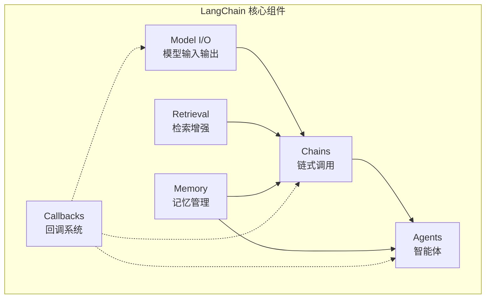

# LangChain 入门

> **创建日期：** 2026-06-06
> **前置知识：** LLM 基础、Prompt Engineering、RAG

---

## 一、LangChain 是什么？

LangChain 是当前最流行的 **LLM 应用开发框架**，提供了一套标准化的组件来构建 AI 应用。

::: tip 核心价值
LangChain 不是帮你写 AI 逻辑，而是帮你**组织** AI 逻辑——让 Prompt、模型调用、工具、记忆等组件可以像乐高一样拼接。
:::

## 二、核心架构



| 组件 | 作用 | 类比 |
|------|------|------|
| **Model I/O** | 封装 LLM 调用、Prompt 模板、输出解析 | 数据库驱动 |
| **Retrieval** | 文档加载、切分、向量存储、检索 | ORM 查询层 |
| **Chains** | 将多个组件串联成管道 | 责任链模式 |
| **Agents** | LLM 自主决策调用哪些工具 | 策略模式 |
| **Memory** | 对话历史管理、上下文保持 | Session 管理 |
| **Callbacks** | 日志、监控、流式输出 | AOP 切面 |

---

## 三、快速上手

### 3.1 安装

```bash
pip install langchain langchain-openai
```

### 3.2 第一个 Chain

```python
from langchain_openai import ChatOpenAI
from langchain_core.prompts import ChatPromptTemplate
from langchain_core.output_parsers import StrOutputParser

# 1. 创建模型
llm = ChatOpenAI(model="gpt-4o", temperature=0)

# 2. 定义 Prompt 模板
prompt = ChatPromptTemplate.from_messages([
    ("system", "你是一个{role}。"),
    ("user", "{question}")
])

# 3. 构建 Chain：Prompt → LLM → 输出解析
chain = prompt | llm | StrOutputParser()

# 4. 运行
result = chain.invoke({
    "role": "Java 架构师",
    "question": "如何设计一个高可用的微服务系统？"
})
print(result)
```

::: tip LCEL（LangChain Expression Language）
`|` 管道操作符是 LangChain 的核心语法，类似 Linux 管道：数据从左到右流动。
:::

---

## 四、与 LlamaIndex 的定位差异

| 维度 | LangChain | LlamaIndex |
|------|-----------|------------|
| **定位** | 通用 LLM 应用框架 | 数据索引和检索框架 |
| **核心能力** | Chain/Agent 编排、工具集成 | 文档解析、索引构建、检索 |
| **RAG** | 支持，但非核心 | 核心能力，更专业 |
| **Agent** | 强大 | 较弱 |
| **学习曲线** | 中等 | 较低 |
| **适用场景** | 需要编排的复杂应用 | 以文档检索为核心的应用 |

::: tip 选择建议
- 数据索引/RAG 为主 → LlamaIndex
- 需要 Agent/工具调用/复杂编排 → LangChain
- 两者可以组合使用：LlamaIndex 做检索，LangChain 做编排
:::

---

## 五、面试高频题

### Q1: LangChain 的核心组件有哪些？各有什么作用？

**详细答案：** LangChain 的核心组件分为六大模块，每个模块解决 LLM 应用开发中的一类特定问题。Model I/O（模型输入输出）模块封装了 LLM 调用、Prompt 模板和输出解析，是 LangChain 的"入口层"，开发者通过它统一管理不同模型的调用方式（OpenAI、Anthropic、本地模型等），无需关心底层 API 差异。Retrieval（检索增强）模块负责文档加载、文本切分、向量存储和检索，是构建 RAG 应用的基础设施，提供了从原始文档到检索结果的完整链路。

Chains（链式调用）模块是 LangChain 的核心编排机制，通过管道操作符（`|`）将多个组件串联成处理管道，实现数据在组件间的流动。Agents（智能体）模块让 LLM 具有自主决策能力，LLM 可以根据用户意图自主选择调用哪些工具、按什么顺序调用，这是 LangChain 区别于简单 API 封装的关键能力。Memory（记忆管理）模块管理对话历史和上下文状态，支持多种记忆策略（Buffer、Summary、Window 等），解决 LLM 的"无状态"问题。Callbacks（回调系统）模块提供日志、监控、流式输出等横切关注点，类似 AOP 切面编程，可以在不修改业务代码的情况下添加观测能力。

这些组件之间的协作关系是：Model I/O 输出数据进入 Chains，Chains 根据需要调用 Retrieval 获取外部知识，Agents 在 Chains 的基础上增加了自主决策能力，Memory 为 Chains 和 Agents 提供上下文持久化，Callbacks 则贯穿所有环节提供可观测性。理解这六大组件及其协作关系，是掌握 LangChain 的关键。

### Q2: LCEL（管道操作符）是什么？有什么好处？

**详细答案：** LCEL（LangChain Expression Language）是 LangChain 的核心语法，通过管道操作符 `|` 将多个组件串联成处理管道。它的设计灵感来自 Linux 管道和函数式编程的组合子（Combinator），数据从左到右流动，每个组件接收上游的输出、处理后传给下游。例如 `chain = prompt | llm | StrOutputParser()` 表示：先将输入传给 Prompt 模板生成完整的 Prompt 文本，再传给 LLM 生成回复，最后通过输出解析器提取纯文本内容。

LCEL 的核心优势在于：第一，声明式编程，代码结构清晰，一眼就能看出数据流向和处理步骤，相比传统的命令式代码更易读、易维护。第二，自动并行化，LCEL 可以自动识别可并行的分支（如 `RunnableParallel`），在需要同时调用多个 LLM 或检索多个数据源时，自动并行执行，提升性能。第三，内置流式支持，所有 LCEL 构建的 Chain 天然支持流式输出（`.stream()`），无需额外配置。第四，内置异步支持，所有 LCEL 组件都支持异步调用（`.ainvoke()`），方便集成到异步框架中。

第五，自动追踪，LCEL 的每个组件调用都会自动生成追踪信息，配合 LangSmith 等工具可以方便地进行调试和性能分析。第六，可组合性，LCEL 组件可以像乐高一样任意组合，一个 Chain 的输出可以作为另一个 Chain 的输入，形成复杂的处理管道。需要注意的是，LCEL 虽然强大，但滥用会导致"管道地狱"（一个 Chain 串联过多组件，难以调试），建议一个 Chain 不超过 5-7 个组件，复杂逻辑拆分为多个子 Chain。

### Q3: LangChain 和 LlamaIndex 的区别是什么？如何选择？

**详细答案：** LangChain 和 LlamaIndex 的定位有本质区别。LangChain 是一个通用 LLM 应用开发框架，核心能力是 Chain/Agent 编排、工具集成和多组件协调，它的目标是让开发者能够像搭积木一样构建复杂的 AI 应用流程。LlamaIndex 是一个数据索引和检索框架，核心能力是文档解析、索引构建、高级检索策略（如递归检索、树状索引、知识图谱检索），它的目标是让 LLM 能够高效地访问和利用海量外部数据。

在 RAG 能力上，LlamaIndex 明显更专业。它提供了丰富的文档加载器（支持 100+ 种格式）、多样的索引结构（向量索引、树索引、关键词索引、知识图谱索引）、多种检索策略（递归检索、混合检索、子问题分解）和专门的评估工具。LangChain 也支持 RAG，但更像是一个"集成层"，你需要自己选择和组合向量库、文档加载器等组件。在 Agent 能力上，LangChain 则明显更强，提供了丰富的 Agent 类型（OpenAI Tools Agent、ReAct Agent、Structured Chat Agent 等）、工具定义和管理机制、多 Agent 协作支持。

选择建议：如果项目以文档检索和知识库问答为核心，数据量大且检索质量要求高，优先选择 LlamaIndex；如果项目需要复杂的 Agent 工作流、多工具编排、多轮对话管理等，优先选择 LangChain。两者并不互斥：很多生产项目使用 LlamaIndex 做检索（发挥其专业优势），使用 LangChain 做编排（发挥其编排优势），通过 API 或共享组件组合使用。另外，如果项目比较轻量，也可以考虑不用任何框架，直接使用 OpenAI SDK 或其他模型 SDK，避免框架的抽象开销。

### Q4: LangChain 的 Chain 和 Agent 有什么区别？

**详细答案：** Chain 和 Agent 是 LangChain 中两种不同的编排模式，核心区别在于"决策权在谁手里"。Chain 是确定性的处理管道，执行路径在代码中预先定义，数据按照固定的顺序在组件间流动。例如，一个 RAG Chain 的执行路径是固定的：输入问题 -> 检索文档 -> 拼接 Prompt -> LLM 生成 -> 输出。Chain 的优点是可控、可预测、性能稳定，缺点是缺乏灵活性，无法根据输入动态调整执行路径。

Agent 是自主决策的执行模式，LLM 根据用户输入自主决定：调用哪些工具、按什么顺序调用、何时停止。Agent 的执行路径是动态的，无法在代码中预先确定。例如，一个客服 Agent 可能先调用订单查询工具，如果订单状态是"已发货"，则调用物流查询工具；如果订单状态是"待付款"，则提示用户付款。这种动态决策能力是 Agent 的核心价值，但也带来了不可预测性：Agent 可能做出错误的决策、调用错误的工具、陷入无限循环等。

从实现角度看，Chain 使用 LCEL 管道语法构建，代码结构清晰；Agent 需要使用 `create_openai_tools_agent` 等函数创建，配合 `AgentExecutor` 管理执行循环。Chain 适合处理流程固定、逻辑明确的任务（如 RAG 问答、文本摘要、翻译）；Agent 适合处理需要动态决策、多步骤操作、工具选择的复杂任务（如客服系统、自动化工作流、数据查询分析）。在实际项目中，通常将两者结合使用：Agent 作为顶层决策者，内部使用多个 Chain 处理具体任务。

### Q5: LangChain 中如何处理流式输出？

**详细答案：** LangChain 的流式输出通过 `.stream()` 方法实现，基于 LCEL 的流式架构，所有使用 LCEL 构建的 Chain 都天然支持流式输出。基本用法是 `for chunk in chain.stream(input): print(chunk)`，每次迭代返回一个 Token 或内容片段，可以实现类似 ChatGPT 的逐字输出效果。流式输出的关键是 LLM 必须支持流式模式（`streaming=True`），大多数主流模型的 API 都支持。

流式输出的实现原理：LCEL 在构建 Chain 时，会自动检测每个组件是否支持流式处理。如果上游组件输出流式数据，下游组件需要能够处理流式输入，否则 LCEL 会自动等待上游完成后再传给下游。例如，`prompt | llm | StrOutputParser()` 中，LLM 产生流式输出，StrOutputParser 支持流式输入，所以整个 Chain 可以实现端到端的流式输出。但如果中间插入一个不支持流式的 RunnableLambda，流式会被打断。

在实际应用中，流式输出常用于聊天应用和实时交互场景。结合 FastAPI 的 Server-Sent Events（SSE），可以实现类似 ChatGPT 的流式响应。需要注意的问题：第一，流式输出时，输出解析器（如 JSON 解析器）可能无法正常工作，因为不完整的 JSON 无法解析，需要在流式完成后做最终解析；第二，Callbacks 中的 `on_llm_new_token` 回调可以在每个 Token 生成时触发，适合做实时进度展示；第三，流式输出虽然提升了用户体验，但增加了实现的复杂度，非实时交互场景（如批量处理）不需要流式输出。

### Q6: LangChain 的优缺点是什么？什么时候不适合用 LangChain？

**详细答案：** LangChain 的优点包括：第一，生态丰富，拥有最庞大的社区和最多的集成（数百个向量数据库、文档加载器、工具集成），遇到问题容易找到解决方案；第二，编排能力强，LCEL 和 Agent 框架提供了灵活的编排机制，能构建复杂的工作流；第三，可观测性好，配合 LangSmith 等工具可以进行详细的调试和性能分析；第四，文档和教程丰富，学习资源多。

LangChain 的缺点也同样明显：第一，抽象层次多，代码追踪困难，"魔法"太多导致调试时需要在源码中跳转多层；第二，过度封装，简单任务可能只需要几行 OpenAI SDK 代码，用 LangChain 反而需要更多代码和配置；第三，版本迭代快，API 不稳定，从 0.0.x 到 0.1.x 到 0.2.x 经历了多次破坏性变更，升级成本高；第四，性能开销，框架的抽象层带来额外的性能开销，在高吞吐场景下可能成为瓶颈。

不适合使用 LangChain 的场景：第一，简单项目，如果只是调用 LLM API 做简单的问答，直接用 OpenAI SDK 或其他模型 SDK 更简洁高效；第二，对性能要求极高的场景，框架的抽象层会带来额外延迟，建议直接使用底层 SDK；第三，需要精细控制每个环节的场景，LangChain 的"魔法"可能阻碍精细控制；第四，团队不熟悉 LangChain 的场景，学习曲线陡峭导致开发效率反而降低。2025-2026 年的趋势是：简单项目倾向于使用轻量框架（如 PydanticAI）或直接使用 SDK，复杂项目才考虑 LangChain。