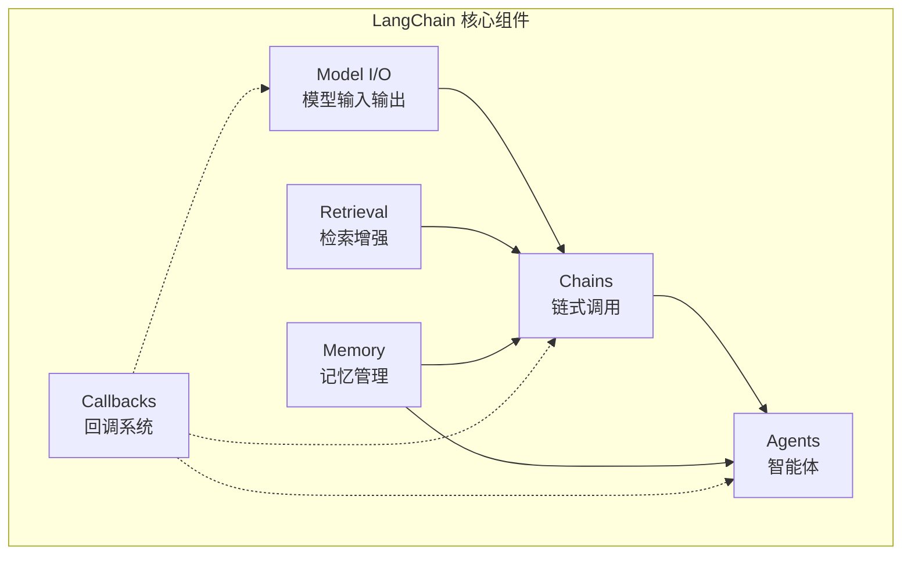

# LangChain 入门

> **创建日期：** 2026-06-06
> **前置知识：** LLM 基础、Prompt Engineering、RAG

---

## 一、LangChain 是什么？

LangChain 是当前最流行的 **LLM 应用开发框架**，提供了一套标准化的组件来构建 AI 应用。

::: tip 核心价值
LangChain 不是帮你写 AI 逻辑，而是帮你**组织** AI 逻辑——让 Prompt、模型调用、工具、记忆等组件可以像乐高一样拼接。
:::

## 二、核心架构



| 组件 | 作用 | 类比 |
|------|------|------|
| **Model I/O** | 封装 LLM 调用、Prompt 模板、输出解析 | 数据库驱动 |
| **Retrieval** | 文档加载、切分、向量存储、检索 | ORM 查询层 |
| **Chains** | 将多个组件串联成管道 | 责任链模式 |
| **Agents** | LLM 自主决策调用哪些工具 | 策略模式 |
| **Memory** | 对话历史管理、上下文保持 | Session 管理 |
| **Callbacks** | 日志、监控、流式输出 | AOP 切面 |

---

## 三、快速上手

### 3.1 安装

```bash
pip install langchain langchain-openai
```

### 3.2 第一个 Chain

```python
from langchain_openai import ChatOpenAI
from langchain_core.prompts import ChatPromptTemplate
from langchain_core.output_parsers import StrOutputParser

# 1. 创建模型
llm = ChatOpenAI(model="gpt-4o", temperature=0)

# 2. 定义 Prompt 模板
prompt = ChatPromptTemplate.from_messages([
    ("system", "你是一个{role}。"),
    ("user", "{question}")
])

# 3. 构建 Chain：Prompt → LLM → 输出解析
chain = prompt | llm | StrOutputParser()

# 4. 运行
result = chain.invoke({
    "role": "Java 架构师",
    "question": "如何设计一个高可用的微服务系统？"
})
print(result)
```

::: tip LCEL（LangChain Expression Language）
`|` 管道操作符是 LangChain 的核心语法，类似 Linux 管道：数据从左到右流动。
:::

---

## 四、与 LlamaIndex 的定位差异

| 维度 | LangChain | LlamaIndex |
|------|-----------|------------|
| **定位** | 通用 LLM 应用框架 | 数据索引和检索框架 |
| **核心能力** | Chain/Agent 编排、工具集成 | 文档解析、索引构建、检索 |
| **RAG** | 支持，但非核心 | 核心能力，更专业 |
| **Agent** | 强大 | 较弱 |
| **学习曲线** | 中等 | 较低 |
| **适用场景** | 需要编排的复杂应用 | 以文档检索为核心的应用 |

::: tip 选择建议
- 数据索引/RAG 为主 → LlamaIndex
- 需要 Agent/工具调用/复杂编排 → LangChain
- 两者可以组合使用：LlamaIndex 做检索，LangChain 做编排
:::

---

## 五、面试重点

::: warning 高频考点
1. **LangChain 的核心组件有哪些？** 各有什么作用？
2. **LCEL（管道操作符）是什么？** 有什么好处？
3. **LangChain 和 LlamaIndex 的区别？** 如何选择？
4. **LangChain 的 Chain 和 Agent 有什么区别？**
5. **LangChain 中如何处理流式输出？**
:::