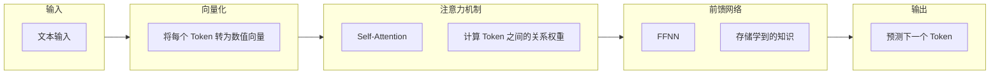
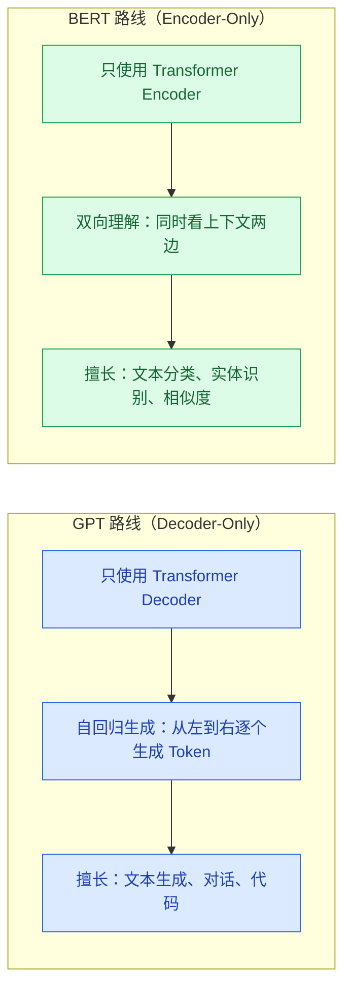

# 大模型基础

> **创建日期：** 2026-06-06
> **前置知识：** 无，面向后端开发者

---

## 一、LLM 是什么？

大语言模型（Large Language Model, LLM）本质上是一个**超大规模的概率预测引擎**——给定一段文本，预测下一个最可能出现的 token。

::: tip 类比理解
如果把传统编程比作"精确计算器"（输入 1+1，输出 2），LLM 就像"联想填空器"——它不计算，而是根据上下文推测最合理的续写。
:::

---

## 二、Transformer 架构心智模型

你不需要从头实现 Transformer，但需要一个可运作的心智模型。Transformer 由三个核心原语组成：



### 2.1 三大核心原语

| 原语 | 做什么 | 类比理解 |
|------|--------|----------|
| **向量 / Embedding** | 将文本转为数值向量，语义相近的文本向量距离也近 | 就像给每个词分配一个 GPS 坐标，意思相近的词坐标也相近 |
| **注意力机制（Attention）** | 让模型理解上下文关系，知道哪些词对当前词最重要 | 就像阅读时"聚焦"关键词，忽略无关内容 |
| **前馈网络（FFNN）** | 存储模型学到的知识，是模型的"记忆库" | 就像数据库存储数据，FFNN 存储训练学到的知识模式 |

### 2.2 为什么 LLM 会产生"幻觉"？

LLM 的本质是**预测下一个 token**，而不是**查数据库**。当它遇到不确定的内容时，它会基于训练数据中的模式"编造"最合理的回答。

- 幻觉不是 Bug，是 LLM 工作原理的固有特性
- 减少幻觉的方法：RAG（检索增强生成）、约束输出格式、提供充分上下文

---

## 三、GPT 路线 vs BERT 路线



> 当前主流大模型（GPT-4o、Claude、Gemini、DeepSeek、Qwen 等）全部采用 **GPT 路线（Decoder-Only）**。

---

## 四、API 调用范式

### 4.1 OpenAI Compatible API

当前主流模型基本都兼容 OpenAI API 格式，只需替换 `base_url` 和 `api_key` 即可切换模型：

```python
# 统一调用模式 - 几乎所有模型都支持此格式
from openai import OpenAI

# 示例：调用 DeepSeek
client = OpenAI(
    api_key="your-api-key",
    base_url="https://api.deepseek.com/v1"  # 替换为不同模型的 API 地址
)

response = client.chat.completions.create(
    model="deepseek-chat",  # 替换为不同模型名称
    messages=[
        {"role": "system", "content": "你是一个有帮助的助手"},
        {"role": "user", "content": "解释一下什么是 Transformer"}
    ],
    temperature=0.7,  # 控制随机性（0=确定，1=随机）
    max_tokens=1000   # 限制输出长度
)

print(response.choices[0].message.content)
```

### 4.2 核心参数说明

| 参数 | 含义 | 推荐值 | 说明 |
|------|------|--------|------|
| **temperature** | 控制输出的随机性 | 0~0.3（精准任务）/ 0.7~1.0（创意任务） | 越低越确定，越高越随机 |
| **top_p** | 核采样阈值 | 0.9~1.0 | 只从累积概率达到 top_p 的 token 中采样 |
| **max_tokens** | 最大输出 token 数 | 按需设置 | 注意总 token 数不能超过模型上下文窗口 |
| **presence_penalty** | 话题重复惩罚 | -2.0~2.0 | 正值鼓励谈论新话题 |
| **frequency_penalty** | 词语重复惩罚 | -2.0~2.0 | 正值减少重复用词 |

### 4.3 流式输出（SSE）

```python
# 流式输出 - 实现打字机效果
stream = client.chat.completions.create(
    model="deepseek-chat",
    messages=[{"role": "user", "content": "写一首诗"}],
    stream=True  # 开启流式输出
)

for chunk in stream:
    if chunk.choices[0].delta.content:
        print(chunk.choices[0].delta.content, end="", flush=True)
```

### 4.4 各模型 API 地址速查

| 模型 | API Base URL | 备注 |
|------|-------------|------|
| OpenAI（GPT-4o 等） | `https://api.openai.com/v1` | 需要海外网络 |
| DeepSeek | `https://api.deepseek.com/v1` | 国内可用，价格低 |
| 通义千问（Qwen） | `https://dashscope.aliyuncs.com/compatible-mode/v1` | 阿里云，需开通 |
| 月之暗面（Kimi） | `https://api.moonshot.cn/v1` | 长文本能力强 |
| 智谱（GLM） | `https://open.bigmodel.cn/api/paas/v4` | 清华系 |
| Ollama（本地） | `http://localhost:11434/v1` | 本地部署，完全免费 |

---

## 五、Function Calling 快速入门

Function Calling 让模型能够调用外部工具（函数），是实现 Agent 的基础。

```python
# 定义工具（函数描述）
tools = [
    {
        "type": "function",
        "function": {
            "name": "get_weather",
            "description": "获取指定城市的天气信息",
            "parameters": {
                "type": "object",
                "properties": {
                    "city": {
                        "type": "string",
                        "description": "城市名称，如'北京'"
                    }
                },
                "required": ["city"]
            }
        }
    }
]

# 调用模型，模型会返回函数调用请求而非直接回答
response = client.chat.completions.create(
    model="deepseek-chat",
    messages=[{"role": "user", "content": "北京今天天气怎么样？"}],
    tools=tools
)

# 判断是否需要调用工具
if response.choices[0].message.tool_calls:
    tool_call = response.choices[0].message.tool_calls[0]
    print(f"模型想调用工具: {tool_call.function.name}")
    print(f"参数: {tool_call.function.arguments}")
```

---

## 六、面试重点

::: warning 高频考点
1. **Transformer 的核心机制是什么？** Self-Attention 如何工作？
2. **GPT 和 BERT 的核心区别是什么？** 为什么现在主流都是 GPT 路线？
3. **temperature 和 top_p 的区别？** 如何控制模型输出的随机性？
4. **Function Calling 的原理是什么？** 模型如何知道该调用哪个工具？
5. **LLM 为什么会产生幻觉？** 如何减少幻觉？
:::

::: danger 容易翻车的点
- 说不清楚 Attention 的作用，只会背"注意力机制"
- 不理解 temperature 的实际效果，只会说"控制随机性"
- 把 Function Calling 误解为模型真的在执行函数
:::