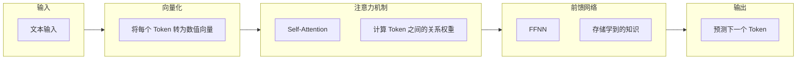
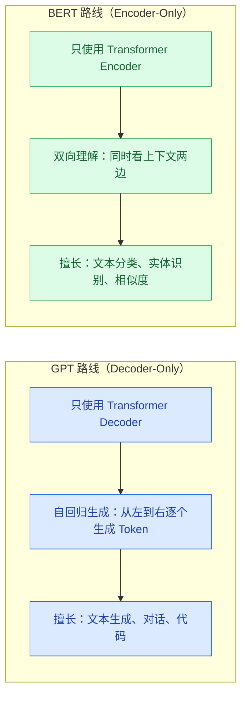

# 大模型基础

> **创建日期：** 2026-06-06
> **前置知识：** 无，面向后端开发者

---

## 一、LLM 是什么？

大语言模型（Large Language Model, LLM）本质上是一个**超大规模的概率预测引擎**——给定一段文本，预测下一个最可能出现的 token。

::: tip 类比理解
如果把传统编程比作"精确计算器"（输入 1+1，输出 2），LLM 就像"联想填空器"——它不计算，而是根据上下文推测最合理的续写。
:::

---

## 二、Transformer 架构心智模型

你不需要从头实现 Transformer，但需要一个可运作的心智模型。Transformer 由三个核心原语组成：



### 2.1 三大核心原语

| 原语 | 做什么 | 类比理解 |
|------|--------|----------|
| **向量 / Embedding** | 将文本转为数值向量，语义相近的文本向量距离也近 | 就像给每个词分配一个 GPS 坐标，意思相近的词坐标也相近 |
| **注意力机制（Attention）** | 让模型理解上下文关系，知道哪些词对当前词最重要 | 就像阅读时"聚焦"关键词，忽略无关内容 |
| **前馈网络（FFNN）** | 存储模型学到的知识，是模型的"记忆库" | 就像数据库存储数据，FFNN 存储训练学到的知识模式 |

### 2.2 为什么 LLM 会产生"幻觉"？

LLM 的本质是**预测下一个 token**，而不是**查数据库**。当它遇到不确定的内容时，它会基于训练数据中的模式"编造"最合理的回答。

- 幻觉不是 Bug，是 LLM 工作原理的固有特性
- 减少幻觉的方法：RAG（检索增强生成）、约束输出格式、提供充分上下文

---

## 三、GPT 路线 vs BERT 路线



> 当前主流大模型（GPT-4o、Claude、Gemini、DeepSeek、Qwen 等）全部采用 **GPT 路线（Decoder-Only）**。

---

## 四、API 调用范式

### 4.1 OpenAI Compatible API

当前主流模型基本都兼容 OpenAI API 格式，只需替换 `base_url` 和 `api_key` 即可切换模型：

```python
# 统一调用模式 - 几乎所有模型都支持此格式
from openai import OpenAI

# 示例：调用 DeepSeek
client = OpenAI(
    api_key="your-api-key",
    base_url="https://api.deepseek.com/v1"  # 替换为不同模型的 API 地址
)

response = client.chat.completions.create(
    model="deepseek-chat",  # 替换为不同模型名称
    messages=[
        {"role": "system", "content": "你是一个有帮助的助手"},
        {"role": "user", "content": "解释一下什么是 Transformer"}
    ],
    temperature=0.7,  # 控制随机性（0=确定，1=随机）
    max_tokens=1000   # 限制输出长度
)

print(response.choices[0].message.content)
```

### 4.2 核心参数说明

| 参数 | 含义 | 推荐值 | 说明 |
|------|------|--------|------|
| **temperature** | 控制输出的随机性 | 0~0.3（精准任务）/ 0.7~1.0（创意任务） | 越低越确定，越高越随机 |
| **top_p** | 核采样阈值 | 0.9~1.0 | 只从累积概率达到 top_p 的 token 中采样 |
| **max_tokens** | 最大输出 token 数 | 按需设置 | 注意总 token 数不能超过模型上下文窗口 |
| **presence_penalty** | 话题重复惩罚 | -2.0~2.0 | 正值鼓励谈论新话题 |
| **frequency_penalty** | 词语重复惩罚 | -2.0~2.0 | 正值减少重复用词 |

### 4.3 流式输出（SSE）

```python
# 流式输出 - 实现打字机效果
stream = client.chat.completions.create(
    model="deepseek-chat",
    messages=[{"role": "user", "content": "写一首诗"}],
    stream=True  # 开启流式输出
)

for chunk in stream:
    if chunk.choices[0].delta.content:
        print(chunk.choices[0].delta.content, end="", flush=True)
```

### 4.4 各模型 API 地址速查

| 模型 | API Base URL | 备注 |
|------|-------------|------|
| OpenAI（GPT-4o 等） | `https://api.openai.com/v1` | 需要海外网络 |
| DeepSeek | `https://api.deepseek.com/v1` | 国内可用，价格低 |
| 通义千问（Qwen） | `https://dashscope.aliyuncs.com/compatible-mode/v1` | 阿里云，需开通 |
| 月之暗面（Kimi） | `https://api.moonshot.cn/v1` | 长文本能力强 |
| 智谱（GLM） | `https://open.bigmodel.cn/api/paas/v4` | 清华系 |
| Ollama（本地） | `http://localhost:11434/v1` | 本地部署，完全免费 |

---

## 五、Function Calling 快速入门

Function Calling 让模型能够调用外部工具（函数），是实现 Agent 的基础。

```python
# 定义工具（函数描述）
tools = [
    {
        "type": "function",
        "function": {
            "name": "get_weather",
            "description": "获取指定城市的天气信息",
            "parameters": {
                "type": "object",
                "properties": {
                    "city": {
                        "type": "string",
                        "description": "城市名称，如'北京'"
                    }
                },
                "required": ["city"]
            }
        }
    }
]

# 调用模型，模型会返回函数调用请求而非直接回答
response = client.chat.completions.create(
    model="deepseek-chat",
    messages=[{"role": "user", "content": "北京今天天气怎么样？"}],
    tools=tools
)

# 判断是否需要调用工具
if response.choices[0].message.tool_calls:
    tool_call = response.choices[0].message.tool_calls[0]
    print(f"模型想调用工具: {tool_call.function.name}")
    print(f"参数: {tool_call.function.arguments}")
```

---

## 六、面试高频题

### Q1: Transformer 的核心机制是什么？Self-Attention 是如何工作的？

**详细答案：**
Transformer 的核心就是自注意力（Self-Attention），一个让序列中每个 token 能"看到"所有其他 token 的机制。Q、K、V 三个矩阵分别代表——Query 在问"我在找什么"，Key 回答"我能提供什么"，Value 给出"我实际贡献什么信息"。每个 token 用 Q 和所有 token 的 K 做点积算出注意力分数，Softmax 归一化后加权求 V，最终得到每个 token"关注了谁、关注了多少"的上下文表示。

我们项目实际没直接写 Attention 代码，但理解这个对调试 LLM 行为很有用。比如我们有次发现长文档问答质量下降，查了好久才发现原因是 RAG 检索到的文档片段在 Prompt 中间位置，受"Lost in the Middle"影响模型根本没好好读。后来改成把最关键的检索结果放在 Prompt 最前面和最后面——首尾两端的注意力分数最集中、模型记得最好——准确率直接提了近 10 个点。另外 O(n²) 的计算复杂度是个硬瓶颈，这也是为什么上下文窗口不能无限扩——翻倍窗口四倍计算量，我们现在用 FlashAttention 优化后确实快了不少，但本质复杂度没变。

### Q2: GPT 和 BERT 的核心区别是什么？为什么现在主流模型都走 GPT 路线？

**详细答案：**
GPT 和 BERT 的区别一句话讲清楚：GPT 是写作者，BERT 是阅读者。GPT（Decoder-Only）用因果注意力掩码，每个 token 只能看到自己之前的 token，从左到右自回归生成下一个词。BERT（Encoder-Only）是双向注意力，每个 token 同时看前后文，所以擅长理解——做分类、实体识别一把好手，但没法直接生成文本。

现在主流全走 GPT 路线，我们项目就很能说明问题。我们最早做意图分类时用的 BERT，效果不错，但后面业务需要生成回答、需要多轮对话、需要 Agent 决策——BERT 全做不了。换了 GPT 这套之后，分类、生成、工具调用一个模型全包了。核心原因是 Decoder-Only 架构把"一切 NLP 任务都转化成了文本生成"，通用性太强了。

面试常问的："BERT 的 MLM 预训练能看到双向上下文，不是更好吗？"其实训练和推理的一致性才是关键——GPT 训练时是预测下一个词、推理时也是预测下一个词，完全一致；BERT 训练时是完形填空、推理时却是分类，中间有 gap。这也是为什么 GPT 可以靠 RLHF 继续对齐、BERT 不行。现在我们项目里 BERT 基本只在轻量级的文本分类和实体抽取场景里当备选，主线全走 GPT 路线。

### Q3: temperature 和 top_p 的区别是什么？如何在实际项目中控制模型输出的随机性？

**详细答案：**
temperature 和 top_p 是两个互补的采样控制策略，作用在不同层面。temperature 改的是概率分布形状——在 Softmax 之前把 logits 除以 temperature，temperature 越接近 0，分布越尖，模型越倾向于选概率最高的 token（确定性强）；temperature 越高，分布越平，低概率 token 也有机会被选中（创造性高）。top_p 则直接截断候选集——只保留累积概率达到 p 值的最小 token 集合，把长尾的垃圾 token 直接过滤掉。

我们项目按场景分开用。意图分类、实体抽取、FAQ 匹配：temperature=0, top_p=1——要的就是确定性，同样的问题必须给同样的答案，方便做缓存和回归测试。文案润色、闲聊回复：temperature=0.7, top_p=0.95——加点随机性让回答不那么生硬。曾经试过把客服对话设 temperature=0.7，结果用户投诉"同一个问题问了三次，三次回答都不一样"，后来改回 0.3 就好了。

还有一个容易被忽略的点：即使 temperature=0，由于浮点精度和不同服务端实现细节，输出也可能有微小差异。我们做回归测试时发现了这个——同一段代码在 DeepSeek 和 OpenAI 上 temperature=0 的答案偶尔差几个字符，不是语义差异，但如果你的系统依赖精确字符串匹配就会出问题。所以生产环境里我们不对"temperature=0 一定完全一致"做硬依赖，而是在应用层加语义比较。另外 `presence_penalty` 这参数也很实用——我们客服场景设了 0.3，有效抑制了模型"车轱辘话来回说"的毛病。

### Q4: Function Calling 的原理是什么？模型是如何知道该调用哪个工具的？

**详细答案：**
Function Calling 的本质很简单——模型根本没有"执行"任何函数，它只是输出一段 JSON 字符串告诉你想调哪个函数、传什么参数，真正的执行是你的代码做的。我们项目里 12 个 tool 的调用全流程就四步：传 tools 定义 -> 模型判断是否需要调工具并返回 tool_call JSON -> 我们的代码拿这个 JSON 调对应的 gRPC 服务拿到结果 -> 把结果以 role=tool 追加到对话历史再调模型，模型出最终回答。

模型是怎么知道调哪个工具的？靠的是 instruction tuning 期间见过的大量"问题 -> 工具调用 -> 工具结果 -> 回答"的样例，学会了意图映射。而我们写 tool description 的细节直接决定准确率。我们踩过最大的坑就是 tool 描述写得太随意——`get_order_status` 只写了"查询订单状态"，结果用户问"帮我查一下 12345"时，Agent 不知道 12345 是不是 order_id，瞎猜调了一个错误的工具。后来把 description 改成"根据 5 位数字订单号查询订单状态，仅当用户提供订单号时调用"，准确率从 60% 提到 90% 以上。

还有一个安全相关的教训：**永远不要直接把 model 返回的 tool_call 参数用于 SQL 查询或写操作**。我们在代码里做了一层参数校验——比如 `cancel_order` 会先验证 order_id 格式、查询订单是否属于当前用户、是否可以取消——全部在校验层做，模型只负责告诉你"用户想取消订单 12345"，真正决定能不能取消的是你的业务逻辑。

### Q5: LLM 为什么会产生幻觉？有哪些有效的减少幻觉的方法？

**详细答案：**
幻觉不是 bug，是 LLM 的工作方式决定的——它做的是"统计上最合理的续写"，不是"查数据库"。我们项目经历过最惊险的幻觉事故：早期 RAG 系统没加"不知道就说不知道"的约束，用户问"公司有没有员工子女教育补贴"，知识库里根本没这条信息，模型硬是编了一段看起来特别合理的回答，什么"教育补贴标准是每年 X 元""需要入职满一年后申请"，要不是 QA 测试员发现，上线就闹大乌龙了。

减少幻觉我们总结了三层防线。第一层 RAG——不让模型靠记忆，而是从知识库检索相关文档塞进 Prompt，这是目前最有效的通用方法。但我们后来发现 RAG 本身也可能引入幻觉——如果检索到的文档片段包含错误信息，或者检索结果根本不相关但模型强行"缝合"，反而更危险。所以第二层加了 reranker——CrossEncoder 对检索结果重排，Top-20 粗排 -> Top-5 精排，过滤掉不相关的文档。第三层 Prompt 硬约束——System Prompt 里写明："如果参考资料中没有相关信息，请直接回答'我不知道'，绝对不要编造。"

效果上，加了这三层之后，我们 QA 抽检发现幻觉率从 12% 降到了 3% 左右。但有个坦诚的建议：幻觉不可能完全消除。哪怕你规则写得再严格，模型有时候还是会"好心办坏事"。所以如果场景对准确性要求极高（比如医疗、法律），永远需要人工审核作为最终兜底，别把 AI 回答直接推给用户。