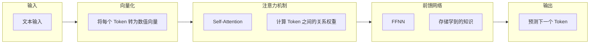
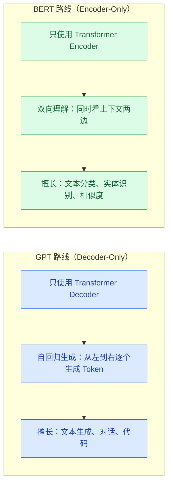

# 大模型基础

> **创建日期：** 2026-06-06
> **前置知识：** 无，面向后端开发者

---

## 一、LLM 是什么？

大语言模型（Large Language Model, LLM）本质上是一个**超大规模的概率预测引擎**——给定一段文本，预测下一个最可能出现的 token。

::: tip 类比理解
如果把传统编程比作"精确计算器"（输入 1+1，输出 2），LLM 就像"联想填空器"——它不计算，而是根据上下文推测最合理的续写。
:::

---

## 二、Transformer 架构心智模型

你不需要从头实现 Transformer，但需要一个可运作的心智模型。Transformer 由三个核心原语组成：



### 2.1 三大核心原语

| 原语 | 做什么 | 类比理解 |
|------|--------|----------|
| **向量 / Embedding** | 将文本转为数值向量，语义相近的文本向量距离也近 | 就像给每个词分配一个 GPS 坐标，意思相近的词坐标也相近 |
| **注意力机制（Attention）** | 让模型理解上下文关系，知道哪些词对当前词最重要 | 就像阅读时"聚焦"关键词，忽略无关内容 |
| **前馈网络（FFNN）** | 存储模型学到的知识，是模型的"记忆库" | 就像数据库存储数据，FFNN 存储训练学到的知识模式 |

### 2.2 为什么 LLM 会产生"幻觉"？

LLM 的本质是**预测下一个 token**，而不是**查数据库**。当它遇到不确定的内容时，它会基于训练数据中的模式"编造"最合理的回答。

- 幻觉不是 Bug，是 LLM 工作原理的固有特性
- 减少幻觉的方法：RAG（检索增强生成）、约束输出格式、提供充分上下文

---

## 三、GPT 路线 vs BERT 路线



> 当前主流大模型（GPT-4o、Claude、Gemini、DeepSeek、Qwen 等）全部采用 **GPT 路线（Decoder-Only）**。

---

## 四、API 调用范式

### 4.1 OpenAI Compatible API

当前主流模型基本都兼容 OpenAI API 格式，只需替换 `base_url` 和 `api_key` 即可切换模型：

```python
# 统一调用模式 - 几乎所有模型都支持此格式
from openai import OpenAI

# 示例：调用 DeepSeek
client = OpenAI(
    api_key="your-api-key",
    base_url="https://api.deepseek.com/v1"  # 替换为不同模型的 API 地址
)

response = client.chat.completions.create(
    model="deepseek-chat",  # 替换为不同模型名称
    messages=[
        {"role": "system", "content": "你是一个有帮助的助手"},
        {"role": "user", "content": "解释一下什么是 Transformer"}
    ],
    temperature=0.7,  # 控制随机性（0=确定，1=随机）
    max_tokens=1000   # 限制输出长度
)

print(response.choices[0].message.content)
```

### 4.2 核心参数说明

| 参数 | 含义 | 推荐值 | 说明 |
|------|------|--------|------|
| **temperature** | 控制输出的随机性 | 0~0.3（精准任务）/ 0.7~1.0（创意任务） | 越低越确定，越高越随机 |
| **top_p** | 核采样阈值 | 0.9~1.0 | 只从累积概率达到 top_p 的 token 中采样 |
| **max_tokens** | 最大输出 token 数 | 按需设置 | 注意总 token 数不能超过模型上下文窗口 |
| **presence_penalty** | 话题重复惩罚 | -2.0~2.0 | 正值鼓励谈论新话题 |
| **frequency_penalty** | 词语重复惩罚 | -2.0~2.0 | 正值减少重复用词 |

### 4.3 流式输出（SSE）

```python
# 流式输出 - 实现打字机效果
stream = client.chat.completions.create(
    model="deepseek-chat",
    messages=[{"role": "user", "content": "写一首诗"}],
    stream=True  # 开启流式输出
)

for chunk in stream:
    if chunk.choices[0].delta.content:
        print(chunk.choices[0].delta.content, end="", flush=True)
```

### 4.4 各模型 API 地址速查

| 模型 | API Base URL | 备注 |
|------|-------------|------|
| OpenAI（GPT-4o 等） | `https://api.openai.com/v1` | 需要海外网络 |
| DeepSeek | `https://api.deepseek.com/v1` | 国内可用，价格低 |
| 通义千问（Qwen） | `https://dashscope.aliyuncs.com/compatible-mode/v1` | 阿里云，需开通 |
| 月之暗面（Kimi） | `https://api.moonshot.cn/v1` | 长文本能力强 |
| 智谱（GLM） | `https://open.bigmodel.cn/api/paas/v4` | 清华系 |
| Ollama（本地） | `http://localhost:11434/v1` | 本地部署，完全免费 |

---

## 五、Function Calling 快速入门

Function Calling 让模型能够调用外部工具（函数），是实现 Agent 的基础。

```python
# 定义工具（函数描述）
tools = [
    {
        "type": "function",
        "function": {
            "name": "get_weather",
            "description": "获取指定城市的天气信息",
            "parameters": {
                "type": "object",
                "properties": {
                    "city": {
                        "type": "string",
                        "description": "城市名称，如'北京'"
                    }
                },
                "required": ["city"]
            }
        }
    }
]

# 调用模型，模型会返回函数调用请求而非直接回答
response = client.chat.completions.create(
    model="deepseek-chat",
    messages=[{"role": "user", "content": "北京今天天气怎么样？"}],
    tools=tools
)

# 判断是否需要调用工具
if response.choices[0].message.tool_calls:
    tool_call = response.choices[0].message.tool_calls[0]
    print(f"模型想调用工具: {tool_call.function.name}")
    print(f"参数: {tool_call.function.arguments}")
```

---

## 六、面试高频题

### Q1: Transformer 的核心机制是什么？Self-Attention 是如何工作的？

**详细答案：**
Transformer 的核心是**自注意力机制（Self-Attention）**，它的本质是让序列中的每个 token 都能直接"看到"序列中的所有其他 token，并计算它们之间的关联权重。具体过程分为三步：首先，每个 token 通过三个可学习的权重矩阵分别生成 Query（查询）、Key（键）、Value（值）三个向量；然后，用当前 token 的 Query 与所有 token 的 Key 做点积，得到注意力分数矩阵；最后，通过 Softmax 归一化后加权求和所有 token 的 Value，得到当前 token 的上下文感知表示。

这种设计的精妙之处在于：它解决了传统 RNN 的"长距离遗忘"问题——无论两个 token 在序列中相隔多远，它们的交互路径长度都是 O(1)。同时，多头注意力（Multi-Head Attention）让模型能从多个不同的"表示子空间"同时学习不同的关系模式（如语法关系、语义关系、指代关系），然后将这些信息拼接起来。面试中常见误区是只背"注意力就是加权求和"，却说不清楚 Q、K、V 各自的角色：Query 表示"我在找什么"，Key 表示"我能提供什么"，Value 表示"我实际贡献什么信息"。

在实际应用中，理解 Self-Attention 对于诊断 LLM 行为至关重要。例如，当 LLM 在长文档中"顾头不顾尾"时，根源就在于注意力分数在序列过长时被稀释。此外，Self-Attention 的计算复杂度是 O(n²)（n 为序列长度），这也是为什么上下文窗口不能无限扩大的根本原因——每翻倍一次窗口，计算量翻四倍。近年来 FlashAttention 等算法通过分块计算和 IO 优化大幅降低了实际计算开销，但 O(n²) 的渐近复杂度本质没有改变。

### Q2: GPT 和 BERT 的核心区别是什么？为什么现在主流模型都走 GPT 路线？

**详细答案：**
GPT 和 BERT 代表了 Transformer 的两种使用范式。GPT 采用 **Decoder-Only 架构**，使用因果注意力掩码（Causal Mask），确保每个 token 只能看到它之前的 token，从而以自回归方式逐个生成下一个 token。BERT 采用 **Encoder-Only 架构**，使用双向注意力，每个 token 可以同时看到前后文，因此擅长理解任务（如分类、实体识别），但无法直接生成文本。一句话总结：GPT 是"写作者"，BERT 是"阅读者"。

现在主流模型全部走 GPT 路线（Decoder-Only），主要有三个原因。第一，**生成能力通用性更强**：几乎所有 NLP 任务都可以转化为"根据输入生成输出"的形式，Decoder-Only 天然支持这种范式。第二，**扩展性更好**：Decoder-Only 在下游任务微调和指令遵循（Instruction Following）方面表现出更强的涌现能力，当模型规模达到一定程度后，能力提升远超 Encoder-Only 架构。第三，**训练效率更高**：因果注意力掩码使得 Decoder-Only 可以在一次前向传播中同时预测序列中所有位置的下一个 token，而 BERT 的双向编码器在生成任务中需要多次前向传播。

面试中常被追问的是："BERT 的 MLM（Masked Language Model）预训练让模型看到了双向上下文，难道不更好吗？" ——关键区别在于预训练和下游任务的一致性：GPT 的预训练任务（预测下一个词）和推理时做的事情完全一致，而 BERT 的 MLM 预训练和实际生成任务存在 gap。这也是为什么 GPT 系列可以通过 RLHF 进一步对齐人类偏好，而 BERT 路线难以做到。

### Q3: temperature 和 top_p 的区别是什么？如何在实际项目中控制模型输出的随机性？

**详细答案：**
temperature 和 top_p 是两种互补的采样控制策略，它们作用在不同层面。**temperature 作用于概率分布内部**：在 Softmax 之前，将 logits 除以 temperature 值——temperature 越低（接近 0），概率分布越尖锐，模型趋向于选择概率最高的 token（确定性输出）；temperature 越高（接近 1 或更大），概率分布越平滑，低概率 token 也有机会被选中（创造性输出）。而 **top_p（核采样）作用于候选集的范围**：它只保留累积概率达到 p 值的最小 token 集合，直接截断长尾的低概率 token，防止模型选到完全不合理的词。

两者通常搭配使用，推荐策略如下：对于**精准任务**（代码生成、数学推理、事实问答），temperature 设为 0~0.3，top_p 设为 0.9~1.0，可以再配合 top_k 进一步限制候选集；对于**创意任务**（文案写作、头脑风暴），temperature 设为 0.7~1.0，top_p 设为 0.9~0.95。一个常见的面试误区是认为"temperature=0 时模型输出完全确定"——实际上，即使 temperature=0，由于浮点数精度和部分服务端实现差异，不同调用仍可能产生微小差异。生产环境中如需严格一致性，应在应用层做缓存而非依赖模型确定性。

还有一个容易被忽略的精细控制参数：**presence_penalty 和 frequency_penalty**。presence_penalty 根据 token 是否已经出现过进行惩罚（鼓励模型谈论新话题），frequency_penalty 根据 token 出现频率进行惩罚（抑制重复用词）。在多轮对话场景中，适当设置 presence_penalty=0.3~0.5 可以显著减少模型"车轱辘话来回说"的问题。

### Q4: Function Calling 的原理是什么？模型是如何知道该调用哪个工具的？

**详细答案：**
Function Calling 的本质是**模型输出结构化 JSON 而非自然语言**，它并没有真正"执行"任何函数。工作流程分四步：第一步，开发者在请求中传入 `tools` 参数，用 JSON Schema 定义了每个函数的名称、描述、参数类型和是否必填；第二步，模型根据用户的自然语言问题，判断是否需要调用工具以及调用哪个工具——它输出的是一个包含函数名和参数的 JSON 对象（tool_call），而不是文本回答；第三步，开发者的代码接收到这个 tool_call，在自己的环境中**实际执行**该函数，获得结果；第四步，开发者将函数执行结果以 `role: "tool"` 的形式追加到对话历史中，再次调用模型，模型基于工具返回的结果生成最终回答。

模型如何"知道"该调用哪个工具？答案是基于 **instruction tuning 和语义匹配**——在模型训练阶段，它已经见过大量"用户提问 -> 工具调用 -> 工具结果 -> 最终回答"的对话样例，学会了将自然语言意图映射到工具签名。当它看到"北京今天天气怎么样"，会判断这个问题的答案不是训练数据能提供的（需要实时信息），于是扫描可用的 tools 列表，发现有一个 `get_weather` 函数且参数是 `city`，语义上高度匹配，就输出该函数的调用请求。

面试中最大的误区就是认为"模型在执行函数"。记住：模型只是在输出一个 JSON 字符串，真正的函数执行、网络请求、数据库查询全部由你的代码完成。理解这一点对于安全性至关重要——**永远不要直接将模型输出的 tool_call 参数用于敏感操作**（如 SQL 查询、文件删除），必须在应用层做参数校验和权限控制。此外，tools 描述写得越好，模型的选择准确率越高：函数描述要说明"做什么"和"什么时候用"，参数描述要给出格式示例和取值范围。

### Q5: LLM 为什么会产生幻觉？有哪些有效的减少幻觉的方法？

**详细答案：**
幻觉（Hallucination）不是 Bug，而是 LLM 自回归生成机制的内在特性。LLM 的本质是在给定上文的情况下预测下一个 token 的概率分布——它做的是"统计上最合理的续写"，而非"查询事实数据库"。当模型遇到训练数据中覆盖不足、或存在矛盾信息、或需要精确事实的知识点时，概率最高的续写路径可能恰好是错误的。从信息论角度看，幻觉是模型在"困惑度"（Perplexity）较高的区域对不确定性的过度自信输出。

减少幻觉的工程化方法可以分为四个层次。**第一层：Prompt 约束**——明确告诉模型"如果不知道就说不知道"，设定 temperature=0 降低随机性，要求模型给出引用来源。**第二层：RAG（检索增强生成）**——不让模型凭记忆回答，而是从外部知识库检索相关文档片段，将检索结果作为上下文传给模型，让它基于提供的事实来回答（而非凭空编造）。这是目前最有效的通用方法。**第三层：结构化输出约束**——使用 JSON Mode 或 Function Calling 强制模型输出符合 schema 的数据，不合规的输出会被拒绝；或者使用 Guidance/Outlines 等工具在 token 层面约束生成过程。**第四层：多模型交叉验证**——对关键答案用多个模型独立生成，取交集或投票结果。

一个值得在面试中展示深度理解的点是：RAG 本身也有幻觉风险——如果检索到的文档包含错误信息，或者检索结果与问题不相关但模型强行"缝合"，反而会引入新的幻觉。因此生产级 RAG 系统通常需要 reranker（重排序模型）过滤不相关文档，以及 citation 校验模块验证模型是否忠实引用了提供的文档。