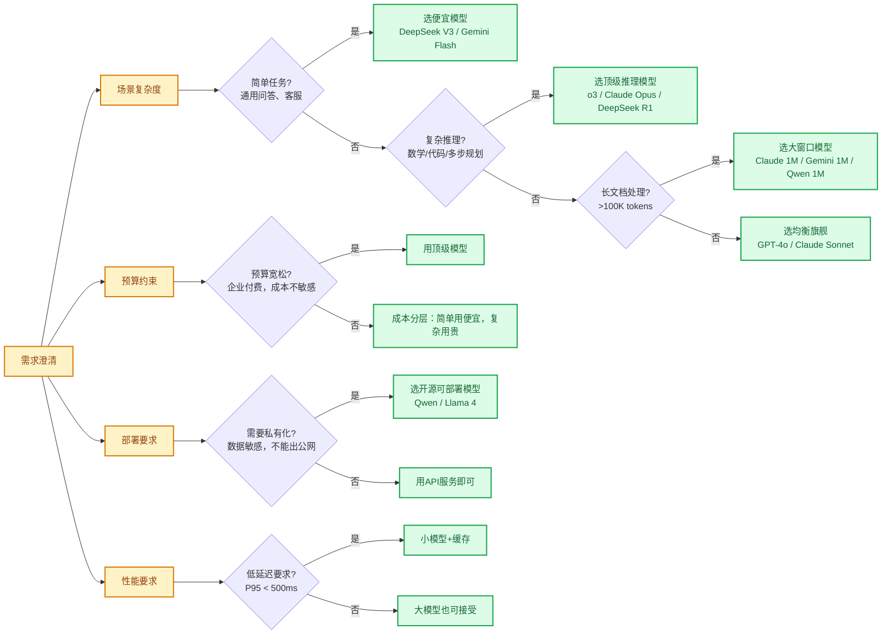
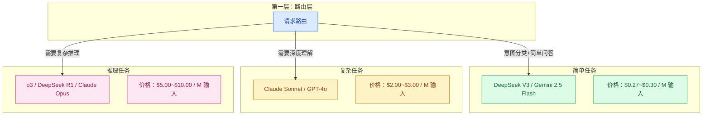

# 模型选型方法论

> **创建日期：** 2026-06-06
> **前置知识：** 主流模型能力对比

---

## 一、选型决策框架

选型不是选"最好"的模型，而是选"最适合"当前场景的模型。决策框架如下图：

---

## 二、按任务分层策略

**分层策略**：不同任务用不同模型，简单任务用便宜模型，复杂任务用贵模型。这是最常用的成本优化手段。

### 分层示例

| 请求类型 | 推荐模型 | 成本对比（同输入输出） |
|----------|----------|------------------------|
| 用户问候、FAQ问答 | DeepSeek V3 | 1x |
| 知识库问答、客服对话 | DeepSeek V3 / Gemini Flash | 1x ~ 2x |
| 代码生成、文档分析 | Claude Sonnet / GPT-4o | 7x ~ 11x |
| 复杂推理、数学、调试 | o3 / Claude Opus | 18x ~ 37x |

---

## 三、国内 vs 国外部署考量

| 维度 | 选择国外模型 | 选择国内模型 |
|------|--------------|--------------|
| **数据出境合规** | ❌ 风险 | ✅ 合规 |
| **网络延迟** | 较高（国内访问） | 低 |
| **中文能力** | 好，但略逊 | 更好 |
| **价格** | 整体较高 | 性价比更高 |
| **生态成熟度** | 更成熟 | 追赶中 |

**决策树：**
1. 如果要求数据不出境 → 必须选国内可私有化部署的模型
2. 如果对延迟要求高 → 选国内模型
3. 如果追求最好效果且不考虑合规 → 选 GPT-4o/Claude
4. 如果成本敏感 → 选 DeepSeek V3（国内API）

---

## 四、API 兼容性说明

当前几乎所有主流模型都支持 **OpenAI Compatible API** 格式：

| 厂商 | Base URL | 兼容程度 |
|------|----------|----------|
| OpenAI | `https://api.openai.com/v1` | 原生 |
| DeepSeek | `https://api.deepseek.com/v1` | ✅ 完全兼容 |
| 通义千问 | `https://dashscope.aliyuncs.com/compatible-mode/v1` | ✅ 完全兼容 |
| 月之暗面 | `https://api.moonshot.cn/v1` | ✅ 完全兼容 |
| 智谱 | `https://open.bigmodel.cn/api/paas/v4` | ✅ 完全兼容 |
| Ollama | `http://localhost:11434/v1` | ✅ 完全兼容 |

这意味着：
- **切换模型不需要改代码**，只需要改 base_url 和 api_key
- **统一工具链**，所有模型用同一个 SDK
- **多模型路由** 更容易实现

---

## 五、选型常见误区

::: danger 误区一：最贵就是最好
不是所有任务都需要最贵的模型。简单的FAQ问答用 DeepSeek V3 就足够好，成本只有 GPT-4o 的 1/10。
:::

::: danger 误区二：盲目追求大上下文
如果数据量超过窗口，用 RAG 比直接塞整个文档效果更好、成本更低。RAG 只检索相关片段，成本可控，质量更好。
:::

::: danger 误区三：只看基准分数，不看实际场景
基准分数高不代表在你的场景一定更好。一定要在你的真实数据上做 A/B 测试。
:::

::: danger 误区四：锁定一个模型用到底
技术发展太快，价格一直在降，能力一直在升。建议 **每季度重新评估一次** 选型。
:::

---

## 六、总结：选型 Checklist

- [ ] 需求是否真的需要大模型？传统方案能不能解决？
- [ ] 任务复杂度是简单/中等/复杂？对应什么价位模型？
- [ ] 数据合规要求是什么？能不能用国外API？
- [ ] 预算约束是什么？有没有成本分摊？
- [ ] 延迟要求是什么？小模型能不能满足？
- [ ] 是否需要私有化部署？开源模型是否满足？
- [ ] 有没有评估集？能不能量化对比不同模型？

> 记住：**最好的选型是在你的约束条件（成本/合规/延迟）下，能满足需求的最便宜模型**。