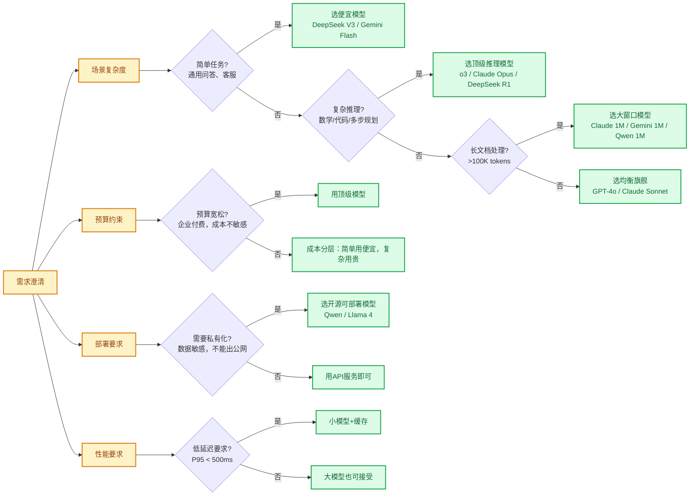
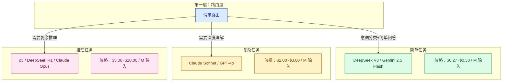

# 模型选型方法论

> **创建日期：** 2026-06-06
> **前置知识：** 主流模型能力对比

---

## 一、选型决策框架

选型不是选"最好"的模型，而是选"最适合"当前场景的模型。决策框架如下图：

---

## 二、按任务分层策略

**分层策略**：不同任务用不同模型，简单任务用便宜模型，复杂任务用贵模型。这是最常用的成本优化手段。

### 分层示例

| 请求类型 | 推荐模型 | 成本对比（同输入输出） |
|----------|----------|------------------------|
| 用户问候、FAQ问答 | DeepSeek V3 | 1x |
| 知识库问答、客服对话 | DeepSeek V3 / Gemini Flash | 1x ~ 2x |
| 代码生成、文档分析 | Claude Sonnet / GPT-4o | 7x ~ 11x |
| 复杂推理、数学、调试 | o3 / Claude Opus | 18x ~ 37x |

---

## 三、国内 vs 国外部署考量

| 维度 | 选择国外模型 | 选择国内模型 |
|------|--------------|--------------|
| **数据出境合规** | ❌ 风险 | ✅ 合规 |
| **网络延迟** | 较高（国内访问） | 低 |
| **中文能力** | 好，但略逊 | 更好 |
| **价格** | 整体较高 | 性价比更高 |
| **生态成熟度** | 更成熟 | 追赶中 |

**决策树：**
1. 如果要求数据不出境 → 必须选国内可私有化部署的模型
2. 如果对延迟要求高 → 选国内模型
3. 如果追求最好效果且不考虑合规 → 选 GPT-4o/Claude
4. 如果成本敏感 → 选 DeepSeek V3（国内API）

---

## 四、API 兼容性说明

当前几乎所有主流模型都支持 **OpenAI Compatible API** 格式：

| 厂商 | Base URL | 兼容程度 |
|------|----------|----------|
| OpenAI | `https://api.openai.com/v1` | 原生 |
| DeepSeek | `https://api.deepseek.com/v1` | ✅ 完全兼容 |
| 通义千问 | `https://dashscope.aliyuncs.com/compatible-mode/v1` | ✅ 完全兼容 |
| 月之暗面 | `https://api.moonshot.cn/v1` | ✅ 完全兼容 |
| 智谱 | `https://open.bigmodel.cn/api/paas/v4` | ✅ 完全兼容 |
| Ollama | `http://localhost:11434/v1` | ✅ 完全兼容 |

这意味着：
- **切换模型不需要改代码**，只需要改 base_url 和 api_key
- **统一工具链**，所有模型用同一个 SDK
- **多模型路由** 更容易实现

---

## 五、选型常见误区

::: danger 误区一：最贵就是最好
不是所有任务都需要最贵的模型。简单的FAQ问答用 DeepSeek V3 就足够好，成本只有 GPT-4o 的 1/10。
:::

::: danger 误区二：盲目追求大上下文
如果数据量超过窗口，用 RAG 比直接塞整个文档效果更好、成本更低。RAG 只检索相关片段，成本可控，质量更好。
:::

::: danger 误区三：只看基准分数，不看实际场景
基准分数高不代表在你的场景一定更好。一定要在你的真实数据上做 A/B 测试。
:::

::: danger 误区四：锁定一个模型用到底
技术发展太快，价格一直在降，能力一直在升。建议 **每季度重新评估一次** 选型。
:::

---

## 六、总结：选型 Checklist

- [ ] 需求是否真的需要大模型？传统方案能不能解决？
- [ ] 任务复杂度是简单/中等/复杂？对应什么价位模型？
- [ ] 数据合规要求是什么？能不能用国外API？
- [ ] 预算约束是什么？有没有成本分摊？
- [ ] 延迟要求是什么？小模型能不能满足？
- [ ] 是否需要私有化部署？开源模型是否满足？
- [ ] 有没有评估集？能不能量化对比不同模型？

> 记住：**最好的选型是在你的约束条件（成本/合规/延迟）下，能满足需求的最便宜模型**。

---

## 面试高频题

### Q1: 在模型选型中，分层策略的具体实现方式是什么？它如何帮助优化成本？

**详细答案：** 分层策略（Tiered Model Strategy）是模型选型中最重要的成本优化手段，核心思想是"不同复杂度的任务使用不同价位的模型"，而非"一刀切"地使用同一个模型。具体实现通常分为三层：第一层（Tier 1）处理简单任务，如用户问候、FAQ 问答、意图识别，使用最便宜的模型（DeepSeek V3 / Gemini 2.5 Flash，每百万 Token 约 $0.3）；第二层（Tier 2）处理中等复杂度任务，如知识库问答、客服对话、内容生成，使用中等模型（Claude Sonnet / GPT-4o，每百万 Token 约 $2-3）；第三层（Tier 3）处理复杂推理任务，如数学证明、多步调试、代码生成，使用顶级模型（o3 / Claude Opus / DeepSeek R1，每百万 Token 约 $5-10）。

实现分层策略的关键在于"请求路由"——在请求到达 LLM 之前，先通过一个轻量级分类器判断该请求的复杂度。分类器可以是一个简单的规则引擎（基于关键词匹配）、一个微调的小模型，或者使用 LLM 自身的意图识别能力。路由决策的考量维度包括：任务类型（问答 vs 代码生成 vs 推理）、上下文长度（长文档 vs 短问题）、用户角色（VIP 用户 vs 普通用户）、历史对话状态（新对话 vs 多轮追问）。这个策略的成本优化效果非常显著——假设 80% 的请求是简单任务，通过分层策略可以将整体 LLM 成本降低 60%-80%，同时保证复杂任务仍能获得高质量输出。

### Q2: 国内模型和国外模型在选型时各有什么优劣？如何做决策？

**详细答案：** 国内模型和国外模型各有所长，选型决策需要综合考虑四个维度。在中文能力上，国内模型（Qwen、DeepSeek、Kimi、GLM）在 CMMLU、C-Eval 等中文基准测试中已经全面超越 GPT-4o，尤其在中文口语化表达、古文理解、中文唐诗宋词等场景中优势明显。在代码和推理能力上，国外顶级模型（Claude Opus、o3）仍然领先，但 DeepSeek R1 和 DeepSeek V4-Pro 在 SWE-bench 等代码基准上已经接近甚至追平。

在数据合规方面，国内模型具有绝对优势——如果企业数据不能出境（如金融、政务、医疗数据），必须选择国内可私有化部署的模型。国外 API 服务（OpenAI、Anthropic）的数据可能经过境外服务器，存在合规风险。在价格方面，国内模型整体性价比更高，DeepSeek V3 的价格仅为 GPT-4o 的 1/10 左右。决策逻辑是：如果数据合规要求严格（数据不能出境），必须选国内模型；如果对延迟要求高（国内用户访问国外 API 延迟较高），选国内模型；如果追求最好效果且不考虑合规，选 GPT-4o 或 Claude；如果成本敏感，选 DeepSeek V3 的国内 API。在实际项目中，很多团队采用"混合策略"——国内模型处理日常业务，国外模型处理需要顶级推理能力的特殊任务。

### Q3: 模型选型中最常见的误区有哪些？如何避免？

**详细答案：** 模型选型中有四个最常见的误区。误区一是"最贵就是最好"——很多人默认选择 GPT-4o 或 Claude Opus，认为最贵的模型一定能给出最好的结果。实际上，对于简单的 FAQ 问答、意图识别等任务，便宜模型（DeepSeek V3）的输出质量与贵模型几乎无差异，但成本只有 1/10。避免这个误区的关键是"用数据说话"——在真实评估集上 A/B 测试不同模型，量化对比效果和成本。

误区二是"盲目追求大上下文窗口"——当看到 128K 甚至 1M 的上下文窗口时，很多人会直接把所有文档塞进 Prompt。但实际上，当数据量超过窗口容量时，RAG 检索相关片段的效果通常优于直接塞全文，因为 LLM 对长上下文中间位置的注意力会衰减（"Lost in the Middle" 现象）。避免这个误区的关键是理解"更多上下文不等于更好结果"——检索精准的少量上下文，优于大量无关上下文。误区三是"只看基准分数"——MMLU、HumanEval 等基准分数高不代表在你的场景中一定更好，因为基准测试的分布可能与你实际业务的数据分布完全不同。误区四是"锁定一个模型用到底"——AI 模型发展极快，价格一直在降、能力一直在升，建议每季度重新评估一次选型，保持对市场变化的敏感度。

### Q4: OpenAI Compatible API 兼容性对多模型架构有什么实际价值？

**详细答案：** OpenAI Compatible API 兼容性的最大价值在于"模型无关性"——它使得切换模型不需要修改代码，只需要修改 base_url 和 api_key 两个配置项。当前几乎所有主流模型（DeepSeek、通义千问、月之暗面、智谱、Ollama 本地模型）都支持 OpenAI 兼容格式，这意味着你可以用同一套代码（使用 `openai` Python SDK）调用完全不同的模型。这种兼容性使得多模型路由、A/B 测试、模型降级等高级架构变得极其简单。

在实际应用中，OpenAI 兼容性带来了三个关键能力。第一是多模型路由——你可以在请求入口处根据任务类型动态选择目标模型，只改一行配置即可。第二是无缝降级——当主模型（如 GPT-4o）出现故障或超时时，可以自动切换到备用模型（如 DeepSeek V3），而不需要维护两套代码。第三是成本优化——你可以在流量低谷期切换到更便宜的模型，在高峰期切回高性能模型，实现弹性成本控制。这种兼容性极大地降低了多模型架构的开发和维护成本，是当前 AI 应用工程化的"基础设施级别的共识"。

### Q5: 为什么说"最好的选型是在约束条件下能满足需求的最便宜模型"？

**详细答案：** 这句话概括了模型选型的核心方法论——"约束驱动"而非"能力驱动"。传统的选型思维是"哪个模型能力最强就用哪个"，但在企业实际场景中，选型受多个约束条件的限制：成本约束（预算有限）、合规约束（数据不能出境）、延迟约束（P95 < 500ms）、部署约束（必须私有化）、技术栈约束（团队熟悉 OpenAI SDK）。脱离这些约束谈"最好"，就像脱离预算谈"最好的车"——对大多数人来说，最好的车不是法拉利，而是在预算范围内最满足需求的那辆。

"最便宜"意味着在满足需求的前提下追求成本最优，这是 AI 应用商业化的基本要求。AI 应用的边际成本是真实且持续的——每个 API 调用都花钱，规模化后成本非常可观。如果简单的 FAQ 问答也用 GPT-4o，每月可能多花数万美元，而这些钱完全可以省下来。因此，负责任的选型应该遵循这样的流程：先明确约束条件（成本上限、合规要求、延迟 SLA），再筛选出满足约束的候选模型，最后在候选模型中选最便宜的。如果后续发现最便宜的模型效果不达标，再逐步升级——这种"向上爬坡"的策略比"从最贵开始"要经济得多。同时，选型不是一次性决策，而是一个持续优化的过程，需要定期根据市场变化（新模型发布、价格调整）重新评估。

### Q6: 在模型选型中，如何建立有效的 A/B 测试流程来验证模型效果？

**详细答案：** 建立 A/B 测试流程的第一步是构建评估集（Eval Set）。评估集应该包含 20-50 个涵盖不同难度和类型的真实问题，每个问题标注 ground truth（理想答案）。评估集的设计需要覆盖业务中的典型场景——简单 FAQ、复杂推理、长文档问答、多轮对话等，确保评估结果的代表性。评估集不是一次性的，而是"活"的——随着业务发展，持续添加线上的 tricky case 和用户反馈中暴露的问题，保持评估集与真实场景的同步。

A/B 测试的执行流程是：对同一个评估集，分别用候选模型 A 和模型 B 生成答案，然后从三个维度进行对比。第一是自动化指标——使用 RAGAS 或类似框架计算 Faithfulness、Answer Relevancy、Correctness 等指标。第二是人工评估——让业务专家对两个模型的答案进行盲评（不知道哪个答案来自哪个模型），打分 1-5 分。第三是成本和延迟对比——记录每个模型的平均 Token 消耗、API 调用费用和响应延迟。最终决策不是只看单一指标，而是综合权衡——如果模型 B 的质量提升 5% 但成本增加 10 倍，可能不值得切换；如果模型 B 质量持平但成本降低 80%，那显然应该切换。A/B 测试的结果应该文档化，形成"选型决策记录"，方便后续回顾和审计。

---

## 参考资料

- [OpenAI API 文档](https://platform.openai.com/docs)
- [DeepSeek API 文档](https://platform.deepseek.com/api-docs)
- [通义千问 API 文档](https://help.aliyun.com/zh/model-studio)