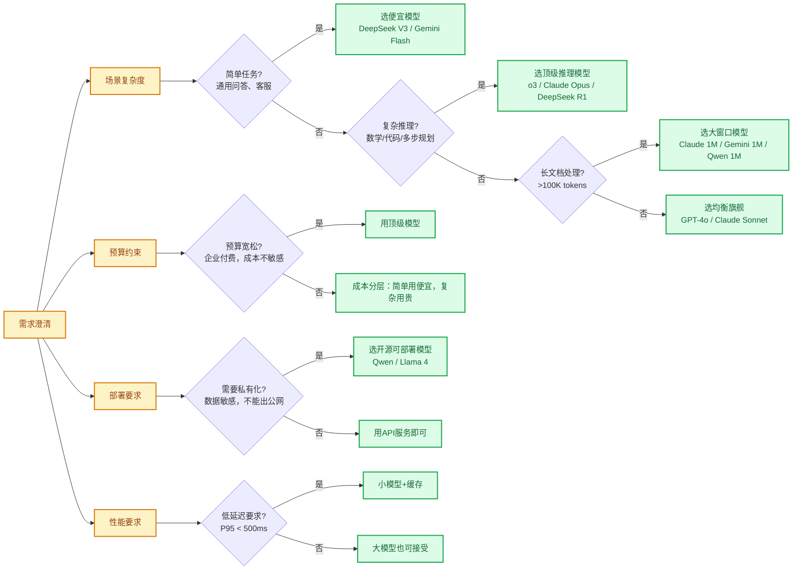
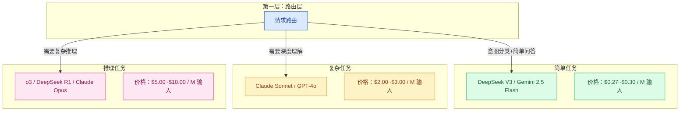

# 模型选型方法论

> **创建日期：** 2026-06-06
> **前置知识：** 主流模型能力对比

---

## 一、选型决策框架

选型不是选"最好"的模型，而是选"最适合"当前场景的模型。决策框架如下图：

---

## 二、按任务分层策略

**分层策略**：不同任务用不同模型，简单任务用便宜模型，复杂任务用贵模型。这是最常用的成本优化手段。

### 分层示例

| 请求类型 | 推荐模型 | 成本对比（同输入输出） |
|----------|----------|------------------------|
| 用户问候、FAQ问答 | DeepSeek V3 | 1x |
| 知识库问答、客服对话 | DeepSeek V3 / Gemini Flash | 1x ~ 2x |
| 代码生成、文档分析 | Claude Sonnet / GPT-4o | 7x ~ 11x |
| 复杂推理、数学、调试 | o3 / Claude Opus | 18x ~ 37x |

---

## 三、国内 vs 国外部署考量

| 维度 | 选择国外模型 | 选择国内模型 |
|------|--------------|--------------|
| **数据出境合规** | ❌ 风险 | ✅ 合规 |
| **网络延迟** | 较高（国内访问） | 低 |
| **中文能力** | 好，但略逊 | 更好 |
| **价格** | 整体较高 | 性价比更高 |
| **生态成熟度** | 更成熟 | 追赶中 |

**决策树：**
1. 如果要求数据不出境 → 必须选国内可私有化部署的模型
2. 如果对延迟要求高 → 选国内模型
3. 如果追求最好效果且不考虑合规 → 选 GPT-4o/Claude
4. 如果成本敏感 → 选 DeepSeek V3（国内API）

---

## 四、API 兼容性说明

当前几乎所有主流模型都支持 **OpenAI Compatible API** 格式：

| 厂商 | Base URL | 兼容程度 |
|------|----------|----------|
| OpenAI | `https://api.openai.com/v1` | 原生 |
| DeepSeek | `https://api.deepseek.com/v1` | ✅ 完全兼容 |
| 通义千问 | `https://dashscope.aliyuncs.com/compatible-mode/v1` | ✅ 完全兼容 |
| 月之暗面 | `https://api.moonshot.cn/v1` | ✅ 完全兼容 |
| 智谱 | `https://open.bigmodel.cn/api/paas/v4` | ✅ 完全兼容 |
| Ollama | `http://localhost:11434/v1` | ✅ 完全兼容 |

这意味着：
- **切换模型不需要改代码**，只需要改 base_url 和 api_key
- **统一工具链**，所有模型用同一个 SDK
- **多模型路由** 更容易实现

---

## 五、选型常见误区

::: danger 误区一：最贵就是最好
不是所有任务都需要最贵的模型。简单的FAQ问答用 DeepSeek V3 就足够好，成本只有 GPT-4o 的 1/10。
:::

::: danger 误区二：盲目追求大上下文
如果数据量超过窗口，用 RAG 比直接塞整个文档效果更好、成本更低。RAG 只检索相关片段，成本可控，质量更好。
:::

::: danger 误区三：只看基准分数，不看实际场景
基准分数高不代表在你的场景一定更好。一定要在你的真实数据上做 A/B 测试。
:::

::: danger 误区四：锁定一个模型用到底
技术发展太快，价格一直在降，能力一直在升。建议 **每季度重新评估一次** 选型。
:::

---

## 六、总结：选型 Checklist

- [ ] 需求是否真的需要大模型？传统方案能不能解决？
- [ ] 任务复杂度是简单/中等/复杂？对应什么价位模型？
- [ ] 数据合规要求是什么？能不能用国外API？
- [ ] 预算约束是什么？有没有成本分摊？
- [ ] 延迟要求是什么？小模型能不能满足？
- [ ] 是否需要私有化部署？开源模型是否满足？
- [ ] 有没有评估集？能不能量化对比不同模型？

> 记住：**最好的选型是在你的约束条件（成本/合规/延迟）下，能满足需求的最便宜模型**。

---

## 面试高频题

### Q1: 在模型选型中，分层策略的具体实现方式是什么？它如何帮助优化成本？

**详细答案：** 分层策略是我们控制成本最核心的手段，说白了就是"不同难度的问题用不同价位的模型"。我们三层架构跑了一年多，省下来的 API 费用够再买一台服务器。Layer 1 是 DeepSeek V3 和 Gemini Flash，处理意图分类、问候语、简单的 FAQ 匹配，这类请求占了总量的 70% 左右，单次成本几乎可以忽略。Layer 2 是 Claude Sonnet 和 GPT-4o，处理中等复杂度的知识库问答、多轮对话、文档分析，占总量 20%。Layer 3 是 o3 和 Claude Opus，只给复杂推理、数学、跨文档综合分析场景用，占不到 10%。

实现的关键在路由上。我们最早用规则引擎——关键词匹配，但发现长尾覆盖太差。后来改成让 LLM 自己判断复杂度（用一次 Layer 1 的廉价模型调用），准确率高了很多。实现很简单：先用 DeepSeek V3 做一次快速的意图分析，同时输出一个 `complexity_level` 字段（low/medium/high），然后路由到对应 Layer。逻辑上是"用便宜的模型帮你决定要不要上贵的模型"，投入产出比很高。

效果很显著。我们日调用 3000+ 次，全用 GPT-4o 的话月费大概 $8000+。分层后 Layer 1 占大头，DeepSeek V3 跑，Layer 3 零星的复杂推理走 Claude Opus，月费降到 $1800 左右，质量几乎没跌。这个策略的关键在于数据驱动——得先分析你的请求分布，确认简单请求占比够大，否则分层成本反而更高。

### Q2: 国内模型和国外模型在选型时各有什么优劣？如何做决策？

**详细答案：** 我们项目是混合架构，国内的 DeepSeek 和 Qwen 处理日常业务，国际的 Claude 和 GPT-4o 处理复杂推理。差异就三个维度。中文能力：国内模型确实碾压——用户说"这破手机烫得跟熨斗似的"，Qwen 秒懂这是吐槽要退货，GPT-4o 可能按字面理解成"手机发热量很高"。合规：我们客服数据含订单号和联系方式，用国内节点数据不出境，满足监管要求，省得做数据脱敏。价格：差距是真的大——DeepSeek V3 输入 $0.27/M vs GPT-4o $2.5/M，差了 9 倍，我们每天的量用 DeepSeek 跑月费 $200 搞定，全用 GPT-4o 得 $2000+。

但国际模型在复杂推理和多模态上还是更强的。我们做过对比——让各模型同时做数学应用题，o3 准确率比最好的国内模型高 15 个点。长文档处理用 Claude 的 1M 窗口也比国内模型稳，特别是超长合同分析场景。

决策逻辑很简单：数据敏感 + 中文为主 -> 国内模型；顶级推理 + 多模态 + 英文场景 -> 国际模型；成本敏感 -> 国内模型占大头 + 国际模型做兜底。混合架构目前在大多数企业里是常态，不是非此即彼的选择。

### Q3: 模型选型中最常见的误区有哪些？如何避免？

**详细答案：** 我们踩过的坑比看过的书多。最大的误区就是"最贵的模型一定最好"——刚上线时我们也这么想，所有场景全用 GPT-4o，月费飙到 $8000 之后一算账发现 80% 是浪费。后来拉了一周数据：FAQ 类问题占 70%，用 GPT-4o 和 DeepSeek V3 的答案质量几乎没有差别，但成本差了 10 倍。所以现在所有新项目上线前都要做一个流程——在真实评估集上 A/B 测不同价位的模型，用数据和实际成本说话。

第二个误区是闭着眼睛把全量文档塞 Prompt，不管 128K 还是 1M 窗口，数据量只要超过窗口，RAG 比直接塞全文效果好得多——因为中间位置的注意力本来就弱。我们现在的策略是"宁可检索精准 2000 Token 也别塞混乱的 20 万 Token"。第三个误区是只看 MMLU 这种基准分数就拍板，我们做过一次对比：MMLU 上两个模型差不到 2 个百分点，但在我们真实客服评估集上差了 15 个百分点。所以永远在你自己的数据上测。第四个误区是不重新评估——模型价格和能力半年一个样，我们每季度重新走一遍评估流程，上次重评的结果就是把 GPT-4o 的大量流量切给了新发的 DeepSeek V4。

### Q4: OpenAI Compatible API 兼容性对多模型架构有什么实际价值？

**详细答案：** 兼容 OpenAI API 格式是我们多模型架构能跑起来的基石。我们系统里同时跑着 4 个模型供应商——OpenAI、DeepSeek、Qwen、Anthropic（后三个都兼容 OpenAI 格式），切换模型只改 `base_url` 和 `api_key` 两个环境变量，代码完全不用动。真正的价值体现在三个场景：

多模型路由——我们根据请求复杂度动态切模型，动作只是改一行配置；无缝降级——有一次 GPT-4o 的 API 区域性故障，我们在 30 秒内把流量全切到 DeepSeek V3，对业务透明；A/B 测试——想比较两个模型的效果？同一套代码并行调用两个不同 base_url 就行，不需要维护两套适配层。一句话总结：接口标准化让你对模型供应商有了"用脚投票"的自由，哪家便宜好用就用哪家。

### Q5: 为什么说"最好的选型是在约束条件下能满足需求的最便宜模型"？

**详细答案：** 这句话是我们团队做技术决策的金句。现实是——没有不受约束的项目。预算、合规、延迟、团队能力，这些约束比"哪个模型最强"更重要。我们选型的时候遇到过这个困境：Claude Opus 在 SWE-bench 上得分最高，但我们的场景是客服不是写代码，而且日调用量 5000+，Claude Opus 的价格会让月费翻到 $12000+，完全不现实。最终选了 DeepSeek V3 + GPT-4o 组合，在满足"回答准确、延迟 < 2 秒、月费 < $2000"的约束下效果最好。

方法论就是"向上爬坡"——先从最便宜的模型开始，如果满足需求就定下来，不满足再往上试一档。别一上来就开最贵的车。我们每季度重评一次，上次重评发现 Gemini Flash 2.5 的性价比又提升了，就把 30% 的 DeepSeek 流量切过去了，月费又降了 $150。选型永远不是一次性决策。

### Q6: 在模型选型中，如何建立有效的 A/B 测试流程来验证模型效果？

**详细答案：** 我们做 A/B 测试有一个固定流程，跑了大半年已经很成熟了。第一步建评估集——从线上日志里采样 50 个真实用户问题，涵盖简单 FAQ、复杂多轮、长文档问答、模糊表达这几类。每个问题都有人工标注的"理想答案"（不是要求完全一致，而是标注关键信息点是否都覆盖到了）。评估集是活的——每周从线上把模型翻车的 Case 加进去，现在是越测越严。

第二步自动化跑分——用 RAGAS 出 Faithfulness、Answer Relevancy 等定量指标，同时记录 Token 消耗、延迟、费用。第三步人工盲评——50 条结果让两个业务同事背靠背打分（不知道哪条是哪个模型出的），1-5 分。上次 A/B 测 DeepSeek V3 vs GPT-4o，RAGAS 分数差不多，但人工评分发现 GPT-4o 在"语气自然度"上高了 0.5 分，这个差异自动化捕捉不到。所以我们现在是自动化评分 + 人工盲评双轨，成本、延迟、准确率三维决策矩阵。

---

## 参考资料

- [OpenAI API 文档](https://platform.openai.com/docs)
- [DeepSeek API 文档](https://platform.deepseek.com/api-docs)
- [通义千问 API 文档](https://help.aliyun.com/zh/model-studio)