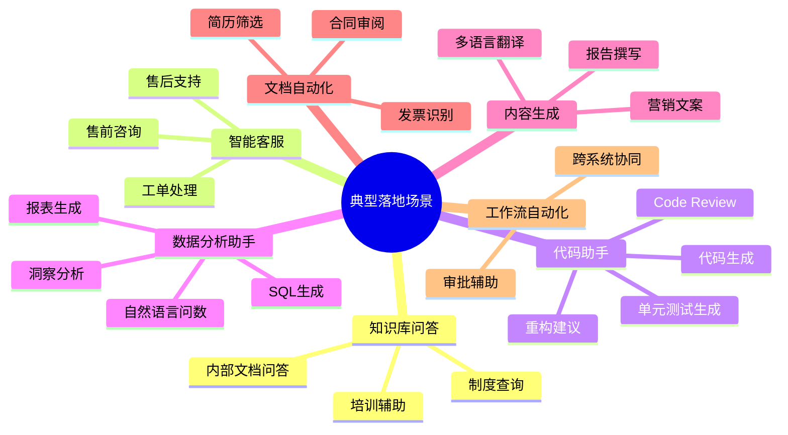
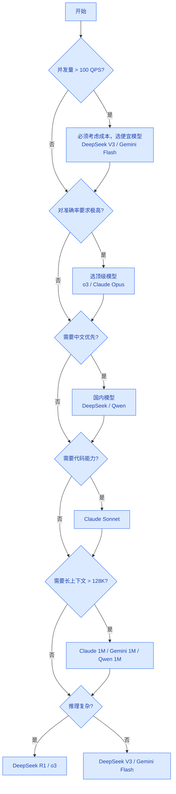

# 场景匹配指南

> **创建日期：** 2026-06-06
> **说明：** 不同企业落地场景的模型选型推荐

---

## 一、企业 AI 落地典型场景



---

## 二、各场景详细推荐

### 2.1 智能知识库问答

**场景特点：**
- 文档数量多，通常是内部文档
- 需要基于文档回答，不能编造
- 并发量中等偏大
- 数据敏感，可能要求私有化

| 选型维度 | 推荐方案 | 理由 |
|----------|----------|------|
| **模型选择** | DeepSeek V3 / Gemini 2.5 Flash / Qwen3.5-Plus | 性价比高，中文能力好 |
| **嵌入模型** | BGE 系列（BAAI/bge-base-zh-v1.5） | 中文开源首选，效果好 |
| **部署要求** | 国内API / 私有化部署 Qwen | 数据合规 |
| **成本优化** | RAG + 检索缓存，相同问题不重复调用 | 降低成本约 30% |

**架构图：**
```
用户提问 → 嵌入向量化 → 向量检索 → Top-K 片段 → 拼接 Prompt → LLM 生成答案
```

---

### 2.2 智能客服

**场景特点：**
- 并发量大
- 问题重复率高
- 需要转接人工机制
- 答案需要基于知识库

| 选型维度 | 推荐方案 | 理由 |
|----------|----------|------|
| **模型选择** | DeepSeek V3 / Gemini 2.5 Flash / Claude Haiku | 速度快，成本低 |
| **意图识别** | 小模型分类 + 检索匹配 | 意图识别简单，不用大模型 |
| **对话管理** | 轮次摘要，控制 Token 消耗 | 长对话不超窗口 |
| **人工转接** | 置信度低于阈值自动转接 | 用户体验保障 |

**典型流程：**
```
用户问题 → 意图识别 → 知识库检索 → 生成回答 → 置信度判断
                                      ↓
                              置信度高 → 返回回答
                              置信度低 → 转接人工
```

---

### 2.3 AI 代码助手

**场景特点：**
- 需要理解代码上下文
- 多文件引用，token 消耗大
- 对准确率要求高
- 代码补全/审查/生成多种需求

| 选型维度 | 推荐方案 | 理由 |
|----------|----------|------|
| **模型选择** | Claude Sonnet 4.6 / Claude Opus 4.6 / DeepSeek V4-Pro | SWE-bench 领先，代码理解好 |
| **代码索引** | RAG 检索相关代码文件 | 解决上下文窗口不足 |
| **本地部署** | Llama 4 / Qwen 代码模型 | 隐私代码不出企业 |
| **工作流** | 问题理解 → 检索相关代码 → 分析 → 修改 → 测试 | Agent 循环 |

**能力分级：**
- L1：代码补全 → 简单场景，小模型足够
- L2：函数级代码生成 → Claude Sonnet
- L3：跨文件修改 → Claude Opus + RAG
- L4：自主修复问题 → Claude 4 + Agent 循环

---

### 2.4 智能数据分析助手（Text-to-SQL）

**场景特点：**
- 自然语言转 SQL
- 多表关联，需要理解表结构
- 结果需要可视化
- 企业数据敏感，不能外泄

| 选型维度 | 推荐方案 | 理由 |
|----------|----------|------|
| **模型选择** | GPT-4o / Claude Sonnet / DeepSeek R1 | 逻辑推理能力强 |
| **架构模式** | Schema 检索 + Few-Shot + 验证执行 | 先找相关表，再生成 SQL |
| **部署要求** | 私有化部署 + 只读权限 | 数据安全 |
| **错误处理** 执行失败自动重试 → 模型根据错误信息修正 SQL | 提高成功率 |

**关键难点：**
- 大数据库下，不能把全库 Schema 都塞进 Prompt
- 需要向量检索：问题 → 找最相关的表/字段
- 对结果正确性要求高，必须有校验机制

---

### 2.5 合同审阅 / 文档自动化

**场景特点：**
- PDF/Word 文档解析
- 结构化信息抽取
- 规则校验（合规/风险）
- 批量处理，成本敏感

| 选型维度 | 推荐方案 | 理由 |
|----------|----------|------|
| **文档解析** | LlamaParse / Unstructured | 复杂PDF解析能力强 |
| **模型选择** | GPT-4o / Claude Sonnet / Qwen3-Max | 多模态能力好，中文准 |
| **输出格式** | Pydantic 结构化输出 | 直接解析成对象，方便后续处理 |
| **批量处理** | Gemini 2.5 Flash / DeepSeek V3 | 成本低，速度快 |

---

### 2.6 营销文案内容生成

**场景特点：**
- 创意要求高
- 批量生成
- 成本敏感
- 多语言支持

| 选型维度 | 推荐方案 | 理由 |
|----------|----------|------|
| **模型选择** | MiniMax M2-Her / Kimi K2.5 / GPT-4o | 角色扮演和创意好 |
| **Prompt 设计** | 明确品牌调性+目标人群+输出格式 | 效果提升明显 |
| **成本优化** | 模板化 + 便宜模型 | 大部分模板文案用便宜模型足够 |

---

### 2.7 多 Agent 协作系统

**场景特点：**
- 复杂任务拆解
- 多个角色分工协作
- 状态管理复杂

| 选型维度 | 推荐方案 | 理由 |
|----------|----------|------|
| **控制器模型** | Claude Sonnet / GPT-4o | 任务规划能力强 |
| **Worker 模型** | DeepSeek V3 / Gemini Flash | 执行任务成本低 |
| **框架选择** | LangGraph / CrewAI | 成熟的状态管理 |

---

## 三、成本-性能权衡决策树



---

## 四、常见问题解答

### Q: 什么时候需要用多模型分层？
**A:** 当你有大量请求，同时有不同复杂度任务时。简单任务用便宜模型省成本，复杂任务交给贵模型保证质量。典型如智能客服：意图识别用便宜模型，复杂问答用贵模型。

### Q: 私有化部署 vs API 服务如何选择？
**A:**
- **数据敏感**（企业内部文档、客户数据）→ 必须私有化
- **对延迟要求极高** → 私有化（但成本高）
- **数据不敏感，API 可接受** → API 服务更省心，成本更低
- **混合场景**： embedding 私有化部署，推理用 API

### Q: 国内模型真的比 GPT-4o 中文好吗？
**A:** 根据 CMMLU/C-Eval 等中文基准，Qwen/DeepSeek 等国内模型中文理解已经超过 GPT-4o。实际项目中建议 A/B 测试验证。

### Q: 模型价格多久更新一次？
**A:** 2024-2026 降价非常快，建议 **每季度重新看一次价格**，可能有惊喜。本知识库的价格数据标注了"截至 2026 年 6 月"，仅供参考，请以官方最新定价为准。

---

## 五、总结

| 场景 | 推荐模型 | 成本优化要点 |
|------|----------|--------------|
| 知识库问答 | DeepSeek V3 / Qwen | 缓存检索结果，复用 embedding |
| 智能客服 | Gemini Flash / DeepSeek V3 | 意图识别用小模型，置信度低转人工 |
| 代码助手 | Claude Sonnet / DeepSeek V4 | RAG 只索检相关文件，控制 token |
| 数据分析 | GPT-4o / DeepSeek R1 | Schema 检索，避免全表塞进 prompt |
| 文档审阅 | GPT-4o / Qwen3-Max | 结构化输出，减少后处理成本 |
| 内容生成 | Gemini Flash / DeepSeek V3 | 模板化，批量处理用便宜模型 |

> **核心原则：** 让合适的模型做合适的事，不要用大炮打蚊子。

---

## 面试高频题

### Q1: 知识库问答场景中，为什么推荐 DeepSeek V3 而非 GPT-4o？

**详细答案：** 我们内部知识库问答全用 DeepSeek V3 跑，原因特别直接——这个场景的瓶颈不在模型能力，在检索质量。只要检索到的文档是准的，中等模型也能拼出好答案。GPT-4o 在这个场景下不会比 DeepSeek V3 明显更好，但成本差了 10 倍。我们算过一笔账：知识库每天 3000 次查询，用 DeepSeek V3 月费 $100 出头，用 GPT-4o 月费 $1000+，多出来的 $900 对回答质量提升微乎其微——这个 ROI 划不来。

中文能力也是个加分项。DeepSeek V3 对中文文档的理解和引用比 GPT-4o 自然，特别是涉及"根据第三条"这种法规引用场景。如果偶尔遇到需要跨文档推理的复杂问题，我们通过路由升到 Claude Sonnet 处理，这样既保证了大部分场景的性价比，又不影响复杂问题的质量。

### Q2: 智能客服系统的模型选型中，意图识别为什么建议用小模型？

**详细答案：** 我们客服每天几万次会话，意图识别是高频调用，用大模型就是烧钱。意图识别本质上是个分类任务——"退货"、"物流"、"投诉"，不需要深度语义理解。我们现在的策略是三层：高频意图（查订单/退换货）直接用规则引擎，命中率 60%，零成本；中等频次意图用 DeepSeek V3 或 Gemini Flash 做 LLM 分类，成本 0.1 分钱级别；长尾复杂表达才升到 GPT-4o。这一套下来意图识别月费从 $3000（全用 GPT-4o）降到了 $200。

### Q3: AI 代码助手场景的核心挑战是什么？如何通过模型选型解决？

**详细答案：** 我们内部做代码助手踩过的最大的坑是上下文管理——一个 Java 项目 500 个文件，Agent 不能把所有类全塞进 Prompt，Token 爆炸 + 注意力稀释。方案是 RAG 代码索引：按类和方法粒度向量化，检索只返回最相关的 3-5 个文件。第二个挑战是正确性——LLM 生成的代码不能直接 commit，需要走"生成 -> 编译检查 -> 代码审查 -> 单元测试"的 Agent 闭环。模型选型上：代码生成用 Claude Sonnet（SWE-bench 72.7%），编译和审查用便宜模型，数据敏感代码私有化部署 Qwen。

### Q4: NL2SQL 场景中，为什么说"Schema 检索"是比"全表 Schema 塞进 Prompt"更好的方案？

**详细答案：** 我们项目确实遇到过这个问题。中间件数据库有 200 多张表，BI 数据库更多，全量 Schema 塞进 Prompt 只塞表名和字段就 4000+ Token，还没算表描述和样例数据。更糟的是 LLM 看到 200 张表会乱——"users"和"user_info"怎么选？我们改成 Schema 检索：把表名 + 字段描述 + 样例数据向量化，用户问"昨天销售额 Top 10 商品"时就只检索到 orders、products 两张表的 Schema 和相关字段，从 200 张表里精准地找到了需要的 2 张。Token 从 4000 降到 400，SQL 生成准确率从 70% 提到 90%。

### Q5: 多 Agent 协作系统中，控制器模型和 Worker 模型如何分工？为什么需要不同级别的模型？

**详细答案：** 我们客服系统就是个多 Agent ——Controller 是大脑，用 Claude Sonnet 把用户问题拆成子任务、决定调哪个 Agent、汇总结果。Worker 只干具体活——订单查询、知识检索、退款流程，不需要深度推理，用便宜模型就够了。Controller 的能力直接决定整体质量——如果它理解错用户意图，后面的 Worker 全白费。Worker 只需要正确地执行一个已知的明确任务。这个分工让成本友好很多——Controller 调用频率低（每种请求类型只有一次），Worker 虽然高频但按任务类型用不同价位模型，最便宜的一个 Worker 只做"检查订单号格式是否正确"（规则引擎，零 LLM 成本）。

### Q6: 在成本-性能权衡决策树中，为什么"并发量 > 100 QPS"是第一判断条件？

**详细答案：** 为什么 100 QPS 是第一判断条件？因为超过 100 QPS 之后，模型选型的所有假设都变了。低并发时你用最贵的 GPT-4o，月费可能 $1000，可接受；100 QPS 甚至 200 QPS 时同样的单次价格，月费从 $1000 变成 $20000，完全不可接受。另一个硬约束是：高并发下延迟会被放大——API 的速率限制、网络抖动、重试开销，任何一个环节出问题都会积累成 P99 的延迟雪崩。

我们在景区节假日经历过这种考验——QPS 从 30 飙到 200+，DeepSeek API 开始限流，P99 从 1 秒涨到 6 秒。后来因为跑得快加了本地 vLLM 部署的 Qwen 做缓冲（池化预热 + KV Cache），延迟才稳住。所以 QPS > 100 时，正确的策略是：优先考虑本地部署或国内模型，减少外部 API 依赖，加缓存和队列削峰——这就是为什么"并发量"应该排在决策树第一位。

---

## 参考资料

- [OpenAI API Pricing](https://openai.com/api/pricing/)
- [DeepSeek API Platform](https://platform.deepseek.com)
- [Anthropic Models Overview](https://docs.anthropic.com/en/docs/about-claude/models)