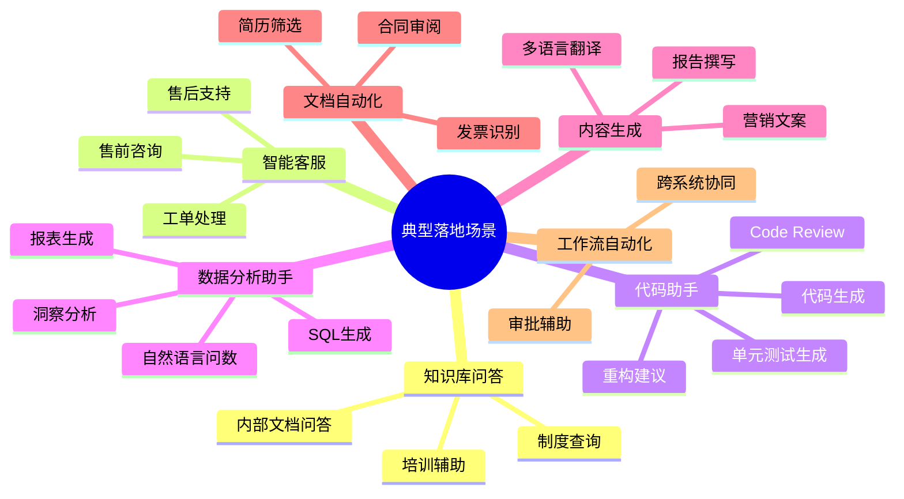
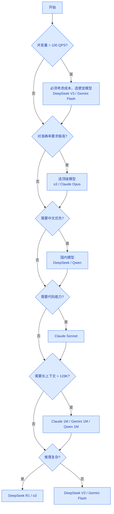

# 场景匹配指南

> **创建日期：** 2026-06-06
> **说明：** 不同企业落地场景的模型选型推荐

---

## 一、企业 AI 落地典型场景



---

## 二、各场景详细推荐

### 2.1 智能知识库问答

**场景特点：**
- 文档数量多，通常是内部文档
- 需要基于文档回答，不能编造
- 并发量中等偏大
- 数据敏感，可能要求私有化

| 选型维度 | 推荐方案 | 理由 |
|----------|----------|------|
| **模型选择** | DeepSeek V3 / Gemini 2.5 Flash / Qwen3.5-Plus | 性价比高，中文能力好 |
| **嵌入模型** | BGE 系列（BAAI/bge-base-zh-v1.5） | 中文开源首选，效果好 |
| **部署要求** | 国内API / 私有化部署 Qwen | 数据合规 |
| **成本优化** | RAG + 检索缓存，相同问题不重复调用 | 降低成本约 30% |

**架构图：**
```
用户提问 → 嵌入向量化 → 向量检索 → Top-K 片段 → 拼接 Prompt → LLM 生成答案
```

---

### 2.2 智能客服

**场景特点：**
- 并发量大
- 问题重复率高
- 需要转接人工机制
- 答案需要基于知识库

| 选型维度 | 推荐方案 | 理由 |
|----------|----------|------|
| **模型选择** | DeepSeek V3 / Gemini 2.5 Flash / Claude Haiku | 速度快，成本低 |
| **意图识别** | 小模型分类 + 检索匹配 | 意图识别简单，不用大模型 |
| **对话管理** | 轮次摘要，控制 Token 消耗 | 长对话不超窗口 |
| **人工转接** | 置信度低于阈值自动转接 | 用户体验保障 |

**典型流程：**
```
用户问题 → 意图识别 → 知识库检索 → 生成回答 → 置信度判断
                                      ↓
                              置信度高 → 返回回答
                              置信度低 → 转接人工
```

---

### 2.3 AI 代码助手

**场景特点：**
- 需要理解代码上下文
- 多文件引用，token 消耗大
- 对准确率要求高
- 代码补全/审查/生成多种需求

| 选型维度 | 推荐方案 | 理由 |
|----------|----------|------|
| **模型选择** | Claude Sonnet 4.6 / Claude Opus 4.6 / DeepSeek V4-Pro | SWE-bench 领先，代码理解好 |
| **代码索引** | RAG 检索相关代码文件 | 解决上下文窗口不足 |
| **本地部署** | Llama 4 / Qwen 代码模型 | 隐私代码不出企业 |
| **工作流** | 问题理解 → 检索相关代码 → 分析 → 修改 → 测试 | Agent 循环 |

**能力分级：**
- L1：代码补全 → 简单场景，小模型足够
- L2：函数级代码生成 → Claude Sonnet
- L3：跨文件修改 → Claude Opus + RAG
- L4：自主修复问题 → Claude 4 + Agent 循环

---

### 2.4 智能数据分析助手（Text-to-SQL）

**场景特点：**
- 自然语言转 SQL
- 多表关联，需要理解表结构
- 结果需要可视化
- 企业数据敏感，不能外泄

| 选型维度 | 推荐方案 | 理由 |
|----------|----------|------|
| **模型选择** | GPT-4o / Claude Sonnet / DeepSeek R1 | 逻辑推理能力强 |
| **架构模式** | Schema 检索 + Few-Shot + 验证执行 | 先找相关表，再生成 SQL |
| **部署要求** | 私有化部署 + 只读权限 | 数据安全 |
| **错误处理** 执行失败自动重试 → 模型根据错误信息修正 SQL | 提高成功率 |

**关键难点：**
- 大数据库下，不能把全库 Schema 都塞进 Prompt
- 需要向量检索：问题 → 找最相关的表/字段
- 对结果正确性要求高，必须有校验机制

---

### 2.5 合同审阅 / 文档自动化

**场景特点：**
- PDF/Word 文档解析
- 结构化信息抽取
- 规则校验（合规/风险）
- 批量处理，成本敏感

| 选型维度 | 推荐方案 | 理由 |
|----------|----------|------|
| **文档解析** | LlamaParse / Unstructured | 复杂PDF解析能力强 |
| **模型选择** | GPT-4o / Claude Sonnet / Qwen3-Max | 多模态能力好，中文准 |
| **输出格式** | Pydantic 结构化输出 | 直接解析成对象，方便后续处理 |
| **批量处理** | Gemini 2.5 Flash / DeepSeek V3 | 成本低，速度快 |

---

### 2.6 营销文案内容生成

**场景特点：**
- 创意要求高
- 批量生成
- 成本敏感
- 多语言支持

| 选型维度 | 推荐方案 | 理由 |
|----------|----------|------|
| **模型选择** | MiniMax M2-Her / Kimi K2.5 / GPT-4o | 角色扮演和创意好 |
| **Prompt 设计** | 明确品牌调性+目标人群+输出格式 | 效果提升明显 |
| **成本优化** | 模板化 + 便宜模型 | 大部分模板文案用便宜模型足够 |

---

### 2.7 多 Agent 协作系统

**场景特点：**
- 复杂任务拆解
- 多个角色分工协作
- 状态管理复杂

| 选型维度 | 推荐方案 | 理由 |
|----------|----------|------|
| **控制器模型** | Claude Sonnet / GPT-4o | 任务规划能力强 |
| **Worker 模型** | DeepSeek V3 / Gemini Flash | 执行任务成本低 |
| **框架选择** | LangGraph / CrewAI | 成熟的状态管理 |

---

## 三、成本-性能权衡决策树



---

## 四、常见问题解答

### Q: 什么时候需要用多模型分层？
**A:** 当你有大量请求，同时有不同复杂度任务时。简单任务用便宜模型省成本，复杂任务交给贵模型保证质量。典型如智能客服：意图识别用便宜模型，复杂问答用贵模型。

### Q: 私有化部署 vs API 服务如何选择？
**A:**
- **数据敏感**（企业内部文档、客户数据）→ 必须私有化
- **对延迟要求极高** → 私有化（但成本高）
- **数据不敏感，API 可接受** → API 服务更省心，成本更低
- **混合场景**： embedding 私有化部署，推理用 API

### Q: 国内模型真的比 GPT-4o 中文好吗？
**A:** 根据 CMMLU/C-Eval 等中文基准，Qwen/DeepSeek 等国内模型中文理解已经超过 GPT-4o。实际项目中建议 A/B 测试验证。

### Q: 模型价格多久更新一次？
**A:** 2024-2026 降价非常快，建议 **每季度重新看一次价格**，可能有惊喜。本知识库的价格数据标注了"截至 2026 年 6 月"，仅供参考，请以官方最新定价为准。

---

## 五、总结

| 场景 | 推荐模型 | 成本优化要点 |
|------|----------|--------------|
| 知识库问答 | DeepSeek V3 / Qwen | 缓存检索结果，复用 embedding |
| 智能客服 | Gemini Flash / DeepSeek V3 | 意图识别用小模型，置信度低转人工 |
| 代码助手 | Claude Sonnet / DeepSeek V4 | RAG 只索检相关文件，控制 token |
| 数据分析 | GPT-4o / DeepSeek R1 | Schema 检索，避免全表塞进 prompt |
| 文档审阅 | GPT-4o / Qwen3-Max | 结构化输出，减少后处理成本 |
| 内容生成 | Gemini Flash / DeepSeek V3 | 模板化，批量处理用便宜模型 |

> **核心原则：** 让合适的模型做合适的事，不要用大炮打蚊子。

---

## 面试高频题

### Q1: 知识库问答场景中，为什么推荐 DeepSeek V3 而非 GPT-4o？

**详细答案：** 知识库问答场景的核心特点是"基于文档回答"——LLM 的角色是理解检索到的文档上下文并组织语言生成答案，而非进行复杂的逻辑推理或创造性写作。在这种场景下，LLM 的能力瓶颈通常不在模型本身，而在检索质量。只要检索到的文档是准确的，即使是中等能力的模型也能生成不错的答案。因此，使用 GPT-4o（每百万 Token 约 $2.5-10）相比 DeepSeek V3（每百万 Token 约 $0.27）并不能带来成比例的体验提升，但成本却高出 10 倍以上。

此外，知识库问答通常有较高的并发量（企业内部可能有数百人同时使用）和成本敏感度（知识库问答不是核心营收业务，ROI 需要算得过来）。使用 DeepSeek V3 可以在保证回答质量的前提下大幅降低成本。如果遇到特别复杂的追问（如需要跨文档推理），可以通过多模型路由将这类请求升级到更高级的模型。另外一个重要考量是中文能力——DeepSeek V3 在中文理解和生成上表现优异，对于中文为主的企业知识库，使用国产模型在语义理解上反而可能更准确。

### Q2: 智能客服系统的模型选型中，意图识别为什么建议用小模型？

**详细答案：** 智能客服系统中意图识别的核心特征是"高并发、低复杂度"。意图识别本质上是一个分类任务——将用户问题归类到预设的意图类别（如"退货咨询"、"物流查询"、"投诉建议"），这个任务不需要深度语义理解和复杂推理，对模型能力的要求远低于生成自然语言回答。在这种情况下，使用大模型（如 GPT-4o）做意图识别是典型的"大炮打蚊子"——成本高、延迟大，但效果提升微乎其微。

相比之下，用小模型（如 DeepSeek V3 或 Gemini Flash）做意图识别，单次调用的成本只有大模型的 1/10 到 1/20，延迟也显著更低。对于日均 10 万次以上的客服对话，这个成本差异累计起来非常可观。更进一步，对于高频重复的意图类别（如"查询订单状态"占 30%），可以直接用规则匹配或检索匹配，完全不需要调用 LLM。意图识别的最佳实践是：简单意图用规则匹配，中等意图用小模型，复杂意图（如多意图混合、模糊表达）才用大模型。这种分层的意图识别策略可以在保证准确率的前提下最大程度降低成本和延迟。

### Q3: AI 代码助手场景的核心挑战是什么？如何通过模型选型解决？

**详细答案：** AI 代码助手场景的第一个核心挑战是"上下文窗口管理"——一个真实的 Java 项目可能有数百个文件，修改一个方法可能需要参考多个相关类的实现，而 LLM 的上下文窗口是有限的。如果直接把所有相关文件塞进 Prompt，Token 消耗会非常大（成本高且延迟高）。解决方案是使用 RAG 检索相关代码文件——只把与当前任务最相关的几个文件/类/方法注入 Prompt，而不是整个项目。这需要建立代码库索引器，按类和方法粒度构建向量索引，支持语义搜索和关键词搜索。

第二个核心挑战是"代码正确性保障"——LLM 生成的代码可能存在语法错误、逻辑 bug、不符合项目编码规范等问题。单独靠 LLM 无法保证代码的正确性，需要通过 Agent 工作流来增强：让 LLM 生成代码后，自动调用编译检查（验证语法）、代码审查（检查逻辑和规范）、单元测试（验证功能），形成"生成 → 检查 → 修复"的闭环。在模型选型上，代码生成任务推荐 Claude Sonnet（在 SWE-bench 代码基准上表现优异），而编译检查和代码审查可以用更便宜的模型或传统工具。第三个挑战是"代码隐私"——如果代码库包含核心业务逻辑，不能上传到公共 API，此时需要私有化部署代码模型（如 Llama 4、Qwen 代码模型）。

### Q4: NL2SQL 场景中，为什么说"Schema 检索"是比"全表 Schema 塞进 Prompt"更好的方案？

**详细答案：** 在实际企业数据库中，一个数据库可能有数百张表、数千个字段。如果把完整的 Schema 都塞进 Prompt，会带来三个严重问题。第一是 Token 消耗巨大——一个完整的 Schema 描述可能消耗数千甚至上万 Token，而大部分表/字段与用户当前问题无关，白白浪费了上下文窗口和 API 费用。第二是 LLM 注意力稀释——当 Prompt 中包含大量无关信息时，LLM 可能被误导，将不相关的表关联到查询中，生成错误的 SQL。第三是上下文窗口限制——当 Schema 总大小超过 LLM 的上下文窗口时，只能截断，导致关键表结构信息丢失。

Schema 检索的方案是：先将所有表的结构描述（表名、字段名、字段类型、字段注释、关联关系）向量化存入向量数据库，当用户提问时，先用问题的语义向量检索最相关的表/字段（通常 Top-3 到 Top-5 张表），只将这些表的 Schema 注入 Prompt。这种方案将 Prompt 中的 Schema 从"全量几百张表"精简到"相关 3-5 张表"，Token 消耗降低 90% 以上，同时生成的 SQL 准确率反而更高——因为 LLM 的注意力被聚焦在真正相关的表上。此外，Schema 检索还可以结合 Few-Shot 示例——检索与当前问题相似的历史 SQL 示例，一并注入 Prompt，进一步提升生成准确率。

### Q5: 多 Agent 协作系统中，控制器模型和 Worker 模型如何分工？为什么需要不同级别的模型？

**详细答案：** 多 Agent 协作系统中，控制器 Agent（Controller/Orchestrator）和 Worker Agent 的分工体现了"任务规划"和"任务执行"的分离。控制器 Agent 负责高层决策——理解用户意图、拆解复杂任务为子任务、分配子任务给合适的 Worker、监控执行进度、汇总结果。这个角色需要强大的推理和规划能力，因此推荐使用顶级模型（Claude Sonnet / GPT-4o）。Worker Agent 负责具体执行——搜索知识库、生成代码、调用 API、查询数据库等。这些任务通常是单一、明确的，对推理能力要求不高，因此可以使用便宜的模型（DeepSeek V3 / Gemini Flash）。

这种"高低搭配"的策略在成本和效果之间取得了最优平衡。如果所有 Agent 都用顶级模型，成本会非常高（一个复杂的多 Agent 任务可能涉及数十次 LLM 调用）；如果所有 Agent 都用便宜模型，控制器可能无法正确处理复杂的任务拆解和异常处理，导致整个系统失败。此外，使用不同级别的模型还带来了"责任分离"的好处——控制器负责"想清楚做什么"，Worker 负责"把事做好"，当系统出错时，可以清晰地定位是规划层面出了问题还是执行层面出了问题。这在调试和优化多 Agent 系统时非常关键。

### Q6: 在成本-性能权衡决策树中，为什么"并发量 > 100 QPS"是第一判断条件？

**详细答案：** 将"并发量 > 100 QPS"作为第一判断条件，是因为并发量直接决定了成本敏感度。当 QPS 较低时（如每天几百次调用），即使使用最贵的模型，月成本也只会是几十到几百美元，对大多数企业来说可以忽略不计。但当 QPS 达到 100+ 时，成本开始指数级放大——假设每次调用消耗 2000 Token（Prompt + 回答），100 QPS 意味着每天约 860 万次调用，使用 GPT-4o（$2.5/M 输入 Token + $10/M 输出 Token）的日成本可能高达数千美元，月成本超过 10 万美元。此时模型选择从"技术决策"变为"商业决策"——成本占比可能超过项目预算。

因此，在决策树中首先判断并发量，是为了在规模化之前做出正确的成本规划。如果并发量 > 100 QPS，必须考虑成本优化：使用便宜模型处理大部分请求，只对少数复杂请求使用贵模型。此外，高并发还意味着对延迟的更高要求——当 QPS 高时，每增加 100ms 的延迟都会显著影响用户体验。便宜模型通常推理速度也更快（模型参数更小），在高并发下能提供更好的响应延迟。最后，高并发场景还需要考虑 API 的 Rate Limit（速率限制），单一模型可能无法满足并发需求，多模型分布式调用可以分散压力。

---

## 参考资料

- [OpenAI API Pricing](https://openai.com/api/pricing/)
- [DeepSeek API Platform](https://platform.deepseek.com)
- [Anthropic Models Overview](https://docs.anthropic.com/en/docs/about-claude/models)