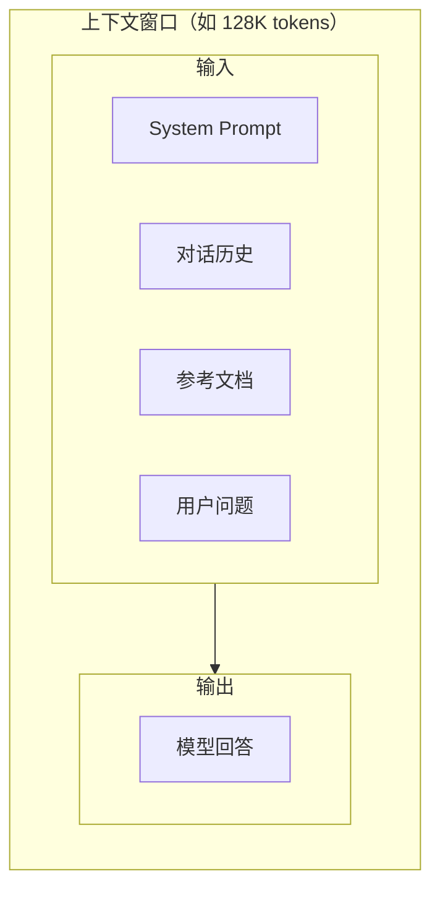

# Token 与上下文窗口

> **创建日期：** 2026-06-06
> **前置知识：** LLM 基础概念

---

## 一、Token 是什么？

Token 是 LLM 处理文本的**最小单位**。模型不直接理解"字符"或"词语"，而是将文本拆分为 token 序列。

### 1.1 Token 化示例

| 文本 | Token 化结果 | Token 数量 |
|------|-------------|-----------|
| `Hello World` | `["Hello", " World"]` | 2 |
| `人工智能` | `["人工", "智能"]` | 2 |
| `Transformer` | `["Transform", "er"]` | 2 |
| `I love AI` | `["I", " love", " AI"]` | 3 |

::: tip 关键认知
- 英文：约 1 token ≈ 0.75 个单词
- 中文：约 1 token ≈ 0.5~1.5 个汉字（取决于 tokenizer）
- 代码：token 消耗通常比自然语言多 20%~50%
:::

### 1.2 Tokenizer 工作原理

Tokenizer 使用 **BPE（Byte Pair Encoding）** 算法，将文本拆分为子词单元：

```
原始文本: "unbelievable"
拆分过程: "un" + "believable" → "un" + "believe" + "able"
最终: ["un", "believe", "able"]
```

---

## 二、上下文窗口

### 2.1 什么是上下文窗口？

上下文窗口（Context Window）是模型**一次能处理的最大 token 数量**。包括输入 token 和输出 token。



### 2.2 主流模型上下文窗口

| 模型 | 上下文窗口 | 说明 |
|------|-----------|------|
| GPT-4o | 128K | 标准窗口 |
| GPT-4.1 | 1M | 超长上下文 |
| Claude 4.6 系列 | 1M（Opus/Sonnet）/ 200K（Haiku） | 全系大窗口 |
| Gemini 2.5 系列 | 1M | 全系大窗口 |
| DeepSeek V3.2 | 128K | 中文模型标准窗口 |
| Qwen3.5-Plus | 1M | 国内最大窗口 |
| Kimi K2.5 | 256K | 长文本优势 |

### 2.3 上下文窗口的"中间丢失"问题

::: warning 重要
模型对上下文窗口**开头和结尾**的内容记忆最好，对**中间部分**的内容容易遗忘（Lost in the Middle 现象）。
:::

**应对策略：**
- 关键信息放在开头或结尾
- 对长文档进行分段处理
- 使用 RAG 只检索相关片段，而非塞入整个文档

---

## 三、Token 计数与成本

### 3.1 如何计算 Token 数量

```python
import tiktoken

# 使用 OpenAI 的 tokenizer 计算
encoding = tiktoken.encoding_for_model("gpt-4o")
text = "人工智能正在改变世界"
tokens = encoding.encode(text)
print(f"文本: {text}")
print(f"Token 数量: {len(tokens)}")
print(f"Token 列表: {tokens}")
```

### 3.2 成本估算公式

```
总成本 = (输入 Token 数 × 输入单价) + (输出 Token 数 × 输出单价)
```

**示例：** 使用 DeepSeek V3.2 处理 1000 次对话，每次平均输入 2000 token、输出 500 token：

```
输入成本: 1000 × 2000 / 1,000,000 × $0.27 = $0.54
输出成本: 1000 × 500 / 1,000,000 × $1.12 = $0.56
总成本: $0.54 + $0.56 = $1.10
```

### 3.3 Token 优化策略

| 策略 | 效果 | 实现方式 |
|------|------|----------|
| **Prompt 压缩** | 减少 30%~50% 输入 token | 精简 System Prompt，删除冗余描述 |
| **对话摘要** | 控制历史长度 | 对长对话历史进行摘要后再传入 |
| **缓存命中** | 显著降低成本 | 相同 Prompt 前缀利用缓存（DeepSeek 缓存命中 $0.028/M） |
| **模型降级** | 大幅降低成本 | 简单任务用 Flash/Mini 模型 |

---

## 四、长文本处理策略

### 4.1 策略对比

| 策略 | 适用场景 | 优点 | 缺点 |
|------|----------|------|------|
| **直接传入** | 文档 < 上下文窗口 | 简单直接 | 受窗口限制，中间丢失 |
| **分段处理** | 文档 > 上下文窗口 | 突破窗口限制 | 丢失跨段上下文 |
| **RAG 检索** | 需要从大量文档中找答案 | 精准、高效 | 需要预先建立索引 |
| **Map-Reduce** | 需要对整个文档做分析 | 覆盖完整 | 多次调用，成本较高 |

### 4.2 分段处理示例

```python
# 将长文档按 token 限制分段
def split_by_tokens(text: str, max_tokens: int = 3000, encoding=None):
    """将文本按 token 限制分段，确保每段不超过 max_tokens"""
    if encoding is None:
        encoding = tiktoken.encoding_for_model("gpt-4o")
    
    tokens = encoding.encode(text)
    chunks = []
    
    for i in range(0, len(tokens), max_tokens):
        chunk_tokens = tokens[i:i + max_tokens]
        chunk_text = encoding.decode(chunk_tokens)
        chunks.append(chunk_text)
    
    return chunks
```

---

## 五、面试高频题

### Q1: Token 是什么？中文和英文的 Token 消耗有什么差异？

**详细答案：**
Token 是 LLM 处理文本的最小语义单元，而非字符或单词。模型使用 BPE（Byte Pair Encoding）算法将文本拆分为 token 序列。BPE 的核心思想是：从字符级别开始，反复合并出现频率最高的相邻 token 对，形成子词级别的词汇表。这样做的优势是平衡了词汇表大小和编码效率——既不会像字符级 tokenizer 那样序列过长，也不会像词级 tokenizer 那样词汇表爆炸，还能处理从未见过的词（通过拆分为已知子词）。

中文和英文的 token 消耗差异是面试中的高频追问点。英文约 1 token 对应 0.75 个单词，即一个中等长度的英文单词约 1.3 个 token；而中文约 1 token 对应 0.5~1.5 个汉字，取决于具体 tokenizer 和文本内容。一个典型的对比：同样意思的一句话，"人工智能正在改变世界"（8 个汉字）约消耗 4~6 个 token，而英文翻译 "Artificial intelligence is changing the world"（6 个词）约消耗 8~10 个 token。中文在 token 效率上通常优于英文，因为一个汉字承载的信息密度高于一个英文字母。

实践中的影响：第一，使用海外模型处理中文内容时，token 消耗可能比预期高（因为海外模型的 tokenizer 对中文优化不足）；第二，代码的 token 消耗通常比自然语言高 20%~50%，因为代码中的特殊符号（括号、缩进、变量名）往往各自成独立的 token；第三，在成本估算时，要针对目标语言和内容类型做实际 token 计数，而不是简单按字数估算。可以使用 `tiktoken` 库或各模型提供的 tokenizer 工具进行精确计数。

### Q2: 上下文窗口是什么？超过窗口会发生什么？

**详细答案：**
上下文窗口是模型一次能处理的最大 token 数量，包括输入 token 和输出 token 的总和。比如 GPT-4o 的 128K 窗口意味着，system prompt + 对话历史 + 用户问题 + 模型回答的总 token 数不能超过 128K。上下文窗口是 LLM 的"工作记忆"上限，决定了一次对话能承载多少信息。

当 token 总数超过上下文窗口时，模型服务商会采取不同的处理策略。第一，**直接拒绝**：API 返回 400 错误，提示超出最大 token 限制。第二，**静默截断**：部分服务商或本地部署会自动截断超出的部分（通常是截断中间部分或前面的部分），但不会明确告知用户，导致模型"看不到"被截断的内容，回答质量下降但你不知道原因。第三，**滑动窗口**：一些高级实现会保留最近的消息和 system prompt，将中间的旧消息逐出窗口。

生产环境中需要特别注意隐式截断问题。当对话历史越来越长，模型突然开始"失忆"——忘记之前讨论过的细节、回答开始前后矛盾，这就是窗口溢出或接近溢出的信号。预防措施包括：第一，在每次请求前主动计算 token 数，确保不超限；第二，对长对话实施摘要策略，压缩历史；第三，监控模型输出质量的退化趋势，当回答开始偏离时检查 token 使用量。另一个容易被忽略的点是：system prompt 也占用 token 额度，如果你的 system prompt 很长（比如塞了整本产品手册），留给用户对话的窗口就很小了。

### Q3: "Lost in the Middle" 是什么？如何有效应对？

**详细答案：**
"Lost in the Middle"（中间丢失）是 LLM 在长上下文中的一个系统性弱点：模型对上下文窗口开头和结尾部分的内容记忆最好，对中间部分的内容容易遗忘或忽略。这不是个别模型的 bug，而是 Transformer 注意力机制的固有特性——注意力分数在序列中间位置分布更分散，导致模型对中间信息的"聚焦"不足。多篇论文实验证明，当信息放在上下文窗口的开头或末尾时，模型的事实回忆准确率远高于信息放在中间位置。

应对策略分为四个层次。第一，**信息位置策略**：将最重要的信息（如任务指令、关键约束）放在 prompt 的末尾，将次要信息（如背景资料、参考示例）放在开头。这利用了"首尾效应"最大化关键信息的利用效率。第二，**分段处理**：对于长文档，不一次性塞入整个文档，而是按逻辑段落或固定 token 窗口分段，对每段独立处理后再汇总——这个策略牺牲了跨段上下文，但提高了每段内部的理解准确率。第三，**RAG 检索**：只从长文档中检索与当前问题最相关的片段，用检索结果的精准性替代长上下文的全面性，是目前主流的工程方案。第四，**重排序（Rerank）**：在检索到的多个片段中，用 reranker 模型重新排序，将最相关片段放在最靠前和最靠后的位置。

面试中的加分项是提到：有一些模型专门针对"Lost in the Middle"做了训练优化（如 Anthropic 声称 Claude 的长上下文注意力更均匀），但问题并未完全解决。在工程实践中，与其依赖模型厂商的改进，不如在上层架构设计中规避这个问题。一个实用的技巧是：对长文档先做摘要，将摘要作为上下文传给模型，让模型基于摘要判断是否需要深入查看某个具体段落。

### Q4: 如何估算 API 调用成本？请给出一个具体场景的计算过程。

**详细答案：**
API 调用成本的计算公式非常简单：`总成本 = (输入 token 数 / 1,000,000) * 输入单价 + (输出 token 数 / 1,000,000) * 输出单价`。但实际估算中，输入 token 数往往被低估，输出 token 数往往被忽略，导致预算偏差很大。

以一个具体场景为例：假设你要用 DeepSeek V3.2 构建一个文档问答系统，每天处理 1000 次用户查询。每次查询的 system prompt 约 500 token，检索到的参考文档约 2000 token，用户问题约 100 token，模型回答约 500 token。那么每次调用的输入 token = 500 + 2000 + 100 = 2600 token，输出 token = 500 token。DeepSeek V3.2 的定价为输入 $0.27/M、输出 $1.12/M。单次成本 = 2600/1M * $0.27 + 500/1M * $1.12 = $0.000702 + $0.00056 = $0.001262（约 0.13 美分）。每天 1000 次 = $1.26，每月约 $38。

成本优化方向：第一，如果 system prompt 不变，可以利用前缀缓存——DeepSeek 缓存命中只需 $0.028/M，此时 system prompt 部分成本降低 90%。第二，精简检索文档，如果能把参考文档从 2000 token 压缩到 1000 token，输入成本直接减半。第三，如果查询比较简单，可以降级到更便宜的模型（如 Qwen-Flash 输入 $0.25/M），成本再降 50%。第四，使用 prompt 缓存——很多服务商都对重复的 prompt 前缀提供缓存折扣，这是成本优化中投入产出比最高的一项。

面试中展示深度的做法是：不仅会算，还能指出"输入 token 才是成本大头"——因为输入 token 通常远大于输出 token（尤其是 RAG 场景），而且输入 token 包含大量的 system prompt 和检索文档，这些是"固定成本"，与用户的每次查询都重复计入。

### Q5: 长文本有哪些处理策略？各策略的优缺点是什么？

**详细答案：**
处理超出模型上下文窗口的长文本，主要有四种策略，各有适用场景和权衡。

**策略一：直接截断。** 最简单粗暴，将文本截断到窗口允许的最大长度。优点是零实现成本，缺点是可能丢失关键信息，且你不知道截断的位置是否恰好砍掉了重要内容。适用于：对内容完整性要求不高的简单场景，如快速摘要、情感分析。

**策略二：分段处理（Chunking）。** 将长文本按固定大小（如 2000 token）分段，每段独立处理，最后汇总结果。优点是突破窗口限制，可以处理任意长度的文本；缺点是分段边界处丢失跨段上下文，如果关键信息恰好跨两个段，可能被割裂。改进方向：使用重叠分段（让相邻段有一定重叠）和语义分段（按段落/章节而非固定 token 分段）。适用于：长文档摘要、批量分类、信息提取。

**策略三：RAG（检索增强生成）。** 不直接处理完整长文本，而是先建立索引，对用户查询检索最相关的片段，只将相关片段传入模型。优点是精准高效，只处理与问题相关的部分；缺点是需要预先建立索引，且检索质量决定了回答质量——如果检索不到相关片段，模型无法回答。适用于：需要从大量文档中查找特定信息的问答场景。

**策略四：Map-Reduce。** 先对每个分段做 Map 操作（如提取关键信息），再对中间结果做 Reduce 操作（汇总、总结）。优点是能覆盖完整文档的全部信息，不丢失内容；缺点是需要多次 LLM 调用，成本随文档长度线性增长，且 Reduce 阶段的摘要质量受 Map 阶段输出质量影响。适用于：需要对整个文档做全面分析（如法律合同审查、财报分析）。

面试中展示深度的地方：强调"没有银弹"，实际项目中往往是多种策略的组合。例如，先用 RAG 检索相关段落，再对检索到的段落做 Map-Reduce 深度分析。策略选择的核心依据是：你的任务需要"广度"（覆盖全文）还是"精度"（深入理解特定部分）？