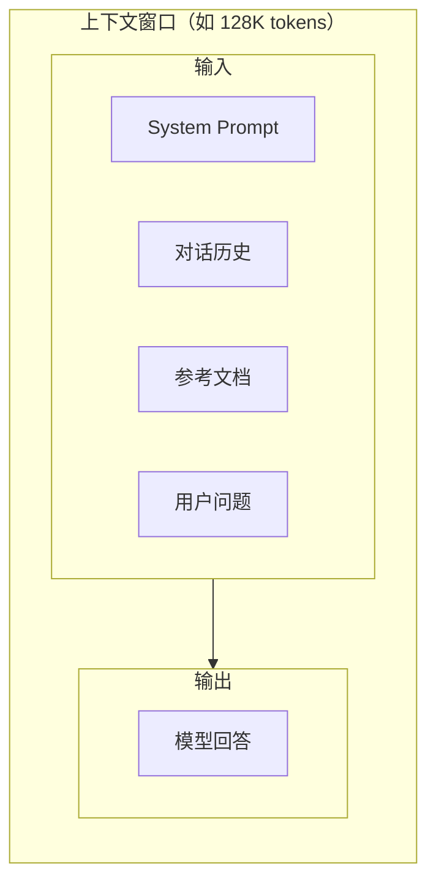

# Token 与上下文窗口

> **创建日期：** 2026-06-06
> **前置知识：** LLM 基础概念

---

## 一、Token 是什么？

Token 是 LLM 处理文本的**最小单位**。模型不直接理解"字符"或"词语"，而是将文本拆分为 token 序列。

### 1.1 Token 化示例

| 文本 | Token 化结果 | Token 数量 |
|------|-------------|-----------|
| `Hello World` | `["Hello", " World"]` | 2 |
| `人工智能` | `["人工", "智能"]` | 2 |
| `Transformer` | `["Transform", "er"]` | 2 |
| `I love AI` | `["I", " love", " AI"]` | 3 |

::: tip 关键认知
- 英文：约 1 token ≈ 0.75 个单词
- 中文：约 1 token ≈ 0.5~1.5 个汉字（取决于 tokenizer）
- 代码：token 消耗通常比自然语言多 20%~50%
:::

### 1.2 Tokenizer 工作原理

Tokenizer 使用 **BPE（Byte Pair Encoding）** 算法，将文本拆分为子词单元：

```
原始文本: "unbelievable"
拆分过程: "un" + "believable" → "un" + "believe" + "able"
最终: ["un", "believe", "able"]
```

---

## 二、上下文窗口

### 2.1 什么是上下文窗口？

上下文窗口（Context Window）是模型**一次能处理的最大 token 数量**。包括输入 token 和输出 token。



### 2.2 主流模型上下文窗口

| 模型 | 上下文窗口 | 说明 |
|------|-----------|------|
| GPT-4o | 128K | 标准窗口 |
| GPT-4.1 | 1M | 超长上下文 |
| Claude 4.6 系列 | 1M（Opus/Sonnet）/ 200K（Haiku） | 全系大窗口 |
| Gemini 2.5 系列 | 1M | 全系大窗口 |
| DeepSeek V3.2 | 128K | 中文模型标准窗口 |
| Qwen3.5-Plus | 1M | 国内最大窗口 |
| Kimi K2.5 | 256K | 长文本优势 |

### 2.3 上下文窗口的"中间丢失"问题

::: warning 重要
模型对上下文窗口**开头和结尾**的内容记忆最好，对**中间部分**的内容容易遗忘（Lost in the Middle 现象）。
:::

**应对策略：**
- 关键信息放在开头或结尾
- 对长文档进行分段处理
- 使用 RAG 只检索相关片段，而非塞入整个文档

---

## 三、Token 计数与成本

### 3.1 如何计算 Token 数量

```python
import tiktoken

# 使用 OpenAI 的 tokenizer 计算
encoding = tiktoken.encoding_for_model("gpt-4o")
text = "人工智能正在改变世界"
tokens = encoding.encode(text)
print(f"文本: {text}")
print(f"Token 数量: {len(tokens)}")
print(f"Token 列表: {tokens}")
```

### 3.2 成本估算公式

```
总成本 = (输入 Token 数 × 输入单价) + (输出 Token 数 × 输出单价)
```

**示例：** 使用 DeepSeek V3.2 处理 1000 次对话，每次平均输入 2000 token、输出 500 token：

```
输入成本: 1000 × 2000 / 1,000,000 × $0.27 = $0.54
输出成本: 1000 × 500 / 1,000,000 × $1.12 = $0.56
总成本: $0.54 + $0.56 = $1.10
```

### 3.3 Token 优化策略

| 策略 | 效果 | 实现方式 |
|------|------|----------|
| **Prompt 压缩** | 减少 30%~50% 输入 token | 精简 System Prompt，删除冗余描述 |
| **对话摘要** | 控制历史长度 | 对长对话历史进行摘要后再传入 |
| **缓存命中** | 显著降低成本 | 相同 Prompt 前缀利用缓存（DeepSeek 缓存命中 $0.028/M） |
| **模型降级** | 大幅降低成本 | 简单任务用 Flash/Mini 模型 |

---

## 四、长文本处理策略

### 4.1 策略对比

| 策略 | 适用场景 | 优点 | 缺点 |
|------|----------|------|------|
| **直接传入** | 文档 < 上下文窗口 | 简单直接 | 受窗口限制，中间丢失 |
| **分段处理** | 文档 > 上下文窗口 | 突破窗口限制 | 丢失跨段上下文 |
| **RAG 检索** | 需要从大量文档中找答案 | 精准、高效 | 需要预先建立索引 |
| **Map-Reduce** | 需要对整个文档做分析 | 覆盖完整 | 多次调用，成本较高 |

### 4.2 分段处理示例

```python
# 将长文档按 token 限制分段
def split_by_tokens(text: str, max_tokens: int = 3000, encoding=None):
    """将文本按 token 限制分段，确保每段不超过 max_tokens"""
    if encoding is None:
        encoding = tiktoken.encoding_for_model("gpt-4o")
    
    tokens = encoding.encode(text)
    chunks = []
    
    for i in range(0, len(tokens), max_tokens):
        chunk_tokens = tokens[i:i + max_tokens]
        chunk_text = encoding.decode(chunk_tokens)
        chunks.append(chunk_text)
    
    return chunks
```

---

## 五、面试重点

::: warning 高频考点
1. **Token 是什么？** 中文和英文的 token 消耗差异？
2. **上下文窗口是什么？** 超过窗口会怎样？
3. **"Lost in the Middle"是什么？** 如何应对？
4. **如何估算 API 调用成本？** 给出一个具体场景的计算过程
5. **长文本有哪些处理策略？** 各策略的优缺点？
:::