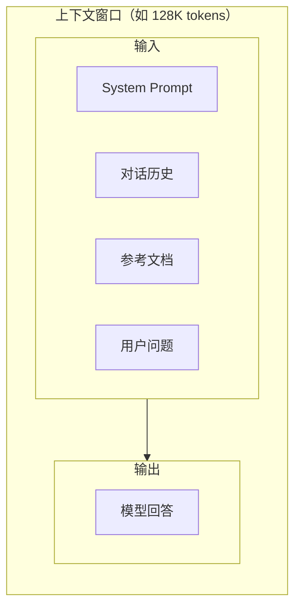

# Token 与上下文窗口

> **创建日期：** 2026-06-06
> **前置知识：** LLM 基础概念

---

## 一、Token 是什么？

Token 是 LLM 处理文本的**最小单位**。模型不直接理解"字符"或"词语"，而是将文本拆分为 token 序列。

### 1.1 Token 化示例

| 文本 | Token 化结果 | Token 数量 |
|------|-------------|-----------|
| `Hello World` | `["Hello", " World"]` | 2 |
| `人工智能` | `["人工", "智能"]` | 2 |
| `Transformer` | `["Transform", "er"]` | 2 |
| `I love AI` | `["I", " love", " AI"]` | 3 |

::: tip 关键认知
- 英文：约 1 token ≈ 0.75 个单词
- 中文：约 1 token ≈ 0.5~1.5 个汉字（取决于 tokenizer）
- 代码：token 消耗通常比自然语言多 20%~50%
:::

### 1.2 Tokenizer 工作原理

Tokenizer 使用 **BPE（Byte Pair Encoding）** 算法，将文本拆分为子词单元：

```
原始文本: "unbelievable"
拆分过程: "un" + "believable" → "un" + "believe" + "able"
最终: ["un", "believe", "able"]
```

---

## 二、上下文窗口

### 2.1 什么是上下文窗口？

上下文窗口（Context Window）是模型**一次能处理的最大 token 数量**。包括输入 token 和输出 token。



### 2.2 主流模型上下文窗口

| 模型 | 上下文窗口 | 说明 |
|------|-----------|------|
| GPT-4o | 128K | 标准窗口 |
| GPT-4.1 | 1M | 超长上下文 |
| Claude 4.6 系列 | 1M（Opus/Sonnet）/ 200K（Haiku） | 全系大窗口 |
| Gemini 2.5 系列 | 1M | 全系大窗口 |
| DeepSeek V3.2 | 128K | 中文模型标准窗口 |
| Qwen3.5-Plus | 1M | 国内最大窗口 |
| Kimi K2.5 | 256K | 长文本优势 |

### 2.3 上下文窗口的"中间丢失"问题

::: warning 重要
模型对上下文窗口**开头和结尾**的内容记忆最好，对**中间部分**的内容容易遗忘（Lost in the Middle 现象）。
:::

**应对策略：**
- 关键信息放在开头或结尾
- 对长文档进行分段处理
- 使用 RAG 只检索相关片段，而非塞入整个文档

---

## 三、Token 计数与成本

### 3.1 如何计算 Token 数量

```python
import tiktoken

# 使用 OpenAI 的 tokenizer 计算
encoding = tiktoken.encoding_for_model("gpt-4o")
text = "人工智能正在改变世界"
tokens = encoding.encode(text)
print(f"文本: {text}")
print(f"Token 数量: {len(tokens)}")
print(f"Token 列表: {tokens}")
```

### 3.2 成本估算公式

```
总成本 = (输入 Token 数 × 输入单价) + (输出 Token 数 × 输出单价)
```

**示例：** 使用 DeepSeek V3.2 处理 1000 次对话，每次平均输入 2000 token、输出 500 token：

```
输入成本: 1000 × 2000 / 1,000,000 × $0.27 = $0.54
输出成本: 1000 × 500 / 1,000,000 × $1.12 = $0.56
总成本: $0.54 + $0.56 = $1.10
```

### 3.3 Token 优化策略

| 策略 | 效果 | 实现方式 |
|------|------|----------|
| **Prompt 压缩** | 减少 30%~50% 输入 token | 精简 System Prompt，删除冗余描述 |
| **对话摘要** | 控制历史长度 | 对长对话历史进行摘要后再传入 |
| **缓存命中** | 显著降低成本 | 相同 Prompt 前缀利用缓存（DeepSeek 缓存命中 $0.028/M） |
| **模型降级** | 大幅降低成本 | 简单任务用 Flash/Mini 模型 |

---

## 四、长文本处理策略

### 4.1 策略对比

| 策略 | 适用场景 | 优点 | 缺点 |
|------|----------|------|------|
| **直接传入** | 文档 < 上下文窗口 | 简单直接 | 受窗口限制，中间丢失 |
| **分段处理** | 文档 > 上下文窗口 | 突破窗口限制 | 丢失跨段上下文 |
| **RAG 检索** | 需要从大量文档中找答案 | 精准、高效 | 需要预先建立索引 |
| **Map-Reduce** | 需要对整个文档做分析 | 覆盖完整 | 多次调用，成本较高 |

### 4.2 分段处理示例

```python
# 将长文档按 token 限制分段
def split_by_tokens(text: str, max_tokens: int = 3000, encoding=None):
    """将文本按 token 限制分段，确保每段不超过 max_tokens"""
    if encoding is None:
        encoding = tiktoken.encoding_for_model("gpt-4o")
    
    tokens = encoding.encode(text)
    chunks = []
    
    for i in range(0, len(tokens), max_tokens):
        chunk_tokens = tokens[i:i + max_tokens]
        chunk_text = encoding.decode(chunk_tokens)
        chunks.append(chunk_text)
    
    return chunks
```

---

## 五、面试高频题

### Q1: Token 是什么？中文和英文的 Token 消耗有什么差异？

**详细答案：**
Token 是 LLM 处理文本的最小单元，不是字符也不是单词。模型通过 BPE 算法（反复合并最高频的相邻 token 对）把文本拆成子词级别，这样既避免了字符级 tokenizer 序列过长，也避免了词级 tokenizer 词汇表爆炸。

中英文 token 消耗差异是我们做成本控制时发现的一个实际痛点。同样的意思，英文"I want to return this product"（6 个词）约 8 个 token，中文"我要退这个产品"（6 个字）约 5 个 token——中文 token 效率更高，因为一个汉字承载的信息密度更高。但用海外模型处理中文时，token 消耗可能比预期高，因为海外模型的 tokenizer 对中文优化不足。我们有一次估算成本时用字符数直接除以 2 来算 token 数，结果实际 token 比预估高了 30%，原因是那批用户反馈里有大量 emoji 和特殊符号，每个都是一个 token。后来改用 tiktoken 精确做 Token 计数，成本预估才准了。

### Q2: 上下文窗口是什么？超过窗口会发生什么？

**详细答案：**
上下文窗口就是模型一次能处理的最大 token 数量，包括输入 + 输出总和。我们在开发中经常会踩一个坑：把整个对话历史 + 检索到的文档 + system prompt 直接塞进去，结果算错了总 token 数，超过窗口报错或静默截断。我记得刚上线客服系统时，有的用户聊了 20 轮之后突然开始答非所问，我们排查了半天才发现是总 token 超了，服务商默默截断了前面的对话历史，模型把用户问题和对话历史对不上。

超过窗口后的处理方式各家不一样：OpenAI 是直接返回 400 报错，我们能在应用层捕获错误然后给用户提示"对话太长了，请刷新对话"。但有些本地框架比如 Ollama 会直接静默截断，不告诉你，这样排查起来就很麻烦。我们现在的预防流程是：每次请求前用 `tiktoken` 先算一遍 token 数，如果超过 80% 窗口就自动触发历史摘要压缩，把早的对话压缩成一段，这样保证总 token 不超限。

还有一个容易被忽略的点：system prompt 也占额度。我们最早 product 场景下直接把整本产品手册塞到 system prompt 里，占了 8000 token，结果用户只能聊三句对话窗口就满了，这太傻了。后来改成 RAG，只在 system prompt 里放规则，把产品手册放知识库，每次只检索相关片段，一下子省出了一大半窗口给对话历史。

### Q3: "Lost in the Middle" 是什么？如何有效应对？

**详细答案：**
"Lost in the Middle"是我们在长文档 RAG 场景里实打实踩过的坑，不是教科书上的概念。模型对上下文窗口开头和结尾的内容记忆最好，中间部分经常被漏掉。我们的 RAG 系统检索到 5 个文档片段拼在 Prompt 里，前两个片段放最前面、后三个放最中间——结果发现模型回答里多次引用了第一个片段，但第三个片段的精确引语几乎没出现过。

定位方法很简单：我们在 Prompt 里把 "Answer with reference to the document at position X" 这种提示语写在每个检索片段后面，观察模型对各位置的引用频率，发现位置 1-2（开头）和位置 5（末尾）准确率达 90%+，位置 3-4（中间）掉到 60%。我们现在的策略是：关键信息放折叠在 Prompt 首尾两处——开头放最重要的文档片段，末尾放第二重要的，中间塞次要信息，这样最大化了模型对关键信息的注意力。另外配合 reranker，让最相关的文档排在检索结果最前面，自然就落在了高效注意力的区间。

### Q4: 如何估算 API 调用成本？请给出一个具体场景的计算过程。

**详细答案：**
公式很简单：`总成本 = (输入 Token / 1M) * 输入单价 + (输出 Token / 1M) * 输出单价`。但实际估算最容易踩的坑是"输出被严重低估"——很多人以为模型吐个短回复 200 token，其实加上思考链、加上格式、加上引用，实际输出的 token 往往翻一翻。

以我们客服系统为例：每天 5000 次查询，每次输入 token = system prompt 500 + 检索文档 2000 + 用户问题 100 = 2600 token，输出平均 400 token。用 DeepSeek V3 跑：输入 0.27/M、输出 1.12/M，单次成本 = 2600/1M * 0.27 + 400/1M * 1.12 = 0.000702 + 0.000448 = 约 0.00115 美元（0.115 美分）。一天 5000 次 = $5.75，一个月 $172。如果全用 GPT-4o 跑同样量：0.0065 + 0.004 = 0.0105 美元一次，一天 $52.5，一个月 $1575——差了 9 倍。这就是为什么模型选型直接决定你账单大小。

我们的节约策略是：System Prompt 保持不变走前缀缓存（DeepSeek 缓存命中 $0.028/M，System Prompt 部分降 90%）；RAG 检索 snippet 精简到 2000 token 以内（砍了原来 3000+ 的冗余度）；简单问题直接用 Flash 模型。三个策略叠加上来，月费从 $400 降到了 $150，质量几乎没落差。

### Q5: 长文本有哪些处理策略？各策略的优缺点是什么？

**详细答案：**
处理超窗口的长文本，我们项目四种策略都用过。直接截断最简单——把超过窗口的部分砍掉——适合对完整性要求不高的快速场景，但有一次我们直接截断了一份 20 页的合同，结果把"违约责任"那一段给截掉了，回答完全走偏。所以截断只适合简单总结，不适合精确分析。

分段处理是我们最常用的 RAG 预处理步骤。用 `RecursiveCharacterTextSplitter(chunk_size=800, chunk_overlap=100)` 切分，每段一个 embedding，后面检索时只检索相关的。但切分有代价——如果一段话前半句在一个 chunk、后半句在另一个（比如"根据第三章第四节的规定\"），检索时永远找不到完整的信息。我们用 overlap 缓解了，但没法根治。

RAG 检索是主流方案——不对整个文档处理，只检索相关片段。我们知识库 5 万篇文档，RAG 让每次查询的输入 token 控制在 3000 上下，否则全量塞入根本不可能。Map-Reduce 是最全面但最贵的——把文档分段、每段独立分析、再汇总结果。我们只用在法律合同分析这种必须覆盖全文的场景，成本是普通 RAG 的 5-8 倍。

实战建议：没有银弹，组合使用。我们现在的流水线是：先用 RAG 检索最相关段落 -> 对命中的段落做 Map-Reduce 深入分析 -> 把分析结果汇总反馈给 LLM 出最终答案。这样既保证了全量覆盖（Map-Reduce 在命中段落上做），又控制了成本（不全文跑 Map-Reduce）。